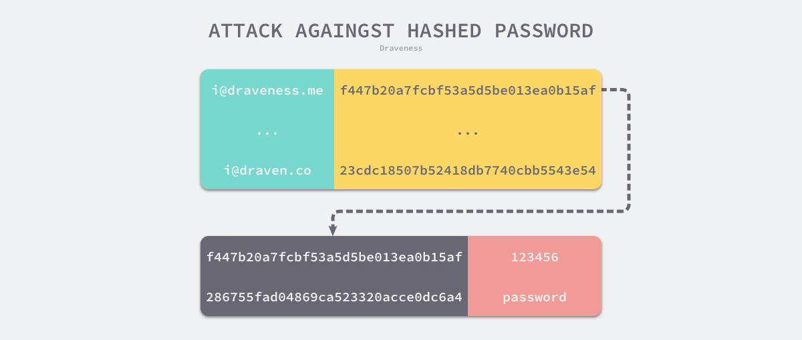
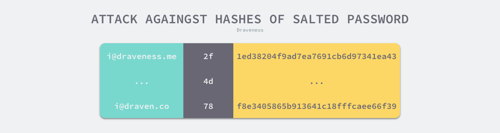
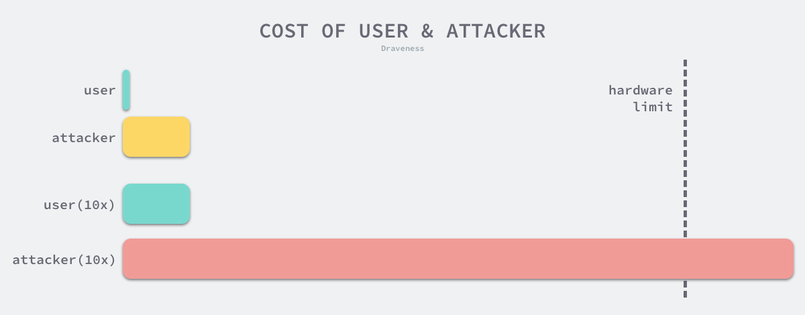

# 为什么 MD5 不能用于存储密码

> 本文转载至：[为什么 MD5 不能用于存储密码 - 面向信仰编程 (draveness.me)](https://draveness.me/whys-the-design-password-with-md5/)

很多软件工程师都认为 MD5 是一种加密算法，然而这种观点其实是大错特错并且十分危险的，作为一个 1992 年第一次被公开的算法，到今天为止已经被发现了一些致命的漏洞，我们在生产环境的任何场景都不应该继续使用 MD5 算法，无论是对数据或者文件的内容进行校验还是用于所谓的『加密』。

这篇文章的主要目的是帮助读者理解 MD5 到底是什么，为什么我们不应该继续使用它，尤其是不应该使用它在数据库中存储密码，作者也希望使用过 MD5 或者明文存储密码的开发者们能够找到更加合理和安全的方式对用户的这些机密信息进行存储（这样也可以间接提高我在各类网站中存储密码的安全性）。

## 一. 概述

与『为什么我们不能使用 MD5 来存储密码？』这一问题相似的其实还有『为什么我们不能使用明文来存储密码？』，使用明文来存储密码是一种看起来就不可行的方案，除非我们能够 100% 保证数据库中的密码字段不会被**任何人**访问到，不仅包括潜在的攻击者，还包括系统的开发者和管理员。

不过这是一个非常理想的情况，在实际的生产环境中，我们不能抵御来自黑客的所有攻击，甚至也不能完全阻挡开发者和管理员的访问，因为我们总需要信任并授权一些人或者程序具有当前数据库的所有访问权限，这也就给攻击者留下了可以利用的漏洞，在抵御外部攻击时我们没有办法做到全面，只能尽可能提高攻击者的成本，这也就是使用 MD5 或者其他方式存储密码的原因了。


很多开发者对于 MD5 的作用和定义都有着非常大的误解，**MD5 并不是一种加密算法，而是一种摘要算法**，我们也可以叫它哈希函数，哈希函数可以将无限键值空间中的所有键都均匀地映射到一个指定大小的键值空间中；一个好的摘要算法能够帮助我们保证文件的完整性，避免攻击者的恶意篡改，但是加密算法或者加密的功能是 —— 通过某种特定的方式来编码消息或者信息，只有授权方可以访问原始数据，而没有被授权的人无法从密文中获取原文。

由于加密需要同时保证消息的秘密性和完整性，所以加密的过程使用一系列的算法，MD5 确实可以在加密的过程中作为哈希函数使用来保证消息的完整性，但是我们还需要另一个算法来保证消息的秘密性，所以由于 MD5 哈希的信息无法被还原，只依靠 MD5 是无法完成加密的。

> 在任何场景下，我们都应该避免 MD5 的使用，可以选择更好的摘要算法替代 MD5，例如 SHA256、SHA512。

聊了这么多对于 MD5 的误解，我们重新回到今天最开始的题目，『为什么 MD5 不能用于存储密码』，对于这个问题有一个最简单的答案，也就是 **MD5 不够安全**。当整个系统中的数据库被攻击者入侵之后，存储密码的摘要而不是明文是我们能够对所有用户的最大保护。需要知道的是，不够安全的不只是 MD5，任何摘要算法在存储密码这一场景下都不够安全，我们在这篇文章中就会哈希函数『为什么哈希函数不能用于存储密码』以及其他相关机制的安全性。

## 二. 设计

既然我们已经对哈希函数和加密算法有了一些简单的了解，接下来的这一节中分析使用以下几种不同方式存储密码的安全性：

- 使用哈希存储密码；
- 使用哈希加盐存储密码；
- 使用加密算法存储密码；
- 使用 bcrypt 存储密码；

在分析的过程中可能会涉及到一些简单的密码学知识，也会谈到一些密码学历史上的一些事件，不过这对于理解不同方式的安全性不会造成太大的障碍。

### 2.1 哈希

在今天，如果我们直接使用哈希来存储密码，那其实跟存储明文没有太多的区别，所有的攻击者在今天都已经掌握了彩虹表这个工具，我们可以将彩虹表理解成一张预计算的大表，其中存储着一些常见密码的哈希，当攻击者通过入侵拿到某些网站的数据库之后就可以通过预计算表中存储的映射来查找原始密码。



攻击者只需要将一些常见密码提前计算一些哈希就可以找到数据库中很多用于存储的密码，Wikipedia 上有一份关于最常见密码的 [列表](https://en.wikipedia.org/wiki/List_of_the_most_common_passwords)，在 2016 年的统计中发现使用情况最多的前 25 个密码占了调查总数的 10%，虽然这不能排除统计本身的不准确因素，但是也足以说明仅仅使用哈希的方式存储密码是不够安全的。

### 2.2 哈希加盐

仅仅使用哈希来存储密码无法抵御来自彩虹表的攻击，在上世纪 70 到 80 年代，早期版本的 Unix 系统就在 `/etc/passwrd` 中存储加盐的哈希密码，密码加盐后的哈希与盐会被一起存储在 `/etc/passwd` 文件中，今天哈希加盐的策略与几十年前的也没有太多的不同，差异可能在于盐的生成和选择：

```
md5(salt, password), salt
```

**加盐的方式主要还是为了增加攻击者的计算成本**，当攻击者顺利拿到数据库中的数据时，由于**每个密码都使用了随机的盐进行哈希**，所以预先计算的彩虹表就没有办法立刻破译出哈希之前的原始数据，攻击者对每一个哈希都需要单独进行计算，这样能够增加了攻击者的成本，减少原始密码被大范围破译的可能性。



在这种情况下，攻击者破解一个用户密码的成本其实就等于发现哈希碰撞的概率，因为攻击者其实不需要知道用户的密码是什么，他只需要找到一个值 `value`，这个值加盐后的哈希与密码加盐后的哈希完全一致就能登录用户的账号：

```go
hash(salt, value) = hash(salt, password)
```

这种情况在密码学中叫做哈希碰撞，也就是两个不同值对应哈希相同，一个哈希函数或者摘要算法被找到哈希碰撞的概率决定了该算法的安全性，早在几十年前，我们就在 MD5 的设计中发现了缺陷并且在随后的发展中找到了低成本快速制造哈希碰撞的方法。

从过往的历史来看，为了保证用户敏感信息的安全，我们不应该使用 MD5 加盐的方式来存储用户的密码，那么我们是否可以使用更加安全的摘要算法呢？不可以，哈希函数并不是专门用来设计存储用户密码的，所以它的计算可能相对来说还是比较快，攻击者今天可以**通过 GPU 每秒执行上亿次的计算来破解用户的密码**，所以不能使用这种方式存储用户的密码，感兴趣的读者可以了解一下用于恢复密码的工具 [Hashcat](https://hashcat.net/hashcat/)。

### 2.3 加密

既然今天的硬件已经能够很快地帮助攻击者破解用户的密码，那么我们能否通过其他的方式来取代哈希函数来存储密码呢？有些工程师想到使用加密算法来替代哈希函数，这样能够从源头上避免哈希碰撞的发生，这种方式看起来非常美好，但是有一个致命的缺点，就是我们**如何存储用于加密密码的秘钥**。

既然存储密码的仓库能被泄露，那么用于存储秘钥的服务也可能会被攻击，我们永远都没有办法保证我们的数据库和服务器是安全的，一旦秘钥被攻击者获取，他们就可以轻而易举地恢复用户的密码，因为核对用户密码的过程需要在内存对密码进行解密，这时明文的密码就可能暴露在内存中，依然有导致用户密码泄露的风险。


使用加密的方式存储密码相比于哈希加盐的方式，在一些安全意识和能力较差的公司和网站反而更容易导致密码的泄露和安全事故。

### 2.4 bcrypt

哈希加盐的方式确实能够增加攻击者的成本，但是今天来看还远远不够，我们需要一种更加安全的方式来存储用户的密码，这也就是今天被广泛使用的 `bcrypt`，使用 `bcrypt` 相比于直接使用哈希加盐是一种更加安全的方式，也是我们目前推荐使用的方法，为了增加攻击者的成本，`bcrypt` 引入了计算成本这一可以调节的参数，能够调节执行 `bcrypt` 函数的成本。



当我们将验证用户密码的成本提高几个数量级时，攻击者的成本其实也相应的提升了几个数量级，只要我们让攻击者的攻击成本大于硬件的限制，同时保证正常请求的耗时在合理范围内，我们就能够保证用户密码的相对安全。

> “`bcrypt` was designed for password hashing hence it is a slow algorithm. This is good for password hashing as it reduces the number of passwords by second an attacker could hash when crafting a dictionary attack. "

`bcrypt` 这一算法就是为哈希密码而专门设计的，所以它是一个执行相对较慢的算法，这也就能够减少攻击者每秒能够处理的密码数量，从而避免攻击者的字典攻击。

```go
func main() {
	for cost := 10; cost <= 15; cost++ {
		startedAt := time.Now()
		bcrypt.GenerateFromPassword([]byte("password"), cost)
		duration := time.Since(startedAt)
		fmt.Printf("cost: %d, duration: %v\n", cost, duration)
	}
}

$ go run bcrypt.go
cost: 10, duration: 51.483401ms
cost: 11, duration: 100.639251ms
cost: 12, duration: 202.788492ms
cost: 13, duration: 399.552731ms
cost: 14, duration: 801.041128ms
cost: 15, duration: 1.579692689s
```

运行上述 [代码片段](https://play.golang.org/p/uCNm-qckWxQ) 时就能发现 `cost` 和运行时间的关系，算法运行的成本每 `+1`，当前算法最终的耗时就会翻一倍，这与 `bcrypt` 算法的实现原理有关，你可以在 [Wikipedia](https://en.wikipedia.org/wiki/Bcrypt) 上找到算法执行过程的伪代码，这可以帮助我们快速理解算法背后的设计。

如果硬件的发展使攻击者能够对使用 `bcrypt` 存储的密码进行攻击时，我们就可以直接提升 `bcrypt` 算法的 `cost` 参数以增加攻击者的成本，这也是 `bcrypt` 设计上的精妙之处，所以使用 `bcrypt` 是一种在存储用户密码时比较安全的方式。

## 三. 总结

这篇文章分析的问题其实是 —— 当数据库被攻击者获取时，我们怎么能够保证用户的密码很难被攻击者『破译』，作为保护用户机密信息的最后手段，选择安全并且合适的方法至关重要。攻击者能否破解用户的密码一般取决于两个条件：

- 使用的加密算法是否足够安全，使用暴力破解的方式时间成本极高；
- 足够好的硬件支持，能够支持大规模地高速计算哈希；

抵御攻击者的攻击的方式其实就是提高单次算法运行的成本，当我们将用户的验证耗时从 `0.1ms` 提升到了 `500ms`，攻击者的计算成本也就提升了 5000 倍，这种结果就是之前需要几小时破解的密码现在需要几年的时间。

不论如何，**使用 MD5、MD5 加盐或者其他哈希的方式来存储密码都是不安全的**，希望各位工程师能够避免在这样的场景下使用 MD5，在其他必须使用哈希函数的场景下也建议使用其他算法代替，例如 SHA-512 等。

当然，如何保证用户机密信息的安全不只是一个密码学问题，它还是一个工程问题，任何工程开发商的疏漏都可能导致安全事故，所以我们作为开发者在与用于敏感信息打交道时也应该小心谨慎、怀有敬畏之心。