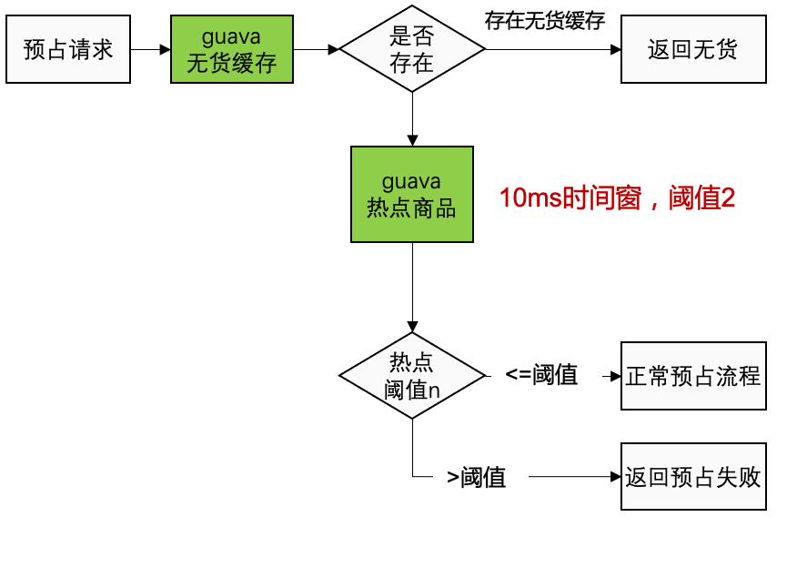

# 库存系统设计思路

如果你要开发一个电商库存系统，最担心的是什么？闭上眼睛想下，当然是高并发和防超卖了！

下面用电商库存为示例，来说明如何高并发扣减库存，原理同样适用于其他需要并发写和数据一致性的场景。

## 一. 库存数量模型示例

为了描述方便，我们使用简化的库存数量模型，真实场景中库存数据项会比我的示例多很多，但已经够说明原理。如下表，库存数量表()(t_inventory)包含商品标识和库存数量两个字段，库存数量代表有多少货可以卖。

| 字段名   | 英文名 | 字段类型 |
| -------- | ------ | -------- |
| 商品标识 | sku_id | 长整型   |
| 库存数量 | num    | 整数     |

为了保证库存幂等性，防止服务超时下游重试，导致库存多扣的情况，一般会设计防重表(t_inventory_idempotent)：

| 字段名 | 英文名 | 字段类型           |
| ------ | ------ | ------------------ |
| 标识   | id     | 长整型             |
| 防重码 | code   | 字符串（唯一索引） |

防重表目的是为了保证接口幂等，可以使用其它方式实现，诸如：redis setnx

同时为了保证整个库存的可回溯，用于查看明细、对账、盘货、排查问题。扣减后，某些场景下做返还，也还依赖流水，所以需要涉及一个流水表（t_inventory_flow）：

| 字段名   | 英文名   | 字段类型 |
| -------- | -------- | -------- |
| 标识     | id       | 长整型   |
| 商品标识 | sku_id   | 字符串   |
| 订单ID   | order_id | 字符串   |
| 扣减数量 | quality  | 整形     |

## 二. 传统通过数据库保证不超卖

库存管理的传统方案为了保证不超卖，都是使用数据库的事务来保证的：通过Sql判断剩余的库存数够用，多个并发执行update语句只有一个能执行成功；为了保证扣减不重复，会配合一个防重表来防止重复的提交，做到幂等性，防重表示例（antiRe）设计如下：

比如一个下单过程的扣减过程示例如下：

```sql
事务开始
insert into t_inventory_idempotent(code) value (‘订单号+Sku’)
update stockNum set num=num-下单数量 where skuId=商品ID and num-下单数量>0
insert into t_inventory_flow (sku_id,order_id,quality) value (...)
事务结束
```

面临系统流量越来越大，数据库的性能瓶颈就会暴露出来：就算分库分表也是没用的，促销的时候高并发都是针对少量商品的，而库存表通常是按照商品维度分库分表，最终并发流量会打向少数表，只能去提升单分片的抗量能力。

## 三. 借助Redis实现库存高并发扣减

扣减库存其实包含两个过程：第一步是超卖校验，第二步是扣减数据的持久化；在传统数据库扣减中，两步是一起完成的。**Redis抗写的实现原理其实是巧妙的利用了分离的思想**，分离开防超卖校验和数据持久化；首先防超卖校验是由Redis来完成的；通过Redis防超卖后，只要落库就可以；而落库又能通过消息中间件进行解耦。

第一关解决防超卖校验：我们可以把数据放入Redis中，每次扣减库存，都对Redis中的数据进行 `incryby` 扣减，如果返回的数量大于0，说明库存够，因为Redis是单线程，可以信任返回结果。第一关是Redis，可以抗高并发，性能Ok。超卖校验通过后，进入第二关。

第二关解决库存扣减：经过第一关后，第二关不需要再判断数量是否足够，只需要傻瓜扣减库存就行，对数据库执行如下语句,当然还是需要处理防重幂等的，不需要判断数量是否大于0了。整体执行流程如下：

```sql
事务开始
// 幂等校验
insert into t_inventory_idempotent(code) value (‘订单号+Sku’)

// 此处操作redis扣减库存

// 更新数据库库存
update stockNum set num=num-下单数量 where skuId=商品ID
// 插入redis
insert into t_inventory_flow (sku_id,order_id,quality) value (...)
事务结束
```

此时Redis帮我们抗住了超卖校验的流量，但是仍然有一些问题：

1. 库存服务强依赖于redis，redis要做到高可用。redis挂掉之后需要通过库存流水去恢复redis的库存数量。
2. 获取库存成功的流量会打到数据库，在并发量很高的场景下，数据库仍然会出现瓶颈。此时我们可以使用消息中间件等异步手段，将扣减数据库库存和写流水的操作异步化，当 `redis` 库存扣减成功后直接返回。

## 四. 商品热点问题

Redis也是有瓶颈的，如果出现过热点SKU就会打向Redis单片，会造成单片性能抖动。

可以定制设计JVM内毫秒级时间窗的限流，限流的目的是保护Redis，尽可能的不限流。限流的极端情况就是商品本来应该在一秒内卖完，但实际花了两秒，正常并不会发生延迟销售，之所以选择JVM是因为如果采用远端集中缓存限流，还未来得及收集数据就已经把Redis打死。



此处是为了防止库存系统本身超过负载所设计的限流，从系统整体考虑，如果出现热点商品问题应该尽量从流量上层进行限流。

 


