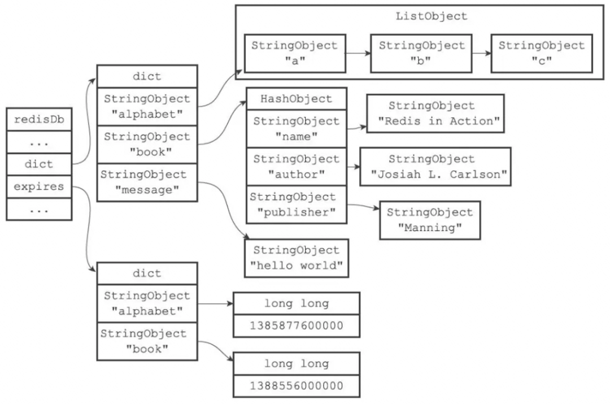

# 订单超时自动取消实现方案

## 一. 定时轮询

数据库定时轮询方式，实现思路比较简单。启动一个定时任务，每隔一定时间扫描订单表，查询到超时订单就取消。

优点：实现简单。
缺点：轮询时间间隔不好确定，占用服务器资源，影响数据库性能。

## 二. JDK延迟队列

JDK[延时队列](https://so.csdn.net/so/search?q=延时队列&spm=1001.2101.3001.7020)DelayQueue是一个无界阻塞队列，该队列只有在延迟期满的时候才能从中获取元素。

简单实现代码demo如下，实际生产过程中会有专门的线程负责消息的入队与消费。

```java
import java.util.concurrent.Delayed;
import java.util.concurrent.TimeUnit;
 

public class OrderDelayed implements Delayed {
 
    /**
     * 延迟时间
     */
    private final Long time;
    /**
     * 订单编号
     */
    public String orderNo;
 
    public OrderDelayed(String orderNo, long time, TimeUnit unit) {
        this.orderNo = orderNo;
        this.time = System.currentTimeMillis() + (time > 0 ? unit.toMillis(time) : 0);
    }
 
    @Override
    public long getDelay(TimeUnit unit) {
        return time - System.currentTimeMillis();
    }
 
    @Override
    public int compareTo(Delayed o) {
        OrderDelayed orderDelayed = (OrderDelayed) o;
        long diff = this.time - orderDelayed.time;
        if (diff <= 0) {
            return -1;
        } else {
            return 1;
        }
    }
}
```

```java
import java.util.concurrent.DelayQueue;
import java.util.concurrent.TimeUnit;
 

public class Test {
 
    public static void main(String[] args) {
 
        DelayQueue<OrderDelayed> delayQueue = new DelayQueue<>();
 
        delayQueue.put(new OrderDelayed("220101001", 8, TimeUnit.SECONDS));
        delayQueue.put(new OrderDelayed("220101002", 4, TimeUnit.SECONDS));
 
        System.out.println("订单延迟队列开始执行");
 
        while (true) {
            // 取队列头部元素是否过期
            OrderDelayed task = delayQueue.poll();
            if (task != null) {
                // 取消订单业务逻辑
                System.out.println("订单 ---> " + task.orderNo + " 已过期准备取消");
            }
        }
    }
}
```

优点：效率高，任务触发时间延迟低。
缺点：异常恢复困难，集群扩展麻烦，内存占用。

## 三. 时间轮

时间轮算法类似于时钟，会按某一个方向按固定频率轮动。可以用Netty的HashedWheelTimer来实现时间轮方法。

```xml
<dependency>
    <groupId>io.netty</groupId>
    <artifactId>netty-all</artifactId>
    <version>4.1.78.Final</version>
</dependency>
```

```java
import io.netty.util.HashedWheelTimer;
import io.netty.util.Timeout;
import io.netty.util.Timer;
import io.netty.util.TimerTask;
 
import java.util.concurrent.TimeUnit;
 
public class Test {
 
    public static void main(String[] args) {
 
        // 初始化时间轮
        Timer timer = new HashedWheelTimer();
 
        // 定时任务
        TimerTask task1 = new TimerTask() {
            public void run(Timeout timeout) throws Exception {
                // 取消订单业务逻辑
                System.out.println("订单1已过期准备取消");
            }
        };
        // 注册此定时任务（延迟时间为5秒，也就是说5秒后订单过期）
        timer.newTimeout(task1, 5, TimeUnit.SECONDS);
 
        // 定时任务
        TimerTask task2 = new TimerTask() {
            public void run(Timeout timeout) throws Exception {
                // 取消订单业务逻辑
                System.out.println("订单2已过期准备取消");
            }
        };
        // 注册此定时任务（延迟时间为3秒，也就是说3秒后订单过期）
        timer.newTimeout(task2, 3, TimeUnit.SECONDS);
    }
}
```

优点：效率高，任务触发时间延迟更低。
缺点：异常恢复困难，集群扩展麻烦，内存占用。

## 四. Redis key过期监听

Redis的key过期回调事件，也能达到延迟队列的效果。

在redis.conf加入一条配置：

```matlab
notify-keyspace-events Ex
```

监听配置

```java
@Configuration
public class RedisListenerConfig {
 
    @Bean
    RedisMessageListenerContainer container(RedisConnectionFactory connectionFactory) {
        RedisMessageListenerContainer container = new RedisMessageListenerContainer();
        container.setConnectionFactory(connectionFactory);
        return container;
    }
}
```

Redis过期回调监听方法

```java
@Component
public class RedisKeyExpirationListener extends KeyExpirationEventMessageListener {
 
    public RedisKeyExpirationListener(RedisMessageListenerContainer listenerContainer) {
        super(listenerContainer);
    }
 
    @Override
    public void onMessage(Message message, byte[] pattern) {
        // 过期key，可以设置成订单号
        String expiredKey = message.toString();
        // 取消订单业务逻辑
        System.out.println("订单 ---> " + expiredKey + " 已过期准备取消");
    }
}
```

优点：数据不易丢失，集群扩展方便。
缺点：需要额外维护redis。由于redis key过期策略使用的是 惰性删除+定时任务，所以key过期可能无法保证很强的实时性，理论上key越多，导致的滞后就会越大。

使用Redis过期key监听方案表面看起来没问题，但是在实际生产上不推荐，我们来看下Redis过期时间的原理

每当我们对一个key设置了过期时间，Redis就会把该key带上过期时间，存到过期字典中，在redisDb中通过expires字段维护：

```c
typedef struct redisDb {
    dict *dict;    /* 维护所有key-value键值对 */
    dict *expires; /* 过期字典，维护设置失效时间的键 */
    ....
} redisDb;
```

过期字典本质上是一个链表，每个节点的数据结构结构如下：

- key是一个指针，指向某个键对象。
- value是一个long long类型的整数，保存了key的过期时间。



Redis主要使用了定期删除和惰性删除策略来进行过期key的删除

- 定期删除：每隔一段时间（默认100ms）就**随机抽取**一些设置了过期时间的key，检查其是否过期，如果有过期就删除。之所以这么做，是为了通过限制删除操作的执行时长和频率来减少对cpu的影响。不然每隔100ms就要遍历所有设置过期时间的key，会导致cpu负载太大。
- 惰性删除：不主动删除过期的key，每次从数据库访问key时，都检测key是否过期，如果过期则删除该key。惰性删除有一个问题，如果这个key已经过期了，但是一直没有被访问，就会一直保存在数据库中。

从以上的原理可以得知[2]，Redis过期删除是不精准的，在订单超时处理的场景下，惰性删除基本上也用不到，无法保证key在过期的时候可以立即删除，更不能保证能立即通知。如果订单量比较大，那么延迟几分钟也是有可能的。

Redis过期通知也是不可靠的，Redis在过期通知的时候，如果应用正好重启了，那么就有可能通知事件就丢了，会导致订单一直无法关闭，有稳定性问题。如果一定要使用Redis过期监听方案，建议再通过定时任务做补偿机制。

> Redis key过期监听存在问题参考：[延迟任务之redis key过期事件问题分析](https://www.jianshu.com/p/06ed26728aba)

## 五. Redis Sorted Set

Redis的数据结构Zset，同样可以实现延迟队列的效果，主要利用它的score属性，redis通过score来为集合中的成员进行从小到大的排序。通过zadd命令向队列delayqueue 中添加元素，并设置score值表示元素过期的时间。

消费端轮询队列delayqueue， 将元素排序后取最小时间与当前时间比对，如小于当前时间代表已经过期移除key。

```java
public void pollOrderQueue() {
 
    while (true) {
        Set<Tuple> set = jedis.zrangeWithScores(delayqueue, 0, 0);
 
        String value = ((Tuple) set.toArray()[0]).getElement();
        int score = (int) ((Tuple) set.toArray()[0]).getScore();
 
        int nowSecond = System.currentTimeMillis() / 1000);
        if (nowSecond >= score) {
            jedis.zrem(delayqueue, value);
            System.out.println(sdf.format(new Date()) + " removed key:" + value);
        }
 
        if (jedis.zcard(delayqueue) <= 0) {
            System.out.println(sdf.format(new Date()) + " zset empty ");
            return;
        }
        Thread.sleep(1000);
    }
}
```

优点：数据不易丢失，集群扩展方便。
缺点：可能重复消费同一key。

## 六. 延迟消息

使用RocketMQ、RabbitMQ、Kafka的延时消息，消息在发送到消息队列服务端后并不会立马投递，而是根据消息中的属性延迟固定时间后才投递给消费者。


> [阿里的订单超时处理方案 (qq.com)](https://mp.weixin.qq.com/s/1M25EZYEa1wgQvIgjHM8Xg)
>
> [关于实现订单超时的几种方案_mq实现订单超时_AragakiYui_Lover的博客-CSDN博客](https://blog.csdn.net/LIKEGAKKI/article/details/115502333)
>
> [延迟任务之redis key过期事件问题分析 - 简书 (jianshu.com)](https://www.jianshu.com/p/06ed26728aba)
