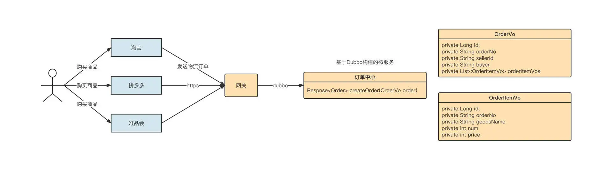
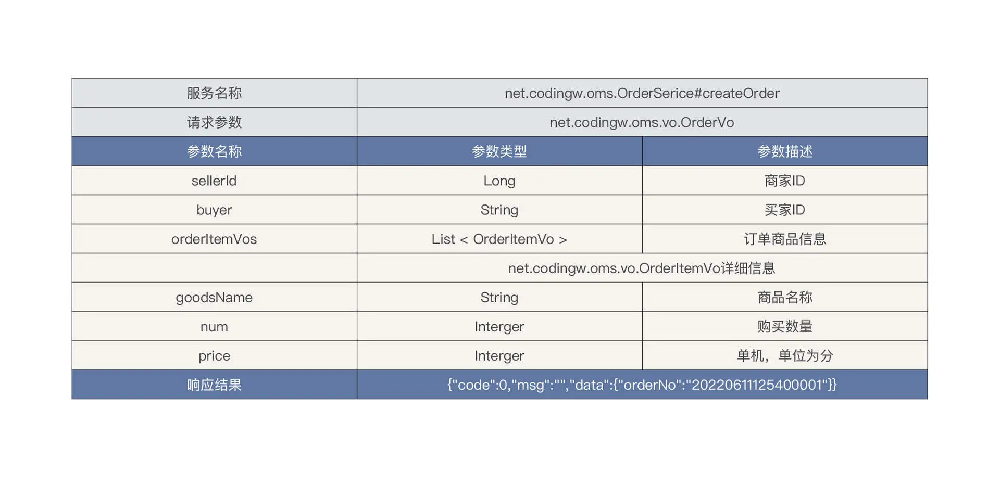
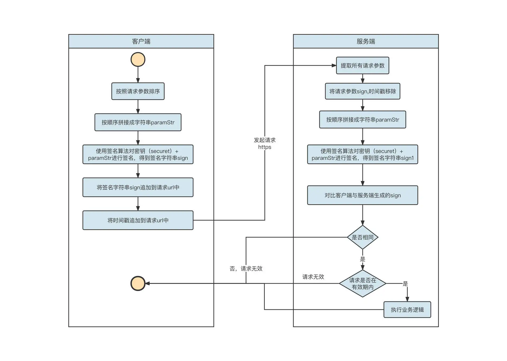
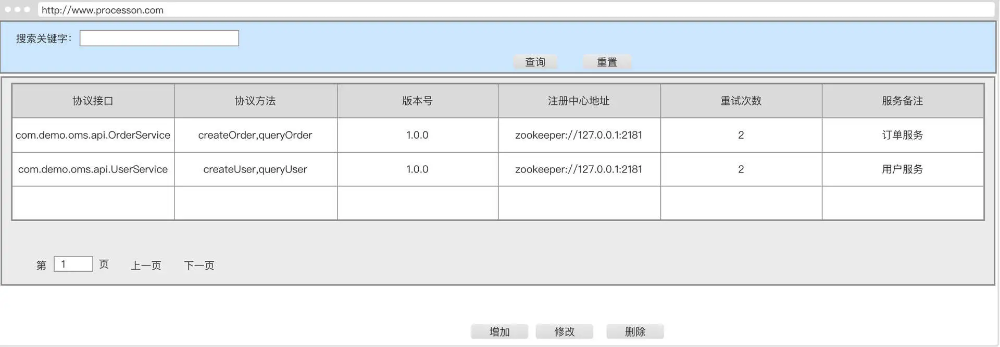
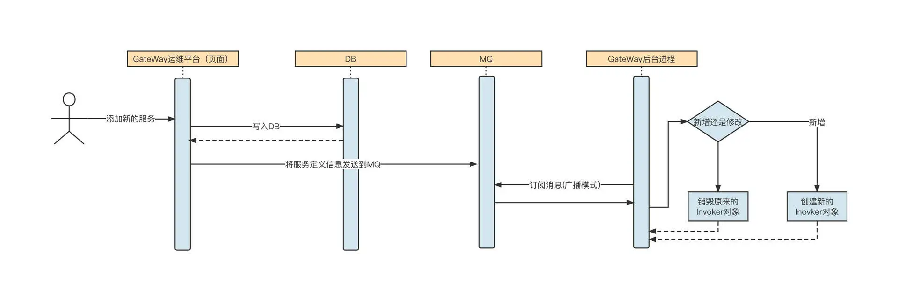
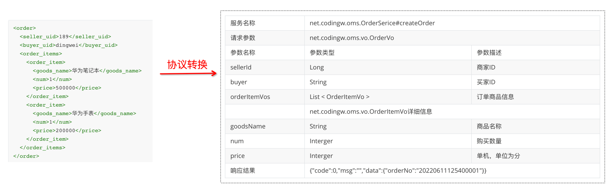
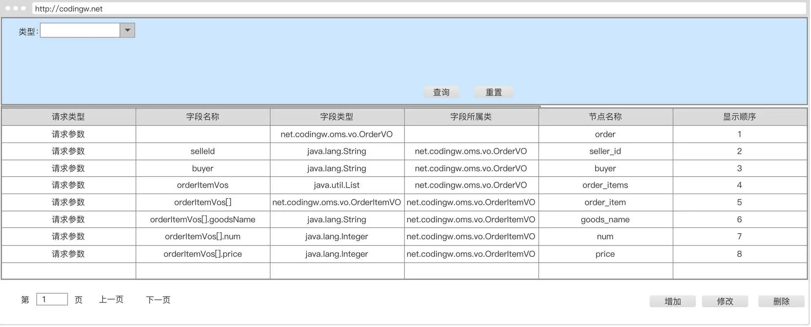

# 如何基于 Dubbo 进行网关设计

> 本文转载至：https://time.geekbang.org/column/article/536477

## 一. 设计背景

要设计一个网关，我们首先要知道它的设计背景。

2017 年，我从传统行业脱身，正式进入物流行业。说来也非常巧，我当时加入的是公司的网关项目组，主要解决泛化调用与协议转换代码的开发问题。刚进公司不久，网关项目组就遇到了技术难题。快递物流行业的业务量可以比肩互联网，从那时候开始，我的传统技术思维开始向互联网技术思维转变。

当时网关项目组的核心任务就是确保能够快速接入各个电商平台。我来简单说明一下具体的场景。



解释一下上面这个图。

物流公司内部已经基于 Dubbo 构建了订单中心微服务域，其中创建订单接口的定义如下：



外部电商平台众多，每一家电商平台内部都有自己的标准，并不会遵循统一的标准。例如在淘宝中，当用户购买商品后，淘宝内部会定义一个统一的订单外派接口。它的请求包可能是这样的：

```json
{
  "seller_id":189,
  "buyer":"dingwei",
  "order":[
    {
      "goods_name":"华为笔记本",
      "num":1,
      "price":500000
    },
    {
      "goods_name":"华为手表",
      "num":1,
      "price":200000
    }
  ]
}
```

但拼多多内部定义的订单外派接口，它的请求包可能是下面这样的：

```xml
<order>
  <seller_uid>189</seller_uid>
  <buyer_uid>dingwei</buyer_uid>
  <order_items>
    <order_item>
      <goods_name>华为笔记本</goods_name>
      <num>1</num>
      <price>500000</price>
    </order_item>
    <order_item>
      <goods_name>华为手表</goods_name>
      <num>1</num>
      <price>200000</price>
    </order_item>
  </order_items>
</order>
```

当电商的快递件占据快递公司总业务量的大半时，电商平台的话语权是高于快递公司的。也就是说，电商平台不管下游对接哪家物流公司，都会下发自己公司内部定义的订单派发接口，适配工作需要由物流公司自己来承担。

那站在物流公司的角度，应该怎么做呢？总不能每接入一个电商平台就为它们开发一套下单服务吧？那样的话，随着越来越多的电商平台接入，系统的复杂度会越来越高，可维护性将越来越差。

所以总结下来，开放平台业务网关主要需要如下基础能力：

1. 接口签名验证
2. 网络协议转换（HTTP->Dubbo）
3. 序列化协议转换（JSON->Dubbo、XML->Dubbo）
4. 接口鉴权
5. 接口限流+租户限流
6. 字段改写

## 二. 设计方案

正是在这样的背景下，网关平台被立项开发出来了。这个网关平台是怎么设计的呢？在设计的过程中需要解决哪些常见的问题？

我认为，网关的设计至少需要包括三个方面，分别是签名验证、服务配置和限流。

先说签名验证。保证请求的安全是系统设计需要优先考虑的。业界有一种非常经典的通信安全校验机制：**验证签名。**

这种机制的做法是，客户端与服务端会首先采用 HTTPS 进行通信，确保传输过程的私密性。

客户端在发送请求时，需要生成如下通用参数：

| 参数名称  | 参数类型 | 参数描述                                          | 意义                                                         |
| --------- | -------- | ------------------------------------------------- | ------------------------------------------------------------ |
| timestamp | long     | 时间戳                                            | 用于校验此次请求是否超过允许的阈值，如果超过阈值则直接返回错误码。 |
| nonce     | string   | 10位随机字符串                                    | 用于业务这边可能存在的幂等设计，防止重放攻击。               |
| traceId   | string   | 请求流水号,调用方自动生成一个随机ID，建议使用uuid | 无业务含义，用于串联第三方和自身系统的日志链路，方便问题排查 |

先将业务参数和通用参数，按参数名称进行排序，然后按顺序拼接成字符串，格式为`key1=a&key2=b`。

接下来，客户端使用一个约定的密钥对拼接出来的参数字符串进行签名，生成签名字符串（我们用 sign 表示签名字符串）并追加到请求体职中。

服务端在接收到客户端的请求后，先从请求中解析出所有的参数，同样按照参数名对参数进行排序，然后使用同样的密钥对参数进行签名。得到的签名字符串需要与客户端计算的签名字符串进行对比，如果两者不同，则请求无效。与此同时，通常我们还需要将服务端当前的时间戳与客户端时间戳进行对比，如果相差超过一定的时间，同样认为请求无效，这个操作主要是为了避免使用同一个连接对网络进行连续攻击。

这整个过程里有一个非常重要的点，就是密钥自始至终并没有在网络上进行过传播，它的安全性可以得到十足的保证。签名验证的流程大概可以用下面这张图表示：



如果要对验证签名进行产品化设计，我们通常需要：

为不同的接入端（电商平台）创建不同的密钥，并通过安全的方式告知他们；

在确保能够安全通信后，接下来就是网关设计最核心的部分了：服务接口配置化。它主要包括两个要点：微服务调用协议（Dubbo 服务描述）和接口定义与参数映射。

我们先来看一下微服务调用协议的配置，设计的原型界面如下图所示：



将所有的微服务（细化到方法级名称）维护到网关系统中，网关应用就可以使用 Dubbo 提供的编程 API，根据这些元信息动态构建一个个消费者（服务调用者），进而通过创建的服务调用客户端发起 RPC 远程调用，最终实现网关应用的 Dubbo 服务调用。

基于这些元信息构建消费者对象的关键代码如下：

```java
public static GenericService getInvoker(String serviceInterface, String version, List<String> methods, int retry, String registryAddr ) {
        ReferenceConfig referenceConfig = new ReferenceConfig();
        // 关于消费者通用参数，可以从配置文件中获取，本示例取消
        ConsumerConfig consumerConfig = new ConsumerConfig();
        consumerConfig.setTimeout(3000);
        consumerConfig.setRetries(2);
        referenceConfig.setConsumer(consumerConfig);
        //应用程序名称
        ApplicationConfig applicationConfig = new ApplicationConfig();
        applicationConfig.setName("GateWay");
        referenceConfig.setApplication(applicationConfig);
        // 注册中心
        RegistryConfig registry = new RegistryConfig();
        registry.setAddress(registryAddr);
        registry.setProtocol("zookeeper");
        referenceConfig.setRegistry(registry);
        // 设置服务接口名称
        referenceConfig.setInterface(serviceInterface);
        // 设置服务版本
        referenceConfig.setVersion(version);
        referenceConfig.setMethods(new ArrayList<MethodConfig>());
        for(String method : methods) {
            MethodConfig methodConfig = new MethodConfig();
            methodConfig.setName(method);
            referenceConfig.getMethods().add(methodConfig);
        }
        referenceConfig.setGeneric("true");// 开启dubbo的泛化调用
        return (GenericService) referenceConfig.get();
    }
```

通过 getInvoker 方法发起调用远程 RPC 服务，这样，**网关应用就成为了对应服务的消费者**。

因为网关应用引入服务规约（API 包）不太现实，所以这里使用的是泛化调用，这样方便网关应用不受约束地构建消费者对象。

值得注意的是，ReferenceConfig 实例很重，它封装了与注册中心的连接以及所有服务提供者的连接，需要被缓存起来。因此，在真实的生产实践中，我们需要将 ReferenceConfig 对象存储到缓存中。否则，重复生成的 ReferenceConfig 可能造成性能问题并伴随着内存和连接泄漏。

除了 ReferenceConfig，其实 getInvoker 生成对象也可以进行缓存，缓存的 key 通常为接口名称、版本和注册中心。

那如果配置信息动态发生了变化，例如需要添加新的服务，这时候网关应用如何做到动态感知呢？我们通常可以用基于 MQ 的方式来解决这个问题。具体的解决方案如下：



也就是说，用户如果在网关运营平台上修改原有服务协议（Dubbo 服务）或者添加新的服务协议，变动后的协议会首先存储到数据库中，然后运营平台发送一条消息到 MQ，紧接着 Gateway 的后台进程以广播模式进行订阅。这样，所有后台网关进程都可以感知。

如果是对已有服务协议进行修改，在具体实践时有一个小细节请你一定注意。我们先看看这段代码：

```java
Map<String /* 缓存key */,GenericService> invokerCache;
GenericService newInvoker = getInvoker(...);//参数省略
GenericService oldInvoker = invokerCache.get(key);
invokerCache.put(newInvoker);//先缓存新的invoker
// 然后再销毁旧的invoker对象
oldInvoker.destory();
```

如果已经存在对应的 Invoker 对象，为了不影响现有调用，应该先用新的 Invoker 对象去更新缓存，然后再销毁旧的 Invoker 对象。

上面的方法解决了网关调用公司内部的 Dubbo 微服务问题，但还有另外一个非常重要的问题，怎么配置服务接口相关参数呢？

联系这节课前面的场景，我们需要在页面上配置公司内部 Dubbo 服务与外部电商的接口映射。



为此，我们专门建立了一条参数映射协议：



参数映射设计的说明如下。

- 请求类型：主要分为请求参数与响应参数；
- 字段名称：Dubbo 服务对应的字段名称；
- 字段类型：Dubbo 服务对应字段的属性；
- 字段所属类：Dubbo 服务对应字段所属类型；
- 节点名称：外部请求接口对应的字段名称；
- 显示顺序：排序字段。

由于网关采取了泛化调用，在编写转换代码时，主要是遍历传入的参数，根据每一个字段查询对应的转换规则，然后转换为 Map，返回值则刚好相反，是将 Map 转换为 XML 或者 JSON。

在真正请求调用时，根据映射规则构建出请求参数 Map 后，通过 Dubbo 的泛化调用执行真正的调用：

```java
GenericService genericService = (GenericService) invokeBean;
Map invokerPams;//省略转换过程
// 参数类型数组
String[] paramTypes = new String[1];
paramTypes[0]="java.util.Map";
// 参数值数组
Object[] paramValues = new Object[1];

invokerPams.put("class", "net.codingw.oms.vo.OrderItemVo");
paramValues[0] = invokerPams;
//由于我们已经转化为java.util.Map，并且Map中，需要有一个key为class的，表示服务端需要转化的类型，这个从协议转换器中获取
Object result = genericService.$invoke(this.getInvokeMethod(), paramTypes, paramValues);
```

这样，网关就具备了高扩展性和稳定性，可以非常灵活地支撑业务的扩展，为不同的电商平台配置不同的参数转换，从而在内部只需要开发一套接口就可以非常灵活地支撑业务的扩展，基本做到网关代码零修改。

