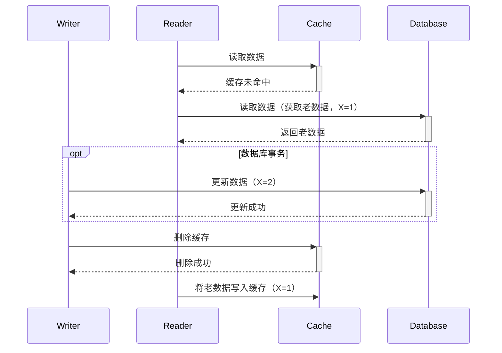
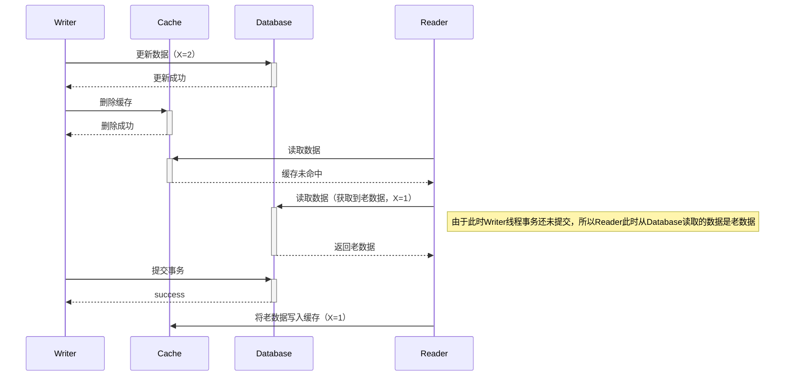
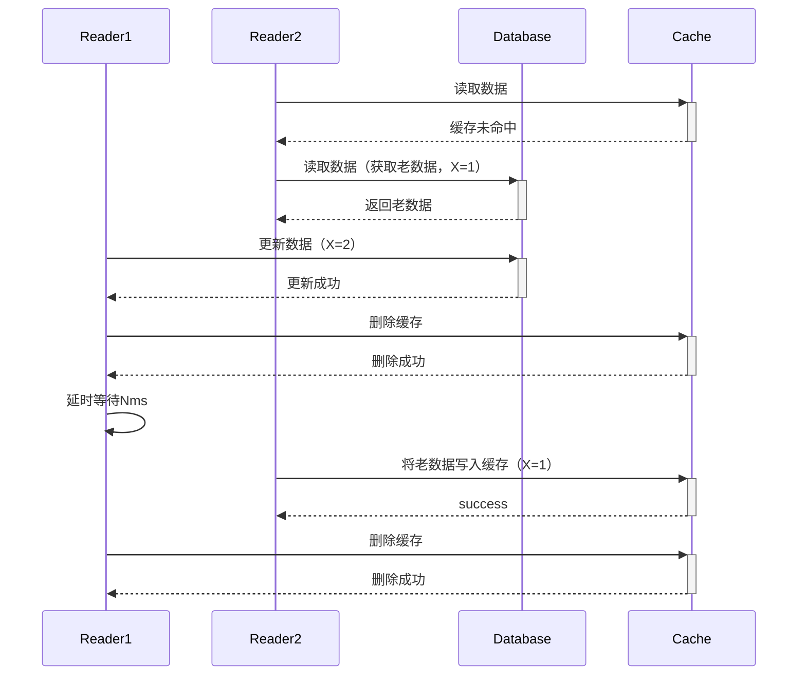
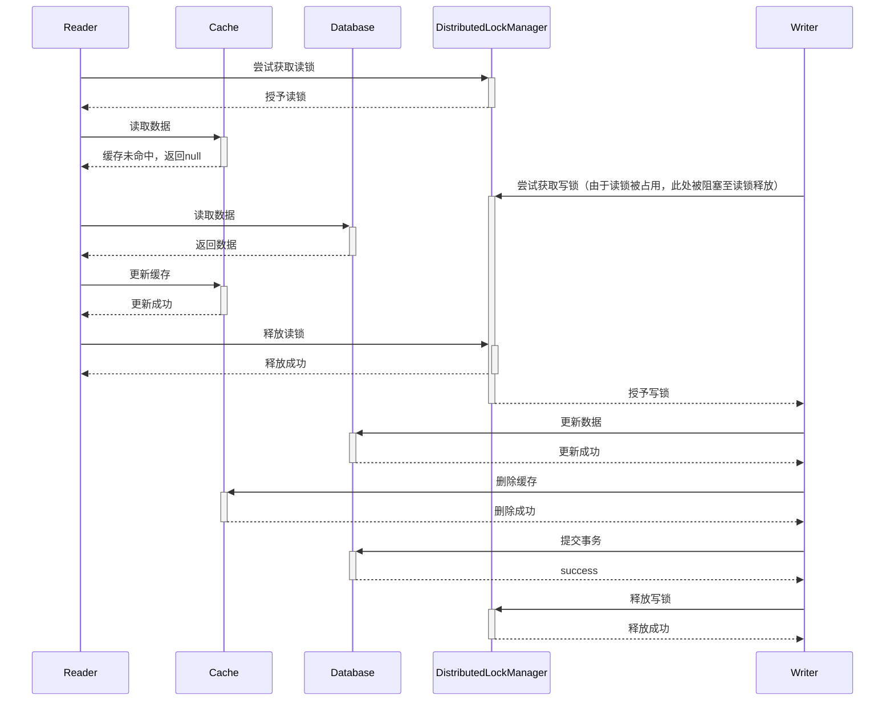
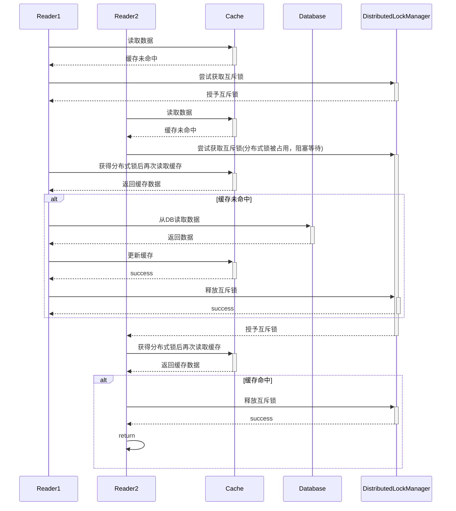
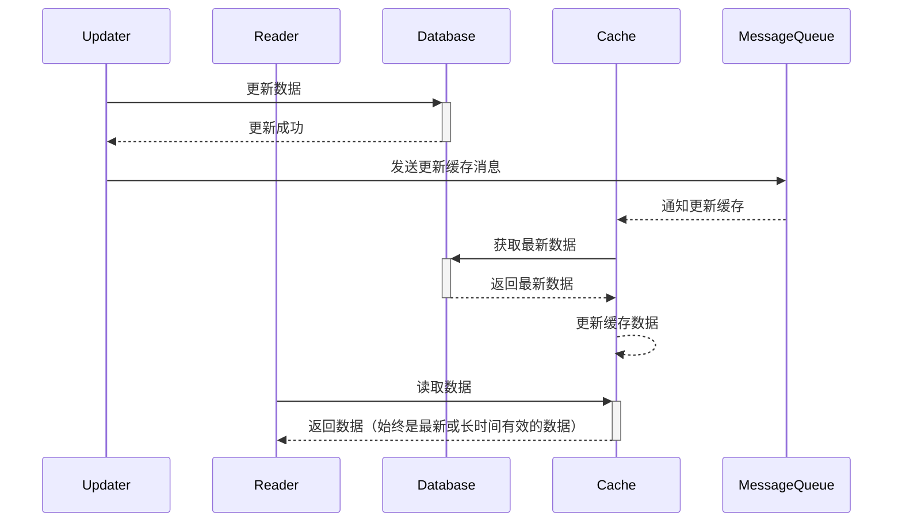
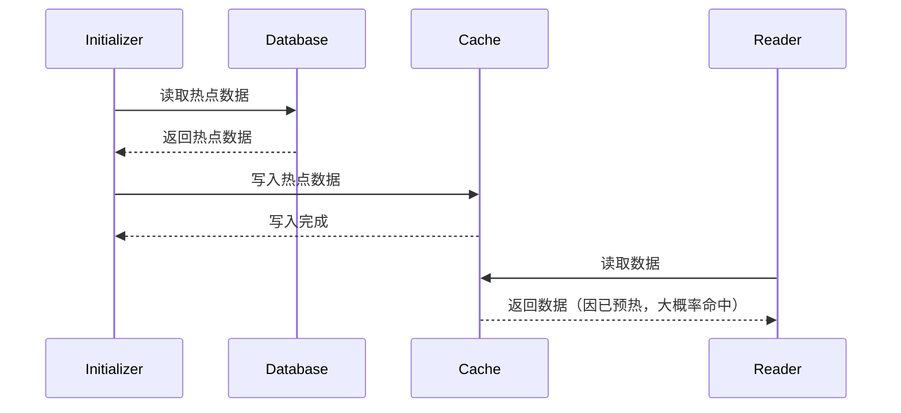

# 深入剖析缓存一致性问题：延时双删的利弊与替代方案

在当今的分布式系统架构中，缓存凭借其快速的数据读取能力，成为提升系统性能和响应速度的关键组件。然而，缓存的引入也带来了缓存一致性问题，这一问题成为开发者在系统设计与维护中必须攻克的难关。缓存一致性问题聚焦于数据更新时，如何确保数据库和缓存中的数据始终保持同步，一旦处理不当，数据不一致的情况就会出现，进而引发各类难以排查和修复的系统故障。

## 一. 缓存一致性问题的常见场景

在实际的系统运行中，缓存一致性问题主要集中在数据更新操作阶段。当数据库中的数据发生变动，缓存中的对应数据也需要及时更新，以保证数据的一致性。常见的读写场景如下：

**读操作流程**：系统首先尝试从缓存中读取数据。若缓存中存在所需数据，直接返回；若缓存未命中，则从数据库中读取数据，并将读取到的数据存入缓存，以便后续读取操作能够更快响应。

**写操作流程**：一般的做法是先更新数据库，然后再更新缓存。但如果在更新数据库之后、更新缓存之前出现异常情况，比如系统崩溃、网络中断等，就会导致数据库和缓存中的数据不一致，数据库已更新为新数据，而缓存中仍保留着旧数据。

## 二. 单次删除在并发场景下的问题

在缓存一致性问题的解决思路中，简单的单次删除缓存方案看似直接，但在并发场景下可能会发生缓存不一致的问题。

### 2.1 情况一：数据库更新和缓存删除不在同一事务中

假设在并发环境下，需要查询的数据还未加载至缓存，系统此时执行数据更新操作，先更新数据库，然后删除缓存。然而，在删除缓存之前，可能会有多个读请求同时到达。由于缓存不存在，这些读请求都会从数据库中读取数据。如果此时数据库的更新操作还未完全完成，或者在读取过程中出现短暂的延迟，读请求就会读取到旧数据，并将旧数据重新写入缓存。这样一来，即使后续数据库更新完成，缓存中却依然保留着旧数据，从而导致数据不一致问题的出现。

下面是在更新DB后单次删除缓存的方案在高并发场景下可能出现问题的时序图：



### 2.2 情况一：数据库更新和缓存删除在同一事务中

在部分代码实践中，会采用将缓存删除操作置于数据库事务内部执行的方式，也就是先删除缓存，再提交数据库事务。然而，这种方式同样存在缓存不一致的隐患。

当系统执行数据更新操作时，正常流程是先更新数据库，再删除缓存。但在删除缓存与事务提交这两个关键步骤的间隙，可能会同时涌入大量读请求。由于此时缓存中还没有所需数据，这些读请求便只能转向数据库进行读取。若数据库事务因网络波动、Writer 所在进程垃圾回收（GC）时发生整堆停顿等原因未能及时提交，根据多版本并发控制（MVCC）机制，穿透到数据库的读请求就会读取到旧数据。紧接着，读请求会把获取到的旧数据重新写入缓存。如此一来，即便后续数据库顺利完成更新，缓存中仍会留存旧数据，最终导致数据不一致问题的出现。



从上述时序图可以清晰地看到，在高并发场景下，单次删除缓存操作容易引发数据不一致的问题，这也正是延时双删方案被提出的原因。

## 三. 延时双删方案

为了解决缓存一致性问题，延时双删作为一种常见的解决方案应运而生。其核心原理是：在完成数据库更新操作后，立即执行第一次缓存删除操作。这一步的目的是让后续的读请求无法从缓存中获取到旧数据，从而被迫从数据库读取最新数据。然后，系统等待一段预先设定好的时间（通常范围在几毫秒到几百毫秒之间），再进行第二次缓存删除操作。设置这段延时的意义在于，确保在第一次删除缓存后，可能存在的读请求有足够的时间从数据库中读取最新数据，并将其写入缓存。通过第二次删除缓存，能够避免在第一次删除缓存后，因读请求读取到旧数据并写入缓存而导致的数据不一致问题。

### 3.1 延时双删流程



### 3.2 延时双删示例代码

以下是一个用 Java 实现延时双删的简单示例代码：

```java
import org.springframework.beans.factory.annotation.Autowired;
import org.springframework.data.redis.core.RedisTemplate;
import org.springframework.stereotype.Service;

import java.util.concurrent.Executors;
import java.util.concurrent.ScheduledExecutorService;
import java.util.concurrent.TimeUnit;
import java.util.function.Consumer;

@Service
public class DelayedDoubleDeleteService {

    @Autowired
    private RedisTemplate<String, Object> redisTemplate;

    private static final ScheduledExecutorService scheduledExecutorService = Executors.newScheduledThreadPool(1);

    /**
     * 执行延时双删操作
     * @param key 缓存的键
     * @param dbUpdateFunction 数据库更新操作的函数
     * @param delayTime 延迟时间，单位为毫秒
     */
    public void performDelayedDoubleDelete(String key, Consumer<Void> dbUpdateFunction, long delayTime) {
        try {
            // 执行数据库更新操作
            dbUpdateFunction.accept(null);

            // 第一次删除缓存
            redisTemplate.delete(key);
            System.out.println("第一次删除缓存完成");

            // 使用 ScheduledExecutorService 延时执行第二次删除操作
            scheduledExecutorService.schedule(() -> {
                try {
                    // 第二次删除缓存
                    redisTemplate.delete(key);
                    System.out.println("第二次删除缓存完成");
                } catch (Exception e) {
                    System.err.println("第二次删除缓存出错: " + e.getMessage());
                }
            }, delayTime, TimeUnit.MILLISECONDS);
        } catch (Exception e) {
            System.err.println("延时双删操作出错: " + e.getMessage());
        }
    }
}
```

在这段代码中，`updateData`方法先执行数据库更新操作，接着进行第一次缓存删除，然后通过`Thread.sleep`方法实现延时，最后执行第二次缓存删除，以此来保障缓存一致性。

### 3.3 延时双删方案的优劣势

#### 3.3.1 优势

**实现相对简单**：相较于一些复杂的缓存一致性解决方案，如基于分布式事务的方案，延时双删只需在原有数据更新逻辑的基础上，添加简单的删除缓存和延时操作，不需要引入额外的复杂中间件或分布式事务管理机制，开发和维护成本相对较低。

**适用范围较广**：在大多数读多写少的应用场景中，延时双删能够有效地解决缓存一致性问题。因为读操作频繁，通过延时双删可以保证读请求在短时间内获取到最新的数据，提升系统的整体数据一致性。

#### 3.3.2 劣势

**延时时间难以精准确定**：设置合理的延时时间是延时双删方案的关键难点之一。如果延时时间过短，可能无法确保读请求已从数据库读取最新数据并写入缓存，从而导致数据不一致问题仍然存在；而如果延时时间过长，在这段延时期间，系统无法从缓存获取数据，所有读请求都需查询数据库，这将极大地增加数据库的负载，严重影响系统性能。

**高并发场景下存在短时间的缓存不一致问题**：**在延时双删策略两次删除操作的时间间隔内，仍然可能会存在短时间的缓存不一致现象**，具体原因前面有过详细解释。

**高并发场景下存在缓存击穿风险**：在读并发量非常高的场景下，双删策略会加剧 cache miss，导致大量请求击穿数据库。

## 四. 缓存一致性问题

### 4.1 分布式读写锁

由于延时双删会导致短时间内的数据不一致问题，一种可行的解决方案是采用读写锁机制。读写锁将对数据的操作分为读操作和写操作，允许多个读操作同时进行，但当有写操作时，会锁定数据，禁止其他读操作和写操作，直到写操作完成。

**数据一致性保障更强**：通过读写锁的机制，能够确保在数据更新期间，不会有读请求获取到旧数据，从根本上避免了因读写并发导致的数据不一致问题，相比延时双删，在数据一致性方面有更严格的保障。

**实时性更好**：读写锁方案不存在延时双删中的延时等待时间，数据更新后能立即对后续的读请求可见，提高了系统的数据实时性。

#### 4.1.1 时序图



在这个示意图中，引入了`DistributedLockManager`来管理分布式锁，读操作和写操作都需要向它请求相应的锁。读操作先尝试从缓存读取数据，缓存未命中时再查询数据库并更新缓存；写操作在获取写锁后更新数据库并删除缓存，以此保证数据一致性和操作的原子性。

#### 4.1.2 示例代码

```java
import org.redisson.api.RReadWriteLock;
import org.redisson.api.RedissonClient;
import org.springframework.data.redis.core.RedisTemplate;

import java.util.concurrent.TimeUnit;

public class CacheDataService {

    private final RedisTemplate<String, Object> redisTemplate;
    private final RedissonClient redissonClient;

    public CacheDataService(RedisTemplate<String, Object> redisTemplate, RedissonClient redissonClient) {
        this.redisTemplate = redisTemplate;
        this.redissonClient = redissonClient;
    }

    /**
     * 读操作方法
     * @param key 缓存键
     * @return 数据对象
     */
    public Object readData(String key) {
        RReadWriteLock rwLock = redissonClient.getReadWriteLock(key + "_rwlock");
        // 获取读锁
        rwLock.readLock().lock();
        try {
            // 从缓存读取数据
            Object data = redisTemplate.opsForValue().get(key);
            if (data == null) {
                // 缓存未命中，从数据库读取数据
                data = readDataFromDatabase();
                // 更新缓存
                redisTemplate.opsForValue().set(key, data);
            }
            return data;
        } finally {
            // 释放读锁
            rwLock.readLock().unlock();
        }
    }

    /**
     * 写操作方法
     * @param key 缓存键
     * @param newData 新的数据
     */
    public void writeData(String key, Object newData) {
        RReadWriteLock rwLock = redissonClient.getReadWriteLock(key + "_rwlock");
        // 尝试获取写锁，最多等待 10 秒，锁自动释放时间为 30 秒
        try {
            boolean isLocked = rwLock.writeLock().tryLock(10, 30, TimeUnit.SECONDS);
            if (isLocked) {
                try {
                    // 更新数据库
                    updateDataInDatabase(newData);
                    // 删除缓存
                    redisTemplate.delete(key);
                } finally {
                    // 释放写锁
                    rwLock.writeLock().unlock();
                }
            }
        } catch (InterruptedException e) {
            Thread.currentThread().interrupt();
        }
    }

    /**
     * 模拟从数据库读取数据
     * @return 数据对象
     */
    private Object readDataFromDatabase() {
        // 这里可以替换为实际的数据库查询逻辑
        return "Data from database";
    }

    /**
     * 模拟更新数据库数据
     * @param newData 新的数据
     */
    private void updateDataInDatabase(Object newData) {
        // 这里可以替换为实际的数据库更新逻辑
        System.out.println("Updating database with new data: " + newData);
    }
}
```

代码说明：

1. **readData 方法**：
   - 使用 `redissonClient.getReadWriteLock(key + "_rwlock")` 获取读写锁对象，并调用 `readLock().lock()` 方法获取读锁。
   - 从缓存中读取数据，如果缓存未命中，则调用 `readDataFromDatabase` 方法从数据库中读取数据，并将数据更新到缓存中。
   - 最后，在 `finally` 块中调用 `readLock().unlock()` 方法释放读锁。
2. **writeData 方法**：
   - 使用 `redissonClient.getReadWriteLock(key + "_rwlock")` 获取读写锁对象，并调用 `writeLock().tryLock(10, 30, TimeUnit.SECONDS)` 方法尝试获取写锁，最多等待 10 秒，锁自动释放时间为 30 秒。
   - 如果获取到写锁，则调用 `updateDataInDatabase` 方法更新数据库，并调用 `redisTemplate.delete(key)` 方法删除缓存。
   - 最后，在 `finally` 块中调用 `writeLock().unlock()` 方法释放写锁。
3. **readDataFromDatabase 方法**：模拟从数据库中读取数据的操作，返回一个字符串。
4. **updateDataInDatabase 方法**：模拟更新数据库数据的操作，打印更新信息。

#### 4.1.3 优劣势分析

优势：

- **不会加剧cache miss**：在读写锁方案中，写操作过程中所有的读请求将会被阻塞，也就不需要通过删除两次缓存来保证缓存最终一致性，缓存删除的频率降低，cache miss理论上也会相应降低。

劣势：

- **性能影响较大**：在高并发读的场景下，由于写操作会锁定数据，当有写操作进行时，所有读请求都需要等待写操作完成，这会导致读操作的响应时间变长，系统整体的吞吐量下降。

- **实现复杂度高**：读写锁的实现需要考虑到分布式环境下的锁管理、锁的粒度控制、死锁预防等多个复杂问题，相比延时双删，其实现和维护的难度大大增加。

### 4.2 缓存一致性问题的思考模式

1. 性能和一致性不能同时满足，为了性能考虑，通常会采用「最终一致性」的方案。
2. 掌握缓存和数据库一致性问题，核心问题有 3 点：缓存利用率、并发、缓存 + 数据库更新一起成功问题。
3. 失败场景下要保证一致性，常见手段就是「重试」，同步重试会影响吞吐量，所以通常会采用异步重试的方案。

## 五. 缓存击穿问题

在延时双删方案的实际应用场景中，若读并发量极高，大量的 cache miss（缓存未命中）现象就可能出现。一旦这些请求毫无限制地穿透到数据库，便可能引发数据库被击穿的严重后果。为了解决这个问题，可以采用以下几种方法：

### 5.1 互斥锁方案

**使用分布式锁限制cache miss请求同时查询数据库的数量**：在查询数据库之前，先获取一个互斥锁。只有获取到锁的线程才能查询数据库并更新缓存，其他线程在等待锁的过程中可以从缓存中获取数据（如果缓存中有数据的话）。这样可以避免大量线程同时查询数据库，减少数据库的压力，防止缓存击穿。

#### 5.1.1 时序图



#### 5.1.2 代码示例

```java
import org.redisson.api.RLock;
import org.redisson.api.RedissonClient;
import org.springframework.data.redis.core.RedisTemplate;

import java.util.concurrent.TimeUnit;

public class CacheService {

    private final RedisTemplate<String, Object> redisTemplate;
    private final RedissonClient redissonClient;

    public CacheService(RedisTemplate<String, Object> redisTemplate, RedissonClient redissonClient) {
        this.redisTemplate = redisTemplate;
        this.redissonClient = redissonClient;
    }

    public Object getData(String key) {
        // 第一次读取缓存
        Object data = redisTemplate.opsForValue().get(key);
        if (data != null) {
            return data;
        }

        // 尝试获取分布式锁
        RLock lock = redissonClient.getLock(key + "_lock");
        try {
            // 尝试获取锁，最多等待 10 秒，锁自动释放时间为 30 秒
            boolean isLocked = lock.tryLock(10, 30, TimeUnit.SECONDS);
            if (isLocked) {
                try {
                    // 获得分布式锁后再次读取缓存
                    data = redisTemplate.opsForValue().get(key);
                    if (data != null) {
                        return data;
                    }

                    // 缓存未命中，从数据库读取数据
                    data = readDataFromDatabase();

                    // 更新缓存
                    redisTemplate.opsForValue().set(key, data);
                    return data;
                } finally {
                    // 释放锁
                    if (lock.isHeldByCurrentThread()) {
                        lock.unlock();
                    }
                }
            }
        } catch (InterruptedException e) {
            Thread.currentThread().interrupt();
        }
        return null;
    }

    private Object readDataFromDatabase() {
        // 模拟从数据库读取数据
        return "Data from database";
    }
}
```

#### 5.1.3 优劣势分析

- **优势**：

  - **有效防止缓存击穿**：通过分布式锁限制同一时间内只有一个线程能查询数据库并更新缓存，避免了大量缓存未命中请求同时穿透到数据库，从而有效保护数据库不被击穿，保障系统的稳定性和可用性。

  - **实现相对简单**：在代码实现上，借助现有的分布式锁框架（如 Redisson），只需在查询数据库前后增加获取锁和释放锁的逻辑，开发成本相对较低，对现有业务代码的侵入性较小。

  - **提高缓存命中率**：在获取锁期间，其他线程可从缓存中获取数据（若缓存中有数据），减少了不必要的数据库查询，提高了缓存的命中率，提升了系统整体的读取性能。

- **劣势**：

  - **性能瓶颈**：在高并发场景下，大量线程竞争分布式锁，会导致锁的竞争激烈，增加了线程等待锁的时间，降低了系统的并发处理能力，可能成为系统的性能瓶颈。

  - **增加系统复杂度**：引入分布式锁需要额外的依赖（如 Redis 等分布式存储），增加了系统架构的复杂性，同时也带来了诸如锁等待超时、死锁等问题，需要额外的机制来处理和监控。

  - **单点故障风险**：如果分布式锁的存储（如 Redis）出现故障，可能导致整个系统无法正常获取锁，进而影响数据的读取和缓存更新，增加了系统的单点故障风险。

### 5.2 热点数据永不过期+缓存预热

在系统启动时，提前将热点数据加载到缓存中，避免系统启动后因大量读请求导致缓存未命中，从而减少数据库的压力。并且将缓存设置为“永不过期”，使得系统不会因为缓存过期导致数据库被击穿。这里的“永不过期”指的是数据在生命周期内永不过期，例如一个有结束时间的活动信息缓存，过期时间可以设置为活动结束时间之后。

#### 5.2.1 缓存更新时序图



此方案是基于消息中间件完成的，在实践过程中需要考虑数据更新和消息发送两个操作如何保证都成功，两种思路：

1. 先发消息，再提交事务。但是这样就会带来数据库长事务的问题。
2. 先提交事务，再发送消息，消息发送失败异步重试+本地消息表+告警。

#### 5.2.2 缓存预热时序图



## 六. 总结

缓存一致性问题是分布式系统中无法回避的关键挑战，延时双删方案虽然在一定程度上提供了有效的解决方案，但并非万能的银弹。它在实现简单性和适用范围上有一定优势，只需在原有数据更新逻辑的基础上添加简单的删除缓存和延时操作，无需引入复杂中间件或分布式事务管理机制，开发和维护成本相对较低。并且在大多数读多写少的应用场景中，能有效解决缓存一致性问题，保证读请求在短时间内获取到最新数据，提升系统整体数据一致性。

然而，延时双删方案也面临着诸多问题。首先，延时时间难以精准确定，过短可能导致数据不一致问题仍然存在，过长则会增加数据库负载，严重影响系统性能。其次，在两次删除操作的时间间隔内，高并发场景下仍可能出现短时间的缓存不一致现象。此外，高并发读场景下，该方案会加剧 cache miss，大量请求可能会击穿数据库。

针对缓存一致性问题，读写锁方案将对数据的操作分为读操作和写操作，允许多个读操作同时进行，但写操作时会锁定数据，禁止其他读操作和写操作，直到写操作完成。该方案在数据一致性方面有更严格的保障，能从根本上避免因读写并发导致的数据不一致问题，数据更新后能立即对后续读请求可见，提高了系统的数据实时性。不过，在高并发读场景下，写操作会使所有读请求等待，导致读操作响应时间变长，系统整体吞吐量下降，且其实现需要考虑分布式环境下的锁管理、锁粒度控制、死锁预防等复杂问题，实现和维护难度较大。

在缓存击穿问题的解决上，互斥锁方案使用分布式锁限制 cache miss 请求同时查询数据库的数量，能有效防止缓存击穿，实现相对简单，还能提高缓存命中率。但在高并发场景下，会导致锁竞争激烈，降低系统并发处理能力，成为性能瓶颈，同时引入分布式锁会增加系统架构复杂性，带来锁过期、死锁等问题，存在单点故障风险。

热点数据永不过期结合缓存预热的方案，在系统启动时提前将热点数据加载到缓存中，并设置为 “永不过期”（如数据在其生命周期内不过期），可避免系统启动后因大量读请求导致缓存未命中，减少数据库压力。不过，基于消息中间件完成缓存更新时，需要考虑数据更新和消息发送两个操作如何保证都成功，如先发消息再提交事务可能带来数据库长事务问题，先提交事务再发送消息则需处理消息发送失败的异步重试、本地消息表及告警等情况。

本文并非对延迟双删的全盘否定，而是强调在特殊场景下，延迟双删策略的弊端会被放大，进而完全盖过其优势。在实际应用中，开发者需要根据具体的业务场景、系统架构和性能需求，综合考虑各种因素，选择最合适的缓存一致性解决方案，以确保系统的高效稳定运行。 

> 参考文章：
>
> [延迟双删如此好用，为何大厂从来不用Cache-aside下数据变更推荐使用删除缓存的策略，为降低数据不一致通常会配合延迟 - 掘金](https://juejin.cn/post/7447033901657096202#heading-15)
>
> [缓存与主副本数据一致性系统设计方案（下篇）如何为Cache-Aside模式提供更强的数据一致保障？提供更强的一致性保障需 - 掘金](https://juejin.cn/post/7440021417506979866#heading-5)
>
> [Big-Data-Interview/面试/分布式/2. 数据库与缓存数据一致性问题.md at master · wanggangkun/Big-Data-Interview](https://github.com/wanggangkun/Big-Data-Interview/blob/master/面试/分布式/2. 数据库与缓存数据一致性问题.md)
>
> [缓存和数据库一致性问题，看这篇就够了 | Kaito's Blog](http://kaito-kidd.com/2021/09/08/how-to-keep-cache-and-consistency-of-db/)
