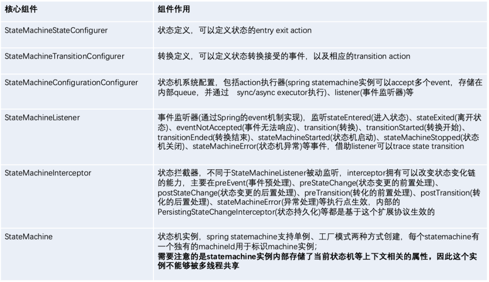
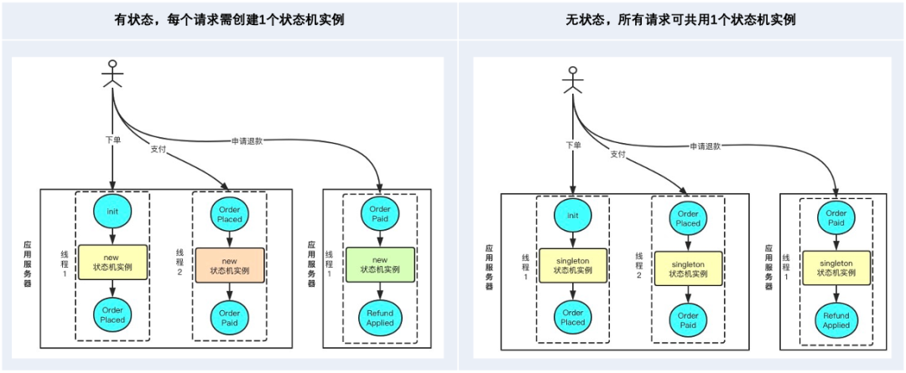
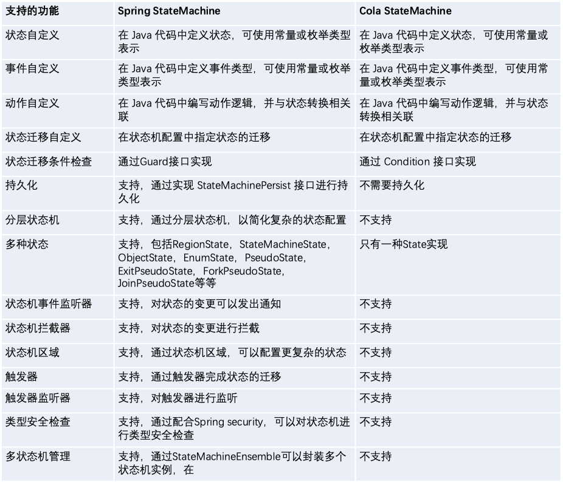
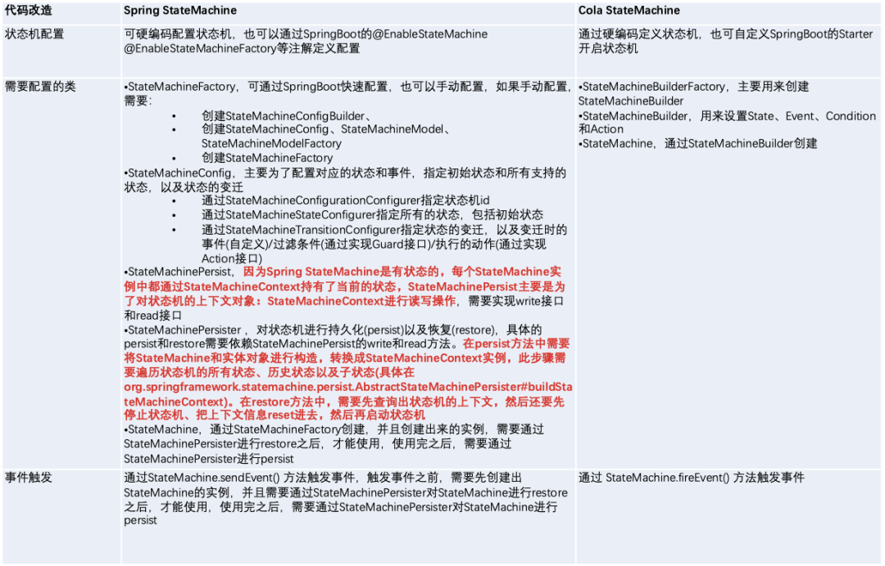

# Spring State Machine入门实践

## 一. 状态机

### 1.1 什么是状态

先来解释什么是`状态（ State ）`。现实事物是有不同状态的，例如一个自动门，就有 `open` 和 `closed` 两种状态。我们通常所说的状态机是有限状态机，也就是被描述的事物的状态的数量是有限个，例如自动门的状态就是两个 `open` 和 `closed` 。

状态机，也就是 `State Machine` ，不是指一台实际机器，而是指一个数学模型。说白了，一般就是指一张状态转换图。

状态机的全称是`有限状态自动机`，自动两个字也是包含重要含义的。给定一个状态机，同时给定它的当前状态以及输入，那么输出状态时可以明确的运算出来的。例如对于自动门，给定初始状态 closed ，给定输入“开门”，那么下一个状态时可以运算出来的。

### 1.2 状态机中的概念

下面来给出状态机的四大概念：

- `State`：状态，一个状态机`至少`要包含两个状态。
- `Event`：事件，事件就是执行某个操作的触发条件或者口令。对于自动门，“按开门按钮”就是一个事件。
- `Action`：动作，事件发生以后要执行动作。例如事件是“按开门按钮”，动作是“开门”。编程的时候，一个 Action一般就对应一个函数。
- `Transition`：变换，也就是从一个状态变化为另一个状态。例如“开门过程”就是一个变换。

### 1.3 状态机的价值

有限状态机通过明确的规则定义，将复杂的业务流程转化为可预测的状态迁移图。其核心优势体现在：

1. 可视化业务流程，降低系统复杂度
2. 保证状态转换的合法性，避免非法状态
3. 集中管理业务规则，提升可维护性

## 二. 状态机选型

### 2.1 Spring StateMachine

Spring StateMachine 是 Spring 官方提供的状态机实现。

先从状态机的定义入手，StateMachine<States, Events>，其中：

- StateMachine：状态机模型
- State：S-状态，一般定义为一个枚举类，如创建、待风控审核、待支付等状态
- Event：E-事件，同样定义成一个枚举类，如订单创建、订单审核、支付等，代表一个动作。一个状态机的定义就由这两个主要的元素组成，状态及对对应的事件（动作）。

Spring StateMachine 中的相关概念：

- Transition: 节点，是组成状态机引擎的核心
- Source：节点的当前状态
- Target：节点的目标状态
- Event：触发节点从当前状态到目标状态的动作
- Guard：起校验功能，一般用于校验是否可以执行后续 Action
- Action：用于实现当前节点对应的业务逻辑处理

以下是一些核心组件：



### 2.2 Cola StateMachine

Spring StateMachine是有状态的（Stateful）的，有状态意味着多线程并发情况下如果是单个实例就容易出现线程安全问题。

如今我们的系统普遍都是分布式部署，不得不考虑多线程的问题，因为每来一个请求就需要创建一个状态机实例(per statemachine per request)。如果某些状态机它的构建过程很复杂，并且当下 QPS 又很高的话，往往会造成系统的性能瓶颈。

为此阿里出了一个开源的状态机：**Cola-StateMachine**

Cola-StateMachine 最重要的特点是，**状态机的设计是无状态的，并且内部实现了 DSL 语法，通过流式 API 限定了方法调用的顺序。**



分析一下市面上的开源状态机引擎，不难发现，它们之所以有状态，主要是在状态机里面维护了两个状态：初始状态（Initial State）和当前状态（Current State），如果我们能把这两个实例变量去掉的话，就可以实现无状态，从而实现一个状态机只需要有一个 Instance 就够了。

关键是这两个状态可以不要吗？当然可以，唯一的副作用是，我们没办法获取到状态机 Instance 的 Current State。然而，我也不需要知道，因为我们使用状态机，仅仅是接受一下 Source State，Check 一下 Condition，Execute 一下 Action，然后返回 Target State 而已。它只是实现了一个状态流转的 DSL 表达，仅此而已，全程操作完全可以是无状态的。

具体举例如下：

```java
        // 构建一个状态机(生产场景下，生产场景可以直接初始化一个Bean)
        StateMachineBuilder<StateMachineTest.ApplyStates, StateMachineTest.ApplyEvents, Context> builder = StateMachineBuilderFactory.create();
        // 外部流转(两个不同状态的流转)
        builder.externalTransition()
            .from(SOURCE)//原来状态
            .to(TARGET)//目标状态
            .on(EVENT1)//基于此事件触发
            .when(checkCondition1())//前置过滤条件
            .perform(doAction());//满足条件，最终触发的动作
```

### 2.3 有状态VS无状态

有状态状态机（Stateful State Machine）：状态机内部维护当前状态，每次事件触发后自动更新状态，无需外部显式传递当前状态。

**优点**：

1. **简化调用逻辑**
   调用方只需传递事件（Event），无需管理当前状态，状态变更由状态机内部自动处理，代码更简洁。
2. **状态生命周期可控**
   状态机可以管理状态的初始化、持久化和销毁逻辑，适合需要长期跟踪状态的场景（如订单流程、审批流）。
3. **适合复杂流程**
   天然支持状态持久化和恢复，适用于需要处理异步事件、状态回溯或长时间运行流程的场景。
4. **框架集成友好**
   如 Spring State Machine 等框架提供了开箱即用的状态管理、监听器和持久化机制。

**缺点**：

1. **状态共享问题**
   在并发或分布式环境中，多个实例可能同时修改同一状态，需要额外处理线程安全或分布式锁。在用户交互场景下，通常需要为每一个用户会话创建一个独立的状态机实例以避免并发问题，这样状态机实例的初始化开销+GC开销可能会不如无状态状态机。
2. **资源占用**
   每个状态机实例需要维护自身状态，可能占用较多内存（尤其在大量并发场景中）。
3. **持久化复杂度**
   若状态需要持久化到数据库或外部存储，需要处理状态序列化和恢复逻辑，增加复杂度。

### 2.4 功能对比



持久化一方面是好事，另一方面是坏事。

好事是因为持久化策略可以应对分布式系统的故障，每个实体对象在做状态变迁之前，可以从持久化的存储中获取该实体之前的状态，不用担心状态的丢失。

坏事是因为为了要保证状态机的状态，每次状态变迁之前都需要先恢复当前的状态，这个操作是非常消耗性能的。

Cola StateMachine 将 StateMachine 的实例定义为无状态(Stateless)的，状态的变迁不依赖当前 StateMachine 实例的状态，所以也就不需要持久化的问题。系统发生故障时，StateMachine 的实例也不需要重建，只需要对状态变迁做重试即可，状态是否能够变迁是在 Condition 中定义的，跟 StateMachine 的实例没有直接的关系。

### 2.5 接入成本对比



## 三. Spring StateMachine Demo

### 3.1 建表

```sql
CREATE TABLE order_info
(
    order_id      VARCHAR(255) NOT NULL comment '订单号',
    state         INT          NOT NULL comment '订单状态',
    amount        BIGINT       NOT NULL comment '订单金额',
    coupon_amount BIGINT       NOT NULL comment '订单优惠金额',
    supplier_ids  VARCHAR(255) NOT NULL comment '勾选的服务商列表',
    start_address VARCHAR(255) NOT NULL comment '订单起始位置',
    end_address   VARCHAR(255) NOT NULL comment '订单结束位置',
    start_lat     DOUBLE,
    start_lng     DOUBLE,
    end_lat       DOUBLE,
    end_lng       DOUBLE,
    create_time   DATETIME     NOT NULL default current_timestamp comment '订单创建时间',
    update_time   DATETIME     NOT NULL default current_timestamp on update current_timestamp comment '订单创建时间',
    PRIMARY KEY (order_id)
);

CREATE TABLE `order_item`
(
    `id`             INT(11)     NOT NULL AUTO_INCREMENT COMMENT '主键ID',
    `order_id`       VARCHAR(64) NOT NULL COMMENT '订单ID',
    `third_order_id` VARCHAR(64) NOT NULL COMMENT '第三方订单ID',
    `supplier_id`    INT(11)     NOT NULL COMMENT '供应商ID',
    PRIMARY KEY (`id`) USING BTREE
) ENGINE = InnoDB
  DEFAULT CHARSET = utf8mb4
  COLLATE = utf8mb4_general_ci
    COMMENT '订单子项表';
```

### 3.2 配置

#### 3.2.1 引入依赖

```xml
        <dependency>
            <groupId>org.springframework.boot</groupId>
            <artifactId>spring-boot-starter</artifactId>
        </dependency>

        <dependency>
            <groupId>org.springframework.boot</groupId>
            <artifactId>spring-boot-starter-test</artifactId>
            <scope>test</scope>
        </dependency>
        <dependency>
            <groupId>org.springframework.boot</groupId>
            <artifactId>spring-boot-starter-web</artifactId>
        </dependency>
        <dependency>
            <groupId>mysql</groupId>
            <artifactId>mysql-connector-java</artifactId>
        </dependency>
        <dependency>
            <groupId>com.baomidou</groupId>
            <artifactId>mybatis-plus-boot-starter</artifactId>
            <version>3.5.0</version>
        </dependency>
        <dependency>
            <groupId>org.projectlombok</groupId>
            <artifactId>lombok</artifactId>
            <scope>provided</scope>
        </dependency>
        <dependency>
            <groupId>cn.hutool</groupId>
            <artifactId>hutool-all</artifactId>
            <version>5.8.36</version>
        </dependency>
        <dependency>
            <groupId>org.aspectj</groupId>
            <artifactId>aspectjweaver</artifactId>
            <version>1.9.7</version>
        </dependency>
		<!--状态机-->
        <dependency>
            <groupId>org.springframework.statemachine</groupId>
            <artifactId>spring-statemachine-core</artifactId>
            <version>4.0.0</version>
        </dependency>
```

#### 2.3.2 application.yaml

```yml
# DataSource Config
spring:
  datasource:
    driver-class-name: com.mysql.cj.jdbc.Driver
    url: jdbc:mysql://localhost:3306/xxx?useSSL=false&serverTimezone=UTC
    username: root
    password: xxx
server:
  port: 8971
```

### 3.3 状态机配置

#### 3.3.1 状态定义

```java
package cn.bigcoder.statemachine.springstatemachinedemo.enums;

import lombok.Getter;

/**
 * @author: bigcoder
 * @date: 2025-03-22
 **/
@Getter
public enum OrderState {
    INIT(1, "初始化"),
    UN_DISPATCHING(2, "未派单"),
    SP_DISPATCHING(3, "服务商派单中"),
    SP_DISPATCHED(4, "服务商已派单"),
    ;

    private Integer state;
    private String desc;

    OrderState(Integer state, String desc) {
        this.state = state;
        this.desc = desc;
    }

    public static OrderState getByState(Integer state) {
        for (OrderState orderState : OrderState.values()) {
            if (orderState.state.equals(state)) {
                return orderState;
            }
        }
        return null;
    }
}

```

#### 3.3.2 事件定义

```java
package cn.bigcoder.statemachine.springstatemachinedemo.enums;

/**
 * @author: bigcoder
 * @date: 2025-03-22
 **/
public enum OrderEvent {
    BOOK_ORDER("下单"),
    DISPATCH("派单"),
    SP_CONFIRM("服务商司机接单"),
    ;

    private String desc;

    OrderEvent(String desc) {
        this.desc = desc;
    }
}

```

#### 3.3.4 定义状态机

```java
package cn.bigcoder.statemachine.springstatemachinedemo.statemachine.config;

import cn.bigcoder.statemachine.springstatemachinedemo.enums.OrderEvent;
import cn.bigcoder.statemachine.springstatemachinedemo.enums.OrderState;
import cn.bigcoder.statemachine.springstatemachinedemo.repository.po.OrderInfoPo;
import cn.bigcoder.statemachine.springstatemachinedemo.statemachine.action.OrderConfirmAction;
import cn.bigcoder.statemachine.springstatemachinedemo.statemachine.action.OrderDispatchAction;
import cn.bigcoder.statemachine.springstatemachinedemo.statemachine.action.OrderInitAction;
import java.util.EnumSet;
import javax.annotation.Resource;
import org.springframework.context.annotation.Bean;
import org.springframework.context.annotation.Configuration;
import org.springframework.statemachine.StateMachineContext;
import org.springframework.statemachine.StateMachinePersist;
import org.springframework.statemachine.config.EnableStateMachineFactory;
import org.springframework.statemachine.config.StateMachineConfigurerAdapter;
import org.springframework.statemachine.config.builders.StateMachineStateConfigurer;
import org.springframework.statemachine.config.builders.StateMachineTransitionConfigurer;
import org.springframework.statemachine.persist.DefaultStateMachinePersister;
import org.springframework.statemachine.persist.StateMachinePersister;
import org.springframework.statemachine.support.DefaultStateMachineContext;

/**
 * @description: 订单状态机
 */
@Configuration
@EnableStateMachineFactory
public class OrderStateMachineConfig extends
        StateMachineConfigurerAdapter<OrderState, OrderEvent> {

    @Resource
    private OrderInitAction orderInitAction;
    @Resource
    private OrderDispatchAction orderDispatchAction;
    @Resource
    private OrderConfirmAction orderConfirmAction;

    /**
     * 配置状态
     */
    @Override
    public void configure(StateMachineStateConfigurer<OrderState, OrderEvent> states)
            throws Exception {
        states.withStates()
                .initial(OrderState.INIT)
                .states(EnumSet.allOf(OrderState.class));
    }

    /**
     * 配置状态转换事件关系
     */
    @Override
    public void configure(StateMachineTransitionConfigurer<OrderState, OrderEvent> transitions)
            throws Exception {
        // 下单
        transitions.withExternal()
                .source(OrderState.INIT)
                .target(OrderState.UN_DISPATCHING)
                .event(OrderEvent.BOOK_ORDER)
                .action(orderInitAction);
        // 派单
        transitions.withExternal()
                .source(OrderState.UN_DISPATCHING)
                .target(OrderState.SP_DISPATCHING)
                .event(OrderEvent.DISPATCH)
                .action(orderDispatchAction);

        // 服务商确认
        transitions.withExternal()
                .source(OrderState.SP_DISPATCHING)
                .target(OrderState.SP_DISPATCHED)
                .event(OrderEvent.SP_CONFIRM)
                .action(orderConfirmAction);
        transitions.withExternal()
                .source(OrderState.UN_DISPATCHING)
                .target(OrderState.SP_DISPATCHED)
                .event(OrderEvent.SP_CONFIRM)
                .action(orderConfirmAction);

    }

    /**
     * StateMachinePersister配置
     *
     * @author yvesdong
     * @date 2024/2/20 14:11
     */
    @Bean
    public StateMachinePersister<OrderState, OrderEvent, OrderInfoPo> persister() {
        return new DefaultStateMachinePersister<>(
                new StateMachinePersist<OrderState, OrderEvent, OrderInfoPo>() {

                    @Override
                    public void write(StateMachineContext<OrderState, OrderEvent> stateMachineContext,
                            OrderInfoPo order)
                            throws Exception {
                        // do nothing: 不依赖于状态机的持久化管理
                    }

                    @Override
                    public StateMachineContext<OrderState, OrderEvent> read(OrderInfoPo orderInfo)
                            throws Exception {
                        // 读取当前订单状态
                        OrderState orderState = OrderState.getByState(orderInfo.getState());
                        if (orderState == null) {
                            throw new RuntimeException("state not exist");
                        }
                        return new DefaultStateMachineContext<>(orderState, null,
                                null, null);
                    }
                });
    }
}
```

#### 3.3.5 定义基础Action

```java
package cn.bigcoder.statemachine.springstatemachinedemo.statemachine.action;

import cn.bigcoder.statemachine.springstatemachinedemo.enums.OrderEvent;
import cn.bigcoder.statemachine.springstatemachinedemo.enums.OrderState;
import cn.bigcoder.statemachine.springstatemachinedemo.repository.OrderInfoPoRepository;
import cn.bigcoder.statemachine.springstatemachinedemo.repository.po.OrderInfoPo;
import cn.bigcoder.statemachine.springstatemachinedemo.statemachine.config.StateMachineConstants;
import javax.annotation.Resource;
import lombok.extern.slf4j.Slf4j;
import org.springframework.aop.framework.AopContext;
import org.springframework.statemachine.StateContext;
import org.springframework.statemachine.action.Action;

@Slf4j
public abstract class AbstractOrderAction<T, R> implements Action<OrderState, OrderEvent> {

    @Override
    public void execute(StateContext<OrderState, OrderEvent> context) {
        R response;
        try {
            if (context.getException() != null) {
                log.warn("BaseOrderAction execute exception, event:{}", context.getEvent(), context.getException());
                throw context.getException();
            } else {
                T request = (T) context.getMessageHeader(StateMachineConstants.REQUEST);
                OrderInfoPo orderInfo = (OrderInfoPo) context.getMessageHeader(StateMachineConstants.ORDER);
                AbstractOrderAction proxy;
                try {
                    // 尝试获取代理对象
                    proxy = (AbstractOrderAction) AopContext.currentProxy();
                } catch (IllegalStateException e) {
                    // 如果没有代理对象，使用当前对象本身
                    proxy = (AbstractOrderAction) this;
                }
                response = (R) proxy.onExecute(context, request, orderInfo);
            }
            context.getExtendedState().getVariables().put(StateMachineConstants.RESPONSE, response);
        } catch (Exception e) {
            context.getExtendedState().getVariables().put(StateMachineConstants.EXCEPTION_KEY, e);
        }
    }


    public abstract R onExecute(StateContext<OrderState, OrderEvent> context, final T request,
            final OrderInfoPo orderInfo) throws Exception;
}
```

在 `AbstractOrderAction` 提供一个 `onExecute` 抽象方法，子类实现该方法完成对应业务逻辑。之所以定义这个抽象类，是因为原生`Action#execute` 方法返回类型为 `void`， 无法直接返回处理结果，亦或者在处理过程中发生异常，也会被状态机吞掉。

但是我们可以借助状态机提供的上下文传递的能力，将返回值以及异常透传出去。

#### 3.3.6 定义状态机门面

```java
package cn.bigcoder.statemachine.springstatemachinedemo.statemachine;

import cn.bigcoder.statemachine.springstatemachinedemo.enums.OrderEvent;
import cn.bigcoder.statemachine.springstatemachinedemo.enums.OrderState;
import cn.bigcoder.statemachine.springstatemachinedemo.repository.mapper.OrderInfoPoMapper;
import cn.bigcoder.statemachine.springstatemachinedemo.repository.po.OrderInfoPo;
import cn.bigcoder.statemachine.springstatemachinedemo.statemachine.config.StateMachineConstants;
import java.rmi.ServerException;
import javax.annotation.Resource;
import lombok.extern.slf4j.Slf4j;
import org.springframework.messaging.support.MessageBuilder;
import org.springframework.statemachine.StateMachine;
import org.springframework.statemachine.config.StateMachineFactory;
import org.springframework.statemachine.persist.StateMachinePersister;
import org.springframework.stereotype.Service;

/**
 * @author: bigcoder
 * @date: 2025-03-22
 **/
@Slf4j
@Service
public class StateMachineService {

    @Resource
    private OrderInfoPoMapper orderInfoPoMapper;

    @Resource
    private StateMachineFactory<OrderState, OrderEvent> stateMachineFactory;
    @Resource
    private StateMachinePersister<OrderState, OrderEvent, OrderInfoPo> stateMachinePersister;

    public <T extends BaseOrderReqDto, R> R sendEvent(OrderEvent event, T request, Class<R> resType) throws Exception {
        String eventName = event.name();
        OrderInfoPo orderInfo = orderInfoPoMapper.selectById(request.getOrderId());
        if (orderInfo == null) {
            throw new RuntimeException("订单不存在");
        }
        // 初始化状态机实例
        StateMachine<OrderState, OrderEvent> stateMachine = stateMachineFactory.getStateMachine();
        // 初始化状态机状态
        stateMachinePersister.restore(stateMachine, orderInfo);
        // 触发事件
        boolean tag = stateMachine.sendEvent(
                MessageBuilder.withPayload(event)
                        .setHeader(StateMachineConstants.REQUEST, request)
                        .setHeader(StateMachineConstants.ORDER, orderInfo)
                        .build());
        if (!tag) {
            throw new ServerException("状态不匹配");
        }
        // 获取action里抛出的异常
        Exception exception = stateMachine
                .getExtendedState()
                .get(StateMachineConstants.EXCEPTION_KEY, Exception.class);
        if (exception != null) {
            // 如果执行过程中有异常，则抛出
            throw exception;
        }
        R response = stateMachine.getExtendedState().get(StateMachineConstants.RESPONSE, resType);
        if (response == null) {
            return null;
        }
        return response;
    }
}
```

### 3.4 实现业务逻辑

#### 3.4.1 OrderInitAction

```java
package cn.bigcoder.statemachine.springstatemachinedemo.statemachine.action;

import cn.bigcoder.statemachine.springstatemachinedemo.enums.OrderEvent;
import cn.bigcoder.statemachine.springstatemachinedemo.enums.OrderState;
import cn.bigcoder.statemachine.springstatemachinedemo.repository.OrderInfoPoRepository;
import cn.bigcoder.statemachine.springstatemachinedemo.repository.mapper.OrderInfoPoMapper;
import cn.bigcoder.statemachine.springstatemachinedemo.repository.po.OrderInfoPo;
import cn.bigcoder.statemachine.springstatemachinedemo.vo.req.OrderCreateReq;
import cn.bigcoder.statemachine.springstatemachinedemo.vo.res.OrderCreateRes;
import cn.hutool.core.lang.TypeReference;
import cn.hutool.json.JSONUtil;
import java.util.List;
import javax.annotation.Resource;
import org.springframework.statemachine.StateContext;
import org.springframework.statemachine.state.State;
import org.springframework.stereotype.Component;
import org.springframework.transaction.annotation.Transactional;

/**
 * 初始化操作
 *
 * @author: bigcoder
 * @date: 2025-03-22
 **/
@Component
public class OrderInitAction extends AbstractOrderAction<OrderCreateReq, OrderCreateRes> {

    @Resource
    private OrderInfoPoRepository orderInfoPoRepository;

    @Override
    @Transactional
    public OrderCreateRes onExecute(StateContext<OrderState, OrderEvent> context, OrderCreateReq request,
            OrderInfoPo orderInfo) throws Exception {
        // 订单那初始化操作.......
        orderInfoPoRepository.updateState(orderInfo.getOrderId(), context.getSource().getId(),
                context.getTarget().getId());
        return OrderCreateRes.builder().orderId(orderInfo.getOrderId()).build();
    }
}

```

#### 3.4.2 OrderDispatchAction

```java
package cn.bigcoder.statemachine.springstatemachinedemo.statemachine.action;

import cn.bigcoder.statemachine.springstatemachinedemo.enums.OrderEvent;
import cn.bigcoder.statemachine.springstatemachinedemo.enums.OrderState;
import cn.bigcoder.statemachine.springstatemachinedemo.repository.OrderInfoPoRepository;
import cn.bigcoder.statemachine.springstatemachinedemo.repository.mapper.OrderItemPoMapper;
import cn.bigcoder.statemachine.springstatemachinedemo.repository.po.OrderInfoPo;
import cn.bigcoder.statemachine.springstatemachinedemo.repository.po.OrderItemPo;
import cn.bigcoder.statemachine.springstatemachinedemo.statemachine.BaseOrderReqDto;
import cn.bigcoder.statemachine.springstatemachinedemo.supplier.SupplierProxyService;
import cn.bigcoder.statemachine.springstatemachinedemo.supplier.dto.SupplierOrderReqDto;
import cn.bigcoder.statemachine.springstatemachinedemo.supplier.dto.SupplierOrderResDto;
import cn.bigcoder.statemachine.springstatemachinedemo.vo.req.OrderCreateReq;
import cn.hutool.core.lang.TypeReference;
import cn.hutool.json.JSONUtil;
import java.util.List;
import java.util.concurrent.atomic.AtomicReference;
import javax.annotation.Resource;
import org.springframework.beans.factory.annotation.Autowired;
import org.springframework.statemachine.StateContext;
import org.springframework.statemachine.state.State;
import org.springframework.stereotype.Component;

/**
 * 派单操作。保证幂等，
 *
 * @author: bigcoder
 * @date: 2025-03-22
 **/
@Component
public class OrderDispatchAction extends AbstractOrderAction<BaseOrderReqDto, Boolean> {

    @Resource
    private SupplierProxyService supplierProxyService;
    @Resource
    private OrderItemPoMapper orderItemPoMapper;
    @Autowired
    private OrderInfoPoRepository orderInfoPoRepository;

    @Override
    public Boolean onExecute(StateContext<OrderState, OrderEvent> context, BaseOrderReqDto request,
            OrderInfoPo orderInfo) throws Exception {

        OrderEvent event = context.getEvent();
        State<OrderState, OrderEvent> source = context.getSource();
        State<OrderState, OrderEvent> target = context.getTarget();

        // 执行派单逻辑
        List<Integer> supplierIds = JSONUtil.toBean(
                orderInfo.getSupplierIds(),
                new TypeReference<List<Integer>>() {
                }, // 泛型类型捕获
                false // 是否跳过转换错误（按需设置）
        );

        AtomicReference<Boolean> success = new AtomicReference<>(true);

        for (Integer supplierId : supplierIds) {
            // 调用运力商接口下单
            SupplierOrderReqDto supplierOrderReqDto = SupplierOrderReqDto.builder()
                    .thirdOrderId(orderInfo.getOrderId())
                    .userCode(orderInfo.getUserId().toString())
                    .build();
            SupplierOrderResDto thirdOrder = supplierProxyService.createOrder(supplierOrderReqDto);
            if (thirdOrder.getCode() == 0) {
                // 记录第三方单号和当前订单关系
                OrderItemPo orderItemPo = new OrderItemPo();
                orderItemPo.setOrderId(orderInfo.getOrderId());
                orderItemPo.setSupplierId(supplierId);
                orderItemPo.setThirdOrderId(thirdOrder.getOrderId());
                orderItemPoMapper.insert(orderItemPo);
            } else {
                success.set(false);
            }
        }
        if (success.get()) {
            orderInfoPoRepository.updateState(request.getOrderId(), source.getId(), target.getId());
        }
        return success.get();
    }
}

```

#### 3.4.3 OrderService

```java
package cn.bigcoder.statemachine.springstatemachinedemo.service.impl;

import cn.bigcoder.statemachine.springstatemachinedemo.enums.OrderEvent;
import cn.bigcoder.statemachine.springstatemachinedemo.enums.OrderState;
import cn.bigcoder.statemachine.springstatemachinedemo.repository.mapper.OrderInfoPoMapper;
import cn.bigcoder.statemachine.springstatemachinedemo.repository.po.OrderInfoPo;
import cn.bigcoder.statemachine.springstatemachinedemo.service.OrderService;
import cn.bigcoder.statemachine.springstatemachinedemo.statemachine.BaseOrderReqDto;
import cn.bigcoder.statemachine.springstatemachinedemo.statemachine.StateMachineService;
import cn.bigcoder.statemachine.springstatemachinedemo.utils.IdGenerator;
import cn.bigcoder.statemachine.springstatemachinedemo.vo.req.OrderCreateReq;
import cn.bigcoder.statemachine.springstatemachinedemo.vo.res.OrderCreateRes;
import cn.hutool.json.JSONUtil;
import javax.annotation.Resource;
import lombok.extern.slf4j.Slf4j;
import org.springframework.stereotype.Service;

/**
 * @author: bigcoder
 * @date: 2025-03-22
 **/
@Service
@Slf4j
public class OrderServiceImpl implements OrderService {

    @Resource
    private StateMachineService stateMachineService;
    @Resource
    private OrderInfoPoMapper orderInfoPoMapper;

    @Override
    public OrderCreateRes createOrder(OrderCreateReq req) throws Exception {
        String orderId = IdGenerator.generateId();
        req.setOrderId(orderId);
        OrderInfoPo orderInfoPo = buildOrderInfo(req);
        orderInfoPoMapper.insert(orderInfoPo);
        return stateMachineService.sendEvent(OrderEvent.BOOK_ORDER, req, OrderCreateRes.class);
    }

    /**
     * 该方法可以由job异步触发
     *
     * @param req
     * @throws Exception
     */
    @Override
    public void dispatch(BaseOrderReqDto req) throws Exception {
        stateMachineService.sendEvent(OrderEvent.DISPATCH, req, Boolean.class);
    }

    private static OrderInfoPo buildOrderInfo(OrderCreateReq req) {
        if (req == null) {
            return null;
        }
        OrderInfoPo orderInfoPo = new OrderInfoPo();
        orderInfoPo.setOrderId(req.getOrderId());
        orderInfoPo.setUserId(req.getUserId());
        orderInfoPo.setSupplierIds(JSONUtil.toJsonStr(req.getSupplierIds()));
        orderInfoPo.setStartAddress(req.getStartAddress());
        orderInfoPo.setEndAddress(req.getEndAddress());
        orderInfoPo.setStartLat(req.getStartLat());
        orderInfoPo.setStartLng(req.getStartLng());
        orderInfoPo.setEndLat(req.getEndLat());
        orderInfoPo.setEndLng(req.getEndLng());
        orderInfoPo.setState(OrderState.INIT.getState());
        orderInfoPo.setAmount(0L);
        orderInfoPo.setCouponAmount(0L);
        return orderInfoPo;
    }
}
```

## 四. 总结

通过本文的实践案例可以看出，Spring StateMachine为复杂业务流提供了清晰的建模方式。开发者需要根据具体业务场景，在状态复杂性、性能要求和开发成本之间找到平衡点。对于需要严格状态控制的电商、金融等系统，Spring StateMachine的完整功能支持具有明显优势，而对于高并发的简单状态管理场景，Cola等轻量级方案可能更为适合。掌握状态机设计模式，将大幅提升开发者对复杂业务系统的架构能力。


> 参考文章：
>
> [得物商品状态体系介绍](https://tech.dewu.com/article?id=91)
>
> [Spring之状态机讲解 - 上善若泪 - 博客园](https://www.cnblogs.com/jingzh/p/17443862.html)
>
> [Spring State Machine（状态机）入门 - spring 中文网](https://springdoc.cn/spring-state-machine-guides/)