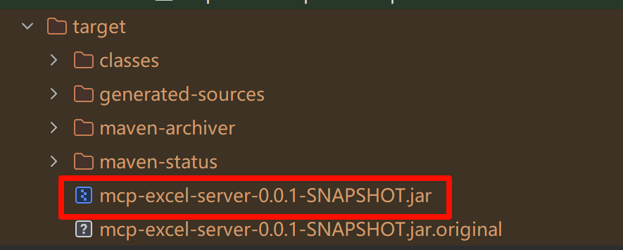

# 从零到一带你开发一个MCP Server

最近 AI 领域的 MCP（模型上下文协议）特别火，它是 Anthropic 推出的开放标准，给大语言模型和 AI 助手提供了统一接口，让 AI 能调用外部工具完成复杂任务。今天咱们就来带大家看看，如何通过 MCP 实现本地 Excel 文件的读取和写入，并且基于 Spring AI 框架进行开发。

## 一. MCP概述

### 1.1 什么是MCP

以前，如果想让 AI 处理我们的数据，基本只能靠预训练数据或者上传数据，既麻烦又低效。而且，就算是很强大的 AI 模型，也会有数据隔离的问题，无法直接访问新数据，每次有新的数据进来，都要重新训练或上传，扩展起来比较困难。

现在，MCP（Model Context Protocol）解决了这个问题，它突破了模型对静态知识库的依赖，使其具备更强的动态交互能力，能够像人类一样调用搜索引擎、访问本地文件、连接 API 服务，甚至直接操作第三方库。所以 MCP 相当于在 AI 和数据之间架起了一座桥。更重要的是，只要大家都遵循 MCP 这套协议，AI 就能无缝连接本地数据、互联网资源、开发工具、生产力软件，甚至整个社区生态，实现真正的“万物互联”，这将极大提升 AI 的协作和工作能力，价值不可估量。


### 1.2 MCP 与 Function Calling 的区别

- MCP（Model Context Protocol），模型上下文协议
- Function Calling，函数调用

这两种技术都是为了增强 AI 模型与外部数据的交互能力，但 MCP 不止可以增强 AI 模型，还可以是其他的应用系统。

| 类别       | MCP（Model Context Protocol）    | Function Calling               |
| ---------- | -------------------------------- | ------------------------------ |
| 性质       | 协议                             | 功能                           |
| 范围       | 通用（多数据源、多功能）         | 特定场景（单一数据源或功能）   |
| 目标       | 统一接口，实现互操作             | 扩展模型能力                   |
| 实现       | 基于标准协议                     | 依赖于特定模型实现             |
| 开发复杂度 | 低：通过统一协议实现多源兼容     | 高：需要为每个任务单独开发函数 |
| 复用性     | 高：一次开发，可多场景使用       | 低：函数通常为特定任务设计     |
| 灵活性     | 高：支持动态适配和扩展           | 低：功能扩展需要额外开发       |
| 常见场景   | 复杂场景，如跨平台数据访问与整合 | 简单任务，如获取商品信息等     |

### 1.3 MCP 核心架构

> [核心架构 - MCP 中文文档](https://mcp-docs.cn/docs/concepts/architecture)

- MCP 遵循一个 client-server 架构，其中：
  - **Hosts** 是 LLM 应用（如 Claude Desktop 或 IDEs），它们发起连接
  - **Clients** 在 host 应用中与 servers 保持 1:1 的连接
  - **Servers** 为 clients 提供上下文、tools 和 prompts


#### 1.3.1 MCP Client

MCP client 充当 LLM 和 MCP server 之间的桥梁，MCP client 的工作流程如下：

- MCP client 首先从 MCP server 获取可用的工具列表。
- 将用户的查询连同工具描述通过 function calling 一起发送给 LLM。
- LLM 决定是否需要使用工具以及使用哪些工具。
- 如果需要使用工具，MCP client 会通过 MCP server 执行相应的工具调用。
- 工具调用的结果会被发送回 LLM。
- LLM 基于所有信息生成自然语言响应。
- 最后将响应展示给用户。

Claude Desktop 和Cursor都支持了MCP Server接入能力，它们就是作为 MCP client来连接某个MCP Server感知和实现调用。

#### 1.3.2 MCP Server

MCP server 是 MCP 架构中的关键组件，它可以提供 3 种主要类型的功能：

- 资源（Resources）：类似文件的数据，可以被客户端读取，如 API 响应或文件内容。
- 工具（Tools）：可以被 LLM 调用的函数（需要用户批准）。
- 提示（Prompts）：预先编写的模板，帮助用户完成特定任务。

这些功能使 MCP server 能够为 AI 应用提供丰富的上下文信息和操作能力，从而增强 LLM 的实用性和灵活性。

你可以在 MCP Servers Repository 和 Awesome MCP Servers 这两个 repo 中找到许多由社区实现的 MCP server。使用 TypeScript 编写的 MCP server 可以通过 npx 命令来运行，使用 Python 编写的 MCP server 可以通过 uvx 命令来运行。

> 在 [mcp.so](https://mcp.so/) 网站中我们可以找到很多好用的 MCP Server

### 1.4 MCP交互流程


MCP的交互步骤解析：

1. **用户提出需求**：用户提出 “帮我读取 /xx/hello.xlsx 文件，并对数据进行汇总” 这样的具体任务需求。
2. **工具发现**：MCP Client 向 MCP Server 发起 “tools/list 工具发现” 请求 ，目的是查找能满足用户需求的工具。
3. **返回工具定义信息**：MCP Server 将符合要求的工具定义信息返回给 MCP Client ，让 MCP Client 了解可用工具的相关情况。
4. **发送用户问题和工具定义信息**：MCP Client 把用户问题以及从 MCP Server 得到的工具定义信息发送给 LLM（大语言模型） 。
5. **大模型调用工具**：LLM 根据接收到的信息，决定调用合适的工具来处理用户问题。
6. **MCP Client 调用工具**：LLM 指示 MCP Client 去调用相应工具，MCP Client 按照指示向 MCP Server 发起工具调用请求 。
7. **读取磁盘中指定文件**：MCP Server 从本地磁盘读取用户要求的 /xx/hello.xlsx 文件 。
8. **MCP Server 解析 excel 文件内容，拼接返回值**：对读取到的 Excel 文件内容进行解析处理，并将相关数据整理拼接成合适的返回值形式。
9. **返回解析到的文件内容**：MCP Server 将解析处理后的文件内容返回给 MCP Client 。
10. **返回工具执行结果**：MCP Client 将工具执行结果（即从 MCP Server 接收到的文件内容等）返回给 LLM 。
11. **返回最终用户问题答案**：LLM 根据接收到的工具执行结果，生成最终的用户问题答案 。
12. **展示最终回答**：MCP Client 将最终答案展示给用户，完成整个交互流程。

## 二. Spring AI MCP

### 2.1 基本架构

介绍完MCP基本原理，我们就来使用 Spring AI MCP 框架来开发 MCP 服务，可以先通过 [官方文档](https://docs.spring.io/spring-ai/reference/api/mcp/mcp-overview.html) 来了解其基本架构。

遵循三层架构：


- **客户端/服务器层** ：MCP Client 处理客户端操作，而 MCP Server 管理服务器端协议操作。两者都使用 McpSession 进行通信管理。
- **会话层（McpSession）** ：通过 DefaultMcpSession 实现管理通信模式和状态。
- **传输层（McpTransport）** ：处理 JSON-RPC 消息序列化和反序列化，支持多种传输实现。

### 2.2 MCP Client

MCP 客户端是 MCP 架构中的关键组件，主要负责和 MCP 服务器建立连接并进行通信。它能自动匹配服务器的协议版本，确认可用功能，并负责数据传输和 JSON-RPC 交互。此外，它还能发现和使用各种工具、管理资源，并与提示系统进行交互。

除了这些核心功能，MCP 客户端还支持一些额外特性，比如根管理、采样控制，以及同步或异步操作。为了适应不同场景，它提供了多种数据传输方式，包括标准输入/输出、基于 Java HttpClient 和 WebFlux 的 SSE 传输。


### 2.3 MCP Server

MCP 服务器是整个 MCP 架构的核心部分，主要用来为客户端提供各种工具、资源和功能支持。它负责处理客户端的请求，包括解析协议、提供工具、管理资源以及处理各种交互信息。同时，它还能记录日志、发送通知，并且支持多个客户端同时连接，保证高效的通信和协作。它可以通过多种方式进行数据传输，比如标准输入/输出、Servlet、WebFlux 和 WebMVC，满足不同应用场景的需求。


### 2.4 Spring AI 集成 MCP

可以通过引入一些依赖，直接让 Spring AI 和 MCP 进行集成，在 Spring Boot 项目中轻松使用。

比如客户端启动器：

- spring-ai-starter-mcp-client：核心启动器，提供 STDIO 和基于 HTTP 的 SSE 支持
- spring-ai-starter-mcp-client-webflux：基于 WebFlux 的 SSE 流式传输实现

服务器启动器：

- spring-ai-starter-mcp-server：核心服务器，具有 STDIO 传输支持
- spring-ai-starter-mcp-server-webmvc：基于 Spring MVC 的 SSE 流式传输实现
- spring-ai-starter-mcp-server-webflux：基于 WebFlux 的 SSE 流式传输实现

下面我们来实战 MCP 项目的开发。

## 三. MCP Server实战

MCP 的使用分为两种模式，STDIO 模式（本地运行）和 SSE 模式（远程服务）。本文我们暂时只介绍 STDIO 模式，如果对 SSE 模式感兴趣，可以参考官方文档：

[MCP Server Boot Starter :: Spring AI Reference](https://docs.spring.io/spring-ai/reference/api/mcp/mcp-server-boot-starter-docs.html)

### 3.1 初始化项目

新建一个SpringBoot 3.x版本的项目，我们取名为 `mcp-excel-server`

项目代码：[bigcoder84/mcp-excel-server](https://github.com/bigcoder84/mcp-excel-server)

### 3.2 引入依赖

```xml
<dependency>
    <groupId>org.springframework.ai</groupId>
    <artifactId>spring-ai-mcp-server-spring-boot-starter</artifactId>
    <version>1.0.0-M6</version>
</dependency>
```

### 3.2 修改application.yaml文件

```yaml
spring:
  application:
    name: mcp-excel-server
  main:
    web-application-type: none
    banner-mode: off

  ai:
    mcp:
      server:
        stdio: true # 启用stdio模式
        name: mcp-server
        version: 0.0.1
        type: SYNC
```

### 3.3 Excel文件读取功能实现

`@Tool` 是 Spring AI MCP 框架中用于快速暴露业务能力为 AI 工具的核心注解，该注解实现 Java 方法与 MCP 协议工具的自动映射，并且可以通过注解的属性 `description`，帮助LLM理解工具能够提供的能力。

```java
package cn.bigcoder.mcp.demo.mcpexcel.mcpexcelserver.servive;

import cn.bigcoder.mcp.demo.mcpexcel.mcpexcelserver.dto.BaseResponse;
import cn.bigcoder.mcp.demo.mcpexcel.mcpexcelserver.dto.ExcelReadRequest;
import cn.bigcoder.mcp.demo.mcpexcel.mcpexcelserver.dto.ExcelReadResponse;
import java.io.FileInputStream;
import java.io.IOException;
import java.util.ArrayList;
import java.util.HashMap;
import java.util.List;
import java.util.Map;
import lombok.extern.slf4j.Slf4j;
import org.apache.poi.hssf.usermodel.HSSFWorkbook;
import org.apache.poi.ss.usermodel.Cell;
import org.apache.poi.ss.usermodel.Row;
import org.apache.poi.ss.usermodel.Sheet;
import org.apache.poi.ss.usermodel.Workbook;
import org.apache.poi.xssf.usermodel.XSSFWorkbook;
import org.springframework.ai.tool.annotation.Tool;
import org.springframework.stereotype.Service;

/**
 * @author bigcoder84
 * @Description
 * @date 2025-03-26 11:35
 */
@Slf4j
@Service
public class ExcelReadService {


    /**
     * 根据搜索词搜索面试鸭面试题目
     *
     * @return 返回解析的JSON数据
     */
    @Tool(description = "用于读取本地excel中的内容，传入文件路径，返回JSON格式的数据")
    public BaseResponse<ExcelReadResponse> readExcel(ExcelReadRequest request) {
        log.info("开始读取Excel文件: {}", request);
        String filePath = request.getFilePath();
        try (FileInputStream fis = new FileInputStream(filePath)) {
            Workbook workbook;
            if (filePath.toLowerCase().endsWith(".xlsx")) {
                workbook = new XSSFWorkbook(fis);
            } else if (filePath.toLowerCase().endsWith(".xls")) {
                workbook = new HSSFWorkbook(fis);
            } else {
                throw new IllegalArgumentException("不支持的文件格式，仅支持.xlsx或.xls格式");
            }

            List<Map<String, String>> result = new ArrayList<>();
            Sheet sheet = workbook.getSheetAt(0);
            Row headerRow = sheet.getRow(0);
            int columnCount = headerRow.getLastCellNum();

            for (int i = 1; i <= sheet.getLastRowNum(); i++) {
                Row row = sheet.getRow(i);
                if (row == null) {
                    continue;
                }

                Map<String, String> rowData = new HashMap<>();
                for (int j = 0; j < columnCount; j++) {
                    Cell headerCell = headerRow.getCell(j);
                    Cell cell = row.getCell(j);
                    String header = headerCell != null ? headerCell.toString() : "Column" + j;
                    String value = cell != null ? cell.toString() : "";
                    rowData.put(header, value);
                }
                result.add(rowData);
            }

            workbook.close();
            log.info("Excel文件读取完成，共处理{}行数据", result.size());
            return BaseResponse.success(ExcelReadResponse.builder().dataList(result).build());
        } catch (IOException e) {
            log.error("读取Excel文件失败: {}", e.getMessage(), e);
            return BaseResponse.failed("读取Excel文件失败,error:" + e.getMessage());
        }
    }
}
```

我们还可以使用 `@ToolParam` 注解，MCP Client需要传递给服务端的参数：

```java
package cn.bigcoder.mcp.demo.mcpexcel.mcpexcelserver.dto;

import lombok.Data;
import org.springframework.ai.tool.annotation.ToolParam;

/**
 * @author: Jindong.Tian
 * @date: 2025-04-12
 **/
@Data
public class ExcelReadRequest {

    @ToolParam(description = "文件绝对路径")
    private String filePath;
}

```

### 3.5 Excel文件写入功能实现

```java
package cn.bigcoder.mcp.demo.mcpexcel.mcpexcelserver.servive;

import cn.bigcoder.mcp.demo.mcpexcel.mcpexcelserver.dto.BaseResponse;
import cn.bigcoder.mcp.demo.mcpexcel.mcpexcelserver.dto.ExcelWriteRequest;
import cn.bigcoder.mcp.demo.mcpexcel.mcpexcelserver.dto.ExcelWriteResponse;
import java.io.FileOutputStream;
import lombok.extern.slf4j.Slf4j;
import org.apache.poi.ss.usermodel.*;
import org.apache.poi.xssf.usermodel.XSSFWorkbook;
import org.springframework.ai.tool.annotation.Tool;
import org.springframework.stereotype.Service;

import java.util.List;
import java.util.Map;

/**
 * @author bigcoder84
 * @Description
 * @date 2025-03-26 11:35
 */
@Slf4j
@Service
public class ExcelWriteService {

    /**
     * 将JSON数据写入Excel文件
     */
    @Tool(description = "用于将JSON数据写入Excel文件，")
    public BaseResponse<ExcelWriteResponse> writeToExcel(ExcelWriteRequest request) {
        log.info("开始写入Excel文件: {}", request);
        if (request.getDataList() == null || request.getDataList().isEmpty()) {
            log.warn("没有数据需要写入Excel");
            return BaseResponse.failed("没有数据需要写入的数据");
        }

        try (Workbook workbook = new XSSFWorkbook()) {
            Sheet sheet = workbook.createSheet("Sheet1");

            // 创建标题行样式
            CellStyle headerStyle = workbook.createCellStyle();
            headerStyle.setFillForegroundColor(IndexedColors.GREY_25_PERCENT.getIndex());
            headerStyle.setFillPattern(FillPatternType.SOLID_FOREGROUND);
            headerStyle.setAlignment(HorizontalAlignment.CENTER);
            //先设置表中的编码
            Font headerFont = workbook.createFont();
            headerFont.setBold(true);
            headerStyle.setFont(headerFont);

            // 创建表头
            List<String> headers = request.getHeaders();
            Row headerRow = sheet.createRow(0);
            int colNum = 0;
            for (String header : headers) {
                Cell cell = headerRow.createCell(colNum++);
                cell.setCellValue(header);
                cell.setCellStyle(headerStyle);
                //先设置表中的编码
            }

            // 写入数据
            int rowNum = 1;
            for (Map<String, String> rowData : request.getDataList()) {
                Row row = sheet.createRow(rowNum++);
                colNum = 0;
                for (String header : headers) {
                    Cell cell = row.createCell(colNum++);
                    Object value = rowData.get(header);
                    if (value != null) {
                        cell.setCellValue(value.toString());
                    }
                }
            }

            // 自动调整列宽
            for (int i = 0; i < headers.size(); i++) {
                sheet.autoSizeColumn(i);
            }

            // 保存文件
            try (FileOutputStream fileOut = new FileOutputStream(request.getFilePath())) {
                workbook.write(fileOut);
            }
            return BaseResponse.success(ExcelWriteResponse.builder().filePath(request.getFilePath()).build());
        } catch (Exception e) {
            log.error("写入Excel文件失败: {}", e.getMessage(), e);
            return BaseResponse.failed("导出失败,error:" + e.getMessage());
        }
    }
}
```

我们同样需要使用 `@ToolParam` 注解注明 MCP Client 需要传递的参数：

```java
package cn.bigcoder.mcp.demo.mcpexcel.mcpexcelserver.dto;

import java.util.List;
import java.util.Map;
import lombok.Data;
import org.springframework.ai.tool.annotation.ToolParam;

/**
 * @author: bigcoder84
 * @date: 2025-04-12
 **/
@Data
public class ExcelWriteRequest {

    @ToolParam(description = "文件绝对路径")
    private String filePath;
    @ToolParam(description = "表头列表，例如[\"列1\", \"列2\", ...]")
    private List<String> headers;
    @ToolParam(description = "数据列表，每个元素是一个Map，键为列名，值为对应单元格的值。例如：[{\"列1\": \"值1\", \"列2\": \"值2\",...},...]")
    private List<Map<String, String>> dataList;
}
```

### 3.6 注册 MCP 工具

```java
package cn.bigcoder.mcp.demo.mcpexcel.mcpexcelserver;

import cn.bigcoder.mcp.demo.mcpexcel.mcpexcelserver.servive.ExcelReadService;
import cn.bigcoder.mcp.demo.mcpexcel.mcpexcelserver.servive.ExcelWriteService;
import org.springframework.ai.tool.ToolCallbackProvider;
import org.springframework.ai.tool.method.MethodToolCallbackProvider;
import org.springframework.boot.SpringApplication;
import org.springframework.boot.autoconfigure.SpringBootApplication;
import org.springframework.context.annotation.Bean;

@SpringBootApplication
public class McpExcelServerApplication {

    public static void main(String[] args) {
        SpringApplication.run(McpExcelServerApplication.class, args);
    }

    @Bean
    public ToolCallbackProvider serverTools(ExcelWriteService excelWriteService,
            ExcelReadService excelReadService) {
        return MethodToolCallbackProvider
                .builder()
                .toolObjects(excelWriteService, excelReadService)
                .build();
    }
}
```

### 3.7 生成可执行jar

在项目根目录下执行下列命令，将项目打包为可执行jar：

```shell
mvn clean package -Dmaven.test.skip=true
```

执行成功后，就会在targrt目录下看到生成的jar包：



## 四. 使用 MCP Inspector 测试 MCP Server

[MCP Inspector](https://github.com/modelcontextprotocol/inspector) 是一个交互式开发者工具，用于测试和调试 MCP 服务器。

该工具运行依赖于node.js，大家自行安装即可。

使用下列命令运行 `MCP Inspector`：

```shell
npx @modelcontextprotocol/inspector
```


访问浏览器 `http://127.0.0.1:6274` 即可进入工具：


选择正确的传输模式、命令、运行参数，以我们开发的工具为例，填写下列参数即可：

| 参数名         | 参数值                                                       |
| -------------- | ------------------------------------------------------------ |
| Transport Type | STDIO                                                        |
| Command        | java                                                         |
| Arguments      | -Dspring.ai.mcp.server.stdio=true -Dspring.main.web-application-type=none -Dlogging.pattern.console= -jar  {your_path}\\\\mcp-excel-server-0.0.1.jar |

点击“Connect”即可连接MCP Server，在右边工具栏中，我们就可以看到MCP Server提供的功能，并且我们可以针对功能传入参数进行调试：


## 五. 在 LLM 客户端中使用 mcp-excel-server

开发完 MCP Server 后，我们可以将其与 LLM 客户端进行集成。

目前 Claude、Cursor 以及 Cherry Studio 等，都可以快速接入 MCP 功能。我们通过 Cherry Studio 来验证一下我们开发的工具。

### 5.1 配置Cherry Studio

1. 打开设置，配置大语言模型API KEY，请选择支持工具调用功能的模型进行配置，我这里配置的DeepSeek：

   

2. 选择 “MCP 服务器” 选项，点击右上角“编辑MCP配置”，配置我们开发的 `mcp-excel-server`
   

   ```shell
   {
     "mcpServers": {
       "AUM5itYnoMcxPiU2vFa3Z": {
         "name": "Excel操作",
         "type": "stdio",
         "description": "",
         "isActive": true,
         "command": "java",
         "args": [
           "-Dspring.ai.mcp.server.stdio=true",
           "-Dspring.main.web-application-type=none",
           "-Dfile.encoding=UTF-8",
           "-jar",
           "{your_path}/mcp-excel-server-0.0.1-SNAPSHOT.jar"
         ]
       }
     }
   }
   ```
   
   当然，你也可以通过图形化界面进行配置。
   
3. 检查是否正确连接 MCP Server

   
   

### 5.2 在对话中使用 MCP 功能

如果想要在对话中激活MCP功，我们需要手动开启该功能：


我们喂给LLM一个本地的EXCEL文件，让他读取该文件，并按天进行汇总后导出为另外一个文件，源文件内容为：


这样我们就能赋予LLM解析本地Excel的能力了：


查看MCP Server生成的文件：


点击 Cherry Studio 对话框中的工具项，我们可以看到 MCP Client 和 MCP Server的调用情况：


至此我们就带大家走完了 MCP Server 开发的全流程。

## 六. 总结

本文通过理论与实战结合的方式，完整呈现了基于 Spring AI 框架开发 MCP Server 的核心流程。从 MCP 协议的基础架构出发，我们理解了其作为 “AI 与数据桥梁” 的核心价值 —— 通过统一接口打破数据孤岛，让 AI 能动态调用工具、访问本地资源，实现复杂任务的处理。相较于传统 Function Calling，MCP 的标准化协议带来了更低的开发成本、更高的复用性和更强的灵活性，尤其在跨平台数据整合与生态协作场景中优势显著。

实战部分，我们基于 Spring AI MCP 提供的工具注解和框架支持，快速实现了本地 Excel 文件的读取与写入功能，并通过 Cherry Studio 等 LLM 客户端验证了 MCP Server 的实际效果。这不仅展示了 MCP 在数据处理场景中的实用性，也印证了其 “一次开发、多场景复用” 的设计理念。随着 MCP 生态的不断完善，未来开发者可基于类似模式构建更多功能模块（如数据库操作、API 调用等），推动 AI 从 “静态知识库” 向 “动态协作平台” 进化，为企业级 AI 应用开发开辟新的可能性。


> 本文参考至：
>
> [如何开发 MCP 服务？保姆级教程！ - 程序员鱼皮 - 博客园](https://www.cnblogs.com/yupi/p/18814281)
>
> [一文看懂：MCP(大模型上下文协议) - 知乎](https://zhuanlan.zhihu.com/p/27327515233)
>
> [十大步骤详解Spring AI MCP机制底层实现，小白误入！-51CTO.COM](https://www.51cto.com/article/813034.html)
>
> [MCP Server Boot Starter :: Spring AI Reference](https://docs.spring.io/spring-ai/reference/api/mcp/mcp-server-boot-starter-docs.html)
>
> [MCP 中文文档](https://mcp-docs.cn/docs/tools/inspector)

