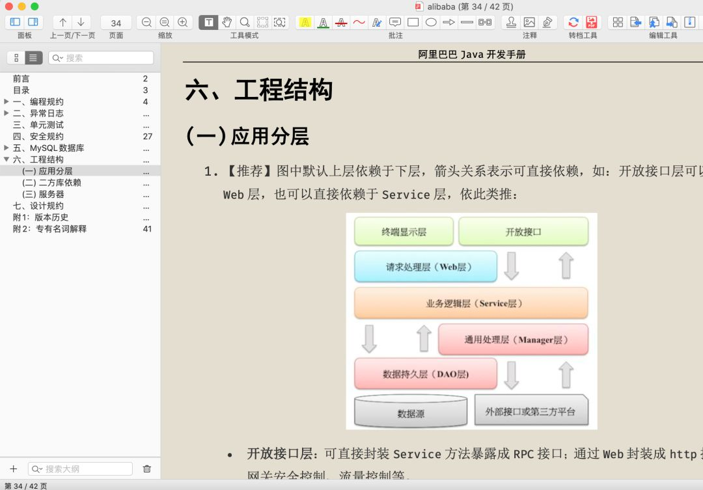
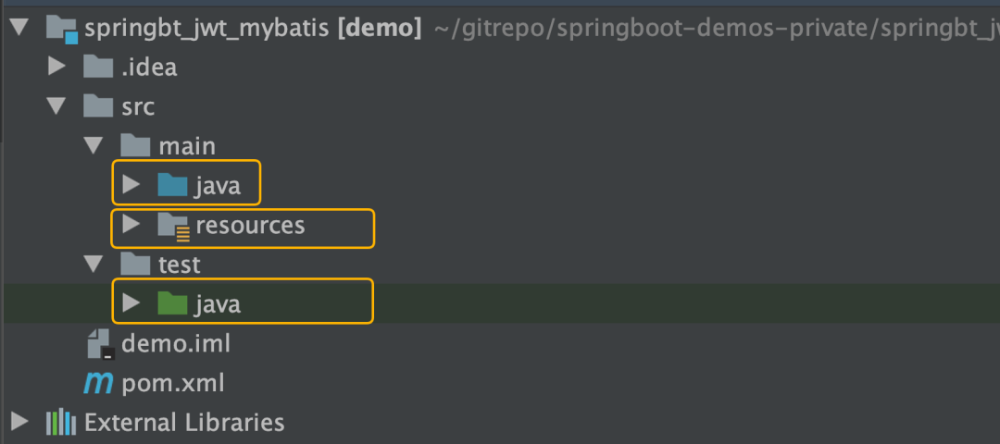
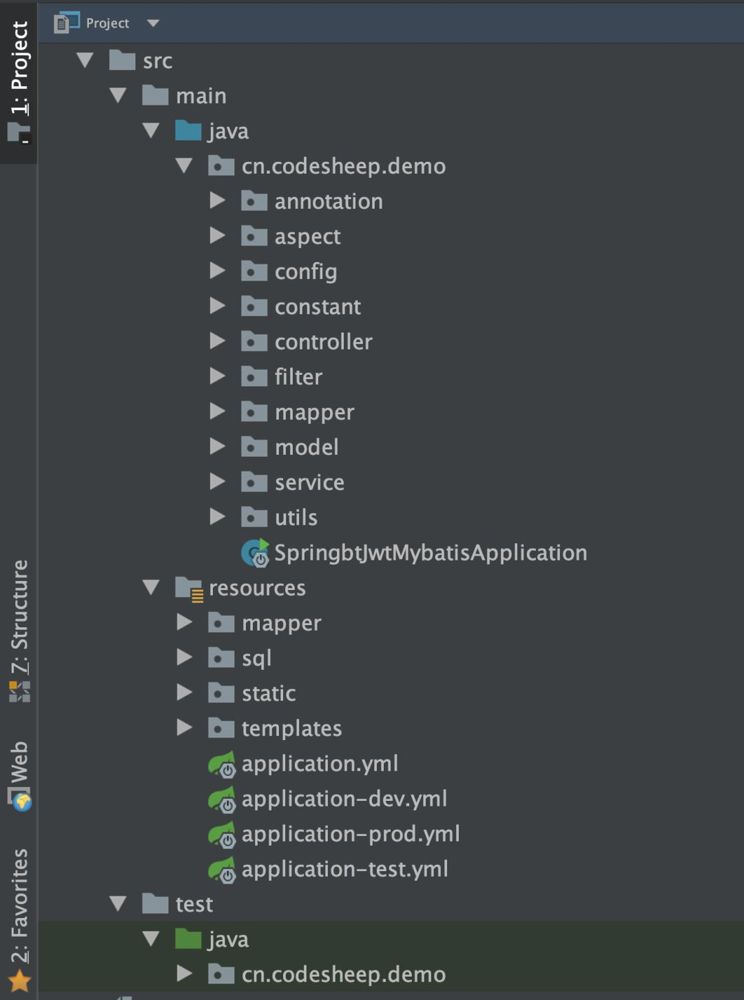
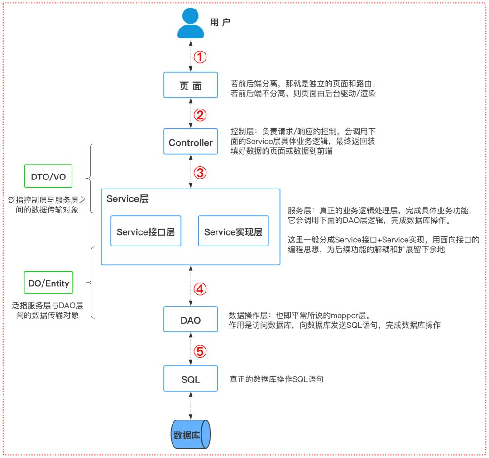

# 项目结构规范

本文转载至：[CodeSheep——看完这篇，别人的开源项目结构应该能看懂了](https://mp.weixin.qq.com/s?__biz=MzU4ODI1MjA3NQ==&mid=2247485409&idx=1&sn=453877c11ead49e90937885b5ac7d2f2&chksm=fdded125caa958333490c0a1f7b2ca76bdc84334a8cc87adc230bb19230eac674b4f6eb0d9aa&mpshare=1&scene=23&srcid=0324myhCloCzpESGwwpubnF9&sharer_sharetime=1585048323602&sharer_shareid=e81601a95b901aeca142bbe3b957819a#rd)

## 一. 我为什么要写这篇

近来，和不少初学Spring或Spring Boot的小伙伴私信交流了关于项目目录结构划分和代码分层的问题。

很多小伙伴表示网上下载下来的开源项目看不懂，项目结构和代码分层看得很蒙，不知道应该以一个什么样的思路去学习和吸收别人的项目。

好，今天熬夜肝了这篇文章，和大家一起来交流探讨一下，不足之处也请小伙伴们批评指正。

## 二. 阿里约定

我印象中，以前在看《阿里巴巴Java开发手册》时，好像有关于工程结构和应用分层相关的内容，于是我回翻了一下，果然有：



它这里面讲的内容大概就是：关于一个正常的企业项目里一种**通用的项目结构和代码层级划分**的指导意见。

按这本书上说的，一般分为如下几层：

- 开放接口层
- 终端显示层
- Web 层
- Service 层
- Manager 层
- DAO 层
- 外部接口或第三方平台

由于书中的篇幅关系，它这地方讲得比较笼统了，估计初学者看了还是会懵，所以接下来**结合实际项目代码结构**，来唠一唠具体的项目结构和代码分层。

## 三. 通常的项目结构

> **首先说在前面的是**：这东西并没有一套通用的标准，不同公司或者团队的使用习惯和规范也不尽相同。

我们就以当下非常火热的Spring Boot典型项目结构为例，创建出来的项目应该总体分为三大层：



- `项目根目录/src/main/java`：放置项目Java源代码
- `项目根目录/src/main/resources`：放置项目静态资源和配置文件
- `项目根目录/src/test/java`：放置项目测试用例代码

而位于`/src/main/java`目录下的Java源代码的组织结构大家比较关心，这地方也只能给出一个通常典型的结构，毕竟不同项目和团队实践不一样，稍许有区别，但整体安排应该差不多。而且如果是**多模块**的项目的话，下面的结构应该只对应其中一个模块，其他模块的代码组织也大致差不多。



各个目录详细介绍：

```
|_annotation：放置项目自定义注解
|_aspect：放置切面代码
|_config：放置配置类
|_constant：放置常量、枚举等定义
   |__consist：存放常量定义
   |__enums：存放枚举定义
|_controller：放置控制器代码
|_filter：放置一些过滤、拦截相关的代码
|_mapper：放置数据访问层代码接口
|_model：放置数据模型代码
   |__entity：放置数据库实体对象定义
   |__dto：存放数据传输对象定义
   |__vo：存放显示层对象定义
|_service：放置具体的业务逻辑代码（接口和实现分离）
   |__intf：存放业务逻辑接口定义
   |__impl：存放业务逻辑实际实现
|_utils：放置工具类和辅助代码
```

然后接下来`/src/main/resources`目录，里面主要存放静态配置文件和页面静态资源等东西：

```
|_mapper：存放mybatis的XML映射文件（如果是mybatis项目）
|_static：存放网页静态资源，比如下面的js/css/img
   |__js：
   |__css：
   |__img：
   |__font：
   |__等等
|_template：存放网页模板，比如thymeleaf/freemarker模板等
   |__header
   |__sidebar
   |__bottom
   |__XXX.html等等
|_application.yml       基本配置文件
|_application-dev.yml   开发环境配置文件
|_application-test.yml  测试环境配置文件
|_application-prod.yml  生产环境配置文件
```

当然，这地方估计有一个**很多人都会纠结的**关于`DTO/VO/DO`等**数据模型定义**的区分。

这在《阿里巴巴Java开发手册》中倒是做了一个所谓的严格区分，那本书上是这样去定义的：

- `DO（Data Object）`：与数据库表结构一一对应，通过DAO层向上传输数据源对象。
- `DTO（Data Transfer Object）`：数据传输对象，Service或Manager向外传输的对象。
- `BO（Business Object）`：业务对象。由Service层输出的封装业务逻辑的对象。
- `AO（Application Object）`：应用对象。在Web层与Service层之间抽象的复用对象模型，极为贴近展示层，复用度不高。
- `VO（View Object）`：显示层对象，通常是Web向模板渲染引擎层传输的对象。
- `Query`：数据查询对象，各层接收上层的查询请求。注意超过2个参数的查询封装，禁止使用Map类来传输。

老实讲，看到这么多对象的定义，我也是很蒙的。实际项目开发时，我觉得没有必要刻意照搬去定义这么多层对象，这样后续做对象转换工作都能烦skr人。

出于简单起见，我个人觉得，只要保证业务逻辑层`Service`和数据库`DAO`层的操作对象严格划分出来，确保互相不渗透，不混用，问题应该就不大。

比如在我上面举例的这个项目的代码结构中，`Service`层处理的对象都定义在了`dto`包里，而`DAO`层处理的对象都放在了`entity`包里了。


## 四. 项目结构划分总结

如果从一个用户访问一个网站的情况来看，对应着上面的项目代码结构来分析，可以贯穿整个代码分层：




## 五. 注意事项

1、`Contorller`层参数传递建议不要使用`HashMap`，建议使用数据模型定义

2、`Controller`层里可以做参数校验、异常抛出等操作，但建议不要放太多业务逻辑，业务逻辑尽量放到`Service`层代码中去做

3、`Service`层做实际业务逻辑，可以按照功能模块做好定义和区分，相互可以调用

4、功能模块`Service`之间引用时，建议不要渗透到`DAO`层（或者`mapper`层），基于`Service`层进行调用和复用比较合理

5、业务逻辑层`Service`和数据库`DAO`层的操作对象不要混用。`Controller`层的数据对象不要直接渗透到`DAO`层（或者`mapper`层）；同理数据表实体对象`Entity`也不要直接传到`Controller`层进行输出或展示。