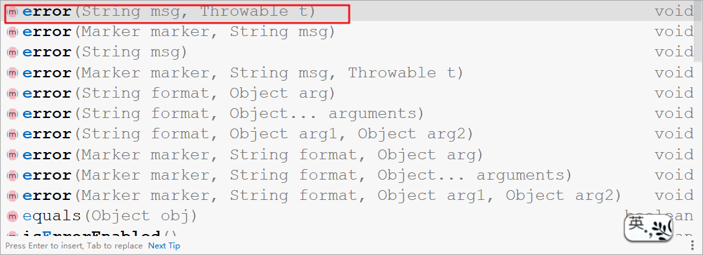
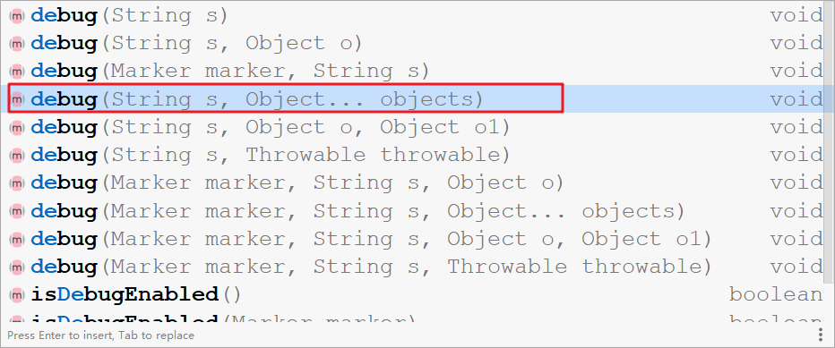

# 项目中日志处理的方式

## 一. 日志输出要点

说明：本文参考至《阿里巴巴Java开发手册》，下文简称“手册”。

**要点一**：在手册中规定，应用中不可直接使用日志系统（Log4j，Logback）中的API，而应依赖使用日志框架SLF4J中的API。使用门面模式的日志框架，有利于维护各个类的日志处理方式统一。

```java
import org.slf4j.Logger;
import org.slf4j.LoggerFactory;
private static final Logger LOG = LoggerFactory.getLogger(Test.class);
```


**要点二**：异常日志的打印，一定包含**案发现场信息**和**异常栈信息**，方便问题的排查，不然需要自己花时间重现问题，并且在复杂的业务场景可能无法重现问题。

```java
LOG.error(各类参数或者对象.toString + "-" +e.getMessage() , e);
```




**要点三**：在日志输出时，字符串变量之间拼接使用占位符的方式。

```java
LOG.debug("Processing trade with id：{} and symbol：{}",id,symbol);
```



说明：这样做可以增加易读性，并且因为字符串拼接或使用StringBuilder的append()方法，有一定性能损耗。使用占位符仅仅是替换动作，可以有效提升性能。


**要点四**：对于`trace`/`debug`/`info`级别的日志输出，必须进行日志级别的开关判断。

```java
if (LOG.isDebugEnabled()) {
    LOG.debug("Processing trade with id：{} and symbol：{}",id,symbol);
}
```

说明：这样可以避免在不必的情况下，字符串大量 拼接/替换 导致性能损耗的问题。


## 二. 项目中异常日志管理

在windows版本Tomcat中，使用“服务”的方式启动时，默认会生成`{tomcat_home}/logs/*-stderr.log`和`{tomcat_home}/logs/*-stdout.log`，它们是对项目中标准输出流的重定向。（注：Linux版本Tomcat在使用`bin/startup.sh`启动时，默认会生成`{tomcat_home}/logs/catanina.out`它也同样是对标准输出的重定向文件。）

例如`System.out.println("xxx")`在使用服务启动时都会输出到`{tomcat_home}/logs/*-stdout.log`中，如果是`e.printStackTrace()`输出的异常栈信息会输出到`{tomcat_home}/logs/*-stderr.log`。但是这些输出统统都没有记录在项目专有的日志文件中。

**所以项目中的捕获的异常一定要使用日志框架打印出来，方便后期问题的排查，其中异常信息日志的输出与一定要按照”要点二“的要求输出**。


