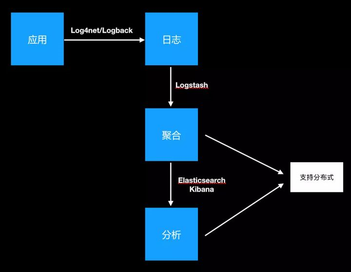

# ELK系统概述

## 为什么做日志系统

通常当系统发生故障时，工程师需要登录到各个服务器上，使用 grep / sed / awk 等 Linux 脚本工具去日志里查找故障原因。在没有日志系统的情况下，首先需要定位处理请求的服务器，如果这台服务器部署了多个实例，则需要去每个应用实例的日志目录下去找日志文件。每个应用实例还会设置日志滚动策略（如：每天生成一个文件），还有日志压缩归档策略等。
这样一系列流程下来，对于我们排查故障以及及时找到故障原因，造成了比较大的麻烦。因此，如果我们能把这些日志集中管理，并提供集中检索功能，不仅可以提高诊断的效率，同时对系统情况有个全面的理解，避免事后救火的被动。
总的来说有一下三点

- 数据查找：通过检索日志信息，定位相应的 bug，找出解决方案。
- 服务诊断：通过对日志信息进行统计、分析，了解服务器的负荷和服务运行状态
- 数据分析：可以做进一步的数据分析。

## 什么是ELK

1. Elasticsearch是个开源分布式搜索引擎，它的特点有：分布式，零配置，自动发现，索引自动分片，索引副本机制，restful风格接口，多数据源，自动搜索负载等。
2. Logstash是一个完全开源的工具，他可以对你的日志进行收集、过滤，并将其存储供以后使用（如，搜索）。
3. Kibana 也是一个开源和免费的工具，它Kibana可以为 Logstash 和 ElasticSearch 提供的日志分析友好的 Web 界面，可以帮助您汇总、分析和搜索重要数据日志

## 其它方案

使用公有云服务商提供的日志系统，例如阿里云的SLS