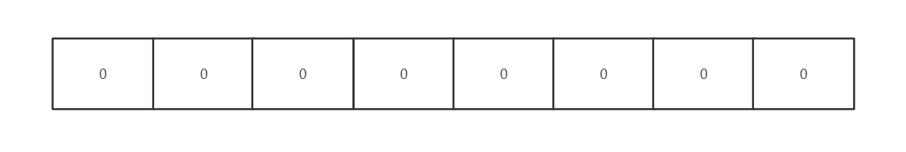
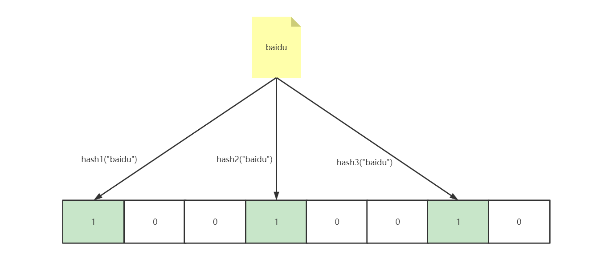
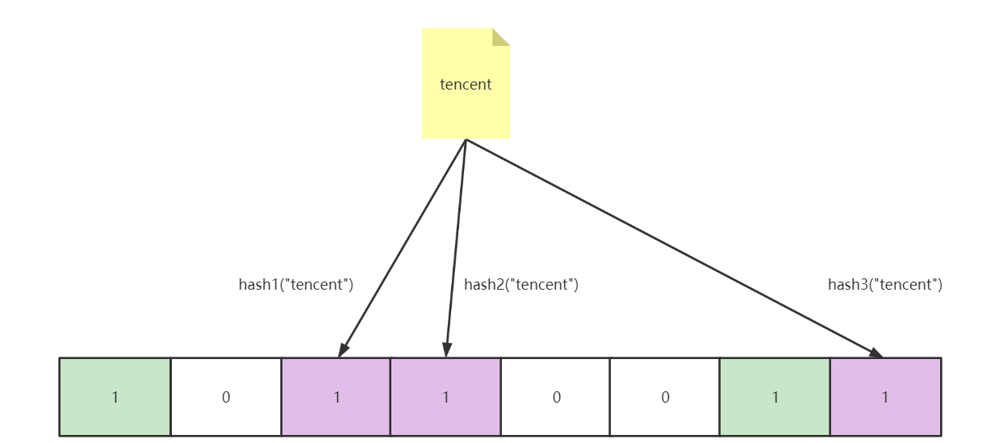
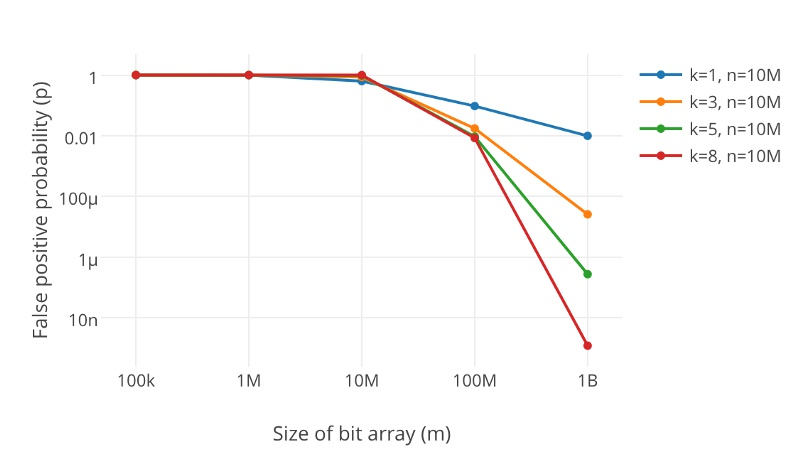
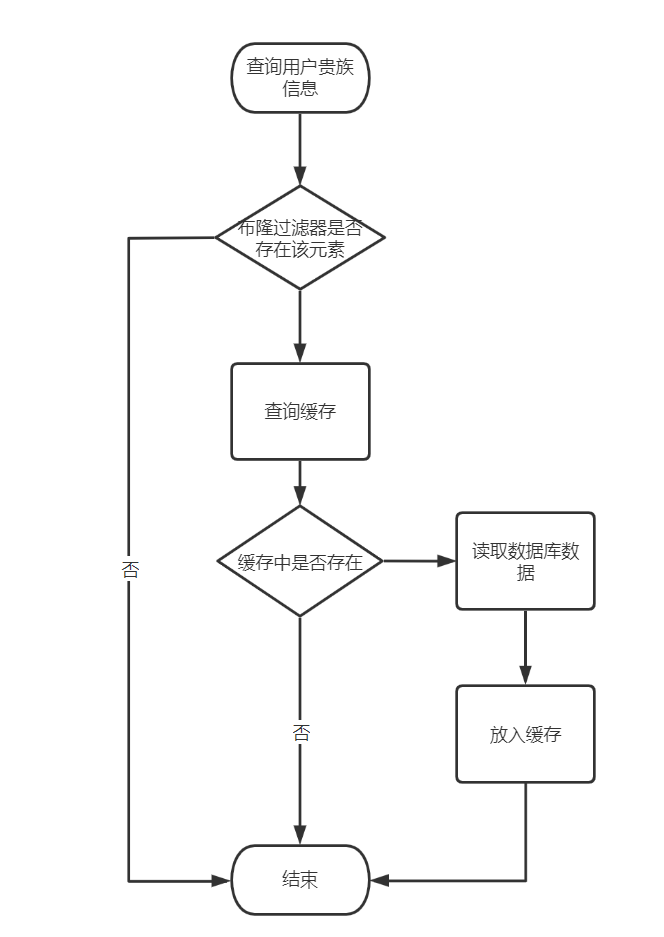
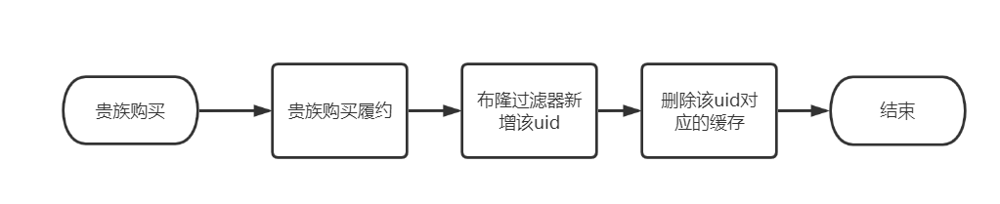

# 布隆过滤器在缓存系统中的实践

## 一. 背景

在业务开发中，在并发量很高的情况下，通常会使用缓存对系统查询性能进行优化，在缓存命中率很高的情况下，缓存的使用能够大幅提升系统查询性能。但是在缓存命中率非常低场景下，如果采用传统缓存读取模式，大部分的请求会穿透至数据库，造成数据库的巨大压力。

例如：最近上线一个“贵族”功能，由于贵族价格比较贵，拥有比较强的特权，该功能也主要面向平台头部大R用户，所以如果采用传统的缓存模式，查询一个用户的贵族信息就会大概率出现缓存无法命中去读库的情况。

有些同学可能会将“空结果”缓存至数据库，这样下次去查询该用户的结果时就会命中缓存。但是由于平台巨大的用户量，如果将所有用户的空结果进行缓存成本是非常高的。

此种场景就非常适合使用布隆过滤器去解决缓存命中率低的问题。

## 二. 什么是布隆过滤器

本质上布隆过滤器是一种数据结构，比较巧妙的概率型数据结构（probabilistic data structure），特点是高效地插入和查询，可以用来告诉你 **“某样东西一定不存在或者可能存在”**。

相比于传统的 List、Set、Map 等数据结构，它更高效、占用空间更少，但是缺点是其返回的结果是概率性的，而不是确切的。

### 2.1 实现原理

布隆过滤器是一个 bit 向量或者说 bit 数组，长这样：



如果我们要映射一个值到布隆过滤器中，我们需要使用**多个不同的哈希函数**生成**多个哈希值，**并对每个生成的哈希值指向的 bit 位置 1，例如针对值 “baidu” 和三个不同的哈希函数分别生成了哈希值 0、3、6，则上图转变为：



Ok，我们现在再存一个值 “tencent”，如果哈希函数返回 2、3、7 的话，图继续变为：



值得注意的是，3 这个 bit 位由于两个值的哈希函数都返回了这个 bit 位，因此它被覆盖了。现在我们如果想查询 “dianping” 这个值是否存在，哈希函数返回了 0、4、7三个值，结果我们发现 4 这个 bit 位上的值为 0，**说明没有任何一个值映射到这个 bit 位上**，因此我们可以很确定地说 “dianping” 这个值不存在。而当我们需要查询 “baidu” 这个值是否存在的话，那么哈希函数必然会返回 0、3、6，然后我们检查发现这三个 bit 位上的值均为 1，那么我们可以说 “baidu” **存在了么？答案是不可以，只能是 “baidu” 这个值可能存在。**

这是为什么呢？答案跟简单，因为随着增加的值越来越多，被置为 1 的 bit 位也会越来越多，这样某个值 “taobao” 即使没有被存储过，但是万一哈希函数返回的三个 bit 位都被其他值置位了 1 ，那么程序还是会判断 “taobao” 这个值存在。

### 2.2 支持删除么

传统的布隆过滤器并不支持删除操作。但是名为 Counting Bloom filter 的变种可以用来测试元素计数个数是否绝对小于某个阈值，它支持元素删除。可以参考文章 [Counting Bloom Filter 的原理和实现](https://link.zhihu.com/?target=https%3A//cloud.tencent.com/developer/article/1136056)

### 2.3 如何选择哈希函数个数和布隆过滤器长度

很显然，过小的布隆过滤器很快所有的 bit 位均为 1，那么查询任何值都会返回“可能存在”，起不到过滤的目的了。布隆过滤器的长度会直接影响误报率，布隆过滤器越长其误报率越小。

另外，哈希函数的个数也需要权衡，个数越多则布隆过滤器 bit 位置位 1 的速度越快，且布隆过滤器的效率越低；但是如果太少的话，那我们的误报率会变高。



> k 为哈希函数个数，m 为布隆过滤器长度，n 为插入的元素个数，p 为误报率

## 四. 布隆过滤器实现

### 4.1 guava

`Google`提供的`guava`包里面也提供了布隆过滤器,引入`pom`文件：

```xml
<dependency>
    <groupId>com.google.guava</groupId>
    <artifactId>guava</artifactId>
    <version>18.0</version>
</dependency>
```

具体的实现调用的代码如下，同样可以指定具体的存储数量以及预计的误判率：

```java
import com.google.common.base.Charsets;
import com.google.common.hash.BloomFilter;
import com.google.common.hash.Funnels;

public class GuavaBloomFilter {
    public static void main(String[] args) {
        BloomFilter<String> bloomFilter = BloomFilter.create(
                Funnels.stringFunnel(Charsets.UTF_8),1000000,0.04);

        bloomFilter.put("Sam");

        System.out.println(bloomFilter.mightContain("Jane"));
        System.out.println(bloomFilter.mightContain("Sam"));
    }
}
```

由于guava的布隆过滤器是缓存在本地的，所以在分布式环境中并不能很好的使用。

### 4.2 redisson

Redisson利用Redis实现了Java分布式的布隆过滤器。因此，在多个JVM节点上或者是其他进程里面，Redisson可以通过同一个Key获取到布隆过滤器。

```java
public class BloomFilterTest extends BaseTest {

    @Autowired
    private RedissonClient redisson;

    @Test
    public void test() {
        RBloomFilter<Object> bloomFilter = redisson.getBloomFilter("bloomTest");
        bloomFilter.tryInit(5000000L,0.03);
        System.out.println(bloomFilter.contains("2"));
        bloomFilter.add("2");
        System.out.println(bloomFilter.contains("2"));
    }
}
```

## 五. 布隆过滤器在缓存系统中的实践

查询流程：



布隆过滤器维护流程：

