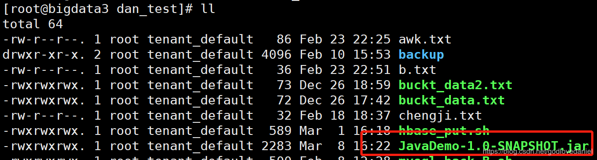
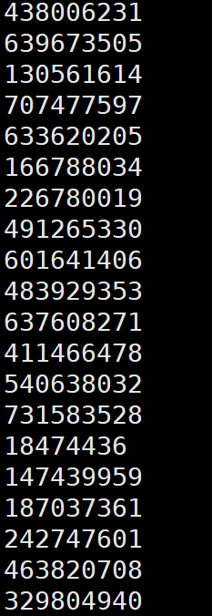
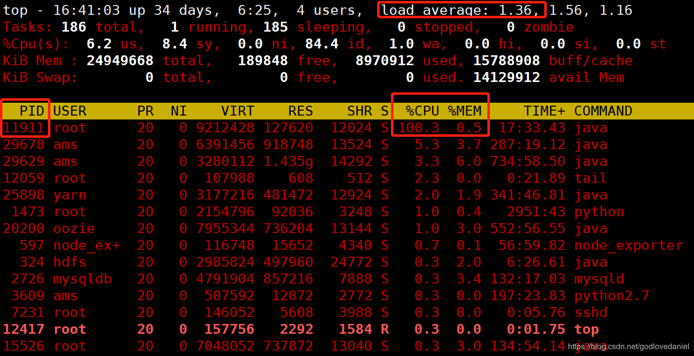
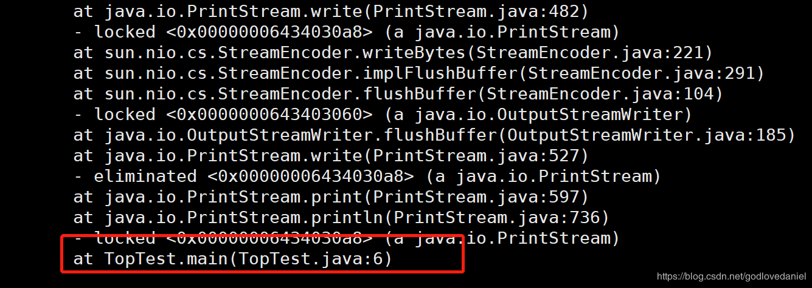
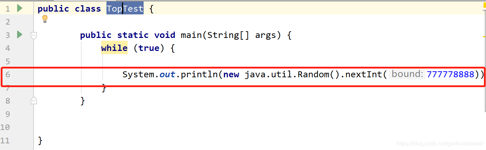

# CPU占用过高解决思路（转载）

 CPU占用过高是LINUX服务器常见的一种故障，也是程序员线上排查故障必备的技能，如果线上出现此种故障，程序员应如何快速定位代码块排查故障呢？本文将从四个步骤进行分析，快速定位问题所在，从应用程序的进程入手到具体线程再到应用程序的具体代码，从整体到局部，化繁为简，层层深入，为读者提供了一种线上快速定位排查故障的思路和手段。

## 一. 测试类编写

编写测试类，模拟占用CPU过高的程序，具体程序代码如下：

```java
public class TopTest {
 
        public static void main(String[] args) {
            while (true) {
 
                System.out.println(new java.util.Random().nextInt(777778888));
            }
        }
 
 
}
```

   maven打包后上传至linux服务器中:



   运行该JAVA程序:

```java
nohup java -jar JavaDemo-1.0-SNAPSHOT.jar >/tmp/TopTest.log  2>&1 ;
```

   监控日志文件：

```java
tail -f TopTest.log
```

   具体内容如下：



## 二. 故障定位方法

### 2.1 定位CPU占用最高的PID

```shell
top
```



由该图可以看到:

- 平均负载（load average）:1.36.说明平均负载过高（超过0.6） ,后台一定有个占用cpu过高的程序。
- 该程序为一个java程序占用CPU百分比为100.3，内存为0.5%，该java进程ID为11911

### 2.2 定位具体的线程ID

```java
ps -mp 11911 -o THREAD,tid,time
```

```java
USER     %CPU PRI SCNT WCHAN  USER SYSTEM   TID     TIME
root     99.9   -    - -         -      -     - 00:33:35
root      0.0  19    - futex_    -      - 11911 00:00:00
root     99.6  19    - -         -      - 11912 00:33:28
root      0.0  19    - futex_    -      - 11913 00:00:00
root      0.0  19    - futex_    -      - 11914 00:00:00
root      0.0  19    - futex_    -      - 11915 00:00:00
root      0.0  19    - futex_    -      - 11916 00:00:00
root      0.0  19    - futex_    -      - 11917 00:00:00
root      0.0  19    - futex_    -      - 11918 00:00:00
root      0.0  19    - futex_    -      - 11919 00:00:00
root      0.0  19    - futex_    -      - 11920 00:00:00
root      0.0  19    - futex_    -      - 11921 00:00:01
root      0.0  19    - futex_    -      - 11922 00:00:00
root      0.0  19    - futex_    -      - 11923 00:00:00
root      0.0  19    - futex_    -      - 11924 00:00:00
root      0.0  19    - futex_    -      - 11925 00:00:00
root      0.0  19    - futex_    -      - 11926 00:00:00
root      0.0  19    - futex_    -      - 11927 00:00:00
root      0.0  19    - futex_    -      - 11928 00:00:00
root      0.0  19    - futex_    -      - 11929 00:00:00
root      0.0  19    - futex_    -      - 11930 00:00:00
```

 可以看出有问题的线程为：

```java
root     99.6  19    - -         -      - 11912 00:33:28
```

### 2.3 定位占用过高的代码位置

打印出该进程下的调用栈：

```java
jstack 11912 >> xxx.log
```

计算占用CPU最高的线程tid对应的十六进制：

```java
11912 -> 2e88 (注意是小写)
```

然后打开输出的文件，查询`2e88`：

```java
"main" #1 prio=5 os_prio=0 tid=0x00007f73f4008800 nid=0x2e88 runnable [0x00007f73fa74f000]
   java.lang.Thread.State: RUNNABLE
	at java.io.FileOutputStream.writeBytes(Native Method)
	at java.io.FileOutputStream.write(FileOutputStream.java:326)
	at java.io.BufferedOutputStream.flushBuffer(BufferedOutputStream.java:82)
	at java.io.BufferedOutputStream.flush(BufferedOutputStream.java:140)
	- locked <0x0000000643403bf0> (a java.io.BufferedOutputStream)
	at java.io.PrintStream.write(PrintStream.java:482)
	- locked <0x00000006434030a8> (a java.io.PrintStream)
	at sun.nio.cs.StreamEncoder.writeBytes(StreamEncoder.java:221)
	at sun.nio.cs.StreamEncoder.implFlushBuffer(StreamEncoder.java:291)
	at sun.nio.cs.StreamEncoder.flushBuffer(StreamEncoder.java:104)
	- locked <0x0000000643403060> (a java.io.OutputStreamWriter)
	at java.io.OutputStreamWriter.flushBuffer(OutputStreamWriter.java:185)
	at java.io.PrintStream.write(PrintStream.java:527)
	- eliminated <0x00000006434030a8> (a java.io.PrintStream)
	at java.io.PrintStream.print(PrintStream.java:597)
	at java.io.PrintStream.println(PrintStream.java:736)
	- locked <0x00000006434030a8> (a java.io.PrintStream)
	at TopTest.main(TopTest.java:6)
 
"VM Thread" os_prio=0 tid=0x00007f73f41c6000 nid=0x2e91 runnable 
 
"GC task thread#0 (ParallelGC)" os_prio=0 tid=0x00007f73f401d800 nid=0x2e89 runnable 
 
"GC task thread#1 (ParallelGC)" os_prio=0 tid=0x00007f73f401f800 nid=0x2e8a runnable 
 
"GC task thread#2 (ParallelGC)" os_prio=0 tid=0x00007f73f4021800 nid=0x2e8b runnable 
 
"GC task thread#3 (ParallelGC)" os_prio=0 tid=0x00007f73f4023000 nid=0x2e8c runnable 
 
"GC task thread#4 (ParallelGC)" os_prio=0 tid=0x00007f73f4025000 nid=0x2e8d runnable 
 
"GC task thread#5 (ParallelGC)" os_prio=0 tid=0x00007f73f4027000 nid=0x2e8e runnable 
 
"GC task thread#6 (ParallelGC)" os_prio=0 tid=0x00007f73f4028800 nid=0x2e8f runnable 
 
"GC task thread#7 (ParallelGC)" os_prio=0 tid=0x00007f73f402a800 nid=0x2e90 runnable 
 
"VM Periodic Task Thread" os_prio=0 tid=0x00007f73f421c000 nid=0x2e9a waiting on condition 
 
JNI global references: 9
```



可以看出是在TopTest类中main方法的第六行出现问题:



