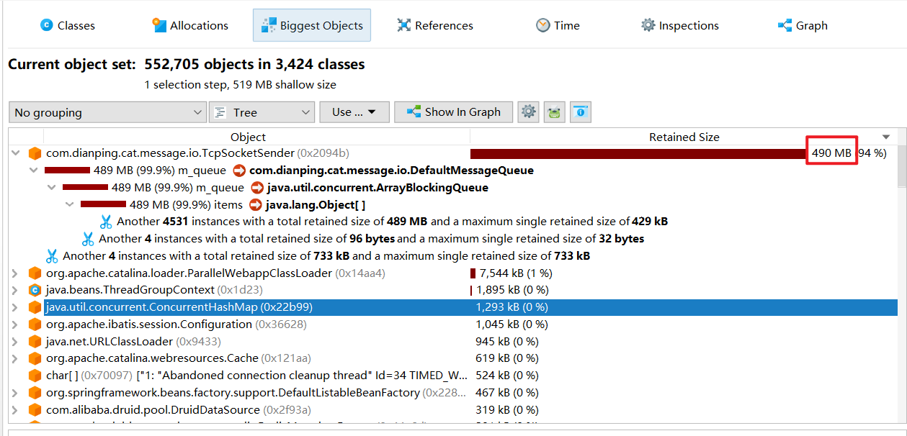
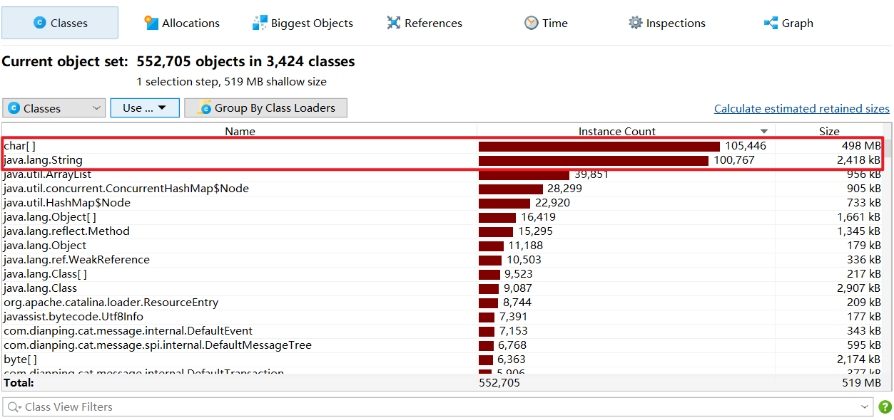

# 线上内存泄露排查

## 一. 排查过程

前不久测试环境一直无缘无故的挂掉，这可苦了我们一线开发人员，每次测试都得把挂掉服务全部起起来。面对几十个微服务模块，我想大家看到这样的场景内心也是一万个草泥马飞过….


硬着头皮把代码写完了，但是大规模的服务宕机显然不正常，看了一波还是热乎的日志，发现是服务器OOM了，顺道看了一下JVM配置，居然没有任何配置，看到这里嘴角丝丝上扬，觉得自己破案了。

随即给核心服务都加上了JVM参数：

```yml
JAVA_OPTS: "-server -Xmx256m" #因为是测试环境对扩容抖动并不敏感，所以没有设置Xms，这样可以节省一点测试环境资源
```

改完配置，我觉的自己头不疼了，自己又行了。

第二天上班发现，测试环境又双叒叕挂了


带着满脸的问号，看了一波日志，结果还是OOM，挂的服务明显变少了。这一波我开始怀疑是不是测试环境应用内存给的确实太少了（线上是1GB），我把堆内存改成了512M：

```java
JAVA_OPTS: "-server -Xmx512m -XX:+HeapDumpOnOutOfMemoryError -XX:HeapDumpPath=/opt/heapdump.hprof"
```

这一波我把`HeapDumpOnOutOfMemoryError`参数带上了，当它OOM的时候将堆内存Dump下来。

抱着怀疑的态度，连续观察了测试环境几天的状态，没有出现OOM挂掉的情况。到这里，我觉得我真的行了。

你以为这就完了？故事当然没有这么简单

过了大概半个月，又有应用出现了OOM。这一次比较好，因为保留了案发现场，可以分析一下移除原因，利用JProfile打开`hprof`文件，把我惊呆了：



`com.dianping.cat.message.io.TcpSocketSender`占用了94%的堆内存，分析Class占用发现是`ArrayBlockingQueue`持有了太多String对象导致的。



## 二. 源码研究

因为测试环境中我们是没有部署Cat服务器，猜测是因为连接不到Cat的服务器导致消息堆积，随着时间的推移，堆积消息到达上限产生了OOM。

研究了一下Cat源码，发现代码中确实有这样的逻辑（省略了大部分无关代码）：

```java
public class TcpSocketSender implements Task, MessageSender, LogEnabled {

	private MessageQueue m_queue = new DefaultMessageQueue(SIZE);
	
    ...
	
	@Override
	public void run() {
		m_active = true;

		while (m_active) {
			processAtomicMessage();
			processNormalMessage();
		}

		processAtomicMessage();

		while (true) {
            // 队列中获取消息
			MessageTree tree = m_queue.poll();

			if (tree != null) {
                // 获取发送管道
				ChannelFuture channel = m_channelManager.channel();

				if (channel != null) {
                    // 发送流程
					sendInternal(channel, tree);
				} else {
                    // 若未获取到发送管道，则将消息在塞回队列中（罪魁祸首）
					offer(tree);
				}
			} else {
				break;
			}
		}
	}
}
```

问题似乎找到了，解决方案有两个一个是将测试环境应用中的Cat disabled掉，另一种是在测试环境中部署一个Cat服务。

## 三. 一丝丝的疑惑

为什么我将应用服务堆内存从`256M`扩大到`512M`，效果却从不到一天就OOM，扩大到了将近半个月才OOM呢？

仔细想了一下，是因为我们测试环境的应用每天凌晨都会自动deploy一次，这样就掩盖了Cat内存泄露的问题。应用每天还没有达到OOM阈值就被重启了。而半个月后又出现的这次OOM，是因为最近几天Jenkins授权问题拉取Groovy脚本失败，并没有执行真正的触发逻辑。这就导致掩盖的内存泄露又暴露出来了。

一切想通后，心情舒畅，我觉得自己真的

