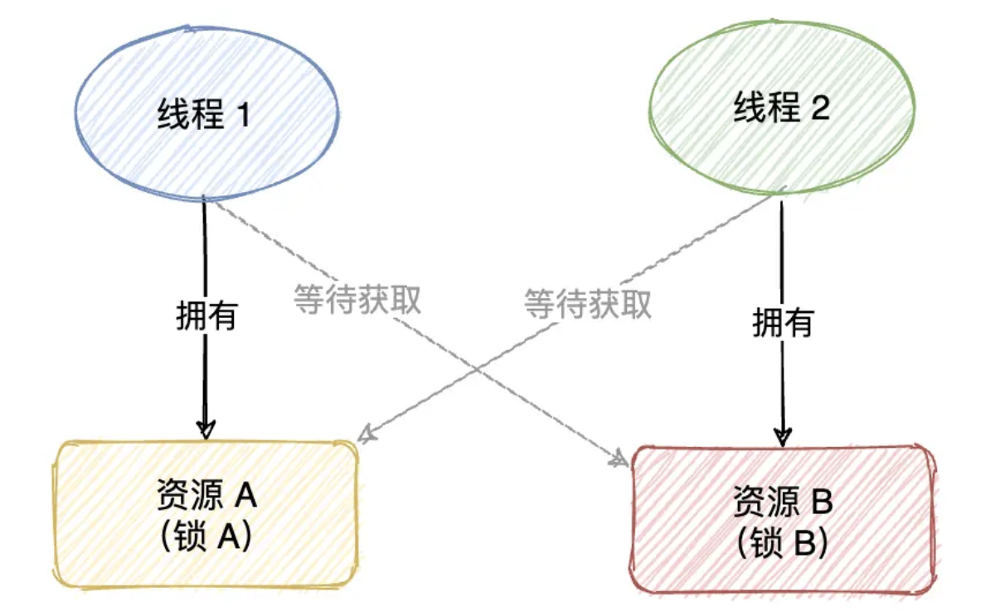
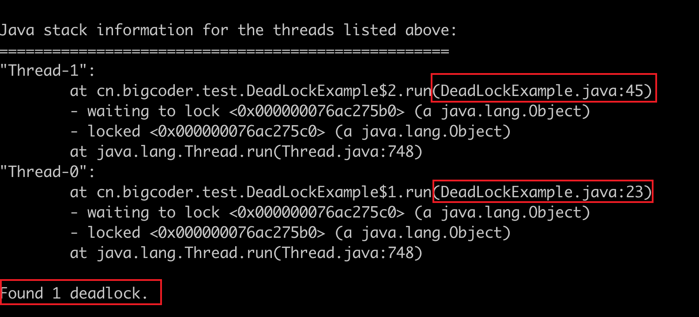

# 死锁排查

> 本文参考至：[死锁的 4 种排查工具 ！ - 掘金 (juejin.cn)](https://juejin.cn/post/6999790359530176519)

死锁（Dead Lock）指的是两个或两个以上的运算单元（进程、线程或协程），都在等待对方停止执行，以取得系统资源，但是没有一方提前退出，就称为死锁。



## 一. 死锁示例

接下来，我们先来演示一下 Java 中最简单的死锁，我们创建两个锁和两个线程，让线程 1 先拥有锁 A，然后在 1s 后尝试获取锁 B，同时我们启动线程 2，让它先拥有锁 B，然后在 1s 之后尝试获取锁 A，这时就会出现相互等待对方释放锁的情况，从而造成死锁的问题，具体代码如下：

```java
public class DeadLockExample {
    public static void main(String[] args) {
        Object lockA = new Object(); // 创建锁 A
        Object lockB = new Object(); // 创建锁 B

        // 创建线程 1
        Thread t1 = new Thread(new Runnable() {
            @Override
            public void run() {
                // 先获取锁 A
                synchronized (lockA) {
                    System.out.println("线程 1:获取到锁 A!");
                    try {
                        Thread.sleep(1000);
                    } catch (InterruptedException e) {
                        e.printStackTrace();
                    }
                    // 尝试获取锁 B
                    System.out.println("线程 1:等待获取 B...");
                    synchronized (lockB) {
                        System.out.println("线程 1:获取到锁 B!");
                    }
                }
            }
        });
        t1.start(); // 运行线程

        // 创建线程 2
        Thread t2 = new Thread(new Runnable() {
            @Override
            public void run() {
                // 先获取锁 B
                synchronized (lockB) {
                    System.out.println("线程 2:获取到锁 B!");
                    try {
                        Thread.sleep(1000);
                    } catch (InterruptedException e) {
                        e.printStackTrace();
                    }
                    // 尝试获取锁 A
                    System.out.println("线程 2:等待获取 A...");
                    synchronized (lockA) {
                        System.out.println("线程 2:获取到锁 A!");
                    }
                }
            }
        });
        t2.start(); // 运行线程
    }
}
```

## 二. 死锁产生原因

通过以上示例，我们可以得出结论，要产生**死锁需要满足以下 4 个条件**：

1. **互斥条件**：指运算单元（进程、线程或协程）对所分配到的资源具有排它性，也就是说在一段时间内某个锁资源只能被一个运算单元所占用。
2. **请求和保持条件**：指运算单元已经保持至少一个资源，但又提出了新的资源请求，而该资源已被其它运算单元占有，此时请求运算单元阻塞，但又对自己已获得的其它资源保持不放。
3. **不可剥夺条件**：指运算单元已获得的资源，在未使用完之前，不能被剥夺。
4. **环路等待条件**：指在发生死锁时，必然存在运算单元和资源的环形链，即运算单元正在等待另一个运算单元占用的资源，而对方又在等待自己占用的资源，从而造成环路等待的情况。

只有以上 4 个条件同时满足，才会造成死锁问题。

## 三. 死锁排查

第一步：查找指定进程ID

```shell
$ jps -l
30525 cn.bigcoder.test.DeadLockExample
```

`jps -l`可以查询本机所有的 Java 程序，jps（Java Virtual Machine Process Status Tool）是 Java 提供的一个显示当前所有 Java 进程 pid 的命令，适合在 linux/unix/windows 平台上简单察看当前 Java 进程的一些简单情况，“-l”用于输出进程 pid 和运行程序完整路径名（包名和类名）。

第二步：使用jstack查看堆栈

```shell
jstack -l 30525
```




