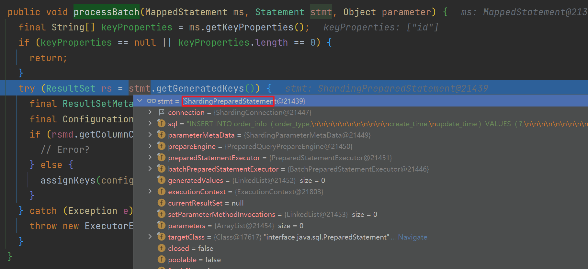
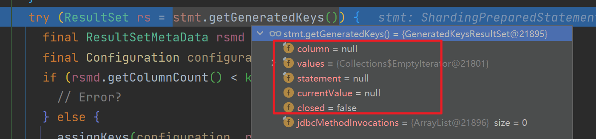

# MyBatisPlus + ShardingJDBC 批量插入不返回主键ID

本文讲述一个由 ShardingJDBC 使用不当引起的悲惨故事。

## 一. 问题重现

有一天运营反馈我们部分订单状态和第三方订单状态无法同步。

根据现象找到了不能同步订单状态是因为 order 表的 thirdOrderId 为空导致的，但是这个字段为啥为空，排查过程比较波折。

过滤掉复杂的业务逻辑，当时的代码可以简化为这样：

```java
Order order;
// 业务在特定情况会生成新的订单
if (特定条件) {
    order = buildOrders();
	orderService.saveBatch(Lists.newArrayList(order));
}


// 省略复杂的业务逻辑
// ...

// 调用第三方下单
ThirdOrder thirdOrder = callThirdPlaceOrder()
// 设置order表 thirdOrderId 字段
order.setThirdOrderId(thirdOrder.getOrderId());
// 设置 order_item 表 thirdOrderId 字段
orderItems.foreach(e -> e.setThirdOrderId(thirdOrder.getOrderId()));

// 更新 order 表
orderService.updateById(order);
// 更新 order_item 表
orderItemService.updateBatchById(itemUpdateList);
```

我们发现这类有问题的订单，order 表 thirdOrderId 为空，但是 order_item 表 thirdOrderId 更新成功了，使我们直接排除了这里母单更新“失败”的问题，因为两张表的更新操作在一个事务里面，子单更新成功了说明这里的代码逻辑应该没有问题。

就是这里的错觉，让我们走了很多弯路。我们排查了所有可能存在并发更新、先读后写、数据覆盖的地方，结合业务日志，翻遍了业务代码仍然无法确认问题具体在哪里。最后只能在可能出现问题的地方补充了日志，同时我们也在此处更新 order 表的地方加上了日志，最后发现在执行 `orderService.saveBatch` 后 order 的 id 为空，导致 order 的更新并没有成功。

说实话找到问题的那一刻有点颠覆我的认知，在我的印象中，MyBatisPlus批量插入的方法是可以返回ID，经过实验，在当前项目环境中，save()方法会返回主键ID，但是saveBatch()方法不会。这种颠覆认知的新

## 二. 源码分析

### 2.1 JDBC如何获取批量插入数据的ID

要想摸清楚批量插入后为什么没有获取到主键ID，我们得先了解一下JDBC如何批量插入数据，以及在批量插入操作后，获取数据库的主键值。

```java
// 创建一个 PreparedStatement 对象，并指定获取自动生成的主键
PreparedStatement pstmt = conn.prepareStatement("INSERT INTO order_info (column1, column2) VALUES (?, ?)", Statement.RETURN_GENERATED_KEYS);

// 执行批量插入操作
pstmt.setString(1, "value1"); // 设置参数值
pstmt.setString(2, "value2"); // 设置参数值
pstmt.addBatch(); // 添加批量操作

// ... 添加更多批量操作

// 执行批量操作
pstmt.executeBatch();

// 获取生成的主键
ResultSet generatedKeys = pstmt.getGeneratedKeys();
while (generatedKeys.next()) {
    int primaryKey = generatedKeys.getInt(1); // 假设主键为整数类型，如果是其他类型，请根据实际情况调整
    System.out.println("Generated Primary Key: " + primaryKey);
}

// 关闭相关资源
generatedKeys.close();
pstmt.close();
conn.close();
```

在执行批量插入操作后，我们可以通过 `Statement.getGeneratedKeys()` 方法获取数据库主键值。

### 2.2 MyBatis 批量插入原理

MyBatis-Plus 是对 MyBatis 的一种增强，底层还是依赖于MyBatis SqlSession API对数据库进行的操作，而SqlSession执行批量插入大概分为如下几步：

```java
try (SqlSession sqlSession = sqlSessionFactory.openSession(ExecutorType.BATCH)) {
    YourMapper mapper = sqlSession.getMapper(YourMapper.class);

    List<YourEntity> entities = new ArrayList<>();
    // 添加要插入的实体对象到列表中

    for (YourEntity entity : entities) {
        // 调用插入方法，但此时还未真正执行
        mapper.insert(entity); 
    }

    // 批量执行SQL
    sqlSession.flushStatements(); 

    sqlSession.commit(); // 提交事务
} catch (Exception e) {
    sqlSession.rollback(); // 发生异常时回滚事务
}
```

### 2.3 Myabtis-Plus + ShardingJDBC 批量插入数据为什么无法获取ID

MyBatis-Plus 执行批量插入操作本质上和MyBatis是一致的，Myabtis-Plus saveBtach方法：

```java
/**
 * 插入（批量）
 *
 * @param entityList 实体对象集合
 */
@Transactional(rollbackFor = Exception.class)
default boolean saveBatch(Collection<T> entityList) {
    return saveBatch(entityList, DEFAULT_BATCH_SIZE);
}

/**
 * 批量插入
 *
 * @param entityList ignore
 * @param batchSize  ignore
 * @return ignore
 */
@Transactional(rollbackFor = Exception.class)
@Override
public boolean saveBatch(Collection<T> entityList, int batchSize) {
    String sqlStatement = getSqlStatement(SqlMethod.INSERT_ONE);
    return executeBatch(entityList, batchSize, (sqlSession, entity) -> sqlSession.insert(sqlStatement, entity));
}
```

进入executeBatch：

```java
   /**
     * 执行批量操作
     *
     * @param entityClass 实体类
     * @param log         日志对象
     * @param list        数据集合
     * @param batchSize   批次大小
     * @param consumer    consumer
     * @param <E>         T
     * @return 操作结果
     * @since 3.4.0
     */
    public static <E> boolean executeBatch(Class<?> entityClass, Log log, Collection<E> list, int batchSize, BiConsumer<SqlSession, E> consumer) {
        Assert.isFalse(batchSize < 1, "batchSize must not be less than one");
        return !CollectionUtils.isEmpty(list) && executeBatch(entityClass, log, sqlSession -> {
            int size = list.size();
            int i = 1;
            for (E element : list) {
                // 执行 sqlSession 的 insert 方法
                consumer.accept(sqlSession, element);
                if ((i % batchSize == 0) || i == size) {
                    // 每达到 batchSize 就执行SQL
                    sqlSession.flushStatements();
                }
                i++;
            }
        });
    }
```

在 executeBatch 中 MyBatis-Plus 会循环调用 `SqlSession.insert` 缓存插入语句，每 `batchSize` 提交一次SQL。

进入 `DefaultSqlSession.flushStatements()`:

```java
  @Override
  public List<BatchResult> flushStatements() {
    try {
      return executor.flushStatements();
    } catch (Exception e) {
      throw ExceptionFactory.wrapException("Error flushing statements.  Cause: " + e, e);
    } finally {
      ErrorContext.instance().reset();
    }
  }
```

委托 `BaseExecutor.flushStatements()` 执行：

```java
  @Override
  public List<BatchResult> flushStatements() throws SQLException {
    return flushStatements(false);
  }

  public List<BatchResult> flushStatements(boolean isRollBack) throws SQLException {
    if (closed) {
      throw new ExecutorException("Executor was closed.");
    }
    return doFlushStatements(isRollBack);
  }
```

最终 `doFlushStatements()` 方法由各个子类去实现，`BaseExecutor` 有 `BatchExecutor`，`ReuseExecutor`，`SimpleExecutor`，`ClosedExecutor`，`MybatisBatchExecutor`，`MybatisReuseExecutor`，`MybatisSimpleExecutor`这几种实现。

Mybatis 开头的是 Mybatis-Plus 提供的实现，分别对应 `MyBatis` 的 simple、reuse、batch执行器类别。不管哪个执行器，里面都会有一个 `StatementHandler` 接口来负责具体执行SQL。

而在 MyBatis-Plus 批量插入的场景中，是由 `MybatisBatchExecutor#doFlushStatements` 执行的：

```java
@Override
public List<BatchResult> doFlushStatements(boolean isRollback) throws SQLException {
    try {
        List<BatchResult> results = new ArrayList<>();
        if (isRollback) {
            return Collections.emptyList();
        }
        for (int i = 0, n = statementList.size(); i < n; i++) {
            Statement stmt = statementList.get(i);
            applyTransactionTimeout(stmt);
            BatchResult batchResult = batchResultList.get(i);
            try {
                // 1. 此处调用JDBC PreparedStatement API，批量执行SQL
                batchResult.setUpdateCounts(stmt.executeBatch());
                MappedStatement ms = batchResult.getMappedStatement();
                List<Object> parameterObjects = batchResult.getParameterObjects();
                KeyGenerator keyGenerator = ms.getKeyGenerator();
                if (Jdbc3KeyGenerator.class.equals(keyGenerator.getClass())) {
                    Jdbc3KeyGenerator jdbc3KeyGenerator = (Jdbc3KeyGenerator) keyGenerator;
                    // 2. 使用 jdbc3KeyGenerator 获取批量执行的所生成的 ID
                    jdbc3KeyGenerator.processBatch(ms, stmt, parameterObjects);
                } else if (!NoKeyGenerator.class.equals(keyGenerator.getClass())) { //issue #141
                    for (Object parameter : parameterObjects) {
                        keyGenerator.processAfter(this, ms, stmt, parameter);
                    }
                }
                // Close statement to close cursor #1109
                closeStatement(stmt);
            } catch (BatchUpdateException e) {
                StringBuilder message = new StringBuilder();
                message.append(batchResult.getMappedStatement().getId())
                    .append(" (batch index #")
                    .append(i + 1)
                    .append(")")
                    .append(" failed.");
                if (i > 0) {
                    message.append(" ")
                        .append(i)
                        .append(" prior sub executor(s) completed successfully, but will be rolled back.");
                }
                throw new BatchExecutorException(message.toString(), e, results, batchResult);
            }
            results.add(batchResult);
        }
        return results;
    } finally {
        for (Statement stmt : statementList) {
            closeStatement(stmt);
        }
        currentSql = null;
        statementList.clear();
        batchResultList.clear();
    }
}
```

在 1 处，执行批量插入语句后，然后在2处调用 `Jdbc3KeyGenerator.jdbc3KeyGenerator` 获取ID：

```java
// org.apache.ibatis.executor.keygen.Jdbc3KeyGenerator#processBatch
public void processBatch(MappedStatement ms, Statement stmt, Object parameter) {
    final String[] keyProperties = ms.getKeyProperties();
    if (keyProperties == null || keyProperties.length == 0) {
      return;
    }
    // 本质上，还是调用JDBC Statement.getGeneratedKeys() 方法获取ID（参考文中2.1示例）
    try (ResultSet rs = stmt.getGeneratedKeys()) {
      final ResultSetMetaData rsmd = rs.getMetaData();
      final Configuration configuration = ms.getConfiguration();
      if (rsmd.getColumnCount() < keyProperties.length) {
        // Error?
      } else {
        assignKeys(configuration, rs, rsmd, keyProperties, parameter);
      }
    } catch (Exception e) {
      throw new ExecutorException("Error getting generated key or setting result to parameter object. Cause: " + e, e);
    }
}
```

但是我们项目中如果使用的 ShardingJDBC，那么此时调用的就是 `ShardingPreparedStatement.getGeneratedKeys()`:



通过 DEBUG，我们发现在我们项目中 `ShardingPreparedStatement.getGeneratedKeys()` 返回的是null值:



这也就找到了为什么MyBatis-Plus 和 ShardingJDBC 一起使用时获取不到ID值的问题，问题的根节并不在MyBatis这边，而是 ShardingJDBC 实现的 PreparedStatement 获取不到key。

### 2.4 为什么执行MyBatis-Plus save方法可以获取到主键

当我们调用 MyBatis-Plus save() 方法保存单条数据时，底层实际上还是调用的 `ShardingPreparedStatement.getGeneratedKeys()` 方法，获取插入后的主键key:

```java
@Override
public ResultSet getGeneratedKeys() throws SQLException {
    Optional<GeneratedKeyContext> generatedKey = findGeneratedKey();
    if (preparedStatementExecutor.isReturnGeneratedKeys() && generatedKey.isPresent()) {
        return new GeneratedKeysResultSet(generatedKey.get().getColumnName(), generatedValues.iterator(), this);
    }
    if (1 == preparedStatementExecutor.getStatements().size()) {
        return preparedStatementExecutor.getStatements().iterator().next().getGeneratedKeys();
    }
    return new GeneratedKeysResultSet();
}
```

但是在执行单条数据插入时，`1 == preparedStatementExecutor.getStatements().size()` 是成立的，就会返回底层被真实被代理的MySQL JDBC 的 Statement 获取主键key：


至于 `AbstractStatementExecutor.statements` 为什么在执行单一语句的时候statements里不为空，但是批量插入的时候，这个list为空，可以参考下面的回答：

> `AbstractStatementExecutor.statements`是ShardingJDBC中的一个重要数据结构，它用于存储待执行的SQL语句及其对应的数据库连接信息。在进行SQL操作时，ShardingJDBC会根据你的分片策略将SQL语句路由到相应的数据库节点，并生成对应的数据结构存储在`statements`这个列表里。
>
> 那么，为什么在执行单一SQL语句时，`statements`不为空，而在批量插入时，这个列表却为空呢？这主要是因为ShardingJDBC处理这两种情况的方式有所不同。
>
> 1. 对于单一SQL语句，ShardingJDBC将其路由到正确的数据库节点（可能是多个），然后创建对应的PreparedStatement对象，这些对象被存储在`statements`列表中，以便后续执行和获取结果。
> 2. 对于批量插入，ShardingJDBC采取了一种“延迟执行”的策略。具体来说，ShardingJDBC首先会解析和拆分批量插入语句，然后将拆分后的单一插入语句暂存起来，而不是立即创建PreparedStatement对象。这就导致了在批量插入过程中，`statements`列表为空。这样做的主要目的是为了提高批量插入的性能，因为创建PreparedStatement对象和管理数据库连接都是需要消耗资源的。

## 三. 总结

本文由故障现象定位到了具体的问题点是因为 MyBatis-Plus 批量插入没有返回数据库组件，而跟踪源码后我们却发现是因为ShardingJDBC不支持批量插入获取主键值。

ShardingJDBC不支持批量插入后获取主键，主要是因为在批量插入操作中，ShardingJDBC可能需要将数据插入到多个不同的数据库节点，在这种情况下，每个节点都可能有自己的主键生成规则，并且这些节点可能并不知道其他节点的主键值。因此，如果你需要在批量插入后获取自动生成的主键，可能需要通过其他方式实现，例如使用全局唯一ID作为主键。