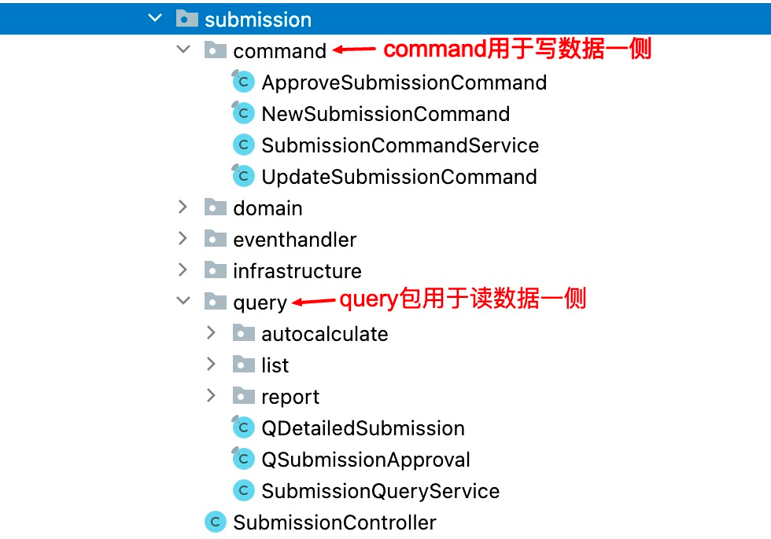
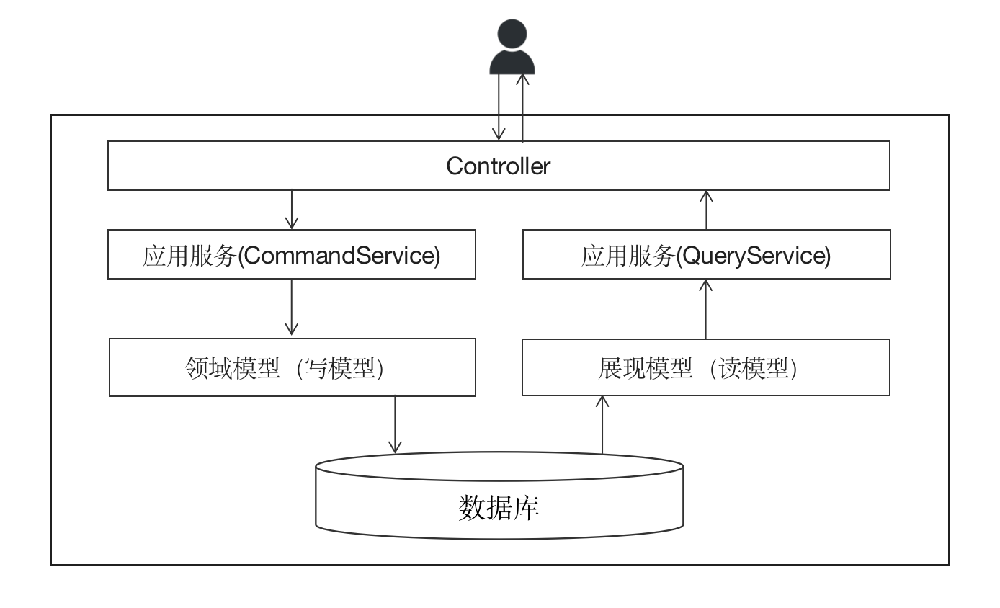
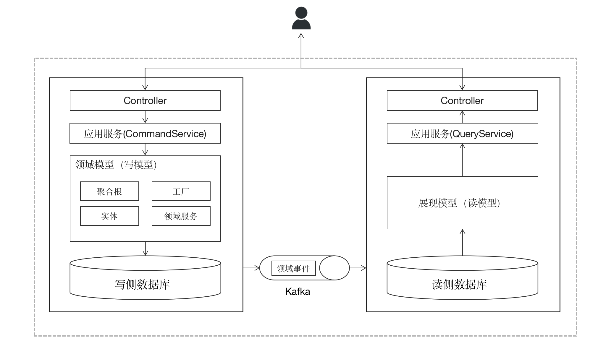

# CQRS

> 本文转载至：[产品代码都给你看了，可别再说不会DDD（十）：CQRS | 码如云文档中心](https://docs.mryqr.com/ddd-cqrs/)

**CQRS**(Command Query Responsibility Segregation)直译成中文叫**命令查询职责分离**，可不要被这个读起来有些拗口的名字吓到了，事实上就是**读写分离**的意思，不过这里的读写分离和我们通常所理解的数据库级别的读写分离是两个不同的概念，CQRS指的读写分离是指在应用程序内部的代码级别的读写分离，在本文中，我将对此做出详细解释。

简单来讲，CQRS的提出是基于这么一种现象：软件中写数据的操作和读数据的操作是两个很不一样的过程，它们各有各的特点，因此可以并且应该将它们作为两个单独的关注点分别进行处理。“写数据”的过程也被称为“命令（Command）”，即表示外界通过向软件发送一些列的命令达到更新软件内部数据的目的，比如更新用户偏好设置、向电商网站下单等；“读数据”的过程也被称为“查询（Query）”，即从软件中获取数据，比如查看订单信息等。读和写的不同主要体现在以下几个方面：

- 业务逻辑的运用主要是在写数据一侧，也就是说，我们在本系列的其他文章中讲到的聚合根，实体，值对象，领域服务等领域模型中的概念主要用于“写数据”的过程，相比之下“读数据”一侧的业务逻辑则相对较少，主要是数据展现逻辑；
- 读数据是幂等的，即无论通过什么方式，都不应该修改系统中的数据，也即读数据相对安全，而在写数据时则需要始终保证数据的正确性和一致性，否则将导致严重Bug；
- 导致读数据和写数据过程发生变更的归因不同，对写数据侧的变更主要基于业务逻辑的变化，而读数据侧的变更则更多基于UI需求的变化，比如根据不同的屏幕尺寸返回不同的数据等；
- 读数据和写数据的频率往往各不相同，对于多数业务来说写数据的频率往往低于读数据的频率。

事实上，读写分离这种思想早在上世纪80年代末便由[Bertrand Meyer](https://en.wikipedia.org/wiki/Bertrand_Meyer)提出，在他的《[Object-Oriented Software Construction](https://en.wikipedia.org/wiki/Object-Oriented_Software_Construction)》一书中指出：

> Every method should either be a command that performs an action, or a query that returns data to the caller, but never both. (一个方法要么作为一个“命令”执行一个操作，要么作为一次“查询”向调用方返回数据，但两者不能共存。）

可以看出，Bertrand Meyer所谓的读写分离主要用于对象中的**方法**(Method)，而CQRS将这种思想扩大到了软件架构层面，接下来让我们分别看看CQRS中的各种读写分离模式。

## 一. 读流程分离

最简单的读写分离模式莫过于读写流程的分离了，事实上这也是我们一直在用的一种方式，是的没错，你已经在用CQRS了。为此，让我们来看看一个具体的例子，在[码如云](https://www.mryqr.com/)中，有权限的**成员**(Member)可以更新**表单**(Submission)，也可以查看表单详情数据，前者是一个写数据的过程，后者则是一个读数据的过程。更新表单的应用服务代码如下：

```java
//SubmissionCommandService

@Transactional
public void updateSubmission(String submissionId, UpdateSubmissionCommand command, User user) {
    Submission submission = submissionRepository.byIdAndCheckTenantShip(submissionId, user);
    AppedQr appedQr = qrRepository.appedQrById(submission.getQrId());
    App app = appedQr.getApp();
    QR qr = appedQr.getQr();

    Page page = app.pageById(submission.getPageId());
    SubmissionPermissions submissionPermissions = submissionPermissionChecker.permissionsFor(user,
            app,
            submission.getGroupId());

    submissionDomainService.updateSubmission(submission,
            app,
            page,
            qr,
            command.getAnswers(),
            submissionPermissions.getPermissions(),
            user
    );

    submissionRepository.houseKeepSave(submission, app);
    log.info("Updated submission[{}].", submissionId);
}
```

> 源码出处：[com/mryqr/core/submission/command/SubmissionCommandService.java](https://github.com/bigcoder84/mry-backend/blob/main/src/main/java/com/mryqr/core/submission/command/SubmissionCommandService.java)

应用服务方法`SubmissionCommandService.updateSubmission()`通过调用领域服务`SubmissionDomainService.updateSubmission()`完成对表单的更新，然后再通过`SubmissionRepository.houseKeepSave()`完成对表单的持久化。

在查看表单详情时的应用服务代码如下：

```java
//SubmissionQueryService

public QDetailedSubmission fetchDetailedSubmission(String submissionId, User user) {
    Submission submission = submissionRepository.byIdAndCheckTenantShip(submissionId, user);

    //将领域对象Submission转为展现对象QDetailedSubmission
    return toSubmissionDetail(submission, user);
}
```

> 源码出处：[com/mryqr/core/submission/query/SubmissionQueryService.java](https://github.com/bigcoder84/mry-backend/blob/main/src/main/java/com/mryqr/core/submission/query/SubmissionQueryService.java)

在`SubmissionQueryService.fetchDetailedSubmission()`方法中，先获取到需要查询的表单聚合根对象`Submission`，然后调用`toSubmissionDetail()`将`Submission`转换为展现对象`QDetailedSubmission`。

在上述2个代码例子中，写数据和读数据使用了不同的应用服务方法，也即流程分离了。你可能会说“我平时就是这么做的呀！”，的确如此，这种方式正是大家平时的编码实现，但是这里我们更希望强调的原则在于：写数据的`SubmissionCommandService.updateSubmission()`返回的是`void`，也即不会返回任何数据，而读数据的`SubmissionQueryService.fetchDetailedSubmission()`则只是获取数据而未修改任何数据。

此外，虽然`SubmissionCommandService`和`SubmissionQueryService`均表示应用服务，但是在编码实现中被分成了2个单独的类以示分离。事实上，在码如云我们在代码的分包层面也做了相应的对读写分离的支持，所有与写数据相关的代码被组织在了`command`包下，而所有与读数据相关的代码则被放在了`query`包下。



在查询数据时，先获取到聚合根对象`Submission`，再将其转化为展现对象`QDetailedSubmission`，也就是说读数据和写数据的过程共享了同一个聚合根对象`Submission`。这种方式对于简单的查询场景没有多大问题，但是对于一些复杂的查询场景来说并不合适，一是使得读数据侧对写数据侧存在依赖，二是在跨表查询的时候，需要将多个聚合根对象分别从数据库中加载到内存，导致对数据库的多次访问，在高并发场景下，这可能影响系统性能。

## 二. 模型分离

既然业务逻辑主要作用于写数据侧，而读数据侧主要处理的是展现逻辑，那是不是在读数据时可以绕过领域模型（上例中的`Submission`）呢？当然可以，这就是模型分离。模型分离的主要特点是：在写数据时，依然严格按照领域模型对业务逻辑的[请求处理流程](https://docs.mryqr.com/ddd-request-process-flow)，但是在读数据时，可以绕过领域模型，直接从数据库创建相应的读模型对象。落到编码层面，在写数据侧可能需要通过ORM等工具完成对聚合根的持久化，但是在读数据侧则不见得，我们全然可以通过直接的SQL语句从数据库中加载所需查询的数据。



在码如云，租户管理员可以查看租户下所有的成员，其查询实现如下：

```java
//MemberQueryService

public PagedList<QListMember> listMyManagedMembers(ListMyManagedMembersQuery queryCommand, User user) {
    String tenantId = user.getTenantId();
    Pagination pagination = pagination(queryCommand.getPageIndex(), queryCommand.getPageSize());
    String departmentId = queryCommand.getDepartmentId();
    String search = queryCommand.getSearch();

    Query query = new Query(buildMemberQueryCriteria(tenantId, departmentId, search));
    long count = mongoTemplate.count(query, Member.class);
    if (count == 0) {
        return pagedList(pagination, 0, List.of());
    }

    query.skip(pagination.skip()).limit(pagination.limit()).with(sort(queryCommand));
    
    //绕过Member，直接将从数据库中查到的数据创建为QListMember
    query.fields().include("name").include("avatar").include("role").include("mobile")
            .include("wxUnionId").include("wxNickName").include("email")
            .include("active").include("createdAt").include("departmentIds");
    
    List<QListMember> members = mongoTemplate.find(query, QListMember.class, MEMBER_COLLECTION);
    return pagedList(pagination, (int) count, members);
}
```

> 源码出处：[com/mryqr/core/member/query/MemberQueryService.java](https://github.com/mryqr-com/mry-backend/blob/main/src/main/java/com/mryqr/core/member/query/MemberQueryService.java)

可以看到，在查询成员列表时，直接通过`mongotTemplate`（码如云使用的是MongoDB）将从数据库中所查询到的数据创建为了读模型`QListMember`，省去了加载`Member`并从`Member`转化为`QListMember`的过程。

## 三. 数据源分离

模型分离可以解决很大一部分读写分离的问题，不过它依然是一种相对简单的CQRS实现方式，对于更加复杂的查询场景来说则显得有些力不从心，主要有以下原因：

1. 模型分离事实上只是代码层面模型的分离，底层的数据库模型并未分离，依然是读写共享的，对于主要服务于写数据一侧的数据库来说，可能由于对读数据一侧的“照料不周”而无法满足某些查询需求；
2. 模型分离只能用于在同一个进程空间之内的查询，也即所查询的数据均位于同一个数据库的场景，但是对于诸如微服务这种需要跨进程查询的情况则无法满足，比如对于一个采用微服务架构的电商系统，在用户首页需要同时查看用户基本信息和积分，但是前者位于“用户”服务中，而后者来自于“积分”服务，此时需要分别从2个服务中获取数据并返回给前端；
3. 查询所需数据不一定能够直接映射到数据库中的字段，而是有可能需要做一些额外的加工，比如将`省份(province)`、`城市(city)`和`详细地址(detailAddress)`拼接为最终的地址值等。

**数据源分离**便是用来解决这个问题的，在这种方式下，我们为数据查询侧单独创建一个数据库，这个数据库存在的目的仅仅是为了方便查询用，可以说是为读数据侧量身定制的，该数据库中的数据依然来自于写数据一侧，只是经过了一些预先的加工，比如根据查询端（前端）所需摒弃了一些无用的字段，或者将多个字段合并成单个字段便于前端的直接显示等。那么，数据又如何从写数据一侧传递到读数据一侧呢？答案是[领域事件](https://docs.mryqr.com/ddd-domain-events)。



在写数据时，对业务数据的变更将通过领域事件的形式发布到消息队列（Kafka）中， 读数据侧作为一个独立的模块通过消费这些领域事件完成对读模型数据库的相应更新，之后在查询数据时，则采用与“模型分离”相似的模式直接从数据库构建读模型，最后返回给查询方（前端）。

在技术栈的选择上，读数据侧的数据库不必与写数据库保持一致，比如写数据侧可以采用诸如MySQL这种强事务一致性的数据库（为了保证业务数据的正确性），但是读数据侧可以采用更有利于数据查询的数据库，比如ElasticSearch等。

事实上，以上3种CQRS的实现模式并不是彼此互斥的，而是可以同时存在，哪种方式相对简单则采用哪种方式。比如，在[码如云](https://www.mryqr.com/)我们便同时采用了3种方式。

## 四. 总结

CQRS即是读写分离的意思，它将软件中的写数据过程和读数据过程分开处理，各司其职，是一种可以在很大程度上简化软件架构的编程模式。在这种模式下，写数据的过程严格遵循DDD的各种原则，而读数据的过程则可以绕开DDD中的领域模型（主要是聚合根），直接从数据库构建需要查询的数据模型。根据具体场景的不同，可以采用不同的CQRS实现模式。