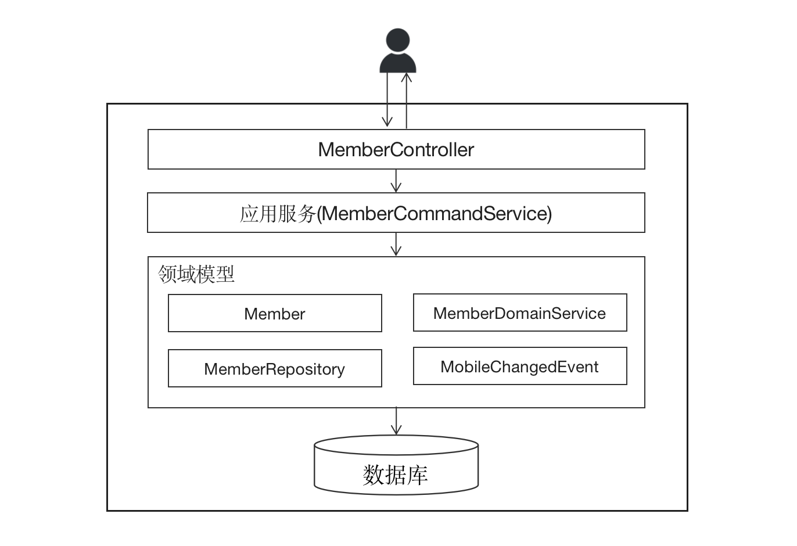

# DDD架构下的CRUD

> 本文转载至：[后端开发就是CRUD？没那么简单！ | 码如云文档中心](https://docs.mryqr.com/backend-is-not-crud/)

作为一个后端开发者，不时都能听到这么一种论调：后端开发没什么技术含量，就是CRUD而已。此时，我一般会嘴角抿抿，心里呵呵。

事实上，从某种程度上说这种说法并没错，我们甚至还可以进一步去挖掘一下其背后更深层次的本质：软件就是一个I/O系统，后端开发就是对数据的I/O处理而已，只需能把数据存起来再放出去即可，的确说不上什么高端可言。此外，在国内的大多数程序员所从事的细分行业只能说是“应用软件开发”或者“业务软件开发”，说白了这些成天处理业务逻辑的软件都没什么难的，就是一些低级逻辑而已，这也是为什么很多非计算机专业的学生都可以成功转行为程序员的原因（之一）。

然而，同样一个业务功能，分别让两个工作经验不同的程序员去实现，他们的代码可能完全不一样。有时，经验少的程序员写100行代码就能实现的一个功能，老程序员却需要写500行，因为后者考虑到了对各种边界条件的处理，缓存的使用以及对性能的顾及等。又有时，经验少的程序员写了500行代码实现的一个功能，老程序员只花了100行就实现了，因为后者使用了更加优秀的算法或者采用了能使代码变得更加简洁的工具和原则等。

李书福说：“造车就是一个沙发加四个车轮”。他说的没错，因为这是汽车的某种本质。然而，真正要造好一台汽车，却需要考虑舒适性、加速性、NVH、操控性、通过性等诸多方面的因素。软件也一样，简单的CRUD操作纵然能够满足基本的I/O需求，但是在具体落地时我们还要考虑很多原则和因素以让人能够更好地掌控软件系统，其中包含但不限于：高内聚低耦合、关注点分离、依赖倒置、非功能性需求等等。这里所涉及到的一个基本命题是：**软件代码首先是给人脑看的，其次才是给电脑执行的。**

在本文中，我们将以一个真实的软件项目 —— **码如云**（[https://www.mryqr.com](https://www.mryqr.com/)）为例，系统性的讲解后端在处理请求的过程中所需要顾及的方方面面，你会发现后端开发绝非单纯的CRUD这么简单。

接下来，我们将围绕以下业务用例展开讨论：在码如云中，**成员**（Member）可以更新自己的手机号码，但如果所使用的手机号已经被他人占用，则禁止更新。

整个请求处理的流程如下图所示：



概括来看，整个请求处理流程和我们通常的实践并没有太大的区别。首先，请求到达`MemberController`，这是Spring MVC处理请求的第一站；然后`MemberController`调用`MemberCommandService`完成该业务用例，调用时传入请求数据对象`ChangeMyMobileCommand`，这里的`MemberCommandService`在DDD中被称为应用服务；`MemberCommandService`通过`MemberRepository`获取到对应的`Member`对象，再通过`MemberDomainService`（在DDD中被称为领域服务）完成对`Member`的手机号更新；最后`MemberCommandService `调用`MemberRepository.save()`将更新后的`Member`对象保存到数据库。

## 一. MemberController

在整个请求处理的过程中，首先通过`MemberController`接收请求：

```java
@PutMapping(value = "/me/mobile")
@ResponseStatus(OK)
public void changeMyMobile(@RequestBody @Valid ChangeMyMobileCommand command,
                           @AuthenticationPrincipal User user) {
    memberCommandService.changeMyMobile(command, user);
}
```

> 源码出处：[com/mryqr/core/member/MemberController.java](https://github.com/bigcoder84/mry-backend/blob/main/src/main/java/com/mryqr/core/member/MemberController.java)

这里，`MemberController.changeMyMobile()`方法一共只有5行代码，可不要小瞧这5行代码，在实际编码时我们却需要考虑多个方面的因素：

1. Spring MVC的Controller是框架直接相关的，DDD讲求业务复杂度与技术复杂度的分离，我们希望自己的代码实现能够尽快的脱离技术框架，因此`MemberController`只起到了简单的代理作用，也即把请求代理给应用服务`MemberCommandService`。
2. 对URL的设计是有讲究的，`MemberController`采用了REST风格的URL，通过HTTP的PUT方法完成对mobile资源（`me/mobile`）的更新，更多关于REST URL的内容，请参考[这里](https://medium.com/@mwaysolutions/10-best-practices-for-better-restful-api-cbe81b06f291)。
3. 同样基于REST原则，更新资源后应该返回HTTP的200状态码，这里通过`@ResponseStatus(OK)`完成（Spring MVC默认返回的即是200）。
4. 对于接收到的数据请求对象`ChangeMyMobileCommand`需要加上`@Valid`以做数据验证，否则后续对`ChangeMyMobileCommand`中的各种[JSR-303](https://beanvalidation.org/1.0/spec/)验证将失效。
5. `MemberController`需要返回`void`，也即不返回任何数据，这是因为基于[CQRS](https://docs.mryqr.com/ddd-cqrs/)的原则，任何写数据的操作不能同时查询数据，反之亦然。

## 二. ChangeMyMobileCommand

命令对象`ChangeMyMobileCommand`用于封装请求数据，之所以称之为**命令**（Command）是因为一个请求就像外界向软件系统发起了一次命令一样，这里的Command正是来自于CQRS中的“C”。

```java
@Value
@Builder
@AllArgsConstructor(access = PRIVATE)
public class ChangeMyMobileCommand implements Command {
    @Mobile
    @NotBlank
    private final String mobile;

    @NotBlank
    @VerificationCode
    private final String verification;

    @NotBlank
    @Password
    private final String password;

    @Override
    public void correctAndValidate() {
        //用于JSR-303无法完成的验证逻辑，但是又不能包含业务逻辑
    }
}
```

> 源码出处：[com/mryqr/core/member/command/ChangeMyMobileCommand.java](https://github.com/bigcoder84/mry-backend/blob/main/src/main/java/com/mryqr/core/member/command/ChangeMyMobileCommand.java)

`ChangeMyMobileCommand `对象主要充当数据容器的作用，其中一个比较重要的任务是完成数据的初步验证。具体实践时需要考虑以下几个方面：

1. Command对象通常是不变的（Immutable），在编码时应将建模为一个[值对象](https://docs.mryqr.com/ddd-entity-and-value-object/)，为此我们使用了[Lombok](https://projectlombok.org/)中的`@Value`、`@Builder`和`@AllArgsConstructor(access = PRIVATE)`达到此目的。
2. 对Command对象中的每一个字段，都需要判断是否需要做验证，有些字段可以通过简单的JSR-303内建注解完成验证，比如`mobile`字段中的`@NotBlank`，而更复杂的验证则需要自行实现JSR-303的`ConstraintValidator`接口，比如`mobile`字段的`@Mobile`注解。
3. 对于Command对象，还需要特别注意其中的容器类字段，比如`List`和`Set`等，需要对这些字段做非null检查（@NotNull），以消除后续代码在引用这些字段时有可能的空指针异常`NullPointerException`。
4. 对于更加复杂的验证，比如需要对多个字段进行关联性验证，通过自定义JSR-303可能比较麻烦，此时可以自定义`Command`接口，通过实现该接口的`correctAndValidate()`方法完成验证目的。
5. 对于字符串类字段来说，任何时候都需要通过`@Size`注解对其长度进行限制，除非其他注解中已经包含了此限制。

## 三. MemberCommandService

**应用服务**（ApplicationService或者CommandService）是领域模型的门面，任何对领域模型的请求都需要通过应用服务中的公有方法完成。更多关于应用服务的讲解，请参考我们DDD文章系列中的[这一篇](https://docs.mryqr.com/ddd-application-service-and-domain-service/)。

```java
@Transactional
public void changeMyMobile(ChangeMyMobileCommand command, User user) {
    mryRateLimiter.applyFor(user.getTenantId(), "Member:ChangeMyMobile", 5);

    String mobile = command.getMobile();
    verificationCodeChecker.check(mobile, command.getVerification(), CHANGE_MOBILE);

    Member member = memberRepository.byId(user.getMemberId());
    memberDomainService.changeMyMobile(member, mobile, command.getPassword());
    memberRepository.save(member);
    log.info("Mobile changed by member[{}].", member.getId());
}
```

> 源码出处：[com/mryqr/core/member/command/MemberCommandService.java](https://github.com/bigcoder84/mry-backend/blob/main/src/main/java/com/mryqr/core/member/command/MemberCommandService.java)

在DDD中，应用服务应该是很薄的一层，因为它不能包含业务逻辑，而主要是起协调的作用，另外事务边界、鉴权等操作也会放在应用服务中。在实现时，应该考虑以下几个方面：

1. 应用服务不能包含业务逻辑，这也是很多CRUD程序员经常犯的一个错误。举个例子，在本例中，如果成员的手机号已经被占用，则禁止更新手机号，这是一个典型的业务逻辑，因此不应该在`MemberCommandService `中完成，而应该放到领域模型中。通常来说，应用服务遵循请求处理“三部曲”原则：
   1. 获取需要处理的领域对象（本例中的`Member`）
   2. 对领域对象进行处理（`memberDomainService.changeMyMobile()`）
   3. 将更新后的领域对象保存回数据库（`memberRepository.save()`）。
2. 应用服务中的公共方法应该与业务用例一一对应，而每个业务用例又对应一个数据库事务，因此应用服务应该是事务的边界，也即Spring的`@Transactional`注解应该打在应用服务的公用方法上。
3. 与Controller一样，应用服务中负责写操作的方法不能返回查询数据，而负责查询的方法不能更改数据。
4. 应用服务应该是独立于技术框架（本例的Spring）的，如果把领域模型比作CPU中的芯片，那么应用服务便是CPU引脚，整个CPU放到不同的电脑主板（类比到技术框架）中均能正常使用。不过，在实际的编码过程中，我们做了一些妥协，比如在本例中，`@Transactional `则是来自于Spring的，不过总的原则是不变的，即应用服务（以及其所包围着的领域模型）尽量少地依赖于技术框架。
5. 一些非业务性的功能也应该在应用服务中完成，比如对请求的限流（本例中的`mryRateLimiter `），限流处理原本可以放到技术框架中统一处理的，不过由于[码如云](https://www.mryqr.com/)是一个SaaS软件，需要对不同的租户单独限流，因此我们将其放在了应用服务这一层。
6. 一般来讲，对权限的检查也可以放在应用服务中；不过不同的人对此有不同的看法，有人认为权限也属于业务逻辑，因此应该放到领域模型中，而另外有人认为权限不是业务逻辑，应该被当做一个单独的关注点来处理。在码如云，我们选择了后者，并且将对权限的处理放到了应用服务中。

## 四. MemberRepository

**资源库**（Repository）的、可以认为是对数据库的封装和抽象，有些类似于DAO（Data Access Object）,不过它们最大的区别是资源库是与DDD中的聚合根一一对应的，只有聚合根对象才“配得上”拥有资源库，而DAO则没有此限制。更多关于资源库的内容，可以参考[这里](https://docs.mryqr.com/ddd-aggregate-root-and-repository/)。

```java
public interface MemberRepository {
    boolean existsByMobile(String mobile);
    Member byId(String id);
    Optional<Member> byIdOptional(String id);
    Member byIdAndCheckTenantShip(String id, User user);
    boolean exists(String arId);
    void save(Member member);
    void delete(Member member);
}
```

在实现资源库时，应该考虑以下几个方面：

1. 只对聚合根对象创建相应的资源库，并且其操作的对象是以聚合根为单位的。
2. 资源库不能包含太多的查询方法，大量的查询操作可能意味着对领域模型的污染，此时可以考虑通过[CQRS](https://docs.mryqr.com/ddd-cqrs/)将查询操作绕过资源库单独处理。
3. 资源库通常分为接口类和实现类，接口类是属于领域模型的一部分，而实现类则应该放到基础设施中，落地时接口类应该放到`domain`分包下，而实现类应该放到`infrastructure`分包下，这也意味着，资源库的实现是“可插拔”的，即如果将来要从MySQL迁移到MongoDB，那么只需要新添加一个基于MongoDB的资源库实现类即可，其他地方可以不变。
4. 资源库中不能包含业务逻辑，其完成的功能只限于将数据从内存同步到数据库，或者反之。

## 五. MemberDomainService

与应用服务不同的是，**领域服务**（DomainService）属于领域模型的一部分，专门用于处理业务逻辑，通常被应用服务所调用。在本例中，我们使用`MemberDomainService `对“手机号是否已经被占用”进行检查：

```java
public void changeMyMobile(Member member, String newMobile, String password) {
    if (!mryPasswordEncoder.matches(password, member.getPassword())) {
        throw new MryException(PASSWORD_NOT_MATCH, "修改手机号失败，密码不正确。", "memberId", member.getId());
    }

    if (Objects.equals(member.getMobile(), newMobile)) {
        return;
    }

    if (memberRepository.existsByMobile(newMobile)) {
        throw new MryException(MEMBER_WITH_MOBILE_ALREADY_EXISTS, "修改手机号失败，手机号对应成员已存在。",
                mapOf("mobile", newMobile, "memberId", member.getId()));
    }

    member.changeMobile(newMobile, member.toUser());
}
```

> 源码出处：[com/mryqr/core/member/domain/MemberDomainService.java](https://github.com/bigcoder84/mry-backend/blob/main/src/main/java/com/mryqr/core/member/domain/MemberDomainService.java)

在实践时，使用领域服务应该考虑到以下几个方面：

1. 领域服务不是必须有的，而是只有当领域模型（准确的讲是聚合根）无法完成某些业务逻辑时才出现的，是“不得已而为之”的结果。在本例中，检查“手机号是否被占用”需要进行跨聚合（`Member`）的操作，光凭当事的`Member`是无法做到这一点的，此外这种检查有属于业务逻辑的一部分，因此我们创建一种可以处理业务逻辑的服务（Service）类来解决，这个服务类即是领域服务。在很多项中，应用服务和领域服务揉杂在一起，功能倒是实现了，但是各组件之间的耦合也加深了，导致的结果是软件在未来的演进中将变得越来越复杂，越来越困难。
2. 领域服务的职责最多只到更新领域模型在内存中的状态，而不包含保存领域模型的职责，比如在本例中，`MemberDomainService `并不调用`memberRepository.save(member)`来保存`Member`，而是由应用服务`MemberCommandService`负责完成。这样做的好处是将领域服务建模为一个仅仅操作领域模型的“存在”，使其职责更加的单一化。

## 六. Member

**领域对象**（Domain Object）是业务逻辑的主要载体，同时包含了业务数据和业务行为。在本例中，`Member`对象则是一个典型的领域对象，在DDD中，`Member`也被称为聚合根对象。`Member`对象实现修改手机号的代码如下：

```java
public void changeMobile(String mobile, User user) {
    if (Objects.equals(this.mobile, mobile)) {
        return;
    }

    this.mobile = mobile;
    this.mobileIdentified = true;
    raiseEvent(new MobileChangedEvent(this.getId(), mobile));
}
```

> 源码出处：[com/mryqr/core/member/domain/Member.java](https://github.com/bigcoder84/mry-backend/blob/main/src/main/java/com/mryqr/core/member/domain/Member.java)

在实现领域对象时，应该考虑以下几个方面：

1. 忘掉数据库，不要预设性地将领域模型中的字段与数据库中的字段对应起来，只有这样才能够做到架构的整洁性以及基础设施中立性，正如Bob大叔所说，数据库是[一个细节](https://blog.cleancoder.com/uncle-bob/2012/05/15/NODB.html)。
2. 领域模型应该保证数据一致性，比如在修改订单项时，订单的价格也应该相应的变化，那么此时所有相关的处理逻辑均应该在同一个方法中完成。在本例中，手机号修改了之后，应该同时将`Member`标记为“手机号已记录”状态（`mobileIdentified `），因此对`mobileIdentified `的修改应该与对`mobile`的修改放在同一个`chagneMyMobile()`方法中。在DDD中，这也称为[不变条件](https://domaincentric.net/blog/modelling-business-rules-invariants-vs-corrective-policies)（Invariants）。
3. 在实现领域逻辑的过程中，还会随之产生**领域事件**（Domain Event），由于领域事件也是领域模型的一部分，因此一种做法是领域对象在完成业务操作之后，还应发出领域事件，即本例中的`raiseEvent(new MobileChangedEvent(this.getId(), mobile));`更多关于领域事件的内容，请参考[这里](https://docs.mryqr.com/ddd-domain-events/)。
4. 领域对象不能持有或引用其他类型的对象，包括应用服务，领域服务，资源库等，因为领域对象只是根据业务逻辑的运算完成对业务数据的更新，也即领域对象应该建模为POJO(Plain Old Java Object)。
5. 同理于应用服务，`Member.changeMobile()`方法是个写操作，不能返回任何数据。

## 七. 总结 

如“用户修改手机号”这样简单的需求，在整个实现过程中需要考虑的点也达到了将近30个，真实情况只会多不会少，比如我们可能还需要考虑性能、缓存和认证等众多非功能性需求等。因此，后端开发绝非CRUD这么简单，而是需要将诸多因素考虑在内的一个系统性工程，还是那句话，有讲究的编程并不是一件易事。