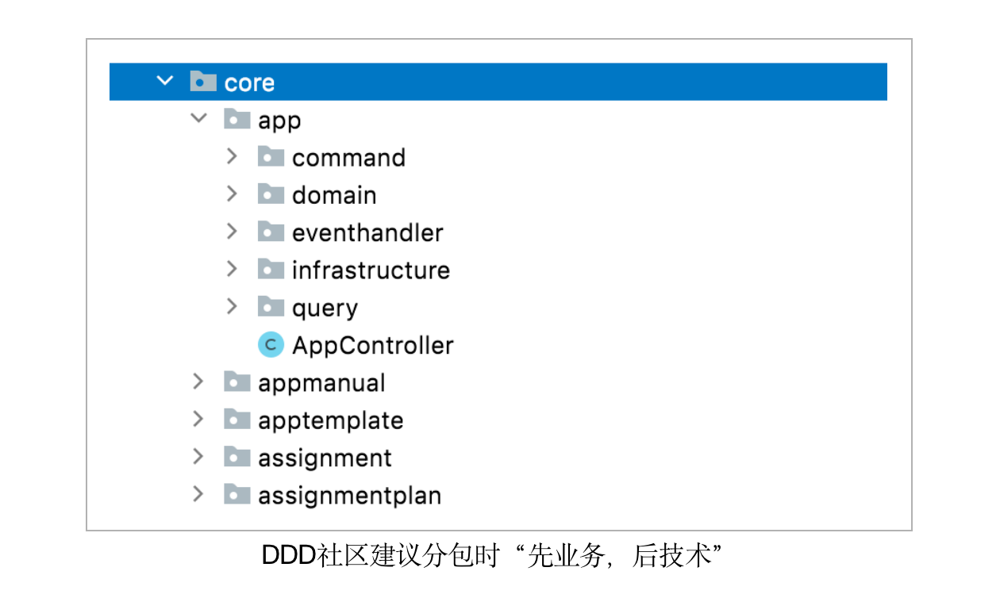

# 整洁架构能有多整洁

> 本文转载至：[整洁架构能有多整洁？ | 码如云文档中心](https://docs.mryqr.com/how-clean-can-clean-architecture-be/)

前段时间，我将一个中大型后端项目顺利地从Spring Boot 2.5 迁移到了Spring Boot 3，整个过程仅花了一天左右时间，在小酌庆祝之余，我开始思考此次迁移之所以能够顺利进行的原因，此时一个概念立即闪现脑海——**整洁架构**。


下来我对项目代码做了个统计，发现了以下两组比较重要的数据：

1. 在整个代码库中，领域模型（对应上图中的`Entities`）的代码占比为55%，应用服务（对应上图中的`Use Cases`）的占比为9%。`Entities`和`Use Cases`合起来可以看作是整个软件系统的**业务核心**，也就是说业务核心代码占到了整个代码库的一大半。（事实上，我们采用了[CQRS](https://docs.mryqr.com/ddd-cqrs/)架构将写操作和读操作分离了，上述统计数字仅仅统计了写操作部分，如果再加上读操作部分，业务核心的代码占比将更大）
2. 在整个业务核心（`Entities`和`Use Cases`）中，我们对Spring框架的所有依赖仅包含4个注解：`@Transactional`、`@Component`、`@Document`和`@TypeAlias`。其中，`@Transactional`用于数据库事务，`@Component`用于依赖注入，`@Document`和`@TypeAlias`用于MongoDB持久化。

## 一. 将业务代码内聚在核心模块中

无论是大家所熟悉的“低耦合，高内聚”原则，还是DDD中的[聚合根](https://docs.mryqr.com/ddd-aggregate-root-and-repository/)概念，都要求与业务逻辑相关的代码具有高度的内聚性，有内聚就有了边界，以此表明业务逻辑与基础设施之间的边界，使得业务逻辑和基础设施可以单独演进，互不影响。

这里所说的业务代码包含了上图中的`Entities`和`Use Cases`，它们所组成的核心模块可以类比于计算机的CPU，其中`Entities`（领域模型）对应CPU内部的各种二极管和三极管等核心电路，而`Use Cases`（应用服务）则对应CPU的管脚。CPU的内部电路通过管脚与外界交互，同理，领域模型通过应用服务与外界交互，外界无需关心领域模型的内部是如何实现的，只需通过业务用例向应用服务发起命令请求即可。

要达到高内聚的目的，在实际编码时，领域模型不应该是只有getter和setter的数据容器，而应该是富含业务行为的领域对象，这也是为什么在[码如云](https://www.mryqr.com/)我们可以做到项目中的大部分代码都集中在核心模型中的原因。

## 二. 通过分包形成清晰的逻辑边界

分包有助于对代码进行归类和分层，以辅助业务复杂度和技术复杂度的分离，边界清晰了，架构自然就整洁了。总结下来，我们形成了以下几种归类，并以此为边界进行分包。



首先，基于DDD社区建议的“先业务，后技术”分包原则，对整个系统按照不同的业务板块进行分包，在码如云中，`app`（应用）、`assignment`（任务）等对应不同的业务板块，因此分别为它们创建分包。

然后，针对某个业务板块，再进行技术性分包。以`app`为例，其下包含以下几种子分包：

- `domain`：用于存放项目中最核心的领域模型，包含所有的业务逻辑，对应文首图中的`Entities`
- `command`：用于存放应用逻辑（即DDD中的[应用服务](https://docs.mryqr.com/ddd-application-service-and-domain-service/)），对应文首图中的`Use Cases`
- `eventhandler`：事件处理类，在EDA（Event Driven Architecture，事件驱动架构）中用于处理[领域事件](https://docs.mryqr.com/ddd-domain-events/)
- `infrastructure`：与`app`模块相关的基础设施，比如数据库访问等
- `query`：用于数据查询，在CQRS架构中，查询逻辑与业务逻辑分离，因此为查询单独建立分包

对于其它业务板块（比如`assignment`）而言，其下的分包结构均与`app`相同。需要注意的是，在这些子分包下，还可以再次进行子包划分，比如可以将一些相互联系紧密的类放到一个子包下。

## 三. 接收请求时，尽可能早地脱离技术框架

为了将技术性代码与业务性代码更好的区分开来，我们建议在接收到请求时，尽可能早地脱离技术框架，否则可能导致业务逻辑分散在系统各个地方，使业务和技术产生强耦合，架构也不再整洁。

比如，在Spring中，请求首先到达Controller，Controller虽然比Servlet更加上层，但是依然是一种基础设施，并且与Spring框架直接相关。在码如云，Controller被建模成了非常薄的一层，薄到仅有一行代码：

```java
//MemberController
@PutMapping(value = "/me/mobile")
public void changeMyMobile(@RequestBody @Valid ChangeMyMobileCommand command,
                           @AuthenticationPrincipal User user) {
    memberCommandService.changeMyMobile(command, user);
}
```

可以看到，对于“修改手机号”用例而言，`MemberController.changeMyMobile()`方法在接收到请求后，立即将请求代理给了`memberCommandService.changeMyMobile()`，然后结束了Controller的使命。`MemberCommandService`是一个应用服务，表示请求已经进入到了业务的核心。

## 四. 调用第三方时，尽可能晚地依赖技术框架

与接收请求的处理相反，在向外部调用第三方时，我们希望尽可能晚地依赖技术框架，不过所达到的目的却是相同的。比如，在向外发送领域事件时，首先在领域模型中定义一个与基础设施无关的`DomainEventPublisher`接口：

```java
public interface DomainEventPublisher {
    void publish(List<String> eventIds);
}
```

该接口的实现类`AsynchronousDomainEventPublisher`如下：

```java
public class AsynchronousDomainEventPublisher implements DomainEventPublisher {
    private final DomainEventDao domainEventDao;
    private final DomainEventSender domainEventSender;
    private final TaskExecutor taskExecutor;

    @Override
    public void publish(List<String> eventIds) {
        if (isNotEmpty(eventIds)) {
            taskExecutor.execute(() -> {
                List<DomainEvent> domainEvents = domainEventDao.byIds(eventIds);
                domainEvents.forEach(domainEventSender::send);
            });
        }
    }

}
```

可以看到，即便是在实现类中，我们也看不出底层使用的消息中间件到底是Kafka，还是RabbitMQ，或者其他，为此需要进一步查看接口`DomainEventSender `的具体实现类`KafkaDomainEventSender`。

```java
public class KafkaDomainEventSender implements DomainEventSender {
    private final KafkaTemplate<String, DomainEvent> kafkaTemplate;
    private final CommonProperties commonProperties;

    public void send(DomainEvent event) {
        kafkaTemplate.send(commonProperties.getEventTopic(), event);
    }
}
```

在整个过程中，直到`KafkaDomainEventSender`才真正对基础设施产生耦合，这也意味着，如果以后需要替换消息队列的话，只需要新增一个`DomainEventSender`的实现类即可，其他地方可以保持不变。

## 五. 保证核心模型中立于基础设施

核心模型如果太多地依赖于基础设施（比如Spring框架），将导致整个软件架构混乱不清，整洁架构也无从谈起。正如前文所说，核心模型就像一个CPU，将其放到不同品牌的电脑主板中均可使用，并且无需额外的适配，软件的核心模型也应该以此为目标，使之中立于具体的技术框架和基础设施。

在具体实践中，我们主要将Spring当做一个IoC容器来使用，而刻意不使用或者少使用诸如Spring Data和Spring Events这样的框架设施。（声明一下：在基础设施层，虽然我们没有全面使用Spring Data，但是依然使用了Spring Data所提供的比较底层的设施类`MongoTemplate`；不过在处理领域事件时，我们一点都没有使用Spring的[ApplicationEvent](https://docs.spring.io/spring-framework/docs/current/javadoc-api/org/springframework/context/ApplicationEvent.html)，而是全部自己建模，对此请参考我们的[领域事件](https://docs.mryqr.com/ddd-domain-events/)一文）

## 六. 了解你的线程模型

软件有单线程模型和多线程模型之分，不同的线程模型可能对我们的编码和架构有很大的影响。有时，在多线程模型中可用的设施在单线程下可能不再适用。举个例子，在使用Spring Security时，在任何时候都可以通过`SecurityContextHolder.getContex()`全局方法获取到当前的用户信息，这得益于Java中的[ThreadLocal](https://www.baeldung.com/java-threadlocal)类将用户信息存放在了当前线程的一个全局变量中。这种方式对于Spring MVC这种采用多线程模型的框架来说是可用的，但是对于某些基于单线程的桌面应用则不再可用。假设有一天你需要从Web应用迁移到桌面版应用程序，而又如果你的代码中包含大量的对`SecurityContextHolder.getContex()`的调用，可能就比较麻烦了。虽然这种迁移可能几乎不会发生，但是却可以从侧面反映出软件架构本身的整洁性和鲁棒性。

在码如云，我们并未采用`SecurityContextHolder.getContex()`，而是采用了中立于线程架构的方式：将用户上下文显式的传递。

```java
//MemberController
@PutMapping(value = "/me/mobile")
public void changeMyMobile(@RequestBody @Valid ChangeMyMobileCommand command,
                           @AuthenticationPrincipal User user) {
    memberCommandService.changeMyMobile(command, user);
}
```

可以看到，在`MemberController.changeMyMobile()`中，我们将从Spring Security中获取到的用户`user`传递给了应用服务`MemberCommandService`，`MemberCommandService`可以直接访问`user`而不用调用`SecurityContextHolder.getContext()`。这样的好处是，一来可以中立于线程模型，二则减少了应用服务对Spring框架的依赖。不过，这种做法也是有代价的，即需要将`user`在多个方法之间传递，这个多余的方法参数即增加了编码成本，也被一些人认为是对方法签名的污染。总之，没有唯一正确的答案，It depends！只是无论选择哪种方式，我们都需要对程序所处的线程环境心知肚明。

## 七. 不用追求100%的整洁架构

如果严格按照Robert C. Martin在[《架构整洁之道》](https://book.douban.com/subject/30333919/)一书中的讲述，我们可能需要分别为`domain`和`infrastucture`等分包单独创建子项目并生成各自的jar文件，因为只有这样才能满足该书中所声称的各个组件单独部署和维护的目的。

然而，在实际编码时，我们并不建议这么做的，因为这样做的代价太大，收益却太小。此外，我们也并不建议核心模型要完全地与技术框架解耦，而是尽量少地依赖于技术框架，少到对技术框架的依赖不至于影响我们对业务逻辑的实现即可。

举个例子，前文提到，码如云的核心模型依赖了Spring的4个注解，由于这些依赖都是通过打在类或方法上的注解形式存在，在我们实现业务逻辑的过程中，并不会受到这些注解的影响，因此我们认为这些依赖是可以接受的。此外，假设未来我们要从Spring迁移到Google的[Guice](https://github.com/google/guice)框架，此时要对这4个注解进行替换的话，成本不会太高，方案如下：

| Spring注解                | Guice替换方案                                                | 替换成本 |
| ------------------------- | ------------------------------------------------------------ | -------- |
| `@Transactional`          | Guice有自己的[Tranctional](https://google.github.io/guice/api-docs/4.2/javadoc/com/google/inject/persist/Transactional.html)注解 | 低       |
| `@Component`              | 使用JSR-330的[`@Named`](https://www.concretepage.com/spring/spring-named-and-inject-jsr-330-annotation-example) | 低       |
| `@Document`和`@TypeAlias` | 自己通过MongoDB的Driver实现                                  | 中       |

可以看到，如果要将码如云从Spring迁移到Guice，对于核心模型来讲，`@Transactional`和`@Component`注解可以通过简单的文本替换即可完成迁移，只是`@Document`和`@TypeAlias`需要多花些功夫。

## 八. 总结

整洁架构是一种非常值得采纳的编程思想，对于系统的解耦和维护有实实在在的指导价值，不过我们也没有必要教条式地追求100%的整洁架构，而是在这种思想的引导下，选择适合于自己的整洁架构方案。