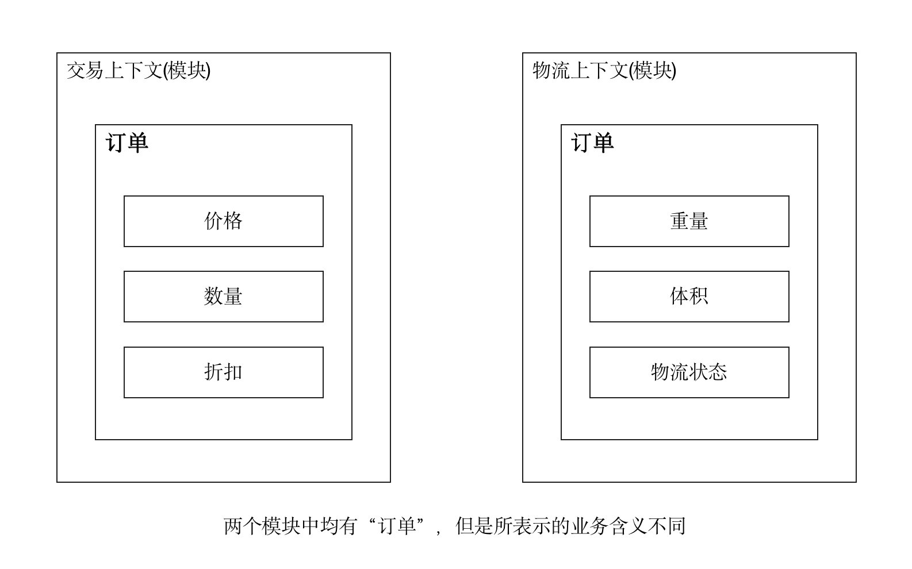
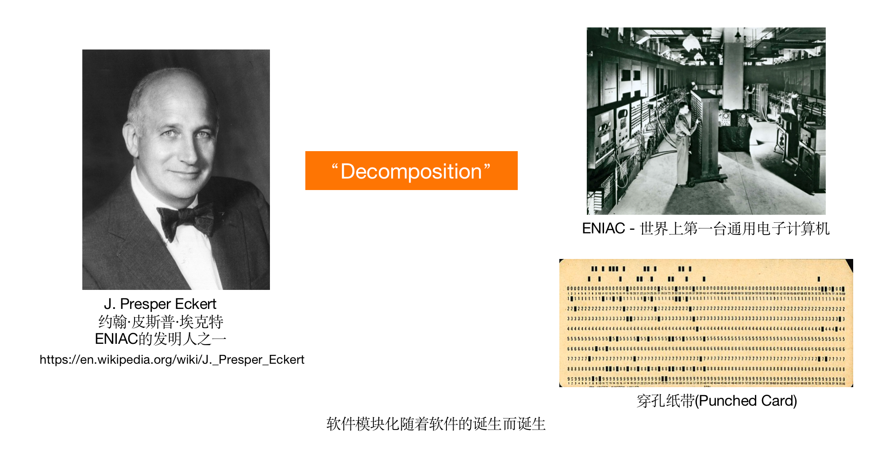
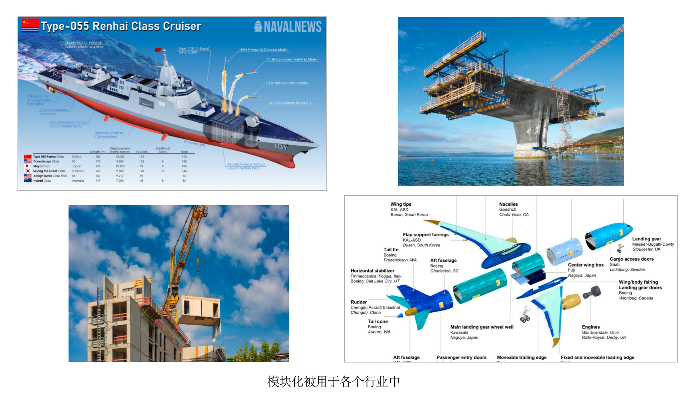
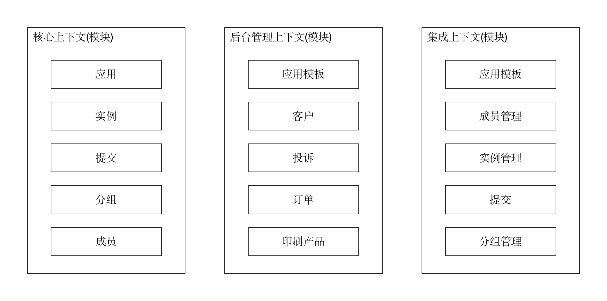

# DDD 战略设计

> 本文转载至：[产品代码都给你看了，可别再说不会DDD（三）：战略设计 | 码如云文档中心](https://docs.mryqr.com/ddd-strategic-design/)

在上一篇 [DDD概念大白话](./_4大白话讲解DDD中的概念.md) 中，我们提出了一个观点：**DDD的战略设计只在解决一个问题，即软件的模块化划分的问题**。在本文中，我们将对此做出详细的解释。

不过，首先让我们来看看DDD的战略设计原本包含哪些内容。战略设计中包含领域、子域、通用语言和限界上下文等概念。**领域**(Domain)表示一个行业中所发生的一切业务；**子域**(Subdomain)则表示领域中细分之后的子业务，是比领域更小的概念，子域又可细分为**核心子域**(Core Domain)、**支撑子域**(Supporting Domain)和**通用子域**(Generic Domain)；**通用语言**(Ubiquitous Language)表示在领域中所有人员都使用一套相同的语言进行沟通交流；**限界上下文**(Bounded Context)则表示由通用语言所形成的上下文边界。读到这里，你是不是感觉好像什么都说了，又感觉什么都没说？

事实上不难看出，无论是从领域到子域，还是从通用语言到限界上下文，其中都体现了一种“分”的思想，这种思想也正是整个计算机科学中的一种基本思想——[分治法(devide and conquer)](https://en.wikipedia.org/wiki/Divide-and-conquer_algorithm)。作为顶层设计的DDD战略设计来讲，这种“分”的思想的落地不正是我们在软件架构图中所看到的那些方块么？不正是软件的模块化划分么？

有了以上认识，再让我们来重新审视一下战略设计中的各种概念。软件中有些模块是业务的核心，对应着DDD中的“核心域”的概念，比如电商系统中的订单模块；有些模块对核心模块起支撑作用，对应DDD中“支撑域”，比如电商系统中的积分模块；而有些模块是通用性质的，对应着DDD中的“通用域”，比如登录管理模块。限界上下文可以看做是子域落地后的概念，因此通常与子域存在一一对应的关系，也即一个限界上下文表示一个模块。限界上下文可以这么理解：**在DDD中，允许在不同的模块中存在相同名称的对象，但是它们在各自的上下文中所表示的含义是不同的，这也是“限界”一词的由来**。举个例子，在电商系统中，存在交易模块和物流模块，它们都包含“订单(Order)”对象，但是交易模块中的订单和物流模块中的订单所承载的业务含义是不一样的，在交易模块中我们更专注订单的价格、数量和折扣等，而在物流模块中我们则更关注订单的重量、体积和物流状态等。

说DDD的战略设计只是模块化划分并不是要贬低战略设计的意思，事实上恰恰相反，战略设计很重要。DDD的开山鼻祖Eric Evans曾经说，如果让他重新撰写《领域驱动设计》那本书，他会将原书中的很大部分全部撕掉，然后用于撰写与限界上下文相关的内容，从此也可见战略设计的重要性。但是，我们希望做的是让读者认清其中的本质，毕竟DDD本身是一种实践性很强的学问，我们对DDD的认识不应该停留在对概念的咬文爵字上，而是真正能够产出高质量的软件。

事实上，软件的模块化划分是一个非常古老的概念，它伴随着软件的诞生而诞生，其萌芽至少可以追溯到世界上第一台通用电子计算机[ENIAC](https://baike.baidu.com/item/ENIAC)的发明者之一[约翰·皮斯普·埃克特](https://baike.baidu.com/item/约翰·埃克特)(J. Presper Eckert)在一篇研究[穿孔纸带](https://baike.baidu.com/item/穿孔纸带)的论文中所提到的“Decomposition(分解)”。

后来，软件的模块化经[道格拉斯·麦克罗伊](https://baike.baidu.com/item/道格拉斯·麦克罗伊)(Douglas McIlroy)和[布莱德·考克斯](https://baike.baidu.com/item/布莱德·考克斯)(Brad Cox，Objective-C发明人)等人得到了进一步发展。如果我们再将眼光放开阔一些，你会发现模块化的思想存在于各个行业中，比如船舶、桥梁、建筑以及航空等领域。

因此，模块化对于接受了现代工业文明洗礼的我们来说，并不是一个陌生的词汇。然而，难点并不在于如何定义模块，而在于如何划分模块。在DDD中，这是一个见仁见智众说纷纭的话题，为此，让我们从一个小故事展开。

一个2岁的幼儿，从来没有看到人的头像简易画（下图中左边的图片），但是当你问他那是什么的时候，他可能会说“人人”。这是为什么？

幼儿能够辨认出他从来没有看到过的东西，是因为他拥有两种能力：**经验**和**抽象**。他虽然没有看到过人头像简易画，但是他之前一定看到过真实的人，此所谓经验，也即我们过去所经历的事情；而他能够将人像简易画和真实的人对等起来，则是因为人类与身俱来的抽象能力。此二者，恰恰是我们划分软件模块所需要的东西，并且人人皆有。因此，你并不需要一套专门的学问来指导你完成DDD的战略设计，你需要的依然是那些在日常工作生活中我们始终在使用着的技能。

但是，经验有多有少，抽象有深有浅，导致不同的人所划分出来的模块形态也不一样。**为了做好DDD战略设计，你需要有充足的经验以及对业务的深入了解**。那么，经验到底到底多少算多呢？5年工作经验够不够？10年又够不够？这种按照年限来区分经验多寡的方式是不合适的，一个10年工作经验的架构师，他可能在这10年内一直在重复性地做着一件事情，而一个3年工作经验的程序员，却可能已经经历过很多项目、技术以及行业。因此，经验是根据你在自己所处的行业中所耕耘的深度和广度来计算的，而非时间。

你可能会认为经验这个东西太不可名状了，无法提炼出一套有据可循理论框架出来，的确没有。然而，这正是**软件被称之为艺术的原因，它让每个人都有属于其自己的发挥空间**，况且还有大哲学家和大科学家为你背书，你还那么不自信到要去追求一个咨询师没把你教会而你自己也没学会的所谓的理论框架吗？坦诚点，自信点，自豪地告诉别人：“我通过自己对业务的深入了解，外加自己的从业经验和抽象能力，搞定了DDD的战略设计！”

让我们来看个例子吧，搜索功能是多数应用网站都有的功能，在一些应用中，搜索可以简单到只是做个正则匹配的小功能点，此时的搜索固然称不上一个模块，而在另一些应用中，比如大型电商网站，搜索包含了多条件多方式查询等众多内容，其后台的软件架构和技术栈甚至都是专门设计的，此时的搜索功能你哪怕找一个毕业生来设计估计结果都是一个独立模块。这里，从功能点到功能模块的变化过程中，没有什么量化工具和理论框架可言，说得直白点，这就是架构师的一个主观认知而已。但是，这个认知却是重要的，因为它体现了架构师对于一个问题的抽象能力，以及对于软件边界的识别能力。什么是架构呢，[一种解释](https://martinfowler.com/architecture/)是**软件架构是项目中的资深程序员们对某个问题所达成的统一认识而已**。

理论框架虽然没有，但是指导性的原则还是有的，以下原则是程序员们耳熟能详的编程原则，将其用在模块化划分上依然成立：

- 高内聚，低耦合原则
- 关注点分离原则
- 单一职责原则

说到DDD，我们可能不得不说一下微服务，因为一般的理解是DDD因为微服务的兴起而重新被业界重视。事实上，DDD和微服务的关系被牵强式地放大了，DDD之于微服务，无外乎“**DDD的限界上下文可以用于指导微服务的划分**”，然而，在我们把限界上下文理解为模块后，这种说法也就不值得再成为一个单独的命题了。DDD的意义在于“DDD之于软件”，而不是“DDD之于微服务”。

在[码如云](https://www.mryqr.com/)，我们采用了单体架构而非微服务，但这并不影响我们划分限界上下文(模块)，我们通过Java分包的方式来划分模块。

码如云的模块关系并不复杂，仅包含3个顶层模块，一个是核心上下文(模块)，其中包含各种核心的业务实体，比如应用和实例等，每个业务实体均被建模为一个[聚合根](https://docs.mryqr.com/ddd-aggregate-root-and-repository)；第二个是后台管理上下文(模块)，用于码如云的后台运营，包含客户关系、投诉管理和订单管理等；第三个是集成上下文(模块)，用于处理与第三方的API集成。在前文中我们提到，登录功能可以被看做是通用子域而建模为一个独立的模块，但是在码如云中我们并未这么划分，而是将登录功能消化在了核心上下文中，因为其粒度尚未大到需要独立为一个模块的程度。

## 总结

很多简单的东西被人为的复杂化了，当资深人士们还在高谈阔论微服务和SOA的区别时，Robert C. Martin（Bob大叔）站出来说，这俩就是一个东西。当下的DDD同样也在遭受着“被复杂化”的境遇，软件（至少企业级应用软件）向来的实践性是非常强的，结果从业者们自己把自己搞不会了，实则不应该呀！在本文中，我们说DDD的战略设计只是在解决软件的模块化划分的问题，并不是要贬低战略设计，而是希望读者看到战略设计的本质，进而从DDD中得到实实在在的好处，也推动这个行业可以健康地，不要那么浮夸式地发展。