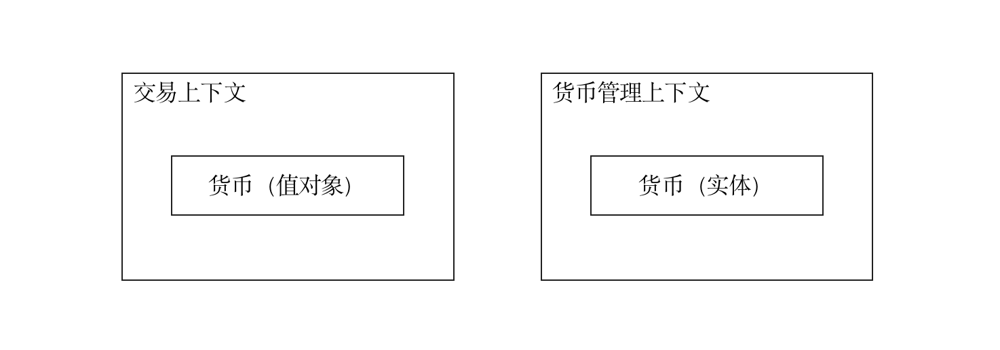

# 实体与值对象

在本系列的上一篇[聚合根与资源库](./_6聚合根和资源库.md)中，我们讲到了聚合根的设计与实现，事实上聚合根本身即是一种**实体**(Entity)，在本文中我们将对实体以及与之相对立的**值对象**(Value Object)做展开讲解。

在对聚合根的深入分析中，我们发现其中存在两种类型的对象，一种是具有生命周期的对象（比如**成员**(Member)），另一种是只起描述作用的对象（比如**地址**(Address)），前者称为**实体**，后者称为**值对象**，充分认识这两种对象之间的区别，对DDD落地有着举足轻重的作用。我们希望达到的目的是，将尽量多的概念建模为值对象，因为值对象比实体更加简单。


实体的生命周期意味着实体具有从产生到消亡的整个过程，这个过程往往比较漫长。比如，在[码如云](https://www.mryqr.com/)中，**成员**(Member)对象的生命周期可能超过几年甚至几十年的时间。相比之下，值对象不存在生命周期可言。为了讲解更加直观，让我们来分别看看值对象和实体的例子。在码如云中，**地址**(Address)即是一个值对象：

```java
//Address

@Value
@Builder
@AllArgsConstructor(access = PRIVATE)
public class Address {
    private final String province; //省份
    private final String city; //城市
    private final String district; //区县
    private final String address; //详细地址

    //......此处省略更多代码

}   
```

聚合根**成员**(Member)则是一个实体对象：

```java
//Member

@Getter
@Document(MEMBER_COLLECTION)
@TypeAlias(MEMBER_COLLECTION)
@NoArgsConstructor(access = PRIVATE)
public class Member extends AggregateRoot {
    private String name;//名字
    private Role role;//角色
    private String mobile;//手机号
    private String email;//邮箱
    private IdentityCard identityCard;//身份证
    
    //...此处省略更多代码

}
```

咋一看，实体和值对象似乎没有什么区别，都是Java对象而已，但事实上，实体和值对象在唯一标识、相等性和可变性等方面均存在很大的区别。

## 一. 唯一标识

值对象的“描述性作用”也意味着它无需唯一标识（即ID）即可完成其使命，而实体则恰恰相反。在本例中，值对象`Address`没有ID，而实体`Member`的唯一标识则存在于其父类`AggregateRoot`的`id`字段中：

```java
//AggregateRoot

@Getter
public abstract class AggregateRoot implements Identified {
    private String id;//聚合根ID
    private String tenantId;//租户ID

    //...此处省略更多代码

}
```

在DDD中，所有的聚合根都是实体对象，但并不是所有的实体都是聚合根，不过从实践上来看了，绝大多数的实体对象都是聚合根。因此，在DDD项目中最常见的情况是：作为实体对象的聚合根包含了大量的值对象。

对于聚合根而言，由于已经是领域模型中的顶层对象，其唯一标识应该是全局唯一的；而对于聚合根下的其他实体而言，由于其作用范围被限制在了聚合根内部，因此对应的唯一标识在聚合根下唯一即可。比如，在码如云中，一个**应用**(App)包含了多个**页面**(Page)，`App`是聚合根，`Page`是`App`下的实体，`App`的ID必须全局唯一，而`Page`的ID在其所属的`App`下唯一即可。

实体的唯一标识可以有多种方式生成，有些业务数据天然即是唯一标识，比如对于人员来说，身份证号即可直接用于唯一标识。不过需要注意的是，只有那些不变的业务字段才能用于唯一标识，否则，当这些业务字段发生更新时，所有引用它的地方都需要做相应更新。更多的时候，我们建议采用一个无业务含义的ID作为唯一标识，比如UUID或者通过[雪花算法](https://segmentfault.com/a/1190000020899379)生成的ID等，又由于UUID的无序性在大数据量场景下可能存在性能问题，因此我们更偏向于雪花算法ID。

有些技术框架可以设置延后对实体ID的生成，比如Hibernate和数据库自增ID等，在DDD中，我们强烈建议不要采用这些方式，因为这些方式所创建出来的实体对象直到保存到数据库的最后一刻都是非法的，更好的方式是在新建实体时即为之设置ID。

在码如云中，我们通过雪花算法为聚合根生成ID，并且在构造函数中完成了对ID的赋值，以达到在新建时即为ID赋值的目的。比如，在`Member`对象的其中一个构造函数中，我们调用了`newMemberId()`为新成员生成ID：

```java
//Member

//创建Member
public Member(String name, String mobile, User user) {
    super(newMemberId(), user);
    this.name = name;
    this.mobile = mobile;
    
    //...此处省略更多代码
}

//通过雪花算法生成成员ID
public static String newMemberId() {
    return "MBR" + newSnowflakeId();
}
```

有时，为了一些纯技术上原因，我们需要为值对象设置ID。比如，如果采用通过ORM框架持久化**租户**(Tenant)，则需要将`Tenant`中的发票地址(`invoiceAddress`)保存到一张单独的数据库表中，由于数据库表之间需要有外键关联，因此需要将`Address`继承自一个[层超类](https://martinfowler.com/eaaCatalog/layerSupertype.html)`IdentifiedValueObject`，在`IdentifiedValueObject`中包含有用于数据库表外键关联的`id`字段。

此时的`Tenant`实现如下：

```java
//Tenant

@Getter
@Document(TENANT_COLLECTION)
@TypeAlias(TENANT_COLLECTION)
@NoArgsConstructor(access = PRIVATE)
public class Tenant extends AggregateRoot {
    private String name;//租户名称
    private InvoiceTitle invoiceTitle;//发票抬头
    private Address invoiceAddress;//发票地址

    //...此处省略更多代码

}
```

层超类`IdentifiedValueObject`实现如下：

```java
//IdentifiedValueObject

public abstract class IdentifiedValueObject {
    private String id;
}
```

此时的`Address`继承自`IdentifiedValueObject`：

```java
//Address

public class Address extends IdentifiedValueObject {
    private final String province;

    //...此处省略更多代码

}
```

需要强调的是，以上“为值对象设置ID”的做法仅仅是一种技术上的实践，不能将其与业务相混淆，为此我们引入了一个层超类`IdentifiedValueObject`将与技术相关的内容作为一个单独的关注点来处理，从而实现了技术与业务的隔离。不过，在码如云，由于我们采用了MongoDB，从而避开了ORM，因此不存在本例中的问题。

## 二. 相等性判断

**实体对象通过ID进行相等性判断，而值对象通过其自身携带的属性进行相等性判断**。举个例子，对于一对双胞胎而言，每人都是一个实体对象，由于二人的身份证号（唯一标识）是不同的，因此无论二人长得多么的相像，均不能认为是同一个人；相反，对于其中某一人来说，哪怕是整容到面目全非，也依然是同一个人，因为其ID始终没变。又比如，对于常见的值对象**货币**(Currency)而言，其价值通过其面值决定，因此一张刚从印钞厂出来的崭新百元大钞和一张沾满了细菌的百元纸币是可以等值互换的，因为它们所携带的面值是相同的。

在编码实践上，最显著的区别是值对象需要实现`equals()`和`hashCode()`方法，而实体则不需要。在码如云中，我们通过[Lombok](https://projectlombok.org/)为值对象自动生成`equals()`和`hashCode()`方法，比如对于存储身份证信息的`IdentityCard`，其实现为：

```java
//IdentityCard

@Value
@Builder
@AllArgsConstructor(access = PRIVATE)
public class IdentityCard {
    private String number;
    private String name;
}
```

其中的`@Value`注解隐式地为`IdentityCard`对象实现了`equals()`和`hashCode()`方法。

## 三. 可变性

实体和值对象的另一个区别是：实体对象是可变的(Mutable)，而值对象是不可变的(Immutable)。对于实体对象而言，我们可以通过调用其上的方法直接更改其状态；而对于值对象而言，如果需要改变其状态，我们只能创建一个新的值对象，然后在新对象中包含改变后的状态。

对实体对象的直接状态变更比较好理解，这里重点讲一讲对值对象的不可变性的编码处理。对于值对象`Address`，如果我们需要修改其下的详细地址，具体的实现如下：

```java
//Address

//修改详细地址
public Address changeTo(String detailAddress) {
    return Address.builder()
            .province(this.province)
            .city(this.city)
            .district(this.district)
            .address(detailAddress)
            .build();
}
```

这里，我们并未直接修改`Address`对象的`address`属性，而是新建了一个`Address`对象，然后将无需修改的字段（比如`provice`）原封不动地拷贝到新对象中，而将需要修改的字段（`address`）在新对象中设置为传入的最新值，最后返回这个新建的对象。

不可变性要求值对象必须满足以下约束：

- 不能有公有的setter方法，否则外界可以直接修改其内部的状态
- 不能有导致内部状态变化的共有方法

## 四. 值对象的好处

本文一开始就提到我们应该将尽量多的对象建模为值对象，因为它比实体更加的简单，事实上值对象有多种好处。

首先，因为值对象是不可变的，所以不可变对象所拥有的好处值对象都有，比如使得对程序的调试和推理更加的简单，线程安全等。

其次，值对象作为一个概念上的整体（Conceptual Whole），它将与之相关的业务逻辑包含在其内部，不仅体现了内聚性，也增加了业务表达力，而这正是DDD所提倡的，比如对于本文中的`Address`，你是希望直接操作4个原始字段（`province`，`city`，`district`和`address`）呢，还是操作一个`Address`对象呢？

另外，值对象由于也包含了业务逻辑，因此可以完成自我验证，这样无论何时我们拿到一个值对象时，都可以相信这是一个合法的对象，而不用在值对象之外再做验证。

例如，在码如云中，定位信息被存放在`Geopoint`值对象中：

```java
@Value
@Builder
@AllArgsConstructor(access = PRIVATE)
public class Geopoint {
    private static final float EARTH_RADIUS_METERS = 6371000;
    private final Float longitude;//经度
    private final Float latitude;//纬度

    public float distanceFrom(Geopoint that) {
        return distanceBetween(this.longitude, this.latitude, that.longitude, that.latitude);
    }

    private float distanceBetween(float lng1, float lat1, float lng2, float lat2) {
        double dLat = Math.toRadians(lat2 - lat1);
        double dLng = Math.toRadians(lng2 - lng1);
        double a = Math.sin(dLat / 2) * Math.sin(dLat / 2) +
                Math.cos(Math.toRadians(lat1)) * Math.cos(Math.toRadians(lat2)) *
                        Math.sin(dLng / 2) * Math.sin(dLng / 2);
        return (float) (EARTH_RADIUS_METERS * 2 * Math.atan2(Math.sqrt(a), Math.sqrt(1 - a)));
    }

    public boolean isPositioned() {
        return longitude != null && latitude != null;
    }
}
```

以看到，`Geopoint`将经度`longitude`和纬度`latitude`封装在一起，成为一个概念上的整体。外部调用方无需单独处理经度和纬度数据，而是直接通过这个整体性的`Geopoint`对象即可完成对定位信息的操作。此外，`distanceFrom()`和`distanceBetween`都是包含业务逻辑的方法，符合“行为饱满的领域对象”原则。再则，通过`isPositioned()`方法使得`Geopoint`可以自行完成业务验证。

## 五. 角色可变

实体和值对象的划分并不是固定不变的，而是根据其所处的限界上下文决定的。一个概念在一个上下文中是一个实体对象，但是在另外的上下文中则可能是一个值对象。比如，对于上文中的货币`Currency`，在日常的的交易活动中，货币很明显应该被建模为一个值对象，因为在对其抽象之后我们忽略了货币的颜色，编号，新旧程度等属性，而只关注其面值。但是，如果哪天央行要做一个系统来管理每一张货币（比如对每张货币进行位置跟踪），那么则需要根据货币的编号进行管理，此时的货币则变成了一个实体对象。



