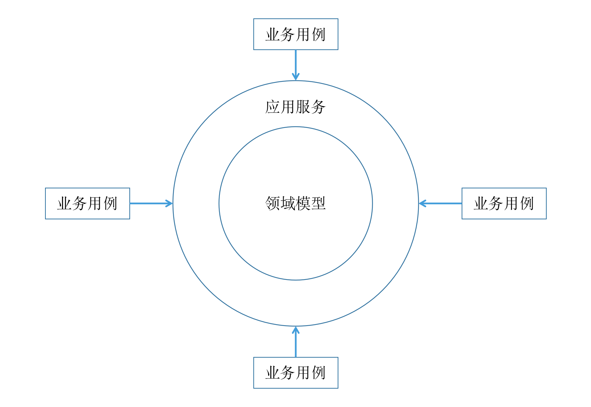

# 应用服务与领域服务

对于服务类（代码中的各种Service类），想必程序员们都不会陌生，比如在做Spring项目时，在Controller层的后面通常会有一个`XxxService`存在。如果对代码职责划分得好一点呢，那么该Service还会协调其他各方完成对请求的处理；而如果代码设计得不那么好呢，估计就是一个Service负责从头到尾的所有了。在DDD中，也有类似的服务类，即**应用服务**（Application Service）和**领域服务**（Domain Service），不过DDD对于这些服务类的职责做出了明确的界定，在本文中我们将对此做出详细地讲解。

## 一. 应用服务

在本系列的前几篇文章中我们讲到，在DDD中领域模型（主要包含聚合根，实体，值对象，工厂等）是软件系统的核心，所有的业务逻辑都发生在其中。在理想情况下，DDD只需要领域模型就够了（毕竟领域驱动嘛）。但是，软件运行于计算机这种基础设施之上，显然不止于领域模型这么简单，至少还应该包含以下方面：

1. 数据的网络传输
2. 应用协议的解析
3. 对业务用例的协调
4. 事务处理
5. 业务数据的持久化
6. 日志
7. 认证授权等非业务逻辑类关注点

以Spring MVC为例，在编写代码时我们直接面对的是Controller。在Controller背后，Spring框架和Servlet容器已经为我们处理好了数据的网络传输以及HTTP协议解析等底层设施，此时的Controller似乎已经是一个比较高级的编程对象了。咋一看，我们得到了这么一个场景：一边是Controller，一边是领域模型，何不直接使用Controller调用领域模型完成上述的第3点到7点呢？并非完全不可以，但是直接在Controller中调用领域模型的缺点也非常明显：

1. Controller属于Spring框架，依然是一个非常技术性的存在，而上述的第3到7点大多与具体的框架无关，因此更应该作为一个单独的关注点来处理，以达到与具体框架解耦的目的
2. 对用例的协调是可以复用的，比如以后需要通过桌面GUI（比如JavaFx）来实现的话，其协调逻辑和此时的Controller是相同的，总不至于再拷一份源代码过去吧

由此可以看出，在技术性的Controller和业务性的领域模型之间，还应该有一个值得被当做单独关注点的存在。而另一方面，从领域模型本身来说，它只是业务知识在软件中的表达，并不负责直接处理外界请求，而是需要有一个门面性的存在来协助它。综合起来，在DDD中我们将这个“存在”称之为**应用服务**。

先来看个关于应用服务的例子，在[码如云](https://www.mryqr.com/)中，租户的管理员可以对**成员**(Member)进行启用或禁用操作，以启用成员为例，此时的Controller代码如下：

```java
//MemberController

@PutMapping(value = "/{memberId}/activation")
public void activateMember(@PathVariable("memberId") @NotBlank @MemberId String memberId,
                           @AuthenticationPrincipal User user) {
    memberCommandService.activateMember(memberId, user);
}
```

对应的应用服务(MemberCommandService)代码如下：

```java
//MemberCommandService

@Transactional
public void activateMember(String memberId, User user) {
    user.checkIsTenantAdmin();
    Member member = memberRepository.byIdAndCheckTenantShip(memberId, user);
    member.activate(user);
    memberRepository.save(member);
    log.info("Activated member[{}].", memberId);
}
```

从上面两段代码中，我们可以总结出以下几点：

1. Controller的作用非常简单，就一行代码，即调用应用服务，这么做的目的是希望程序尽量早地从技术框架解耦；
2. 应用服务`MemberCommandService`遵循DDD中的[业务请求处理三部曲](https://docs.mryqr.com/ddd-request-process-flow)原则，即先加载`Member`，再调用`Member`上的业务方法`activate()`，最后调用资源库`memberRepository.save(member)`保存`Member`，整个过程中，应用服务主要起组织协调作用，并不负责实际的业务逻辑；
3. `MemberCommandService`方法上标注了`@Transactional`，也即应用服务负责处理事务边界；
4. 在完成协调工作之前，`MemberCommandService`通过调用`user.checkIsTenantAdmin()`来检查操作用户是否为租户管理员，也即应用服务也会负责协调对权限的处理；
5. 打日志，一个应用服务对应一个独立的业务用例，用例处理完后需要日志记录；
6. 从整个上看，应用服务与其所在的Spring框架是解耦的。

### 1.1 应用服务是领域模型的门面

在DDD中，领域模型并不直接接收外界的请求，而是通过应用服务向外提供业务功能。此时的应用服务就像酒店的前台一样，对外面对客户，对内则将客户的请求代理派发给内部的领域模型。应用服务将核心的领域模型和外界隔离开来，可以说应用服务是在“呵护”着领域模型。



既然应用服务只是起协调代理的作用，也意味着应用服务不应该包含过多的逻辑，而应该是很薄的一层。另外，应用服务是以业务用例为粒度接收外部请求的，也即应用服务类中的每一个共有方法即对应一个业务用例，进而意味着应用服务也负责处理事务边界，使得对一个业务用例的处理要么全部成功，要么全部失败。对应到实际编码过程中，`@Tranactional`注解并不是想怎么打就怎么打的，而是主要应该打到应用服务上。

### 1.2 应用服务应该与框架无关

应用服务要做到与技术框架无关，因为应用服务向外代表着业务用例，而业务用例不因框架的变化而变化，当我们把应用服务放到诸如Spring MVC这种Web框架中，它能正常工作，当我们将它迁移到桌面GUI程序中，它也应该可以正常工作。从这个角度，可以将应用服务比作电子元器件，比如CPU，一个CPU在华硕的主板上可以正常使用，将其转插到微星主板中也是可以的。

这里有个需要讨论的点是`@Transactional`，这个注解是属于Spring框架的，将其打在了到应用服务上，这不违背了“应用服务与框架无关”的原则吗？严格上来讲，的确如此，但是这个妥协我们认为是可以做的，原因如下：（1）`@Transational`注解是打在应用服务方法之上的，并不直接侵入应用服务的方法实现内部，因此这种侵入性并不会导致应用服务中逻辑的混乱，替换的成本也不高；（2）`@Transational`本是通过Spring的AOP实现，如果的确不想使用，可以在Controller中调用应用服务的地方使用Spring的`TranactionalTemplate`类完成，或者另行封装一个`TransactionWrapper`之类的东西供Controller调用，这样一来咱们的应用服务就的确和Spring框架没任何关系了，但是从务实的角度考虑，这种做法有些得不偿失。就上例而言，如果的确有一天你需要像电脑更换CPU那样将系统从Spring迁移到Guice框架，通过简单的适配便达到目的了。

## 二. 领域服务

**领域服务**虽然和**应用服务**都有“服务”二字，但是它们并没有多少联系，分别在不同的DDD岗位上各司其职，并且源自于两种完全不同的逻辑推演。

在本系列的前几篇文章中，我们知道了领域模型中最重要的概念是**聚合根**对象，理想情况下我们希望所有的业务逻辑都发生在聚合根之中，在实际编码中我们也是朝着这个目标行进的。但是，理想和现实始终是存在差距的，在有些情况下将业务逻辑放到聚合根中并不合适，于是我们做个妥协，将这部分业务逻辑放到另外的地方——**领域服务**。

还是来看个实际的例子，在码如云中，**成员**(Member)可以修改自己的手机号，在修改手机号时，需要判断新手机号是否已经被他人占用。这里的“检查手机号是否被占用”是一种跨聚合根的业务逻辑，单单凭当事的`Member`自身是否无法完成的，因为该`Member`无法感知到其他`Member`的状态。另外，“手机号不能重复”这种逻辑恰恰是一种业务逻辑，应该属于领域模型的一部分。

让我们将思考问题的方式反过来，通过自底向上的方式再看看，要实现跨聚合根的检查，无论如何是需要访问数据库的，这落入了**资源库**(Repository)的职责范畴，为此我们在`Member`对应的资源库`MemberRepository`中实`existsByMobile(mobileNumber)`方法用于检查一个手机号`mobileNumber`是否已经被占用。接下来的问题在于，对该方法的调用应该由谁完成？此时至少有3种方式：

1. **在应用服务中调用**：这种调用不再是简单的协调式调用，而是感知到了业务逻辑的调用，这违背了应用服务的基本原则，因此不应该使用这种方式；
2. **将`MemberRepository`作为参数传入`Member`中**，这的确是一种方式，但是这种方式使得聚合根`Member`接受了与业务数据无关的方法参数，是一种API污染，因此我们也不推荐；
3. **作为一个单独的关注点，另立门户**：将这部分逻辑放到一个单独的类中，这个类依然属于领域模型，此时的“另立门户”便是一个**领域服务**了。

在使用了**领域服务**后，整个请求的流程稍微有些变化。首先在应用服务`MemberCommandService`中， 我们不再遵循经典的[请求处理三部曲](https://docs.mryqr.com/ddd-request-process-flow)，而是通过调用领域服务`MemberDomainService`来更新`Member`的状态：

```java
@Transactional
public void changeMobile(ChangeMyMobileCommand command, User user) {
    Member member = memberRepository.byId(user.getMemberId());
    memberDomainService.changeMobile(member, command.getMobile(), command.getPassword());
    memberRepository.save(member);
    log.info("Mobile changed by member[{}].", member.getId());
}
```

这里，应用服务`MemberCommandService`在加载到对应的`Member`对象后，将该`Member`传递给了领域服务`MemberDomainService.changeMobile()`，并期待着这个领域服务会干正确的事情（即更新`Member`的手机号）。最后，应用服务再调用`memberRepository.save()`将更新后的`Member`对象保存到数据库中。在这个过程中，应用服务的“将请求代理给领域模型”这种结构并没有发生变化，并且也无需关心领域服务的内部细节。事实上，此时对请求的处理依然是三部曲，只是其中的第2步从“调用聚合根上的业务方法”变成了“调用领域服务上的业务方法”。

领域服务`MemberDomainService`的实现如下：

```java
//MemberDomainService

public void changeMobile(Member member, String newMobile) {
    if (Objects.equals(member.getMobile(), newMobile)) {
        return;
    }

    if (memberRepository.existsByMobile(newMobile)) {
        throw new MryException(MEMBER_WITH_MOBILE_ALREADY_EXISTS,
                "修改手机号失败，手机号对应成员已存在。",
                mapOf("mobile", newMobile, "memberId", member.getId()));
    }

    member.changeMobile(newMobile, member.toUser());
}
```

`MemberDomainService`先调用`memberRepository.existsByMobile()`判断手机号是否被占用，如被占用则抛出异常，反之才调用`Member.changeMobile()`完成实际的状态更新。

在码如云，我们发现多数情况下领域服务的存在都是为了解决类似于本例中的“检查某个值是否重复”这样的场景，比如检查成员邮箱是否被占用，检查分组名称是否重复等。事实上，这类问题被业界广泛讨论过，有兴趣的读者可以参考[这里](https://ardalis.com/design-no-duplicates-rule-in-domain-model/)和[这里](https://github.com/ardalis/DDD-NoDuplicates)。当然，领域服务远不止处理此类场景，比如有时生成ID是通过某些复杂的算法或者调用第三方完成，此时便可以将其封装在领域服务中。此外，DDD中的[工厂](https://docs.mryqr.com/ddd-aggregate-root-and-repository)可以被认为是一种特殊类型的领域服务。

可以看到，DDD中的应用服务和领域服务分别解决了两个完全不同的问题，他们主要的区别在于：

1. 应用服务处于领域模型的外侧，是领域模型的客户（调用方），其作用是协调各方完成业务用例；而领域服务则是属于领域模型的一部分；
2. 应用服务不处理业务逻辑，领域服务里全是业务逻辑；
3. 每一个业务用例都需要经过应用服务，而领域服务则是一种迫不得已而为之的妥协。

到这里，再去看看自己代码中的那些Service类，是不是可以尝试着对它们归个类了？

## 三. 总结

在本文中，我们分别对应用服务和领域服务做了展开讲解，包含它们各自产生的逻辑以及它们之间的区别。在实际编码中，通常的编码方式是：从Controller中调用应用服务，应用服务协调各方完成对业务用例的处理，业务逻辑优先放入聚合根中，如果不合适才考虑使用领域服务。在下一篇[领域事件](https://docs.mryqr.com/ddd-domain-events)中，我们将讲到领域事件在DDD中的应用。