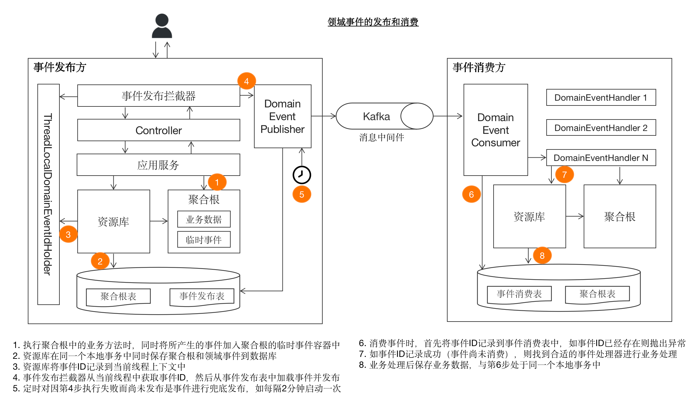

# 领域事件

> 本文转载至：https://docs.mryqr.com/ddd-domain-events

**领域事件**(Domain Event)中的“事件”即[事件驱动架构](https://www.baidu.com/s?wd=事件驱动架构)(Event Driven Architecture, EDA)中的“事件”之意。事件驱动架构被广泛地用于计算机的硬件和软件中，DDD也不例外。狭义地理解“事件”，你可能会认为不就是诸如Kafka或者RabbitMQ之类的消息队列(Message Queue)么？可不止那么简单，在本文中，我们将对DDD中领域事件的建模、产生、发送和消费做详细讲解。

为了方便读者直观概括性地了解领域事件的全景，我们先将从事件发布到消费整个过程中的关键节点展示在下图。在阅读过程中，读者可返回该图进行对应。



## 一. 领域事件建模

**领域事件**表示在领域模型中已经发生过的重要事件，主要用于软件中各个组件、模块、子系统甚至与第三方系统之间的数据同步和集成。所谓“重要”，指的是所发出的事件会引起进一步的动作，以此形成更大范围的业务闭环。举个例子，在电商系统中，“用户已下单”则是一个领域事件，它可能会进一步引起支付、物流、积分等一些列后续业务动作。

当然，对于“重要”的定义是相对的，需要视实际所处业务场景而定。例如，在[码如云](https://www.mryqr.com/)中，用户可以自行更改头像，整个业务闭环到此为止，因此我们并没有为此创建相应的领域事件；不过，对于其他一些系统来说，用户更新了头像后，可能需要将头像信息同步到另外的子系统，那么此时便可发出“用户头像已更新”事件，其他子系统通过订阅监听该事件完成头像数据的同步。

领域事件的命名一般采用“XX已XX”的形式，前一个“XX”通常表示一个名词，后一个“XX”则表示一个动词，比如“订单已支付”、“表单已提交”等。在实际建模时，通常先建立一个公共基类`DomainEvent`，其他实际的事件类均继承自该基类。

```java
//DomainEvent

public abstract class DomainEvent {
    private String id;//事件ID
    private DomainEventType type;//事件类型

    //状态，CREATED(刚创建)，PUBLISH_SUCCEED(已发布成功)， PUBLISH_FAILED(发布失败)
    private DomainEventStatus status;

    private Instant raisedAt;//事件产生时间

    protected DomainEvent(DomainEventType type,) {
        requireNonNull(type, "Domain event type must not be null.");
        this.id = newSnowflakeId();
        this.type = type;
        this.raisedAt = now();
    }
}
```

领域事件基类`DomainEvent`包含了事件标识`id`，事件类型`type`，事件状态`status`，以及事件产生的时间`raisedAt`，根据自身情况还可以添加更多的公共字段，比如事件产生时的操作人等。

具体的事件类继承自`DomainEvent`，以“成员已创建(`MemberCreatedEvent`)”事件为例：

```java
//MemberCreatedEvent

public class MemberCreatedEvent extends DomainEvent {
    private String memberId;

    public MemberCreatedEvent(String memberId) {
        super(MEMBER_CREATED);
        this.memberId = memberId;
    }
}
```

> 源码出处：[com/mryqr/core/member/domain/event/MemberCreatedEvent.java](https://github.com/bigcoder84/mry-backend/blob/main/src/main/java/com/mryqr/core/member/domain/event/MemberCreatedEvent.java)

领域事件中应该包含恰如其分的数据信息，且所包含的信息应该与其所产生时的上下文强相关。比如本例中，`MemberCreatedEvent`事件对应新成员已创建的业务场景，此时最重要的是记录下这个新成员的唯一标识`memberId`。又比如，对于“成员修改自己姓名”的业务场景，其所发出的“成员姓名已更新”事件`MemberNameChangedEvent`则应该同时包含修改前的姓名`oldName`和修改后的姓名`newName`：

```java
//MemberNameChangedEvent

public class MemberNameChangedEvent extends DomainEvent {
    private String memberId;
    private String newName;
    private String oldName;

    public MemberNameChangedEvent(String memberId, String newName, String oldName) {
        super(MEMBER_NAME_CHANGED);
        this.memberId = memberId;
        this.newName = newName;
        this.oldName = oldName;
    }
}
```

> 源码出处：[com/mryqr/core/member/domain/event/MemberNameChangedEvent.java](https://github.com/bigcoder84/mry-backend/blob/main/src/main/java/com/mryqr/core/member/domain/event/MemberNameChangedEvent.java)

这里有两个需要注意的问题，第一个是对于“成员已创建”事件`MemberCreatedEvent`来说，除了唯一的`memberId`字段之外，为什么不包含其他信息呢，比如创建成员时所输入的姓名、邮箱和电话号码等，这些信息不也是和场景强相关的吗？这个问题涉及到事件驱动架构的架构模式问题，通常来说有2种模式： （1）事件作为通知机制 （2）事件携带状态转移(Event Carried State Transfer)

对于第（1）种“事件作为通知机制”来说，领域事件主要起到一个通知作用，事件消费方在得到通知后需要反过来调用事件发布方提供的API以获取更多的业务数据，这种方式主要用于处理一些数据同步的场景，优点是可以保证任何时候事件的消费者都能获取到最新的数据，而不用担心事件的延迟消费或者乱序消费等问题，这种方式的缺点是增加了一次额外的API调用，并且在事件的发送方和消费方之间多了一层耦合。

对于第（2）种“事件携带状态转移”来说，事件消费方无需额外的API调用，而是从事件本身中即可获取到业务数据，降低了系统之间的耦合，通常用于比单纯的数据同步更复杂的业务场景，不过缺点则是可能导致消费方所获取到的数据不再是最新的，举个例子，对于“成员姓名已更新”事件（`MemberNameChangedEvent`）来说，假设成员的姓名先后更新的2次，首先将`newName`更新为“张三”，然后更新为“李四”，但是由于消息机制的不确定性等原因，可能更新为“李四”的事件先于“张三”事件而到达，最终导致的结果是消费方中成员的姓名依然为“张三”，而不是最新的“李四”，当然可以通过更多的手段来解决这个问题，比如消费方可以对事件产生的时间进行检查，如果发现事件产生的时间早于最近一次已处理事件的产生时间，则不再处理，不过这样一来引入了一些新的成本。

至于选择哪一种架构模式，并不是一个确定性的问题，开发团队需要根据自身系统的业务场景以及自身的团队情况做出决定。在[码如云](https://www.mryqr.com/)，我们选择了第（1）种，即将事件作为通知机制，因为码如云系统中的领域事件多数是用来处理纯粹的事件同步的。

另一个问题是，对于“成员姓名已更新”事件（`MemberNameChangedEvent`）来讲，一般来说消费方更关心变更后的姓名`newName`，谁会去关心那个老姓名`oldName`呢？这样一来是不是可以将`oldName`删除掉？答案是否定的，因为事件的发布者应该是一个“独善其身”式的存在，应该按照自身的业务场景行事，而不应该因为消费方不需要而省略掉与上下文强相关的信息。

## 二. 领域事件的产生

使用领域事件的一种直接做法是：在**应用服务**(Application Service)中产生事件并发布出去。例如，对于“成员更新姓名”的用例来讲，对应的应用服务`MemberCommandService`实现如下：

```java
@Transactional
public void updateMyName(UpdateMemberNameCommand command, User user) {
    Member member = memberRepository.byId(user.getMemberId());
    String oldName = member.getName();
    String newName = command.getName();
    
    member.updateName(newName, user);
    memberRepository.save(member);

    MemberNameChangedEvent event = new MemberNameChangedEvent(member.getId(), newName, oldName);
    eventPublisher.publish(event);

    log.info("Member name updated by member[{}].", member.getId());
}
```

> 源码出处：[com/mryqr/core/member/command/MemberCommandService.java](https://github.com/bigcoder84/mry-backend/blob/main/src/main/java/com/mryqr/core/member/command/MemberCommandService.java)

这里，在更新了成员的姓名之后，即刻调用事件发布器 `eventPublisher.publish()` 将事件发送到消息队列（Redis Stream）中。虽然这种方式比较流行，但它至少存在2个问题：

1. 领域事件本应属于领域模型的一部分，也即应该从领域模型中产生，而这里却在应用服务中产生
2. 对聚合根（本例中的`Member`）的持久化和对事件的发布可能导致数据不一致问题

对于第1个问题，我们可以采用“从领域模型中返回领域事件”的方式：

```java
@Transactional
public void updateMyName(UpdateMemberNameCommand command, User user) {
    Member member = memberRepository.byId(user.getMemberId());
    String oldName = member.getName();
    String newName = command.getName();

    MemberNameChangedEvent event = member.updateName(newName, user);
    memberRepository.save(member);
    eventPublisher.publish(event);

    log.info("Member name updated by member[{}].", member.getId());
}
```

> 源码出处：[com/mryqr/core/member/command/MemberCommandService.java](https://github.com/bigcoder84/mry-backend/blob/main/src/main/java/com/mryqr/core/member/command/MemberCommandService.java)

在本例中，`Member.updateName()`方法不再返回`void`，而是返回领域事件`MemberNameChangedEvent`，然后由`eventPublisher.publish(event)`发布。更多关于此种方式的讨论，请参考[这篇文章](https://blog.jayway.com/2013/06/20/dont-publish-domain-events-return-them/)。

这种方式保证了领域事件是从领域模型中产生，也即解决了第1个问题，但是依然存在第2个问题，接下来我们详细解释一下第2个问题。第2个问题中所谓的“数据一致性”，表示的是将聚合根保存到数据库和将领域事件发布到消息队列之间的一致性。由于数据库和消息队列属于异构的数据源，要保证他们之间的数据一致性需要引入分布式事务，比如JTA（Java Transaction API）。但是分布式事务通常是比较重量级的，再加上当下的诸多常见消息队列均不支持分布式事务（比如Kafka），因此我们并不建议使用分布式事务来解决这个问题。不过不要担心，有人专门研究过这个问题的解决方案，并形成了一种设计模式——[Transactional Outbox](https://microservices.io/patterns/data/transactional-outbox.html)。概括来说，这种方式将一个分布式事务的问题拆解为多个本地事务，并采用“至少一次投递（At Least Once Delivery）”原则保证消息的发布。具体来讲，发布方在与业务数据相同的数据库中为领域事件创建相应的事件发布表（Outbox table），然后在保存业务数据的同时将所产生的事件保存到事件发布表中，由于此时二者都属于同一个数据库的本地事务所管辖，因此保证了“业务操作”与“事件产生”之间的一致性。此时的代码变成了：

```java
@Transactional
public void updateMyName(UpdateMemberNameCommand command, User user) {
    Member member = memberRepository.byId(user.getMemberId());
    String oldName = member.getName();
    String newName = command.getName();

    MemberNameChangedEvent event = member.updateName(newName, user);
    memberRepository.save(member);
    eventStore.save(event);

    log.info("Member name updated by member[{}].", member.getId());
}
```

> 源码出处：[com/mryqr/core/member/command/MemberCommandService.java](https://github.com/bigcoder84/mry-backend/blob/main/src/main/java/com/mryqr/core/member/command/MemberCommandService.java)

此例和上例唯一的区别在于：先前的`eventPublisher.publish(event)`被替换成了`eventStore.save(event)`，也即应用服务不再将事件直接发布出去，而是将事件保存到数据库中，之后另一个模块将从数据库中读取事件并发布（对此我们将在下文进行讲解）。

然而，这种方式依然有个缺点：每个需要产生领域事件的场景都需要应用服务先后调用`repository.save()`和`eventStore.save()`，导致了代码重复。有没有一种“一劳永逸”的方法呢？答案是有的，为此请允许我们隆重地介绍处理领域事件的一枚“银弹”——在聚合根中临时保存领域事件，然后在资源库中同时保存聚合根和领域事件到数据库。开玩笑的啦，“银弹”这个梗，我们怎么可能不给自己留点后路呢？虽然不是“银弹”，但是这种方式的确有其好处，在[码如云](https://www.mryqr.com/)，我们采用了这种方式，算得上是屡试不爽了。在这种方式下，首先需要在聚合根的基类中完成与领域事件相关的各种设施，包括创建临时性的事件容器`events`以及通用的事件产生方法`raiseEvent()`：

```java
//AggregateRoot

@Getter
public abstract class AggregateRoot implements Identified {
    private String id;
    private String tenantId;

    private List<DomainEvent> events;//领域事件列表，用于临时存放完成某个业务流程中所发出的事件，会被BaseRepository保存到事件表中

    //此处省略其他代码

    protected void raiseEvent(DomainEvent event) {//将领域事件添加到临时性的events容器中
        allEvents().add(event);
    }

    public void clearEvents() {//清空所有的事件，在聚合根落库之前需要完成此操作
        this.events = null;
    }

    private List<DomainEvent> allEvents() {
        if (events == null) {
            this.events = new ArrayList<>();
        }

        return events;
    }
}
```

> 源码出处：[com/mryqr/core/common/domain/AggregateRoot.java](https://github.com/bigcoder84/mry-backend/blob/main/src/main/java/com/mryqr/core/common/domain/AggregateRoot.java)

在聚合根基类`AggregateRoot`中，`events`字段用于临时保存聚合根中所产生的所有事件，各实际的聚合根类通过调用`raiseEvent()`向`events`中添加事件。比如，对于“成员修改姓名”用例而言，`Member`实现如下：

```java
//Member

public void updateName(String name, User user) {
    if (Objects.equals(this.name, name)) {
        return;
    }

    String oldName = this.name;
    this.name = name;
    raiseEvent(new MemberNameChangedEvent(this.getId(), name, oldName));
}
```

> 源码出处：[com/mryqr/core/member/domain/Member.java](https://github.com/bigcoder84/mry-backend/blob/main/src/main/java/com/mryqr/core/member/domain/Member.java)

这里，聚合根`Member`不再返回领域事件，而是将领域事件通过`AggregateRoot.raiseEvent()`暂时性地保存到自身的`events`中。之后在保存`Member`时，资源库的公共基类`BaseRepository`的`save()`方法同时完成对聚合根和领域事件的持久化：

```java
//MongoBaseRepository

public void save(AR it) {
    requireNonNull(it, "AR must not be null.");

    if (!isEmpty(it.getEvents())) {
        saveEvents(it.getEvents());
        it.clearEvents();
    }

    mongoTemplate.save(it);
}
```

这里了的`AR`是表示所有聚合根类的泛型，在`save()`方法中，首先获取到聚合根中的所有领域事件，然后通过`saveEvents()`方法将它们保存到发布事件表中，最后通过`mongoTemplate.save(it)`保存聚合根。需要注意的是，在这种方式下，`AggregateRoot`中的`events`字段是不能被持久化的，因为我们需要保证每次从数据库中加载出聚合根时`events`都是空的，为此我们在`saveEvents()`保存了领域事件后，立即调用`it.clearEvents()`将所有的领域事件清空掉，以免领域事件随着聚合根一道被持久化到数据库中。

到目前为止，我们对领域事件的处理都还没有涉及到与任何消息中间件相关的内容，也即事件的产生是一个完全独立于消息队列的关注点，此时我们不用关心领域事件之后将以何种形式发布出去，Kafka也好，RabbitMQ也罢。除了关注点分离的好处外，这种解耦也使得系统在有可能切换消息中间件时更加的简单。

## 三. 领域事件的发布

对于上文中的“在应用服务中通过`eventPublisher.publish()`直接发布事件”而言，对事件的产生和发布是同时完成的；但是对于“在聚合根中临时性保存领域事件”的方式来说，它只解决了事件的产生问题，并未解决事件的发布问题，在本小节中，我们将详细讲解在这种方式下如何发布领域事件。

事件的发布方应该采用“发射后不管(Fire And Forget)”的原则，即发布方无需了解消费方是如何处理领域事件的，甚至都不需要知道事件被哪些消费方所消费。

在将业务数据和领域事件同时保存到数据库之后，接下来的事情便是如何将领域事件发布出去了。在发布事件时，应该从数据库的事件发布表中加载领域事件，然后通过消息中间件的API将事件发送出去，这里需要解决以下2个问题：

1. 什么时候启动对领域事件的发布？
2. 如何处理发布失败的情况？

对于第1个问题，需要数据库事务执行完毕之后，也即保证领域事件落盘之后，才可进行对事件的发布，显然从应用服务中发布并不满足此条件（因为@Transactional注解是打在应用服务上的，应用服务的方法在执行过程中事务尚未结束），除此之外便只有Controller了，但是如果在Controller中发布领域事件又会导致需要在每个Controller中都重复调用事件发布逻辑的代码。有没有其他办法呢？有，一是可以通过AOP的方式在每个Controller方法执行完毕之后启动对事件的发布，另一种是通过Spring框架提供的`HandlerInterceptor`对每个HTTP请求进行拦截并启动对事件的发布，在码如云中，我们采用了`HandlerInterceptor`的方式：

```java
public class DomainEventHandlingInterceptor implements HandlerInterceptor {
    private final DomainEventPublisher eventPublisher;

    @Override
    public void postHandle(HttpServletRequest request,
                           HttpServletResponse response,
                           Object handler,
                           ModelAndView modelAndView) {

        //从数据库中加载所有尚未发布的事件(status=CREATED或PUBLISH_FAILED)并发布
        eventPublisher.publishEvents();
    }
}
```

这里，`DomainEventHandlingInterceptor`的`postHandel()`方法将在每个HTTP请求完成之后运行，`eventPublisher.publishEvents()`并不接受任何参数，其实现逻辑是从数据库中加载出所有尚未发送的事件并发布（可以通过`DomainEvent`的`status`来判断事件是否已经发送）。

这种方式依然不完美，因为即便一个请求中没有任何事件产生，也将导致一次对数据库的查询操作，如果有种方式可以记住请求中所产生的事件ID，然后再针对性的发送相应的事件就好了，答案是有的：使用Java的[ThreadLocal](https://www.liaoxuefeng.com/wiki/1252599548343744/1306581251653666)（粗略可以理解为线程级别的全局变量）记录下一次请求中所产生的事件ID。为此，需要在`BaseRepository`对事件落库的时候将所有的事件ID记录到ThreadLocal中：

```java
//MongoBaseRepository

private void saveEvents(List<DomainEvent> events) {
    if (!isEmpty(events)) {
        domainEventDao.insert(events);//保存事件到数据库
        ThreadLocalDomainEventIdHolder.addEvents(events);//记录事件ID以备后用
    }
}
```

这里的`ThreadLocalDomainEventIdHolder.addEvents()`将使用ThreadLocal将本次请求中的所有事件ID记录下来以备后用。`ThreadLocalDomainEventIdHolder`实现如下：

```java
//ThreadLocalDomainEventIdHolder

public class ThreadLocalDomainEventIdHolder {
    private static final ThreadLocal<LinkedList<String>> THREAD_LOCAL_EVENT_IDS = withInitial(LinkedList::new);

    public static void clear() {
        eventIds().clear();
    }

    public static void remove() {
        THREAD_LOCAL_EVENT_IDS.remove();
    }

    public static List<String> allEventIds() {
        List<String> eventIds = eventIds();
        return isNotEmpty(eventIds) ? List.copyOf(eventIds) : List.of();
    }
    
    public static void addEvents(List<DomainEvent> events) {//添加事件ID
        events.forEach(ThreadLocalDomainEventIdHolder::addEvent);
    }

    public static void addEvent(DomainEvent event) {//添加事件ID
        LinkedList<String> eventIds = eventIds();
        eventIds.add(event.getId());
    }

    private static LinkedList<String> eventIds() {
        return THREAD_LOCAL_EVENT_IDS.get();
    }
}
```

现在，线程中有了已产生事件的ID，接下来便可在`DomainEventHandlingInterceptor`获取这些事件ID并发布对应事件了：

```java
//DomainEventHandlingInterceptor

public class DomainEventHandlingInterceptor implements HandlerInterceptor {
    private final DomainEventPublisher eventPublisher;

    @Override
    public void postHandle(HttpServletRequest request, 
                           HttpServletResponse response,
                           Object handler, 
                           ModelAndView modelAndView) {
        
        List<String> eventIds = ThreadLocalDomainEventIdHolder.allEventIds();
        try {
            eventPublisher.publish(eventIds);
        } finally {
            ThreadLocalDomainEventIdHolder.remove();
        }
    }
}
```

在发送事件时，可以采用同步的方式，也可以采用异步的方式，同步方式即事件的发送与业务请求的处理在同一个线程中完成，这种方式可能导致系统响应时间延长，在高并发场景下可能影响系统吞吐量，因此一般建议采用异步方式，即通过一个单独的线程池完成对事件的发布。异步发送的代码如下：

```java
public class AsynchronousDomainEventPublisher implements DomainEventPublisher {
    private final TaskExecutor taskExecutor;
    private final DomainEventJobs domainEventJobs;

    @Override
    public void publish(List<String> eventIds) {
        if (isNotEmpty(eventIds)) {
            taskExecutor.execute(domainEventJobs::publishDomainEvents);
        }
    }
}
```

可以看到，`AsynchronousDomainEventPublisher`通过`TaskExecutor`完成了事件发布的异步化。不过需要注意的是，这种使用ThreadLocal来记录事件ID的方式只适合于基于线程的Web容器，比如Servlet容器，而对于Webflux则不支持了。

在通过`DomainEventJobs.publishDomainEvents()`发送领域事件时，先通过`DomainEventDao.tobePublishedEvents()`获取到尚未发布的领域事件，然后根据时间产生顺序进行发送。另外，由于多个线程可能同时执行事件发送逻辑，导致事件的发生顺序无法得到保证，因此我们使用了分布式锁`LockingTaskExecutor`来保证某个时刻只有事件发送任务可以工作。

```java
// DomainEventJobs

    public int publishDomainEvents() {
        try {
            //通过分布式锁保证只有一个publisher工作，以此保证消息发送的顺序
            TaskResult<Integer> result = lockingTaskExecutor.executeWithLock(this::doPublishDomainEvents,
                    new LockConfiguration(now(), "publish-domain-events", ofMinutes(1), ofMillis(1)));
            Integer publishedCount = result.getResult();
            return publishedCount != null ? publishedCount : 0;
        } catch (Throwable e) {
            log.error("Error while publish domain events.", e);
            return 0;
        }
    }

    private int doPublishDomainEvents() {
        int count = 0;
        int max = 10000;//每次运行最多发送的条数
        String startEventId = "EVT00000000000000001";//从最早的ID开始算起

        while (true) {
            List<DomainEvent> domainEvents = domainEventDao.tobePublishedEvents(startEventId, 100);
            if (isEmpty(domainEvents)) {
                break;
            }

            for (DomainEvent event : domainEvents) {
                redisDomainEventSender.send(event);
            }

            count = domainEvents.size() + count;
            if (count >= max) {
                break;
            }
            startEventId = domainEvents.get(domainEvents.size() - 1).getId();//下一次直接从最后一条开始查询
        }

        return count;
    }
```

事件发布有可能不成功，比如消息队列连接不上等原因，此时我们则需要建立事件兜底机制，即在每次请求正常发布事件之外，还需要定时（比如每2分钟）扫描数据库中尚未成功发布的事件并发布。

```java
    @Scheduled(cron = "0 */2 * * * ?")
    public void houseKeepPublishDomainEvent() {
        int count = domainEventJobs.publishDomainEvents();
        if (count > 0) {
            log.info("House keep published {} domain events.", count);
        }
    }
```

这也意味着我们需要记录每一个事件的发布状态`status`。在事件发布到消息中间件之后，更新事件的状态：

```java
public class RedisDomainEventSender {
    private final MryObjectMapper mryObjectMapper;
    private final MryRedisProperties mryRedisProperties;
    private final StringRedisTemplate stringRedisTemplate;
    private final DomainEventDao domainEventDao;

    public void send(DomainEvent event) {
        try {
            String eventString = mryObjectMapper.writeValueAsString(event);
            ObjectRecord<String, String> record = StreamRecords.newRecord()
                    .ofObject(eventString)
                    .withStreamKey(mryRedisProperties.getDomainEventStream());
            stringRedisTemplate.opsForStream().add(record);
            domainEventDao.successPublish(event);
        } catch (Throwable t) {
            log.error("Error happened while publish domain event[{}:{}] to redis.", event.getType(), event.getId(), t);
            domainEventDao.failPublish(event);
        }
    }
}
```

这里，当事件发布成功后调用`domainEventDao.successPublish(event)`将事件状态设置为“发布成功”（`status=PUBLISH_SUCCEED`），反之将事件状态设置为“发布失败”（`status=PUBLISH_FAILED`）。事实上，将`status`放在`DomainEvent`上并不是一种好的实践，因为这里的`status`主要用于发布方，对消费方来说则无端地多了一个无用字段，更好的方式是在发布方另行创建一张数据库表来记录每个事件的发布状态。不过，在码如云，由于我们采用了单体架构，事件的发布方和消费方均在同一个进程空间中，为了方便实用起见，我们做出了妥协，即依然将`status`字段保留在`DomainEvent`中。

有趣的是，这里的`RedisDomainEventSender`让我们再次陷入了分布式事务的困境，因为发送事件需要操作消息中间件，而更新事件状态需要操作数据库。在不使用分布式事务的情况下（我们也不想使用），此时的代码对于“事件发布成功 + 数据库落库成功”来讲是皆大欢喜的，但是依然无法排除有很小的概率导致事件发送成功了但是状态却为得到更新的情况。要解决这个问题，我们做了一个妥协，即事件发布方无法保证事件的“[精确一次性投递(Exactly Once)](https://www.cloudcomputingpatterns.org/exactly_once_delivery/)”，而是保证“[至少一次投递（At Least Once）](https://www.cloudcomputingpatterns.org/at_least_once_delivery/)”。假设在事件发布成功之后，由于种种原因导致事件的状态未得到更新，即依然为`CREATED`状态，那么稍后，当事件兜底机制启动时，它将加载系统中尚未发布的事件进行发布，其中就包含状态为`CREATED`的事件，进而导致事件的重复投递。

“至少一次投递”将更多的负担转嫁给了事件的消费方，使得事件发送方得以全身而退，在下文中我们将讲到对事件的消费。

## 四. 领域事件的消费

事件消费的重点在于如何解决发布方的“至少一次投递”问题。举个例子，假设在电商系统中，订单子系统发布了“订单已成交”（`OrderPlacedEvent`）事件，积分子系统消费这个事件时会给用户新增与订单价格等额的积分，但是对事件的“至少一次投递”有可能导致该事件被重复投递进而导致重复给用户积分的情况产生。解决这个问题通常有2种方式：

1. 将消费方自身的处理逻辑设计为幂等的，即多次执行和一次执行的结果是相同的
2. 消费方在数据库中建立一个事件消费表，用于跟踪已经被消费的事件

第1种方式是最理想的，消费方不用引入额外的支撑性机制，但是这种方式对消费方的要求太高，并不是所有场景都能将消费方本身的处理逻辑设计为幂等。因此，实践中主要采用第2种方式。

在消费事件时，通过`DomainEventConsumer`类作为事件处理的统一入口，其中将遍历所有可以处理给定事件的`DomainEventHandler`，这些`DomainEventHandler`中包含对事件的实际处理逻辑：

```java
public class DomainEventConsumer {
    private final List<DomainEventHandler> handlers;
    private final DomainEventDao domainEventDao;

    public DomainEventConsumer(List<DomainEventHandler> handlers, DomainEventDao domainEventDao) {
        this.handlers = handlers;
        this.handlers.sort(comparingInt(DomainEventHandler::priority));
        this.domainEventDao = domainEventDao;
    }

    //所有能处理事件的handler依次处理，全部处理成功记录消费成功，否则记录为消费失败；
    //消费失败后，兜底机制将重新发送事件，重新发送最多不超过3次
    public void consume(DomainEvent domainEvent) {
        log.info("Start consume domain event[{}:{}].", domainEvent.getType(), domainEvent.getId());

        boolean hasError = false;
        MryTaskRunner taskRunner = newTaskRunner();

        for (DomainEventHandler handler : handlers) {
            try {
                if (handler.canHandle(domainEvent)) {
                    handler.handle(domainEvent, taskRunner);
                }
            } catch (Throwable t) {
                hasError = true;
                log.error("Error while handle domain event[{}:{}] by [{}].",
                        domainEvent.getType(), domainEvent.getId(), handler.getClass().getSimpleName(), t);
            }
        }

        if (taskRunner.isHasError()) {
            hasError = true;
        }

        if (hasError) {
            domainEventDao.failConsume(domainEvent);
        } else {
            domainEventDao.successConsume(domainEvent);
        }
    }
}
```

对于事件处理器`DomainEventHandler`而言，其地位与应用服务相当，也即它并不处理具体的业务逻辑，而是代理给领域模型进行处理。举个例子，在码如云，当成员姓名更新后，系统中所有记录该成员姓名的聚合根均需要做相应同步，此时“成员姓名已更新”（`MemberNameChangedEvent`）事件对应的处理器为：

```java
//MemberNameChangedEventHandler

public class MemberNameChangedEventHandler implements DomainEventHandler {
    private final MemberRepository memberRepository;

    @Override
    public boolean canHandle(DomainEvent domainEvent) {
        return domainEvent.getType() == MEMBER_NAME_CHANGED;
    }

    @Override
    public void handle(DomainEvent domainEvent, MryTaskRunner taskRunner) {
        MemberNameChangedEvent event = (MemberNameChangedEvent) domainEvent;
        memberRepository.byIdOptional(event.getMemberId())
                .ifPresent(memberRepository::syncMemberNameToAllArs);
    }
}
```

可以看到，`DomainEventHandler`并没有直接完成对姓名的同步，而是将其代理给了领域模型中的`MemberRepository`，因此`DomainEventHandler`也应该是很薄的一层。另外，`DomainEventHandler`是与消息中间件无关的，不管底层使用的是Kafka还是RabbitMQ，`DomainEventHandler`是不用变化的。

## 五. 总结

在DDD中，领域事件是用于解耦各个模块（子系统）的常用方式。另外，领域事件的产生、发布和消费彼此也是解耦的。产生领域事件时，通过本地事件发布表表保证事件产生和业务操作之间的数据一致性，然后通过“至少一次投递”的方式发布事件，消费方通过本地事件消费表的方式保证事件消费的幂等性。在整个发布和消费的过程中，只有少数几处存在对消息中间件（Redis Stream）的依赖，其他地方，包括发布方对事件的产生以及持久化，消费方的各个事件处理器（DomainEventHandler）均是中立于消息基础设施的。在下一篇[CQRS](https://docs.mryqr.com/ddd-cqrs)中，我们将对DDD中的读写分离模式进行讲解。
