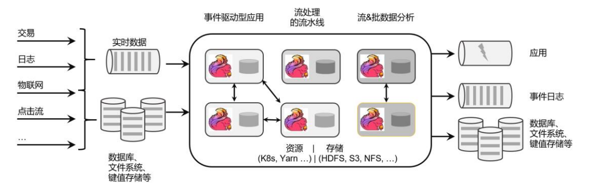
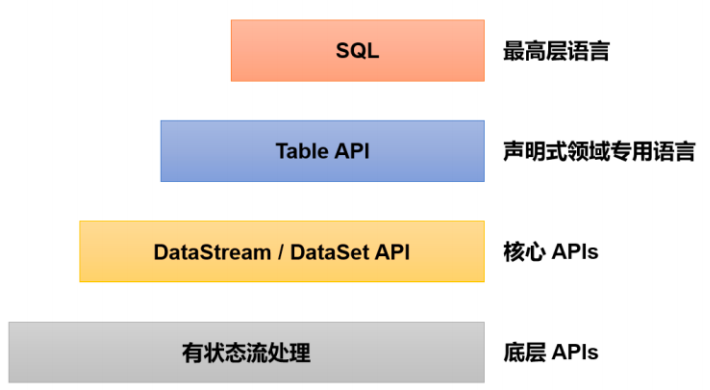

# Flink介绍

Apache Flink是由Apache软件基金会开发的开源流处理框架，其核心是用Java和Scala编写的分布式流数据流引擎。Flink以数据并行和管道方式执行任意流数据程序，Flink的流水线运行时系统可以执行批处理和流处理程序。此外，Flink的运行时本身也支持迭代算法的执行。

## Flink 的源起和设计理念

Flink 起源于一个叫作 Stratosphere 的项目，它是由 3 所地处柏林的大学和欧洲其他一些大学在 2010~2014 年共同进行的研究项目，由柏林理工大学的教授沃克尔·马尔科（Volker Markl）领衔开发。2014 年 4 月，Stratosphere 的代码被复制并捐赠给了 Apache 软件基金会，Flink 就是在此基础上被重新设计出来的。

在德语中，“flink”一词表示“快速、灵巧”。项目的 logo 是一只彩色的松鼠，当然了，这不仅是因为 Apache 大数据项目对动物的喜好（是否联想到了 Hadoop、Hive？），更是因为松鼠这种小动物完美地体现了“快速、灵巧”的特点。关于 logo 的颜色，还一个有趣的缘由：柏林当地的松鼠非常漂亮，颜色是迷人的红棕色；而 Apache 软件基金会的 logo，刚好也是一根以红棕色为主的渐变色羽毛。于是，Flink 的松鼠 Logo 就设计成了红棕色，而且拥有一个漂亮的渐变色尾巴，尾巴的配色与 Apache 软件基金会的 logo 一致。这只松鼠色彩炫目，既呼应了 Apache 的风格，似乎也预示着 Flink 未来将要大放异彩。

从命名上，我们也可以看出 Flink 项目对于自身特点的定位，那就是对于大数据处理，要做到快速和灵活。

- 2014 年 8 月，Flink 第一个版本 0.6 正式发布（至于 0.5 之前的版本，那就是在Stratosphere 名下的了）。与此同时 Fink 的几位核心开发者创办了 Data Artisans 公司，主要做 Fink 的商业应用，帮助企业部署大规模数据处理解决方案。
- 2014 年 12 月，Flink 项目完成了孵化，一跃成为 Apache 软件基金会的顶级项目。
- 2015 年 4 月，Flink 发布了里程碑式的重要版本 0.9.0，很多国内外大公司也正是从这时开始关注、并参与到 Flink 社区建设的。
- 2019 年 1 月，长期对 Flink 投入研发的阿里巴巴，以 9000 万欧元的价格收购了 Data Artisans 公司；之后又将自己的内部版本 Blink 开源，继而与 8 月份发布的 Flink 1.9.0版本进行了合并。自此之后，Flink 被越来越多的人所熟知，成为当前最火的新一代大数据处理框架。

由此可见，Flink 从真正起步到火爆，只不过几年时间。在这短短几年内，Flink 从最初的第一个稳定版本 0.9，到目前本书编写期间已经发布到了 1.17.0，这期间不断有新功能新特性加入。从一开始，Flink 就拥有一个非常活跃的社区，而且一直在快速成长。到目前为止，Flink的代码贡献者（Contributors）已经超过 800 人，并且 Flink 已经发展成为最复杂的开源流处理引擎之一，得到了广泛的应用。

根据 Apache 软件基金会发布的 2020 年度报告，Flink 项目的社区参与和贡献依旧非常活跃，在 Apache 旗下的众多项目中保持着多项领先：

- 邮件列表（Mailing List）活跃度，排名第一
- 代码提交（Commits）数，排名第二
- GitHub 访问量，排名第二

Flink 就像一列高速行进的列车，向我们呼啸而来，朝着未来更实时、更稳定的大数据处理奔去。这辆通向未来的车，我们上车可以迟，但一定不要错过。

Flink 的官网主页地址：https://flink.apache.org/

在 Flink 官网主页的顶部可以看到，项目的核心目标，是“数据流上的有状态计算”（Stateful Computations over Data Streams）。

具体定位是：Apache Flink 是一个框架和分布式处理引擎，如图所示，用于对无界和有界数据流进行有状态计算。Flink 被设计在所有常见的集群环境中运行，以内存执行速度和任意规模来执行计算。

这里有很多专业词汇，我们从中至少可以提炼出一些容易理解的信息：Flink 是一个“框架”，是一个数据处理的“引擎”；既然是“分布式”，当然是为了应付大规模数据的应用场景了；另外，Flink 处理的是数据流。所以，Flink 是一个流式大数据处理引擎。

而“内存执行速度”和“任意规模”，突出了 Flink 的两个特点：速度快、可扩展性强——这说的自然就是小松鼠的“快速”和“灵巧”了。

那什么叫作“无界和有界数据流”，什么又叫作“有状态计算”呢？这涉及流处理的相关知识，我们会在后续的章节一一展开。

## 主要应用场景

Flink 本身的定位是一个大数据流式处理引擎，处理的是流式数据，也就是“数据流”（Data Flow）。顾名思义，数据流的含义是，数据并不是收集好的，而是像水流一样，是一组有序的数据序列，逐个到来、逐个处理。由于数据来到之后就会被即刻处理，所以流处理的一大特点就是“快速”，也就是良好的实时性。Flink 适合的场景，其实也就是需要实时处理数据流的场景。

具体来看，一些行业中的典型应用有：

- 电商和市场营销

举例：实时数据报表、广告投放、实时推荐

- 物联网（IOT）

举例：传感器实时数据采集和显示、实时报警，交通运输业

- 物流配送和服务业

举例：订单状态实时更新、通知信息推送

- 银行和金融业

举例：实时结算和通知推送，实时检测异常行为ibnk

## Flink特点

Flink 是第三代分布式流处理器，它的功能丰富而强大。核心特性：

- 高吞吐和低延迟。每秒处理数百万个事件，毫秒级延迟。 结果的准确性。Flink 提供了事件时间（event-time）和处理时间（processing-time）语义。对于乱序事件流，事件时间语义仍然能提供一致且准确的结果。
- 精确一次（exactly-once）的状态一致性保证。
- 可以连接到最常用的存储系统，如 Apache Kafka、Apache Cassandra、Elasticsearch、JDBC、Kinesis 和（分布式）文件系统，如 HDFS 和 S3。
- 高可用。本身高可用的设置，加上与 K8s，YARN 和 Mesos 的紧密集成，再加上从故障中快速恢复和动态扩展任务的能力，Flink 能做到以极少的停机时间 7×24 全天候运行。
- 能够更新应用程序代码并将作业（jobs）迁移到不同的 Flink 集群，而不会丢失应用程序的状态。

## Flink分层API

除了上述这些特性之外，Flink 还是一个非常易于开发的框架，因为它拥有易于使用的分层 API，整体 API 分层如图：

- 最底层级的抽象仅仅提供了有状态流，它将处理函数（Process Function）嵌入到了DataStream API 中。底层处理函数（Process Function）与 DataStream API 相集成，可以对某些操作进行抽象，它允许用户可以使用自定义状态处理来自一个或多个数据流的事件，且状态具有一致性和容错保证。除此之外，用户可以注册事件时间并处理时间回调，从而使程序可以处理复杂的计算。

- 实际上，大多数应用并不需要上述的底层抽象，而是直接针对核心 API（Core APIs） 进行编程，比如 DataStream API（用于处理有界或无界流数据）以及 DataSet API（用于处理有界数据集）。这些 API 为数据处理提供了通用的构建模块，比如由用户定义的多种形式的转换（transformations）、连接（joins）、聚合（aggregations）、窗口（windows）操作等。DataSet API 为有界数据集提供了额外的支持，例如循环与迭代。这些 API 处理的数据类型以类（classes）的形式由各自的编程语言所表示。

- Table API 是以表为中心的声明式编程，其中表在表达流数据时会动态变化。Table API 遵循关系模型：表有二维数据结构（schema）（类似于关系数据库中的表），同时 API 提供可比较的操作，例如 select、join、group-by、aggregate 等。

  尽管 Table API 可以通过多种类型的用户自定义函数（UDF）进行扩展，仍不如核心 API更具表达能力，但是使用起来代码量更少，更加简洁。除此之外，Table API 程序在执行之前会使用内置优化器进行优化。

  我们可以在表与 DataStream/DataSet 之间无缝切换，以允许程序将 Table API 与DataStream 以及 DataSet 混合使用。

- Flink 提供的最高层级的抽象是 SQL。这一层抽象在语法与表达能力上与 Table API 类似，但是是以 SQL 查询表达式的形式表现程序。SQL 抽象与 Table API 交互密切，同时 SQL 查询可以直接在 Table API 定义的表上执行。

目前 Flink SQL 和 Table API 还在开发完善的过程中，很多大厂都会二次开发符合自己需要的工具包。而 DataSet 作为批处理 API 实际应用较少，2020 年 12 月 8 日发布的新版本 1.12.0, 已经完全实现了真正的流批一体，DataSet API 已处于软性弃用（soft deprecated）的状态。用Data Stream API 写好的一套代码, 即可以处理流数据, 也可以处理批数据，只需要设置不同的执行模式。这与之前版本处理有界流的方式是不一样的，Flink 已专门对批处理数据做了优化处理。

## Flink VS Spark

数据处理架构

我们已经知道，数据处理的基本方式，可以分为批处理和流处理两种。

- 批处理针对的是有界数据集，非常适合需要访问海量的全部数据才能完成的计算工作，一般用于离线统计。
- 流处理主要针对的是数据流，特点是无界、实时, 对系统传输的每个数据依次执行操作，一般用于实时统计。

从根本上说，Spark 和 Flink 采用了完全不同的数据处理方式。可以说，两者的世界观是截然相反的。

Spark 以批处理为根本，并尝试在批处理之上支持流计算；在 Spark 的世界观中，万物皆批次，离线数据是一个大批次，而实时数据则是由一个一个无限的小批次组成的。所以对于流处理框架 Spark Streaming 而言，其实并不是真正意义上的“流”处理，而是“微批次（micro-batching）处理，如图所示。

而 Flink 则认为，流处理才是最基本的操作，批处理也可以统一为流处理。在 Flink 的世界观中，万物皆流，实时数据是标准的、没有界限的流，而离线数据则是有界限的流。

- 无界数据流（Unbounded Data Stream）

  所谓无界数据流，就是有头没尾，数据的生成和传递会开始但永远不会结束，我们无法等待所有数据都到达，因为输入是无界的，永无止境，数据没有“都到达”的时候。所以对于无界数据流，必须连续处理，也就是说必须在获取数据后立即处理。在处理无界流时，为了保证结果的正确性，我们必须能够做到按照顺序处理数据。

- 有界数据流（Bounded Data Stream）

  对应的，有界数据流有明确定义的开始和结束，所以我们可以通过获取所有数据来处理有界流。处理有界流就不需要严格保证数据的顺序了，因为总可以对有界数据集进行排序。有界流的处理也就是批处理。

正因为这种架构上的不同，Spark 和 Flink 在不同的应用领域上表现会有差别。一般来说，Spark 基于微批处理的方式做同步总有一个“攒批”的过程，所以会有额外开销，因此无法在流处理的低延迟上做到极致。在低延迟流处理场景，Flink 已经有明显的优势。而在海量数据的批处理领域，Spark 能够处理的吞吐量更大，加上其完善的生态和成熟易用的 API，目前同样优势比较明显。

### 如何选择

Spark 和 Flink 可以说目前是各擅胜场，批处理领域 Spark 称王，而在流处理方面 Flink 当仁不让。具体到项目应用中，不仅要看是流处理还是批处理，还需要在延迟、吞吐量、可靠性，以及开发容易度等多个方面进行权衡。

**如果在工作中需要从 Spark 和 Flink 这两个主流框架中选择一个来进行实时流处理，我们更加推荐使用 Flink**，主要的原因有：

- Flink 的延迟是毫秒级别，而 Spark Streaming 的延迟是秒级延迟。
- Flink 提供了严格的精确一次性语义保证。
- Flink 的窗口 API 更加灵活、语义更丰富。
- Flink 提供事件时间语义，可以正确处理延迟数据。
- Flink 提供了更加灵活的对状态编程的 API。

当然，在海量数据的批处理方面，Spark 还是具有明显的优势。而且 Spark 的生态更加成成熟，也会使其在应用中更为方便。

另外，Spark 2.0 之后新增的 Structured Streaming 流处理引擎借鉴 DataFlow 进行了大量优化，同样做到了低延迟、时间正确性以及精确一次性语义保证；Spark 2.3 以后引入的连续处理（Continuous Processing）模式，更是可以在至少一次语义保证下做到 1 毫秒的延迟。而 Flink自 1.9 版本合并 Blink 以来，在 SQL 的表达和批处理的能力上同样有了长足的进步。

> 本文参考至：[Flink-介绍和快速上手_迷雾总会解的博客-CSDN博客](https://blog.csdn.net/qq_44766883/article/details/129120879)
