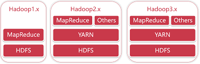
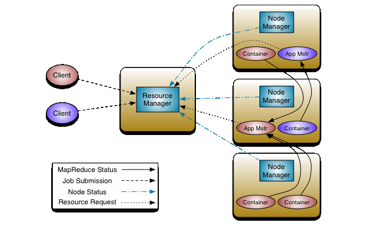

# Hadoop概述

## 一. 概述

Hadoop是一个开源的分布式计算框架，旨在处理大量数据。它使用分布式文件系统（HDFS）来存储数据，并通过MapReduce编程模型对数据进行分布式处理。Hadoop支持在大量节点上进行计算，并通过容错机制来保证数据的可靠性。

Hadoop 框架主要由四个模块组成，这四个模块协同运行以形成 Hadoop 生态系统：

Hadoop Distributed File System (HDFS)：作为 Hadoop 生态系统的主要组件，HDFS 是一个分布式文件系统，可提供对应用数据的高吞吐量访问，而无需预先定义架构。

Yet Another Resource Negotiator (YARN)：YARN 是一个资源管理平台，负责管理集群中的计算资源并使用它们来调度用户的应用。它在整个 Hadoop 系统上执行调度和资源分配。

MapReduce：MapReduce 是一个用于大规模数据处理的编程模型。通过使用分布式和并行计算算法，MapReduce 可以沿用处理逻辑，并帮助编写将大型数据集转换为可管理数据集的应用。

Hadoop Common：Hadoop Common 包括其他Hadoop 模块使用和共享的库和实用程序。

**Hadoop主要解决了海量数据的存储和分析计算**。

## 二. Hadoop的优势

- 高可靠性：Hadoop底层维护者多个数据副本，即使Hadoop某一个计算元素或者存储发生故障，也不会导致数据丢失。
- 高扩展性：在集群间分配任务数据，可方便的扩展数以千计的节点。
- 高效性：在MapReduce的思想下，Hadoop是并行工作的，以加快数据的处理速度。
- 高容错性：能够自动将失败的任务重新分配。

## 三. Hadoop组件

### 3.1 HDFS

整个Hadoop的体系结构主要是通过HDFS(Hadoop分布式文件系统)来实现对分布式存储的底层支持，并通过 MapReduce 来实现对分布式并行任务处理的程序支持。

HDFS是Hadoop体系中数据存储管理的基础。它是一个高度容错的系统，能检测和应对硬件故障，用于在低成本的通用硬件上运行。HDFS简化了文件的一致性模型，通过流式数据访问，提供高吞吐量应用程序数据访问功能，适合带有大型数据集的应用程序。

从内部来看，文件被分成若干个数据块，这若干个数据块存放在一组DataNode上。NameNode执行文件系统的命名空间，如打开、关闭、重命名文件或目录等，也负责数据块到具体DataNode的映射。DataNode负责处理文件系统客户端的文件读写，并在NameNode的统一调度下进行数据库的创建、删除和复制工作。NameNode是所有HDFS元数据的管理者，用户数据永远不会经过NameNode。

### 3.2 MapReduce

Hadoop MapReduce 是 Google MapReduce 克隆版。

> 著名的 Google MapReduce 论文:[Google MapReduce中文版](https://github.com/lizhenghn123/StudyBooks/blob/master/%E6%95%B0%E6%8D%AE%E5%BA%93/Google%20MapReduce-%E4%B8%AD%E6%96%87%E7%89%88.pdf)

MapReduce是一个分布式运算程序的编程框架，核心功能是将用户编写的业务逻辑代码和自带默认组件整合成一个完整的分布式运算程序，并发运行在Hadoop集群上。

MapReduce设计并提供了统一的计算框架，为程序员隐藏了绝大多数系统层面的处理细节。为程序员提供一个抽象和高层的编程接口和框架。程序员仅需要关心其应用层的具体计算问题，仅需编写少量的处理应用本身计算问题的程序代码。如何具体完成这个并行计算任务所相关的诸多系统层细节被隐藏起来，交给计算框架去处理。

> [【Hadoop】MapReduce详解_镰刀韭菜的博客-CSDN博客_hadoop的mapreduce详解](https://blog.csdn.net/ARPOSPF/article/details/107591051)

### 3.3 YARN

Hadoop YARN（Yet Another Resource Negotiator）是Hadoop生态系统的一部分，是一种资源管理系统，主要用于管理Hadoop集群的计算资源。YARN的目的是把Hadoop的数据处理和计算资源管理抽离出来，使Hadoop不仅仅可以处理批量数据，还可以支持流数据处理和交互式查询等应用。

Yarn从整体上还是属于master/slave模型，主要依赖于三个组件来实现功能，第一个就是ResourceManager，是集群资源的仲裁者，它包括两部分：一个是可插拔式的调度Scheduler，一个是ApplicationManager，用于管理集群中的用户作业。第二个是每个节点上的NodeManager，管理该节点上的用户作业和工作流，也会不断发送自己Container使用情况给ResourceManager。第三个组件是ApplicationMaster，用户作业生命周期的管理者它的主要功能就是向ResourceManager（全局的）申请计算资源（Containers）并且和NodeManager交互来执行和监控具体的task。架构图如下：

> [hadoop之yarn详解（基础架构篇） - 一寸HUI - 博客园 (cnblogs.com)](https://www.cnblogs.com/zsql/p/11636112.html)

