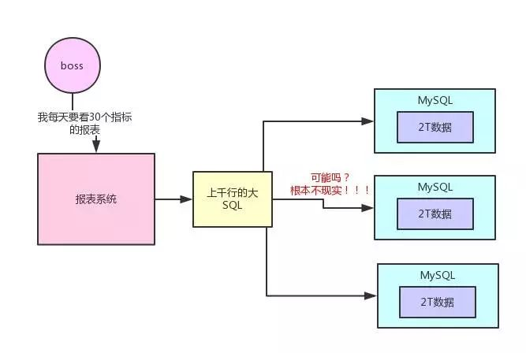
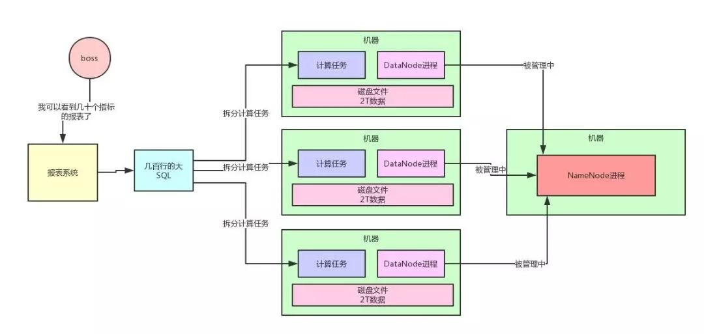
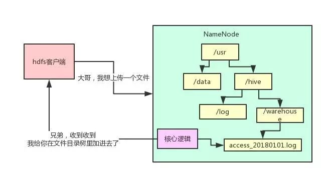
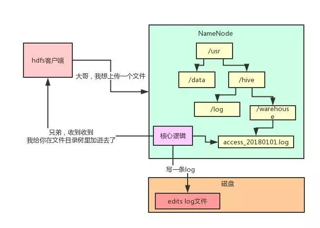
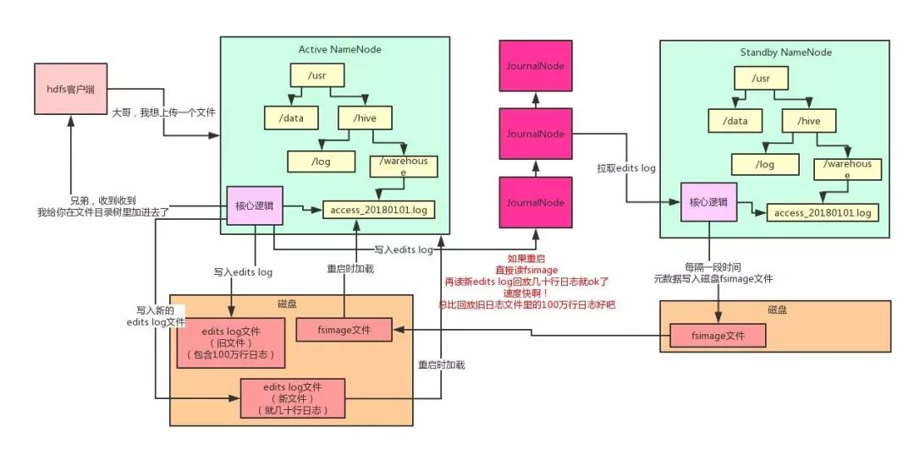
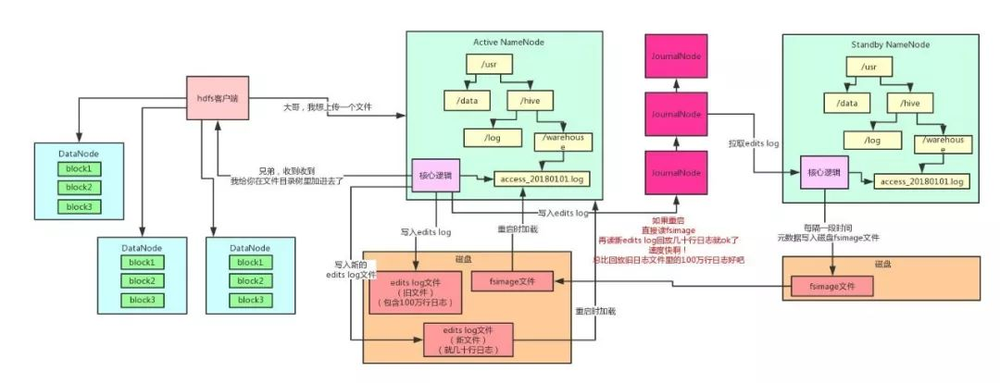
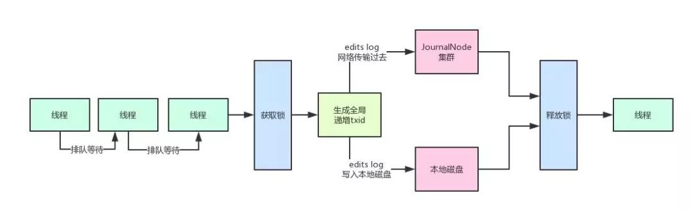
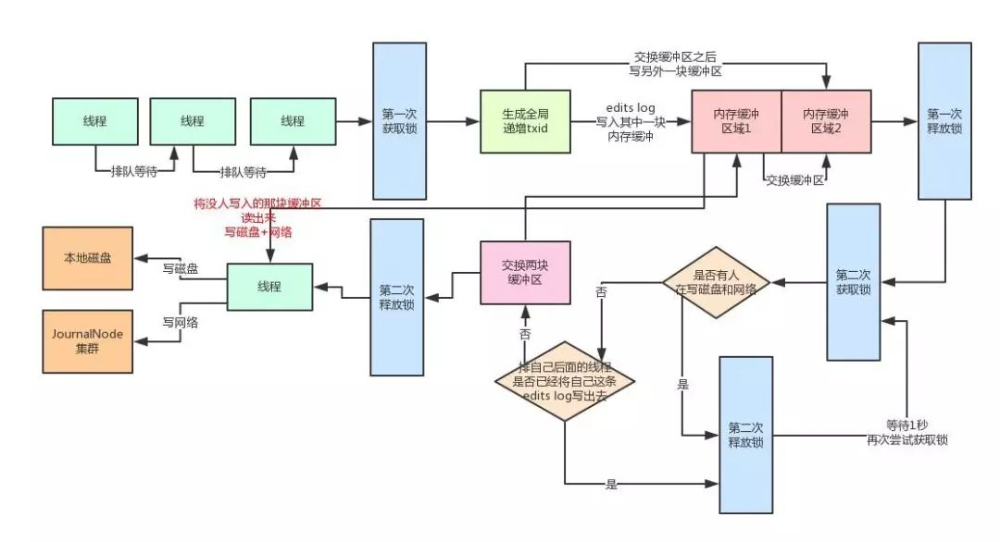

# Hadoop NameNode如何承载每秒上千次的高并发访问

> 转载至：[用大白话告诉你小白都能看懂的Hadoop架构原理](https://mp.weixin.qq.com/s?__biz=MjM5ODI5Njc2MA==&mid=2655820642&idx=1&sn=0cef49cfc7591c0746dd2d42f6a05cd6&chksm=bd74d6b58a035fa3eca85006230e19e464c1c3f77528c8e6a34cd50ed5d57c9eaee81fc73db2&mpshare=1&scene=24&srcid=#rd)

Hadoop 是目前大数据领域最主流的一套技术体系，包含了多种技术，例如 HDFS（分布式文件系统），YARN（分布式资源调度系统），MapReduce（分布式计算系统）等等。

有些朋友可能听说过 Hadoop，但是却不太清楚它到底是个什么东西，这篇文章就用大白话给各位阐述一下。

假如你现在公司里的数据都是放在 MySQL 里的，那么就全部放在一台数据库服务器上，我们就假设这台服务器的磁盘空间有 2T 吧，大家先看下面这张图：

现在问题来了，你不停的往这台服务器的 MySQL 里放数据，结果数据量越来越大了，超过了 2T 的大小了，现在咋办？

你说，我可以搞多台 MySQL 数据库服务器，分库分表啊！每台服务器放一部分数据不就得了。如上图所示！

好，没问题，那咱们搞 3 台数据库服务器，3 个 MySQL 实例，然后每台服务器都可以 2T 的数据。

现在我问你一个问题，所谓的大数据是在干什么？我们来说一下大数据最初级的一个使用场景。

假设你有一个电商网站，要把这个电商网站里所有的用户在页面和 App 上的点击、购买、浏览的行为日志都存放起来分析。

你现在把这些数据全都放在了 3 台 MySQL 服务器上，数据量很大，但还是勉强可以放的下。

某天早上，你的 Boss 来了。要看一张报表，比如要看每天网站的 X 指标、Y 指标、Z 指标，等等，二三十个数据指标。

好了，兄弟，现在你尝试去从那些点击、购买、浏览的日志里，通过写一个 SQL 来分析出那二三十个指标试试看？

我跟你打赌，你绝对会写出来一个几百行起步，甚至上千行的超级复杂大 SQL。这个 SQL，你觉得他能运行在分库分表后的 3 台 MySQL 服务器上么？

如果你觉得可以的话，那你一定是不太了解 MySQL 分库分表后有多坑，几百行的大 SQL 跨库 Join，各种复杂的计算，根本不现实。

所以说，大数据的存储和计算压根儿不是靠 MySQL 来搞的，因此 Hadoop、Spark 等大数据技术体系才应运而生。

本质上，Hadoop、Spark 等大数据技术，其实就是一系列的分布式系统。比如 Hadoop 中的 HDFS，就是大数据技术体系中的核心基石，负责分布式存储数据，这是啥意思？别急，继续往下看。

HDFS 全称是 Hadoop Distributed File System，是 Hadoop 的分布式文件系统。

它由很多机器组成，每台机器上运行一个 DataNode 进程，负责管理一部分数据。

然后有一台机器上运行了 NameNode 进程，NameNode 大致可以认为是负责管理整个 HDFS 集群的这么一个进程，它里面存储了 HDFS 集群的所有元数据。

然后有很多台机器，每台机器存储一部分数据！好，HDFS 现在可以很好的存储和管理大量的数据了。

这时候你肯定会有疑问：MySQL 服务器不也是这样的吗？你要是这样想，那就大错特错了。

这个事情不是你想的那么简单的，HDFS 天然就是分布式的技术，所以你上传大量数据，存储数据，管理数据，天然就可以用 HDFS 来做。

如果你硬要基于 MySQL 分库分表这个事儿，会痛苦很多倍，因为 MySQL 并不是设计为分布式系统架构的，它在分布式数据存储这块缺乏很多数据保障的机制。

好，你现在用 HDFS 分布式存储了数据，接着不就是要分布式来计算这些数据了吗？

对于分布式计算：

- 很多公司用 Hive 写几百行的大 SQL（底层基于 MapReduce）。
- 也有很多公司开始慢慢的用 Spark 写几百行的大 SQL（底层是 Spark Core 引擎）。

总之就是写一个大 SQL，然后拆分为很多的计算任务，放到各个机器上去，每个计算任务就负责计算一小部分数据，这就是所谓的分布式计算。

这个，绝对比你针对分库分表的 MySQL 来跑几百行大 SQL 要靠谱的多。

对于上述所说的分布式存储与分布式计算，老规矩，同样给大家来一张图，大伙儿跟着图来仔细捋一下整个过程。

## 一. HDFS 的 NameNode 架构原理

好了，前奏铺垫完之后，进入正题。本文主要就是讨论一下 HDFS 集群中的 NameNode 的核心架构原理。

NameNode 有一个很核心的功能：管理整个 HDFS 集群的元数据，比如说文件目录树、权限的设置、副本数的设置，等等。

下面就用最典型的文件目录树的维护，来给大家举例说明，我们看看下面的图。现在有一个客户端系统要上传一个 1TB 的大文件到 HDFS 集群里。

此时它会先跟 NameNode 通信，说：大哥，我想创建一个新的文件，它的名字叫“/usr/hive/warehouse/access_20180101.log”，大小是 1TB，你看行不？

然后 NameNode 就会在自己内存的文件目录树里，在指定的目录下搞一个新的文件对象，名字就是“access_20180101.log”。

这个文件目录树不就是 HDFS 非常核心的一块元数据，维护了 HDFS 这个分布式文件系统中，有哪些目录，有哪些文件，对不对？

但是有个问题，这个文件目录树是在 NameNode 的内存里的啊！这可坑爹了，你把重要的元数据都放在内存里，万一 NameNode 不小心宕机了可咋整？元数据不就全部丢失了？

可你要是每次都频繁的修改磁盘文件里的元数据，性能肯定是极低的啊！毕竟这是大量的磁盘随机读写！

没关系，我们来看看 HDFS 优雅的解决方案。每次内存里改完了，写一条 edits log，元数据修改的操作日志存到磁盘文件里，不修改磁盘文件内容，就是顺序追加，这个性能就高多了。

每次 NameNode 重启的时候，把 edits log 里的操作日志读到内存里回放一下，不就可以恢复元数据了？

大家顺着上面的文字，把整个过程，用下面这张图跟着走一遍：

但是问题又来了，那 edits log 如果越来越大的话，岂不是每次重启都会很慢？因为要读取大量的 edits log 回放恢复元数据！

所以 HDFS 说，我可以这样子啊，我引入一个新的磁盘文件叫做 fsimage，然后呢，再引入一个 JournalNodes 集群，以及一个 Standby NameNode（备节点）。

每次 Active NameNode（主节点）修改一次元数据都会生成一条 edits log，除了写入本地磁盘文件，还会写入 JournalNodes 集群。

然后 Standby NameNode 就可以从 JournalNodes 集群拉取 edits log，应用到自己内存的文件目录树里，跟 Active NameNode 保持一致。

然后每隔一段时间，Standby NameNode 都把自己内存里的文件目录树写一份到磁盘上的 fsimage，这可不是日志，这是完整的一份元数据。这个操作就是所谓的 checkpoint 检查点操作。

然后把这个 fsimage 上传到 Active NameNode，接着清空掉 Active NameNode 的旧的 edits log 文件，这里可能都有 100 万行修改日志了！

然后 Active NameNode 继续接收修改元数据的请求，再写入 edits log，写了一小会儿，这里可能就几十行修改日志而已！

如果说此时，Active NameNode 重启了，Bingo！没关系，只要把 Standby NameNode 传过来的 fsimage 直接读到内存里，这个 fsimage 直接就是元数据，不需要做任何额外操作，纯读取，效率很高！

然后把新的 edits log 里少量的几十行的修改日志回放到内存里就 OK 了！

这个过程的启动速度就快的多了！因为不需要回放大量上百万行的 edits log 来恢复元数据了！如下图所示。

此外，大家看看上面这张图，现在咱们有俩 NameNode：

- 一个是主节点对外提供服务接收请求。
- 另外一个纯就是接收和同步主节点的 edits log 以及执行定期 checkpoint 的备节点。

大家有没有发现！他们俩内存里的元数据几乎是一模一样的啊！所以呢，如果 Active NameNode 挂了，是不是可以立马切换成 Standby NameNode 对外提供服务？

这不就是所谓的 NameNode 主备高可用故障转移机制么！接下来大家再想想，HDFS 客户端在 NameNode 内存里的文件目录树，新加了一个文件。

但是这个时候，人家要把数据上传到多台 DataNode 机器上去啊，这可是一个 1TB 的大文件！咋传呢？

很简单，把 1TB 的大文件拆成 N 个 block，每个 block 是 128MB。1TB = 1024GB = 1048576MB，一个 block 是 128MB，那么就是对应着 8192 个 block。

这些 block 会分布在不同的机器上管理着，比如说一共有 100 台机器组成的集群，那么每台机器上放 80 个左右的 block 就 OK 了。

但是问题又来了，那如果这个时候 1 台机器宕机了，不就导致 80 个 block 丢失了？

也就是说上传上去的 1TB 的大文件，会丢失一小部分数据啊。没关系！HDFS 都考虑好了！

它会默认给每个 block 搞 3 个副本，一模一样的副本，分放在不同的机器上，如果一台机器宕机了，同一个 block 还有另外两个副本在其他机器上呢！

大伙儿看看下面这张图。每个 block 都在不同的机器上有 3 个副本，任何一台机器宕机都没事！还可以从其他的机器上拿到那个 block。

这下子，你往 HDFS 上传一个 1TB 的大文件，可以高枕无忧了吧！

OK，上面就是大白话加上一系列手绘图，给大家先聊聊小白都能听懂的 Hadoop 的基本架构原理。

## 二. 大规模集群下 Hadoop NameNode 如何承载每秒上千次的高并发访问

上面我们已经初步给大家解释了 Hadoop HDFS 的整体架构原理，相信大家都有了一定的认识和了解。

下面我们来看看，如果大量客户端对 NameNode 发起高并发（比如每秒上千次）访问来修改元数据，此时 NameNode 该如何抗住？

### 2.1 问题的起源

我们先来分析一下，高并发请求 NameNode 会遇到什么样的问题。

大家现在都知道了，每次请求 NameNode 修改一条元数据（比如说申请上传一个文件，那么就需要在内存目录树中加入一个文件），都要写一条 edits log。

包括如下两个步骤：

- **写入本地磁盘。**
- **通过网络传输给 JournalNodes 集群。**

但是如果对 Java 有一定了解的同学都该知道多线程并发安全问题吧？

NameNode 在写 edits log 时的第一条原则：必须保证每条 edits log 都有一个全局顺序递增的 **transactionId**（简称为 txid），这样才可以标识出来一条一条的 edits log 的先后顺序。

那么如果要保证每条 edits log 的 txid 都是递增的，就必须得加锁。

每个线程修改了元数据，要写一条 edits log 的时候，都必须按顺序排队获取锁后，才能生成一个递增的 txid，代表这次要写的 edits log 的序号。

好了，那么问题来了，大家看看下面的图。如果每次都是在一个加锁的代码块里，生成 txid，然后写磁盘文件 edits log，网络请求写入 JournalNodes 一条 edits log，会咋样？

不用说，这个绝对完蛋了！NameNode 本身用多线程接收多个客户端发送过来的并发的请求，结果多个线程居然修改完内存中的元数据之后，排着队写 edits log！

而且你要知道，写本地磁盘 + 网络传输给 JournalNodes，都是很耗时的啊！性能两大杀手：磁盘写 + 网络写！

如果 HDFS 的架构真要是这么设计的话，基本上 NameNode 能承载的每秒的并发数量就很少了，可能就每秒处理几十个并发请求处理撑死了！

### 2.2 **HDFS** 优雅的解决方案

首先大家想一下，既然咱们不希望每个线程写 edits log 的时候，串行化排队生成 txid + 写磁盘 + 写 JournalNode，那么是不是可以搞一个内存缓冲？

也就是说，多个线程可以快速的获取锁，生成 txid，然后快速的将 edits log 写入内存缓冲。

接着就快速的释放锁，让下一个线程继续获取锁后，生成 id + 写 edits log 进入内存缓冲。

然后接下来有一个线程可以将内存中的 edits log 刷入磁盘，但是在这个过程中，还是继续允许其他线程将 edits log 写入内存缓冲中。

但是这里又有一个问题了，如果针对同一块内存缓冲，同时有人写入，还同时有人读取后写磁盘，那也有问题，因为不能并发读写一块共享内存数据！

所以 HDFS 在这里采取了 double-buffer 双缓冲机制来处理！将一块内存缓冲分成两个部分：

- **其中一个部分可以写入。**
- **另外一个部分用于读取后写入磁盘和 JournalNodes。**

大家可能感觉文字叙述不太直观，老规矩，咱们来一张图，按顺序给大家阐述一下。

#### 2.2.1 分段加锁机制 + 内存双缓冲机制

首先各个线程依次第一次获取锁，生成顺序递增的 txid，然后将 edits log 写入内存双缓冲的区域 1，接着就立马第一次释放锁了。

趁着这个空隙，后面的线程就可以再次立马第一次获取锁，然后立即写自己的 edits log 到内存缓冲。

写内存那么快，可能才耗时几十微妙，接着就立马第一次释放锁了。所以这个并发优化绝对是有效果的，大家有没有感受到？

接着各个线程竞争第二次获取锁，有线程获取到锁之后，就看看，有没有谁在写磁盘和网络？

如果没有，好，那么这个线程是个幸运儿！直接交换双缓冲的区域 1 和区域 2，接着第二次释放锁。这个过程相当快速，内存里判断几个条件，耗时不了几微秒。

好，到这一步为止，内存缓冲已经被交换了，后面的线程可以立马快速的依次获取锁，然后将 edits log 写入内存缓冲的区域 2，区域 1 中的数据被锁定了，不能写。

怎么样，是不是又感受到了一点点多线程并发的优化？

#### 2.2.2 多线程并发吞吐量的百倍优化

接着，之前那个幸运儿线程，将内存缓冲的区域 1 中的数据读取出来（此时没人写区域 1 了，都在写区域 2），将里面的 edtis log 都写入磁盘文件，以及通过网络写入 JournalNodes 集群。

这个过程可是很耗时的！但是没关系啊，人家做过优化了，在写磁盘和网络的过程中，是不持有锁的！

因此后面的线程可以噼里啪啦的快速的第一次获取锁后，立马写入内存缓冲的区域 2，然后释放锁。

这个时候大量的线程都可以快速的写入内存，没有阻塞和卡顿！怎么样？并发优化的感觉感受到了没有！

#### 2.2.3 缓冲数据批量刷磁盘 + 网络的优化

那么在幸运儿线程吭哧吭哧把数据写磁盘和网络的过程中，排在后面的大量线程，快速的第一次获取锁，写内存缓冲区域 2，释放锁，之后，这些线程第二次获取到锁后会干嘛？

他们会发现有人在写磁盘啊，兄弟们！所以会立即休眠 1 秒，释放锁。

此时大量的线程并发过来的话，都会在这里快速的第二次获取锁，然后发现有人在写磁盘和网络，快速的释放锁，休眠。

怎么样，这个过程没有人长时间的阻塞其他人吧！因为都会快速的释放锁，所以后面的线程还是可以迅速的第一次获取锁后写内存缓冲！

Again！并发优化的感觉感受到了没有？

而且这时，一定会有很多线程发现，好像之前那个幸运儿线程的 txid 是排在自己之后的，那么肯定就把自己的 edits log 从缓冲里写入磁盘和网络了。

这些线程甚至都不会休眠等待，直接就会返回后去干别的事情了，压根儿不会卡在这里。这里又感受到并发的优化没有？

然后那个幸运儿线程写完磁盘和网络之后，就会唤醒之前休眠的那些线程。

那些线程会依次排队再第二次获取锁后进入判断，咦！发现没有人在写磁盘和网络了！

然后就会再判断，有没有排在自己之后的线程已经将自己的 edtis log 写入磁盘和网络了：

- 如果有的话，就直接返回了。
- 没有的话，那么就成为第二个幸运儿线程，交换两块缓冲区，区域 1 和区域 2 交换一下。
- 然后释放锁，自己开始吭哧吭哧的将区域 2 的数据写入磁盘和网络。

但是这个时候没有关系啊，后面的线程如果要写 edits log 的，还是可以第一次获取锁后立马写内存缓冲再释放锁。以此类推。

## 三. 总结

这套机制还是挺复杂的，涉及到了分段加锁以及内存双缓冲两个机制。

通过这套机制，NameNode 保证了多个线程在高并发的修改元数据之后写 edits log 的时候，不会说一个线程一个线程的写磁盘和网络，那样性能实在太差，并发能力太弱了！

所以通过上述那套复杂的机制，尽最大的努力保证，一个线程可以批量的将一个缓冲中的多条 edits log 刷入磁盘和网络。

在这个漫长的吭哧吭哧的过程中，其他的线程可以快速的高并发写入 edits log 到内存缓冲里，不会阻塞其他的线程写 edits log。

所以，正是依靠以上机制，最大限度优化了 NameNode 处理高并发访问修改元数据的能力！