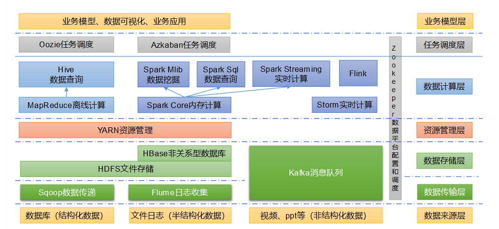

# 大数据生态体系

图中涉及的技术名词解释如下：

1. Sqoop：Sqoop是一款开源的工具，主要用于在Hadoop、Hive与传统的数据库（MySQL）间进行数据的传递，可以将一个关系型数据库（例如 ：MySQL，Oracle 等）中的数据导进到Hadoop的HDFS中，也可以将HDFS的数据导进到关系型数据库中。

2. Flume：Flume是一个高可用的，高可靠的，分布式的海量日志采集、聚合和传输的系统，Flume支持在日志系统中定制各类数据发送方，用于收集数据；

3. Kafka：Kafka是一种高吞吐量的分布式发布订阅消息系统； 

4. Spark：Spark是当前最流行的开源大数据内存计算框架。可以基于Hadoop上存储的大数据进行计算。

5. Flink：Flink是当前最流行的开源大数据内存计算框架。用于实时计算的场景较多。

6. Oozie：Oozie是一个管理Hadoop作业（job）的工作流程调度管理系统。

7. Hbase：HBase是一个分布式的、面向列的开源数据库。HBase不同于一般的关系数据库，它是一个适合于非结构化数据存储的数据库。

8. Hive：Hive是基于Hadoop的一个数据仓库工具，可以将结构化的数据文件映射为一张数据库表，并提供简单的SQL查询功能，可以将SQL语句转换为MapReduce任务进行运行。其优点是学习成本低，可以通过类SQL语句快速实现简单的MapReduce统计，不必开发专门的MapReduce应用，十分适合数据仓库的统计分析。

9. ZooKeeper：它是一个针对大型分布式系统的可靠协调系统，提供的功能包括：配置维护、名字服务、分布式同步、组服务等。