# Hadoop安装和本地运行

## 一. 安装

> hadoop依赖于JDK，所以在安装Hadoop之前需要安装JDK

第一步：下载hadoop包

前往官网下载hadoop包：[Apache Hadoop](https://hadoop.apache.org/releases.html)

第二步：解压至 `/opt/` 目录下

```shell
tar -zxvf hadoop-3.3.4.tar.gz -C /opt/
```

第三步：将Hadoop添加至环境变量

编辑 `/etc/profile` 文件，在末尾添加如下环境变量：

```shell
#HADOOP_HOME
export HADOOP_HOME=/opt/hadoop-3.3.4
export PATH=$PATH:$HADOOP_HOME/bin
export PATH=$PATH:$HADOOP_HOME/sbin
```

第四步：测试是否安装成功

```shell
$ hadoop version
hadoop-3.3.4
```

## 二. 本地运行模式运行Hadoop

Hadoop运行模式包括：本地模式、伪分布式模式、完全分布式模式。

- 本地模式：单机运行，只是用来演示一下官方案例。生产环境不用。
- 伪分布式模式：也是单机运行，但是具备Hadoop集群的所有功能，一台服务器模拟一个分布式的环境。
- 完全分布式模式：多台服务器组成分布式环境。生产环境使用。

安装好后，我们可以在本地运行官方提供的 `word count` 示例map-reduce程序。

第一步：在任意地方，创建一个wcinput文件夹，该文件夹用于存放map-reduce程序源数据目录

```shell
mkdir wcinput
```

第二步：在 `wcinput` 文件夹下创建 `word.txt` 文件

```shell
cd wcinput
vim word.txt
```

并在文件中添加如下内容：

```txt
hadoop yarn
hadoop mapreduce
bigcoder
bigcoder
```

第三步：回到 `wcinput` 外层目录

```shell
cd ../
```

第四步：执行程序

```shell
hadoop jar /opt/hadoop-3.3.4/share/hadoop/mapreduce/hadoop-mapreduce-examples-3.3.4.jar wordcount wcinput wcoutput 
```

最后三个参数:

- wordcount：代表运行 `wordcount` 示例，用于统计输入文件中的单词次数。
- wcinput：输入文件所在目录
- wcoutput：输出文件所在目录

最后执行成功后会生成输出文件夹 `wcoutput`，该目录中有两个输出文件：

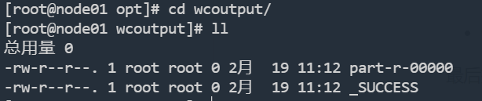

输出结果如下：

```txt
bigcoder        2
hadoop  2
mapreduce       1
yarn    1
```

## 三. 完全分布式部署

### 3.1 准备工作

1. 准备3台Linux主机（关闭防火墙、静态IP、主机名称）
2. 安装JDK
3. 配置环境变量
4. 安装Hadoop
5. 配置环境变量
6. 配置三个节点，免密SSH登录。（如果不配置，在3.5.2启动集群时，就会失败）

我们使用虚拟机虚拟出三台Linux实例，分别如下：

| 主机名称 | node01         | node02         | node03         |
| -------- | -------------- | -------------- | -------------- |
| IP地址   | 192.168.10.101 | 192.168.10.102 | 192.168.10.103 |

#### 3.1.1 配置SSH免密登录

**第一步：在`node01`上生成公钥和私钥**

```shell
[root@node01 hadoop-3.3.4] ssh-keygen -t rsa
```

敲（三个回车），就会生成两个文件id_rsa（私钥）、id_rsa.pub（公钥）

**第二步：将公钥拷贝到要免密登录的目标机器上**

```shell
[root@node01 hadoop-3.3.4]ssh-copy-id node01
[root@node01 hadoop-3.3.4]ssh-copy-id node02
[root@node01 hadoop-3.3.4]ssh-copy-id node03
```

然后在 `node02`、`node03` 分别执行上述操作，这样我们不管在集群中哪一个节点中，都能免密登录到其它节点上。

### 3.2 集群规划

Hadoop整体架构参考：[Hadoop概述](./_1Hadoop概述.md)

| 主机名称 | node01             | node02                       | node03                      |
| -------- | ------------------ | ---------------------------- | --------------------------- |
| IP地址   | 192.168.10.101     | 192.168.10.102               | 192.168.10.103              |
| HDFS     | NameNode、DataNode | DataNode                     | SecondaryNameNode、DataNode |
| YARN     | NodeManager        | NodeManager、ResourceManager | NodeManager                 |

> 注意：
>
> - NameNode和SecondaryNameNode不要安装在同一台服务器
>
> - ResourceManager也很消耗内存，不要和NameNode、SecondaryNameNode配置在同一台机器上。

### 3.3 配置文件说明

Hadoop配置文件分两类：默认配置文件和自定义配置文件，只有用户想修改某一默认配置值时，才需要修改自定义配置文件，更改相应属性值。

#### 3.3.1 默认配置文件

| 要获取的默认文件   | 文件存放在Hadoop的jar包中的位置                              |
| ------------------ | ------------------------------------------------------------ |
| core-default.xml   | hadoop-3.3.4/share/hadoop/common/hadoop-common-3.3.4.jar/core-default.xml |
| hdfs-default.xml   | hadoop-3.3.4/share/hadoop/hdfs/hadoop-hdfs-3.3.4.jar/hdfs-default.xml |
| yarn-default.xml   | hadoop-3.3.4/share/hadoop/yarn/hadoop-yarn-common-3.3.4.jar/yarn-default.xml |
| mapred-default.xml | hadoop-3.3.4/share/hadoop/mapreduce/hadoop-mapreduce-client-core-3.3.4.jar/mapred-default.xml |

#### 3.3.2 自定义配置文件

core-site.xml、hdfs-site.xml、yarn-site.xml、mapred-site.xml四个配置文件存放在 `$HADOOP_HOME/etc/hadoop` 这个路径上，用户可以根据项目需求重新进行修改配置。

### 3.4 集群配置

需要说明的是，下面的配置文件中可能会遇到配置IP地址的地方，示例中都是配置的主机名，这是因为我已经在所有节点`hosts`文件上配置好了主机IP映射，如果你的实例没有配置，直接配置IP地址即可。

`hosts` 文件如下：

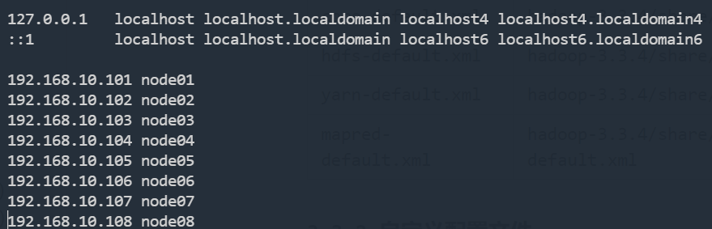

#### 3.4.1 核心配置文件（core-site.xml）

执行如下命令，编辑 `core-site.xml` 文件：

```shell
cd $HADOOP_HOME/etc/hadoop
vim core-site.xml
```

文件内容如下:

```xml
<?xml-stylesheet type="text/xsl" href="configuration.xsl"?>
<configuration>
    <!-- 指定NameNode的地址 -->
    <property>
        <name>fs.defaultFS</name>
        <value>hdfs://node01:8020</value>
    </property>

    <!-- 指定hadoop数据的存储目录 -->
    <property>
        <name>hadoop.tmp.dir</name>
        <value>/opt/hadoop-3.3.4/data</value>
    </property>

    <!-- 配置HDFS网页登录使用的静态用户为bigcoder -->
    <property>
        <name>hadoop.http.staticuser.user</name>
        <value>bigcoder</value>
    </property>
</configuration>
```

#### 3.4.2 HDFS配置文件（hdfs-site.xml）

文件内容如下：

```xml
<?xml version="1.0" encoding="UTF-8"?>
<?xml-stylesheet type="text/xsl" href="configuration.xsl"?>

<configuration>
	<!-- NameNode web端访问地址-->
	<property>
        <name>dfs.namenode.http-address</name>
        <value>node01:9870</value>
    </property>
	<!-- SecondaryNameNode web端访问地址-->
    <property>
        <name>dfs.namenode.secondary.http-address</name>
        <value>node03:9868</value>
    </property>
</configuration>
```

#### 3.4.3 YARN配置文件（yarn-site.xml）

文件内容如下：

```xml
<?xml version="1.0" encoding="UTF-8"?>
<?xml-stylesheet type="text/xsl" href="configuration.xsl"?>

<configuration>
    <!-- 指定MR走shuffle -->
    <property>
        <name>yarn.nodemanager.aux-services</name>
        <value>mapreduce_shuffle</value>
    </property>

    <!-- 指定ResourceManager的地址-->
    <property>
        <name>yarn.resourcemanager.hostname</name>
        <value>node02</value>
    </property>

    <!-- 环境变量的继承 -->
    <property>
        <name>yarn.nodemanager.env-whitelist</name>
        <value>JAVA_HOME,HADOOP_COMMON_HOME,HADOOP_HDFS_HOME,HADOOP_CONF_DIR,CLASSPATH_PREPEND_DISTCACHE,HADOOP_YARN_HOME,HADOOP_MAPRED_HOME</value>
    </property>
</configuration>

```

#### 3.4.4 MapReduce配置文件（mapred-site.xml）

文件内容如下：

```xml
<?xml version="1.0" encoding="UTF-8"?>
<?xml-stylesheet type="text/xsl" href="configuration.xsl"?>

<configuration>
	<!-- 指定MapReduce程序运行在Yarn上 -->
    <property>
        <name>mapreduce.framework.name</name>
        <value>yarn</value>
    </property>
</configuration>
```

配置好 `node01` 实例后，将上述配置同步配置到`node02`、`node03`实例中，此处不再赘述。

### 3.5 启动集群

#### 3.5.1 配置workers

为 `node01`、`node02`、`node03`三个节点分别配置 workers 文件：

```shell
cd $HADOOP_HOME/etc/hadoop
vim workers
```

配置如下信息：

```txt
node01
node02
node03
```

这里也可以配置IP地址.

#### 3.5.2 启动集群

1. **如果集群是第一次启动**，需要在`node01`节点格式化 NameNode（注意：格式化NameNode，会产生新的集群id，导致NameNode和DataNode的集群id不一致，集群找不到已往数据。如果集群在运行过程中报错，需要重新格式化NameNode的话，一定要先停止namenode和datanode进程，并且要删除所有机器的data和logs目录，然后再进行格式化。）

   ```shell
    [root@node01 hadoop-3.3.4] hdfs namenode -format
   ```

   执行结果：

   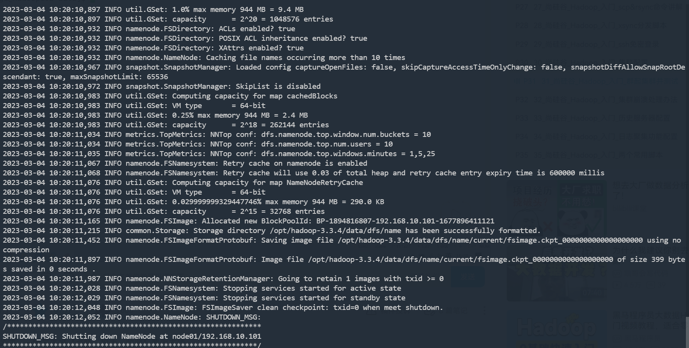

   执行完成后，就会生成 data 目录：

   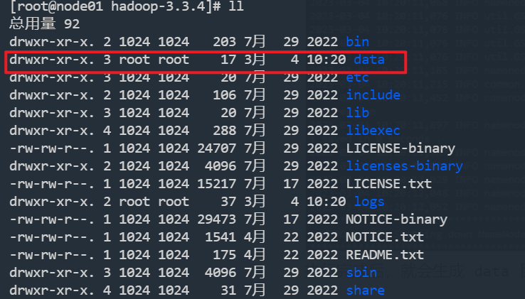

   在该文件夹下，有一个 `VERSION` 文件：

   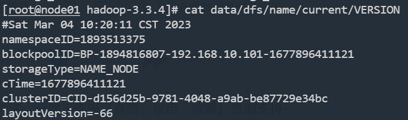

2. **启动HDFS**

   我们需要在配置 `NameNode` 节点上启动HDFS，也就是 `node01` 节点，启动直接执行 `sbin/start-dfs.sh` 即可，它会自动通过ssh登录到其它节点前去启动 `DataNode`、`SecondaryNameNode`：

   ```shell
   [root@node01 hadoop-3.3.4] sbin/start-dfs.sh
   ```

   启动时可能会报如下错误：

   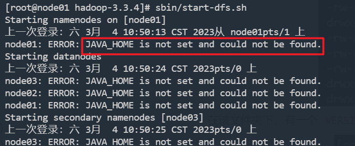

   需要分别配置三个节点 `${HADOOP_HOME}/etc/hadoop/hadoop-env.sh` 文件，在文件末尾加入如下指令：

   ```shell
   export JAVA_HOME=/usr/java/jdk-11.0.6
   ```

   然后重新在 `node01` 节点执行启动命令：

   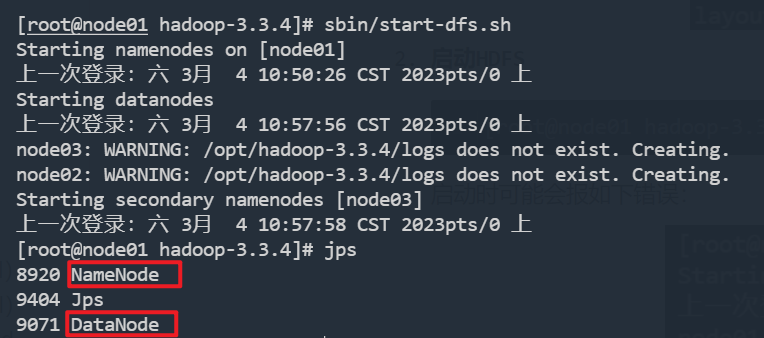

3. **启动YARN**

   在配置了ResourceManager的节点（node02）启动YARN：

   ```shell
   [root@node02 hadoop-3.3.4]# sbin/start-yarn.sh
   ```

   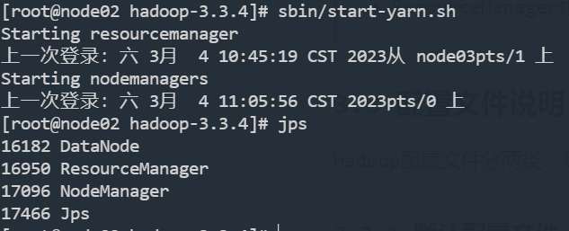

4. Web端查看HDFS的NameNode

   [http://192.168.10.101:9870/dfshealth.html#tab-datanode)](http://192.168.10.101:9870/dfshealth.html#tab-datanode)

   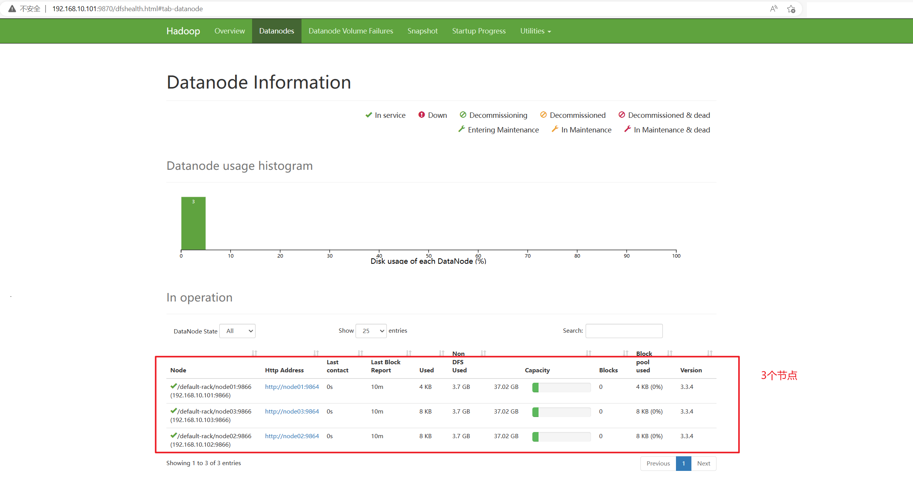

5. Web端查看YARN的ResourceManager

   [http://192.168.10.102:8088/cluster/nodes](http://192.168.10.102:8088/cluster/nodes)

   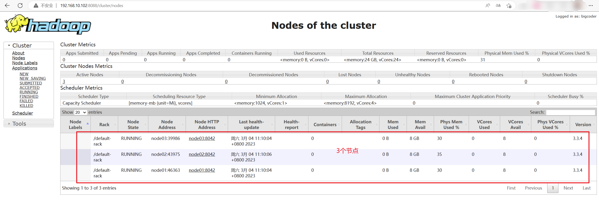

### 3.6 集群基本测试

#### 3.6.1 上传文件到集群

```shell
[root@node01 hadoop-3.3.4]# hadoop fs -mkdir /input
[root@node01 hadoop-3.3.4]# hadoop fs -put /opt/hadoop-3.3.4/etc/hadoop/core-site.xml /input
```

我们通过HDFS Web管理页面，就可以看到我们刚刚上传的文件：

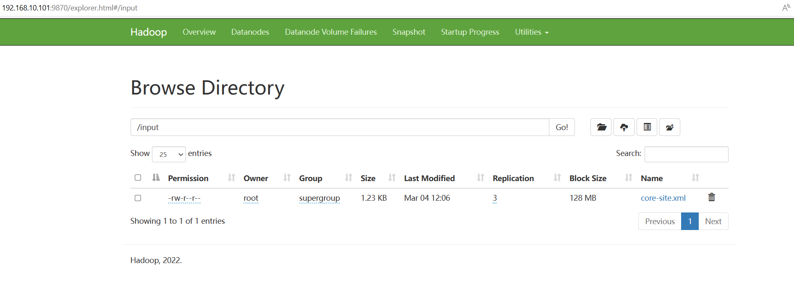

#### 3.6.2 从HDFS下载文件

```shell
[root@node01 opt]# hadoop fs -get /input/core-site.xml ./
[root@node01 opt]# ll
总用量 4
-rw-r--r--.  1 root root 1260 3月   4 12:13 core-site.xml
```

#### 3.6.3 执行 `word count` 示例MapReduce程序

第一步：将输入文件上传至 `wcinput` 文件夹

```shell
[root@node01 tmp]# hadoop fs -mkdir /wcinput
[root@node01 tmp]# hadoop fs -put word.txt /wcinput
```

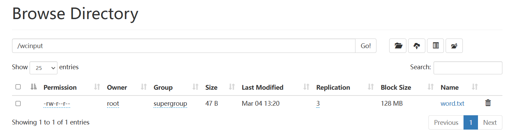

第二步：运行 `word count` 程序

```shell
[root@node01 hadoop-3.3.4]# hadoop jar share/hadoop/mapreduce/hadoop-mapreduce-examples-3.3.4.jar wordcount /wcinput /wcoutput
```

执行过程中，我们进入`Yarn` WEB控制台，可以看到正在运行的任务状态：

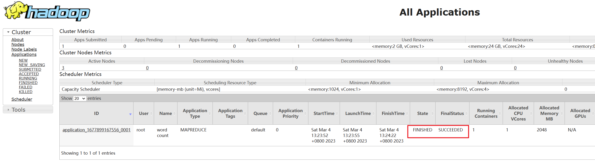

我们再次进入 `HDFS` WEB控制台，可以发现HDFS新增了 `/wcoutput` 目录，里面存放着 `word count` 程序所执行的结果：

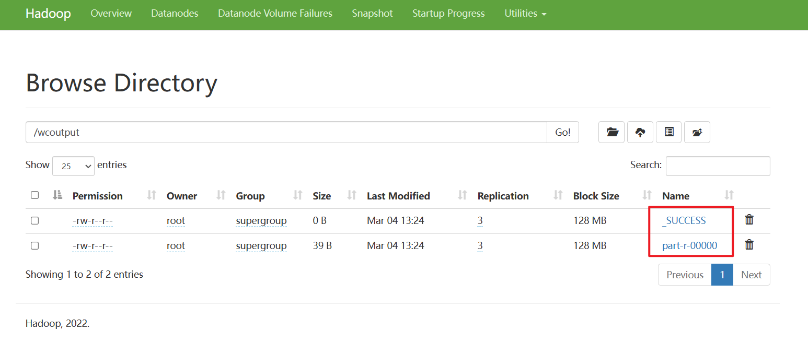

### 3.7 配置历史服务器

在Yarn控制台，每一个任务后面都有 `History` 按钮，用于查看任务历史运行情况，但是默认情况，点击该按钮是无法查看的。


为了查看程序的历史运行情况，需要配置一下历史服务器。具体配置步骤如下：

**第一步：配置mapred-site.xml**

在集群所有节点的 `mapred-site.xml` 文件上，新增如下配置

```xml
    <!-- 历史服务器端地址 -->
    <property>
        <name>mapreduce.jobhistory.address</name>
        <value>node01:10020</value>
    </property>

    <!-- 历史服务器web端地址 -->
    <property>
        <name>mapreduce.jobhistory.webapp.address</name>
        <value>node01:19888</value>
    </property>
```

**第二步：重启YARN**

启动和关闭YARN，需要在 `ResourceManager` 所在节点上执行，也就是我们的 `node02` 节点：

```shell
[root@node02 hadoop-3.3.4]# ./sbin/stop-yarn.sh # 关闭yarn
[root@node02 hadoop-3.3.4]# ./sbin/start-yarn.sh # 重启yarn
```

**第三步：在 `node01` 上启动历史服务器**

```shell
[root@node01 hadoop-3.3.4]# mapred --daemon start historyserver
```

启动完成后，接可以看到历史服务器的Java进程了：

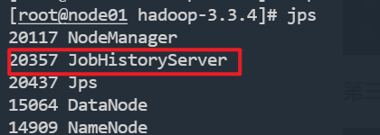

这样，我们通过 [http://192.168.10.101:19888/jobhistory](http://192.168.10.101:19888/jobhistory)就可以访问历史服务器了：

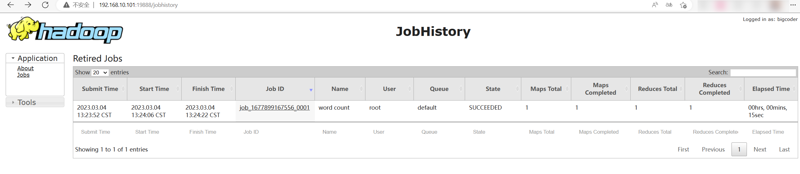

此时我们再次点击 `History` 按钮，即可查看历史运行信息：

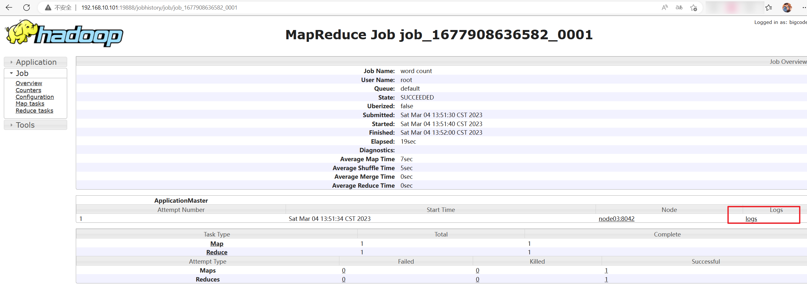

### 3.8 配置日志聚合

在任务历史运行情况的页面，有一个 `logs` 入口，可以查看该任务在运行期间产生的日志，默认情况下，也是无法访问的：

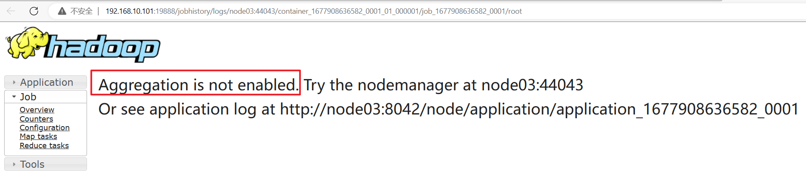

所以此时，我们可以配置日志聚合。

日志聚集概念：应用运行完成以后，将程序运行日志信息上传到HDFS系统上。

日志聚集功能好处：可以方便的查看到程序运行详情，方便开发调试。

注意：开启日志聚集功能，需要重新启动NodeManager 、ResourceManager和HistoryServer。

开启日志聚集功能具体步骤如下：

**第一步：配置yarn-site.xml**

在集群所有节点的 `yarn-site.xml` 文件上，新增如下配置

```xml
    <!-- 开启日志聚集功能 -->
    <property>
        <name>yarn.log-aggregation-enable</name>
        <value>true</value>
    </property>
    <!-- 设置日志聚集服务器地址 -->
    <property>  
        <name>yarn.log.server.url</name>  
        <value>http://node01:19888/jobhistory/logs</value>
    </property>
    <!-- 设置日志保留时间为7天 -->
    <property>
        <name>yarn.log-aggregation.retain-seconds</name>
        <value>604800</value>
    </property>
```

**第二步：关闭 NodeManager 、ResourceManager、HistoryServer**

- 在 `node02` 上关闭 `ResourceManager`：

```shell
[root@node02 hadoop-3.3.4]# ./sbin/stop-yarn.sh 
```

- 在 `node01` 上关闭 历史服务器：

```shell
[root@node01 hadoop-3.3.4]# mapred --daemon stop historyserver
```

**第三步：启动NodeManager 、ResourceManage、HistoryServer**

```shell
[root@node02 hadoop-3.3.4]# ./sbin/start-yarn.sh 
[root@node01 hadoop-3.3.4]# mapred --daemon start historyserver
```

到此，日志聚合配置已经完成，我们来测试一下日志聚合，重新执行一下 `map-reduce` 程序：

```shell
[root@node01 hadoop-3.3.4]# hadoop fs -rm -r /wcoutput
Deleted /wcoutput
[root@node01 hadoop-3.3.4]# hadoop jar share/hadoop/mapreduce/hadoop-mapreduce-examples-3.3.4.jar wordcount /wcinput /wcoutput
```

进入历史任务列表：

[http://192.168.10.101:19888/jobhistory](http://192.168.10.101:19888/jobhistory)

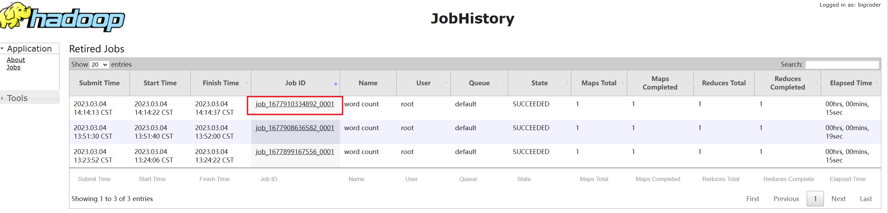

查看任务运行情况：

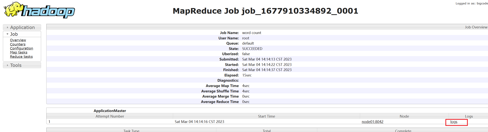

查看运行日志：

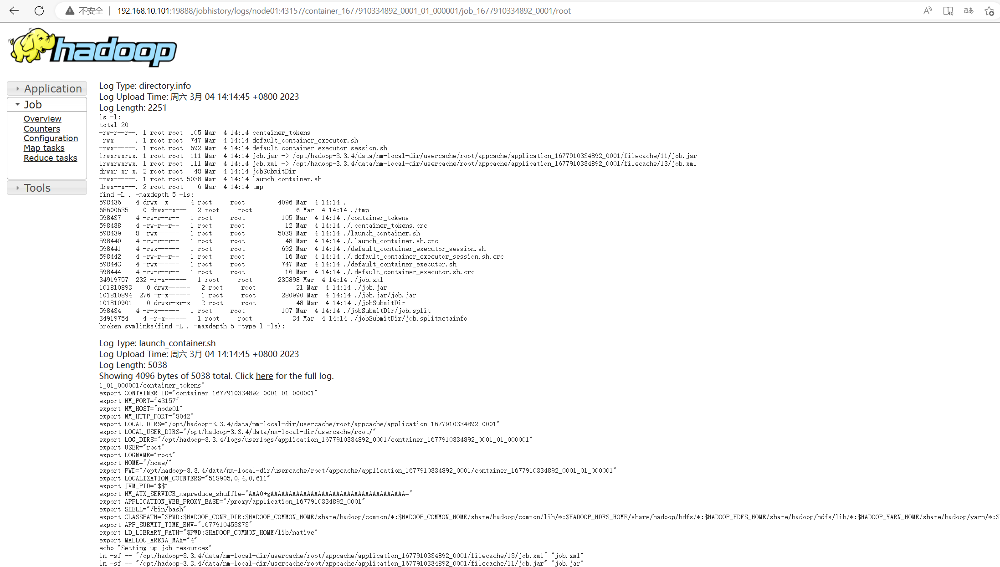

### 3.9 集群一键启动脚本

集群的组件比较多，组件分布在不同实例上，启动相对比较复杂，我们可以写一个shell脚本，实现一键启动和停止。

在集群任意节点，任意位置创建 `hadoop-cluster` 脚本文件：

```shell
vim hadoop-cluster
```

在脚本文件中插入如下类容：

```shell
#!/bin/bash

if [ $# -lt 1 ]
then
    echo "No Args Input..."
    exit ;
fi

case $1 in
"start")
        echo " =================== 启动 hadoop集群 ==================="

        echo " --------------- 启动 hdfs ---------------"
        ssh node01 "/opt/hadoop-3.3.4/sbin/start-dfs.sh"
        echo " --------------- 启动 yarn ---------------"
        ssh node02 "/opt/hadoop-3.3.4/sbin/start-yarn.sh"
        echo " --------------- 启动 historyserver ---------------"
        ssh node01 "/opt/hadoop-3.3.4/bin/mapred --daemon start historyserver"
;;
"stop")
        echo " =================== 关闭 hadoop集群 ==================="

        echo " --------------- 关闭 historyserver ---------------"
        ssh node01 "/opt/hadoop-3.3.4/bin/mapred --daemon stop historyserver"
        echo " --------------- 关闭 yarn ---------------"
        ssh node02 "/opt/hadoop-3.3.4/sbin/stop-yarn.sh"
        echo " --------------- 关闭 hdfs ---------------"
        ssh node01 "/opt/hadoop-3.3.4/sbin/stop-dfs.sh"
;;
*)
    echo "Input Args Error..."
;;
esac
```

给脚本文件赋执行权限：

```shell
chmod +x hadoop-cluster
```

停止 hadoop 集群：

```shell
hadoop-cluster stop
```

启动 hadoop 集群：

```shell
hadoop-cluster start
```

