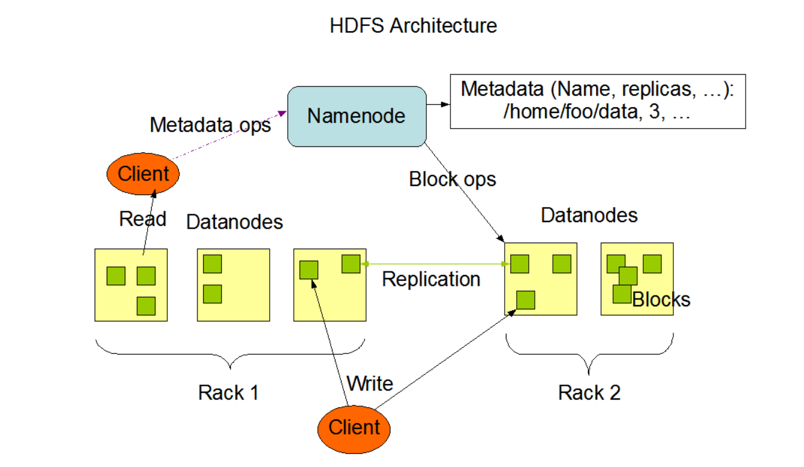
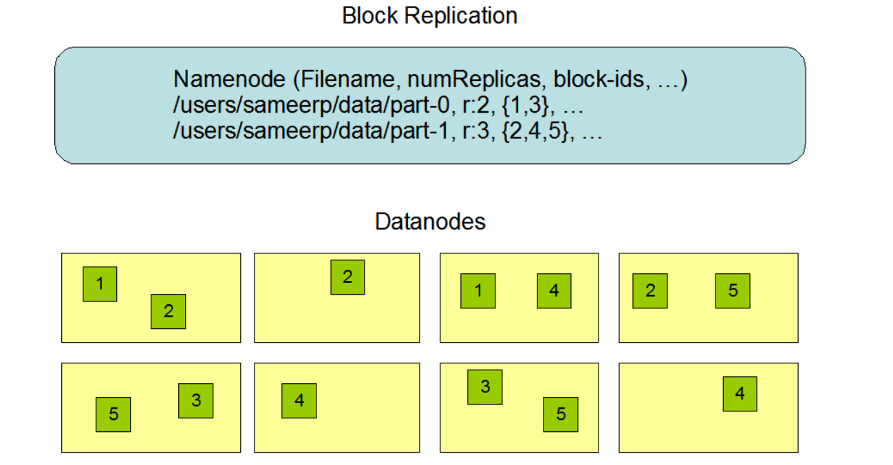

# HDFS详解

## 一. HDFS概述

### 1.1 HDFS 产出背景及定义

**产生背景**

随着数据量越来越大，在一个操作系统存不下所有的数据，那么就分配到更多的操作系统管理的磁盘中，但是不方便管理和维护，迫切需要一种系统来管理多台机器上的文件，这就是分布式[文件管理系统](https://so.csdn.net/so/search?q=文件管理系统&spm=1001.2101.3001.7020)。HDFS 只是分布式文件管理系统中的一种。

**HDFS定义**

HDFS（Hadoop Distributed File System），它是一个文件系统，用于存储文件，通过目录树来定位文件；其次，它是分布式的，由很多服务器联合起来实现其功能，集群中的服务器有各自的角色。 HDFS 的使用场景：**适合一次写入，多次读出的场景。一个文件经过创建、写入和关闭之后就不需要改变**。

### 1.2 HDFS 优缺点

**优点**

- 高容错性

  - 数据自动保存多个副本。它通过增加副本的形式，提高容错性。

  - 某一个副本丢失以后，它可以自动恢复。

- 适合处理大数据
  - 数据规模：能够处理数据规模达到GB、TB、甚至PB级别的数据；
  - 文件规模：能够处理百万规模以上的文件数量，数量相当之大。
  - 可构建在廉价机器上，通过多副本机制，提高可靠性。

**缺点**

- 不适合低延时数据访问，比如毫秒级的存储数据，是做不到的。
- 无法高效的对大量小文件进行存储。
- 存储大量小文件的话，它会占用NameNode大量的内存来存储文件目录和块信息。这样是不可取的，因为NameNode的内存总是有限的；小文件存储的寻址时间会超过读取时间，它违反了HDFS的设计目标。
- 不支持并发写入、文件随机修改。hdfs的不能并发写指的是同位置同名文件只能有一个writer，否则会使得所有的上传请求失败。
- 仅支持数据append（追加），不支持文件的随机修改

### 1.2 HDFS设计目标

Hadoop分布式文件系统(HDFS)被设计成适合运行在通用硬件(commodity hardware)上的分布式文件系统。它和现有的分布式文件系统有很多共同点。但同时，它和其他的分布式文件系统的区别也是很明显的。HDFS是一个高度容错性的系统，适合部署在廉价的机器上。HDFS能提供高吞吐量的数据访问，非常适合大规模数据集上的应用。HDFS放宽了一部分POSIX约束，来实现流式读取文件系统数据的目的。HDFS在最开始是作为Apache Nutch搜索引擎项目的基础架构而开发的。HDFS是Apache Hadoop Core项目的一部分。这个项目的地址是https://hadoop.apache.org/core/。

#### 1.2.1 硬件错误

硬件错误是常态而不是异常。HDFS可能由成百上千的服务器所构成，每个服务器上存储着文件系统的部分数据。我们面对的现实是构成系统的组件数目是巨大的，而且任一组件都有可能失效，这意味着总是有一部分HDFS的组件是不工作的。因此**错误检测**和**快速、自动的恢复**是HDFS最核心的架构目标。

#### 1.2.2 流式数据访问

运行在HDFS上的应用和普通的应用不同，需要流式访问它们的数据集。HDFS的设计中更多的考虑到了数据批处理，而不是用户交互处理。比之数据访问的低延迟问题，更关键的在于数据访问的高吞吐量。POSIX标准设置的很多硬性约束对HDFS应用系统不是必需的。为了提高数据的吞吐量，在一些关键方面对POSIX的语义做了一些修改。

#### 1.2.3 大规模数据集

运行在HDFS上的应用具有很大的数据集。HDFS上的一个典型文件大小一般都在G字节至T字节。因此，HDFS被调节以支持大文件存储。它应该能提供整体上高的数据传输带宽，能在一个集群里扩展到数百个节点。一个单一的HDFS实例应该能支撑数以千万计的文件。

#### 1.2.4 简单的一致性模型

HDFS应用需要一个“一次写入多次读取”的文件访问模型。一个文件经过创建、写入和关闭之后就不需要改变。这一假设简化了数据一致性问题，并且使高吞吐量的数据访问成为可能。Map/Reduce应用或者网络爬虫应用都非常适合这个模型。目前还有计划在将来扩充这个模型，使之支持文件的附加写操作。

#### 1.2.5 移动计算比移动数据更划算

一个应用请求的计算，离它操作的数据越近就越高效，在数据达到海量级别的时候更是如此。因为这样就能降低网络阻塞的影响，提高系统数据的吞吐量。将计算移动到数据附近，比之将数据移动到应用所在显然更好。HDFS为应用提供了将它们自己移动到数据附近的接口。

#### 1.2.6 异构软硬件平台间的可移植性

HDFS在设计的时候就考虑到平台的可移植性。这种特性方便了HDFS作为大规模数据应用平台的推广。

### 1.3 HDFS架构

HDFS采用master/slave架构。一个HDFS集群是由一个Namenode和一定数目的Datanodes组成。Namenode是一个中心服务器，负责管理文件系统的名字空间(namespace)以及客户端对文件的访问。集群中的Datanode一般是一个节点一个，负责管理它所在节点上的存储。HDFS暴露了文件系统的名字空间，用户能够以文件的形式在上面存储数据。从内部看，一个文件其实被分成一个或多个数据块，这些块存储在一组Datanode上。Namenode执行文件系统的名字空间操作，比如打开、关闭、重命名文件或目录。它也负责确定数据块到具体Datanode节点的映射。Datanode负责处理文件系统客户端的读写请求。在Namenode的统一调度下进行数据块的创建、删除和复制。



Namenode和Datanode被设计成可以在普通的商用机器上运行。这些机器一般运行着GNU/Linux操作系统(OS)。HDFS采用Java语言开发，因此任何支持Java的机器都可以部署Namenode或Datanode。由于采用了可移植性极强的Java语言，使得HDFS可以部署到多种类型的机器上。一个典型的部署场景是一台机器上只运行一个Namenode实例，而集群中的其它机器分别运行一个Datanode实例。这种架构并不排斥在一台机器上运行多个Datanode，只不过这样的情况比较少见。

集群中单一Namenode的结构大大简化了系统的架构。Namenode是所有HDFS元数据的仲裁者和管理者，这样，用户数据永远不会流过Namenode。

### 1.4 文件系统的名字空间 (namespace)

HDFS支持传统的层次型文件组织结构。用户或者应用程序可以创建目录，然后将文件保存在这些目录里。文件系统名字空间的层次结构和大多数现有的文件系统类似：用户可以创建、删除、移动或重命名文件。当前，HDFS不支持用户磁盘配额和访问权限控制，也不支持硬链接和软链接。但是HDFS架构并不妨碍实现这些特性。

Namenode负责维护文件系统的名字空间，任何对文件系统名字空间或属性的修改都将被Namenode记录下来。应用程序可以设置HDFS保存的文件的副本数目。文件副本的数目称为文件的副本系数，这个信息也是由Namenode保存的。

### 1.5 数据复制

HDFS被设计成能够在一个大集群中跨机器可靠地存储超大文件。它将每个文件存储成一系列的数据块，除了最后一个，所有的数据块都是同样大小的。为了容错，文件的所有数据块都会有副本。每个文件的数据块大小和副本系数都是可配置的。应用程序可以指定某个文件的副本数目。副本系数可以在文件创建的时候指定，也可以在之后改变。HDFS中的文件都是一次性写入的，并且严格要求在任何时候只能有一个写入者。

Namenode全权管理数据块的复制，它周期性地从集群中的每个Datanode接收心跳信号和块状态报告(Blockreport)。接收到心跳信号意味着该Datanode节点工作正常。块状态报告包含了一个该Datanode上所有数据块的列表。



### 1.6 副本策略

副本的存放是HDFS可靠性和性能的关键。优化的副本存放策略是HDFS区分于其他大部分分布式文件系统的重要特性。这种特性需要做大量的调优，并需要经验的积累。HDFS采用一种称为机架感知(rack-aware)的策略来改进数据的可靠性、可用性和网络带宽的利用率。目前实现的副本存放策略只是在这个方向上的第一步。实现这个策略的短期目标是验证它在生产环境下的有效性，观察它的行为，为实现更先进的策略打下测试和研究的基础。

大型HDFS实例一般运行在跨越多个机架的计算机组成的集群上，不同机架上的两台机器之间的通讯需要经过交换机。在大多数情况下，同一个机架内的两台机器间的带宽会比不同机架的两台机器间的带宽大。

通过一个[机架感知](https://hadoop.apache.org/docs/r1.0.4/cn/cluster_setup.html#Hadoop的机架感知)的过程，Namenode可以确定每个Datanode所属的机架id。一个简单但没有优化的策略就是将副本存放在不同的机架上。这样可以有效防止当整个机架失效时数据的丢失，并且允许读数据的时候充分利用多个机架的带宽。这种策略设置可以将副本均匀分布在集群中，有利于当组件失效情况下的负载均衡。但是，因为这种策略的一个写操作需要传输数据块到多个机架，这增加了写的代价。

在大多数情况下，副本系数是3，HDFS的存放策略是将一个副本存放在本地机架的节点上，一个副本放在同一机架的另一个节点上，最后一个副本放在不同机架的节点上。这种策略减少了机架间的数据传输，这就提高了写操作的效率。机架的错误远远比节点的错误少，所以这个策略不会影响到数据的可靠性和可用性。于此同时，因为数据块只放在两个（不是三个）不同的机架上，所以此策略减少了读取数据时需要的网络传输总带宽。在这种策略下，副本并不是均匀分布在不同的机架上。三分之一的副本在一个节点上，三分之二的副本在一个机架上，其他副本均匀分布在剩下的机架中，这一策略在不损害数据可靠性和读取性能的情况下改进了写的性能。

为了降低整体的带宽消耗和读取延时，HDFS会尽量让读取程序读取离它最近的副本。如果在读取程序的同一个机架上有一个副本，那么就读取该副本。如果一个HDFS集群跨越多个数据中心，那么客户端也将首先读本地数据中心的副本

### 1.7 安全模式

Namenode启动后会进入一个称为安全模式的特殊状态。处于安全模式的Namenode是不会进行数据块的复制的。Namenode从所有的Datanode接收心跳信号和块状态报告。块状态报告包括了某个Datanode所有的数据块列表。每个数据块都有一个指定的最小副本数。当Namenode检测确认某个数据块的副本数目达到这个最小值，那么该数据块就会被认为是副本安全(safely replicated)的；在一定百分比（这个参数可配置）的数据块被Namenode检测确认是安全之后（加上一个额外的30秒等待时间），Namenode将退出安全模式状态。接下来它会确定还有哪些数据块的副本没有达到指定数目，并将这些数据块复制到其他Datanode上。

### 1.8 文件系统元数据的持久化

Namenode上保存着HDFS的名字空间。对于任何对文件系统元数据产生修改的操作，Namenode都会使用一种称为EditLog的事务日志记录下来。例如，在HDFS中创建一个文件，Namenode就会在Editlog中插入一条记录来表示；同样地，修改文件的副本系数也将往Editlog插入一条记录。Namenode在本地操作系统的文件系统中存储这个Editlog。整个文件系统的名字空间，包括数据块到文件的映射、文件的属性等，都存储在一个称为FsImage的文件中，这个文件也是放在Namenode所在的本地文件系统上。

Namenode在内存中保存着整个文件系统的名字空间和文件数据块映射(Blockmap)的映像。这个关键的元数据结构设计得很紧凑，因而一个有4G内存的Namenode足够支撑大量的文件和目录。当Namenode启动时，它从硬盘中读取Editlog和FsImage，将所有Editlog中的事务作用在内存中的FsImage上，并将这个新版本的FsImage从内存中保存到本地磁盘上，然后删除旧的Editlog，因为这个旧的Editlog的事务都已经作用在FsImage上了。这个过程称为一个检查点(checkpoint)。在当前实现中，检查点只发生在Namenode启动时，在不久的将来将实现支持周期性的检查点。

Datanode将HDFS数据以文件的形式存储在本地的文件系统中，它并不知道有关HDFS文件的信息。它把每个HDFS数据块存储在本地文件系统的一个单独的文件中。Datanode并不在同一个目录创建所有的文件，实际上，它用试探的方法来确定每个目录的最佳文件数目，并且在适当的时候创建子目录。在同一个目录中创建所有的本地文件并不是最优的选择，这是因为本地文件系统可能无法高效地在单个目录中支持大量的文件。当一个Datanode启动时，它会扫描本地文件系统，产生一个这些本地文件对应的所有HDFS数据块的列表，然后作为报告发送到Namenode，这个报告就是块状态报告。

> 参考：https://hadoop.apache.org/docs/r1.0.4/cn/hdfs_design.html

## 二. HDFS Shell操作

### 2.1 基本语法

- hadoop fs 具体命令
- hdfs dfs 具体命令

上述两种命令格式是等价的。

### 2.2 HDFS 命令

```shell
$ bin/hadoop fs
[-appendToFile <localsrc> ... <dst>]
 [-cat [-ignoreCrc] <src> ...]
 [-chgrp [-R] GROUP PATH...]
 [-chmod [-R] <MODE[,MODE]... | OCTALMODE> PATH...]
 [-chown [-R] [OWNER][:[GROUP]] PATH...]
 [-copyFromLocal [-f] [-p] <localsrc> ... <dst>]
 [-copyToLocal [-p] [-ignoreCrc] [-crc] <src> ... <localdst>]
 [-count [-q] <path> ...]
 [-cp [-f] [-p] <src> ... <dst>]
 [-df [-h] [<path> ...]]
 [-du [-s] [-h] <path> ...]
 [-get [-p] [-ignoreCrc] [-crc] <src> ... <localdst>]
 [-getmerge [-nl] <src> <localdst>]
 [-help [cmd ...]]
 [-ls [-d] [-h] [-R] [<path> ...]]
 [-mkdir [-p] <path> ...]
 [-moveFromLocal <localsrc> ... <dst>]
 [-moveToLocal <src> <localdst>]
 [-mv <src> ... <dst>]
 [-put [-f] [-p] <localsrc> ... <dst>]
 [-rm [-f] [-r|-R] [-skipTrash] <src> ...]
 [-rmdir [--ignore-fail-on-non-empty] <dir> ...]
<acl_spec> <path>]]
 [-setrep [-R] [-w] <rep> <path> ...]
 [-stat [format] <path> ...]
 [-tail [-f] <file>]
 [-test -[defsz] <path>]
 [-text [-ignoreCrc] <src> ...]
```

#### 2.2.1 上传

1. `-moveFromLocal`：从本地剪切粘贴到 HDFS

   ```shell
   hadoop fs -moveFromLocal ./shuguo.txt /sanguo
   ```

   - ./shuguo.txt 本地文件
   - /sanguo HDFS文件夹

2. `-copyFromLocal`：从本地文件系统中拷贝文件到 HDFS 路径去

3. `-put`：等同于 copyFromLocal，生产环境更习惯用 put

4. `-appendToFile`：追加一个文件到已经存在的文件末尾

#### 2.2.2 下载

1. `-copyToLocal`：从 HDFS 拷贝到本地

   ```shell
    hadoop fs -copyToLocal /sanguo/shuguo.txt ./
   ```

2. `-get`：等同于 copyToLocal，生产环境更习惯用 get

#### 2.2.4 HDFS 直接操作

1. `-ls`: 显示目录信息

   ```shell
   $ hadoop fs -ls /sanguo
   ```

2. `-cat`：显示文件内容

3. `-chgrp`、`-chmod`、`-chown`：Linux 文件系统中的用法一样，修改文件所属权限

4. `-mkdir`：创建文件夹

5. `-cp`：从 HDFS 的一个路径拷贝到 HDFS 的另一个路径

6. `-mv`：在 HDFS 目录中移动文件

7. `-tail`：显示一个文件的末尾 1kb 的数据

8. `-rm`：删除文件或文件夹
9. `-rm -r`：递归删除目录及目录里面内容
10. `-du` 统计文件夹的大小信息
11. `-setrep`：设置 HDFS 中文件的副本数量。这里设置的副本数只是记录在 NameNode 的元数据中，是否真的会有这么多副本，还得 看 DataNode 的数量。因为目前只有 3 台设备，最多也就 3 个副本，只有节点数的增加到 10 台时，副本数才能达到 10。

## 三. API操作

在Java项目中引入如下依赖：

```xml
<dependency>
    <groupId>org.apache.hadoop</groupId>
    <artifactId>hadoop-client</artifactId>
    <version>3.3.4</version>
</dependency>
```

需要注意的是，客户端版本要和Hadoop集群保持一致。

### 3.1 创建文件夹

```java
// 1 获取文件系统
Configuration configuration = new Configuration();

FileSystem fs = FileSystem.get(new URI("hdfs://192.168.10.101:8020"), configuration, "root");

// 2 创建目录
fs.mkdirs(new Path("/xiyou/huaguoshan/"));

// 3 关闭资源
fs.close();
```

### 3.2 文件上传

```java
// 1 获取文件系统
Configuration configuration = new Configuration();
// 副本个数
configuration.set("dfs.replication", "2");
FileSystem fs = FileSystem.get(new URI("hdfs://192.168.10.101:8020"), configuration, "root");

// 2 上传文件
fs.copyFromLocalFile(new Path("d:/sunwukong.txt"), new Path("/xiyou/huaguoshan"));

// 3 关闭资源
fs.close();
```

**参数优先级**

参数优先级排序：（1）客户端代码中设置的值 >（2）ClassPath下的用户自定义配置文件 >（3）然后是服务器的自定义配置（xxx-site.xml） >（4）服务器的默认配置（xxx-default.xml）

### 3.3 文件下载

```java
// 1 获取文件系统
Configuration configuration = new Configuration();
FileSystem fs = FileSystem.get(new URI("hdfs://192.168.10.101:8020"), configuration, "root");

// 2 执行下载操作
// boolean delSrc 指是否将原文件删除
// Path src 指要下载的文件路径
// Path dst 指将文件下载到的路径
// boolean useRawLocalFileSystem 是否开启文件校验
fs.copyToLocalFile(false, new Path("/xiyou/huaguoshan/sunwukong.txt"), new Path("d:/sunwukong2.txt"), true);

// 3 关闭资源
fs.close();
```

注意：如果执行上面代码，下载不了文件，有可能是你电脑的微软支持的运行库少，需要安装一下微软运行库。

### 3.4 文件更名或移动

```java
// 1 获取文件系统
Configuration configuration = new Configuration();
FileSystem fs = FileSystem.get(new URI("hdfs://192.168.10.101:8020"), configuration, "root"); 
	
// 2 修改文件名称
fs.rename(new Path("/xiyou/huaguoshan/sunwukong.txt"), new Path("/xiyou/huaguoshan/meihouwang.txt"));
	
// 3 关闭资源
fs.close();
```

### 3.5 删除文件和目录

```java
// 1 获取文件系统
Configuration configuration = new Configuration();
FileSystem fs = FileSystem.get(new URI("hdfs://192.168.10.101:8020"), configuration, "root");
	
// 2 执行删除
fs.delete(new Path("/xiyou"), true);
	
// 3 关闭资源
fs.close();
```

### 3.6 文件详情查看

```java
// 1 获取文件系统
Configuration configuration = new Configuration();
FileSystem fs = FileSystem.get(new URI("hdfs://192.168.10.101:8020"), configuration, "root"); 

// 2 获取文件详情
RemoteIterator<LocatedFileStatus> listFiles = fs.listFiles(new Path("/"), true);

while (listFiles.hasNext()) {
	LocatedFileStatus fileStatus = listFiles.next();

	System.out.println("========" + fileStatus.getPath() + "=========");
	System.out.println(fileStatus.getPermission());
	System.out.println(fileStatus.getOwner());
	System.out.println(fileStatus.getGroup());
	System.out.println(fileStatus.getLen());
	System.out.println(fileStatus.getModificationTime());
	System.out.println(fileStatus.getReplication());
	System.out.println(fileStatus.getBlockSize());
	System.out.println(fileStatus.getPath().getName());

	// 获取块信息
	BlockLocation[] blockLocations = fileStatus.getBlockLocations();
	System.out.println(Arrays.toString(blockLocations));
}
// 3 关闭资源
fs.close();
```

### 3.7 文件和文件夹判断

```java
// 1 获取文件系统
Configuration configuration = new Configuration();
FileSystem fs = FileSystem.get(new URI("hdfs://192.168.10.101:8020"), configuration, "root");     

// 2 判断是文件还是文件夹
FileStatus[] listStatus = fs.listStatus(new Path("/"));

for (FileStatus fileStatus : listStatus) {

    // 如果是文件
    if (fileStatus.isFile()) {
        System.out.println("f:"+fileStatus.getPath().getName());
    }else {
        System.out.println("d:"+fileStatus.getPath().getName());
    }
}

// 3 关闭资源
fs.close();
```


