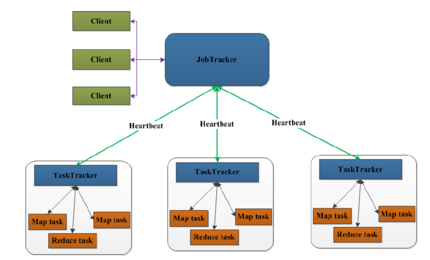
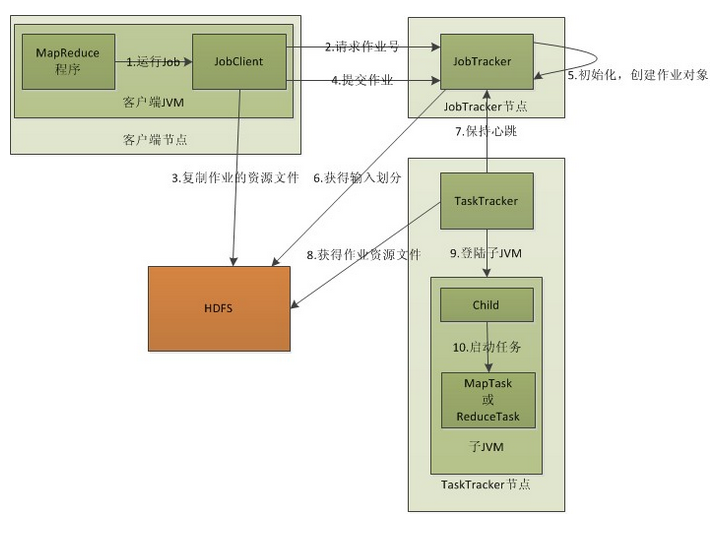
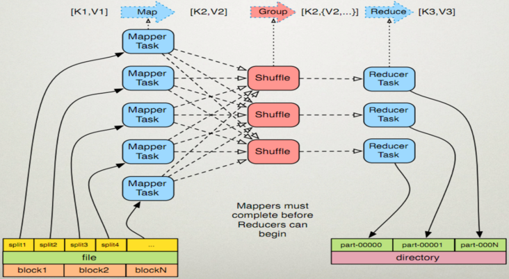
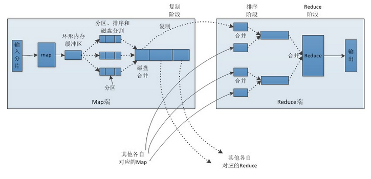

# MapReduce

## 一. 概述

### 1.1 MapReduce定义

MapReduce是一个分布式运算程序的编程框架，是用户开发“基于Hadoop的数据分析应用”的核心框架。

MapReduce核心功能是将用户编写的业务逻辑代码和自带默认组件整合成一个完整的分布式运算程序，并发运行在一个Hadoop集群上。

### 1.2 MapReduce优缺点

**优点**

1. MapReduce易于编程：它简单的实现一些接口，就可以完成一个分布式程序，这个分布式程序可以分布到大量廉价的PC机器上运行。也就是说你写一个分布式程序，跟写一个简单的串行程序是一模一样的。就是因为这个特点使得MapReduce编程变得非常流行。
2. 良好的扩展性：当你的计算资源不能得到满足的时候，你可以通过简单的增加机器来扩展它的计算能力。
3. 高容错性：MapReduce设计的初衷就是使程序能够部署在廉价的PC机器上，这就要求它具有很高的容错性。比如其中一台机器挂了，它可以把上面的计算任务转移到另外一个节点上运行，不至于这个任务运行失败，而且这个过程不需要人工参与，而完全是由Hadoop内部完成的。
4. 适合PB级以上海量数据的离线处理：可以实现上千台服务器集群并发工作，提供数据处理能力。

**缺点**

1. 不擅长实时计算：MapReduce无法像MySQL一样，在毫秒或者秒级内返回结果。
2. 不擅长流式计算：流式计算的输入数据是动态的，而MapReduce的输入数据集是静态的，不能动态变化。这是因为MapReduce自身的设计特点决定了数据源必须是静态的。
3. 不擅长DAG（有向无环图）计算：多个应用程序存在依赖关系，后一个应用程序的输入为前一个的输出。在这种情况下，MapReduce并不是不能做，而是使用后，每个MapReduce作业的输出结果都会写入到磁盘，会造成大量的磁盘IO，导致性能非常的低下。

## 二. 核心思想（分而治之）

当我们需要对一个大规模数据集进行处理时，传统的处理方式是将整个数据集加载到单个计算机的内存中进行处理，这样会出现内存不足的问题。而 Hadoop MapReduce 的核心思想是将数据集分割成多个小块，并在分布式的计算节点上并行处理这些小块，最终将结果汇总起来。

下面举一个简单的例子来说明 Hadoop MapReduce 的核心思想：

假设我们有一个包含 10 亿个整数的数据集，我们需要对这些整数进行求和。如果使用传统的方式，在单个计算机上进行处理，很容易会出现内存不足的问题。而使用 Hadoop MapReduce，则可以将数据集划分成多个小块，每个小块包含一部分整数。然后，将这些小块分发到不同的计算节点上，并在每个节点上运行一个 Map 任务，对这些小块中的整数进行求和操作。最后，将这些求和结果传输到一个节点上，并在该节点上运行一个 Reduce 任务，将所有结果求和，得到最终的结果。

使用 Hadoop MapReduce 的核心思想，我们可以将大规模的数据集分解成多个小块，并在分布式的计算节点上进行并行处理，从而提高了处理效率。同时，由于每个计算节点只需要处理部分数据，因此可以避免内存不足等问题。

## 三. MapReduce架构

### 3.1 整体架构

一个完整的 MapReduce 程序在分布式运行时，涉及到以下几个进程：

1. JobClient：JobClient 是用户提交 MapReduce 作业的客户端程序，它负责向 Hadoop 集群提交作业请求，并监控作业的运行状态。
2. JobTracker：JobTracker 是 Hadoop 集群的主节点上运行的守护进程，它负责接收 JobClient 提交的作业请求，并将作业分配给可用的 TaskTracker 节点进行处理。JobTracker 还负责监控 TaskTracker 节点的状态，并在出现故障时进行故障转移。**一个Hadoop集群中只有一台JobTracker**。
3. TaskTracker：TaskTracker 是 Hadoop 集群的工作节点上运行的守护进程，它负责接收 JobTracker 分配的任务，包括 Map 任务和 Reduce 任务，并在本地执行任务。TaskTracker 还负责将任务执行进度和状态汇报给 JobTracker。
4. Map Task：Map Task 是在 TaskTracker 节点上运行的 Map 任务，它负责读取分配给它的数据块，并将其转换为键值对进行处理。
5. Reduce Task：Reduce Task 是在 TaskTracker 节点上运行的 Reduce 任务，它负责接收 Map 任务输出的键值对，并根据键进行分组和聚合。

在 MapReduce 程序的执行过程中，JobClient 和 JobTracker 通常运行在集群的主节点上，而 TaskTracker 和 Map/Reduce Task 则运行在集群的工作节点上。整个 MapReduce 程序的执行过程中，JobTracker 会不断地监控任务的执行状态，将失败的任务重新分配到其他可用的节点上，直到所有的任务完成为止。

客户端向JobTracker提交一个作业，JobTracker把这个作业拆分成很多份，然后分配给TaskTracker去执行，TaskTracker会隔一段时间向JobTracker发送（Heartbeat）心跳信息，如果JobTracker在一段时间内没有收到TaskTracker的心跳信息，JobTracker会认为TaskTracker挂掉了，会把TaskTracker的作业任务分配给其他TaskTracker。

### 3.2 MapReduce执行过程

1. 客户端启动一个job
2. 向JobTracker请求一个JobID
3. 将运行作业所需要的资源文件复制到HDFS上，包括MapReduce程序打包的JAR文件、配置文件和客户端计算所得的输入划分信息。这些文件都存放在JobTracker专门为该作业创建的文件夹中，文件夹名为该作业JobID。JAR文件默认会有10个副本，输入划分信息告诉JobTracker应该为这个作业启动多少个map任务等信息。
4. JobTracker接收到作业后将其放在作业队列中，等待JobTracker对其进行调度。当JobTracker根据自己的调度算法调度该作业时，会根据输入划分信息为每个划分创建一个map任务，并将map任务分配给TaskTracker执行。这里需要注意的是，map任务不是随便分配给某个TaskTracker的，Data-Local（数据本地化）将map任务分配给含有该map处理的数据库的TaskTracker上，同时将程序JAR包复制到该TaskTracker上运行，但是分配reducer任务时不考虑数据本地化。
5. TaskTracker每隔一段时间给JobTracker发送一个Heartbeat告诉JobTracker它仍然在运行，同时心跳还携带很多比如map任务完成的进度等信息。当JobTracker收到作业的最后一个任务完成信息时，便把作业设置成“成功”，JobClient再传达信息给用户。

## 四. Map 和 Reduce

MapReduce 框架**只操作键值对**，MapReduce 将job的不同类型输入当做键值对来处理并且生成**一组键值对作为输出**。

举个例子，我们要数图书馆中的所有书。你数1号书架，我数2号书架。这就是“Map”。我们人越多，数书就更快。现在我们到一起，把所有人的统计数加在一起。这就是“Reduce”。简单来说，Map就是“分”而Reduce就是“合” 。

> **(input) ->map-> ->combine-> ->reduce-> (output)**

### 4.1 map

MapReduce中的每个map任务可以细分4个阶段：record reader、mapper、combiner和partitioner。map任务的输出被称为中间键和中间值，会被发送到reducer做后续处理。

1. 读取HDFS中的文件。每一行解析成一个`<k,v>`。每一个键值对调用一次map函数。`<0,helloyou><10,hello me>`
2. 覆盖map()，接收（1）中产生的`<k,v>`，进行处理，转换为新的`<k,v>`输出。`<hello,1><you,1><hello,1><me,1>`
3. 对（2）输出的<k,v>进行**分区**，默认分为一个区。
4. 对不同分区中的数据进行**按照Key排序、分组**。分组指的是相同key的value放到一个集合中。排序后：`<hello,1><hello,1><me,1> <you,1>`，分组后：`<hello,{1,1}><me,{1}><you,{1}>`
5. 对分组后的数据进行**合并归约**。

### 4.2 reduce

reduce任务可以分为4个阶段：混排（shuffle）、排序（sort）、reducer和输出格式（output format）

1. 多个map任务的输出，按照不同的分区，通过网络copy到不同的reduce节点上。（shuffle）
2. 对多个map的输出进行**合并、排序**。覆盖reduce函数，接收的是分组后的数据，实现自己的业务逻辑，`<hello,2><me,1><you,1>` 处理后，产生新的`<k,v>`输出。
3. 对reduce输出的`<k,v>`写到HDFS中。

## 五. WordCount官方案例

> 参考文章：
>
> [hadoop - (三)通俗易懂地理解MapReduce的工作原理 - 个人文章 - SegmentFault 思否](https://segmentfault.com/a/1190000037645246)