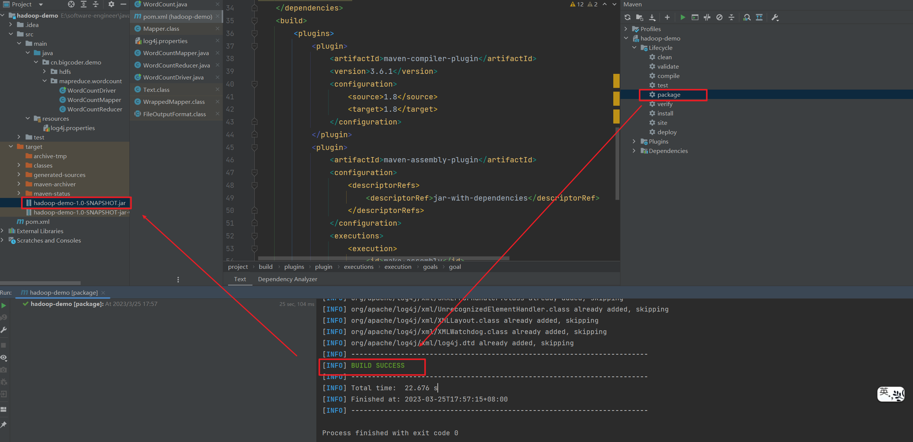
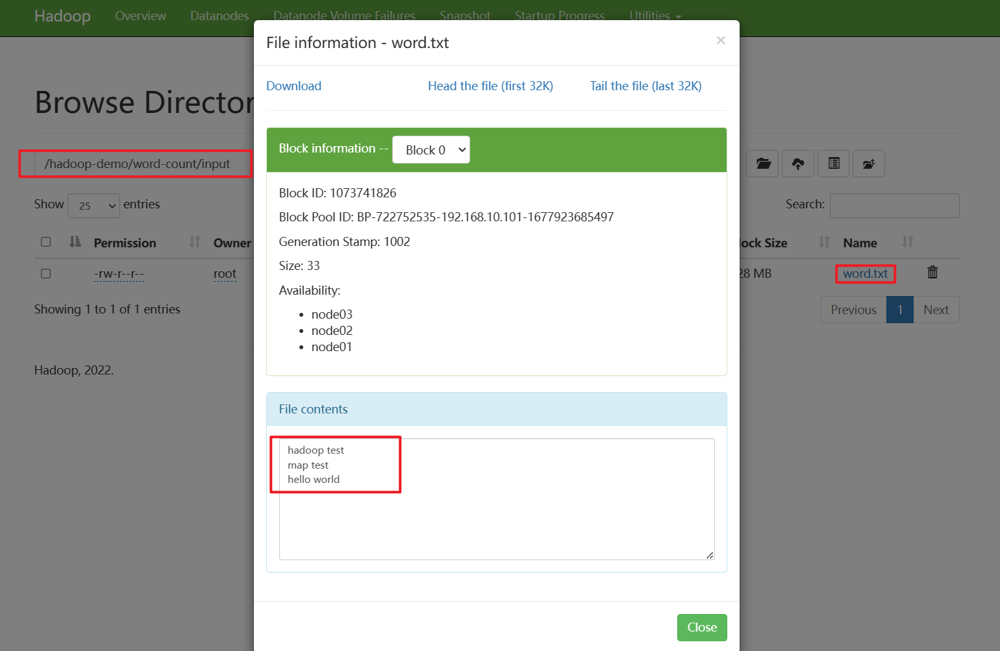
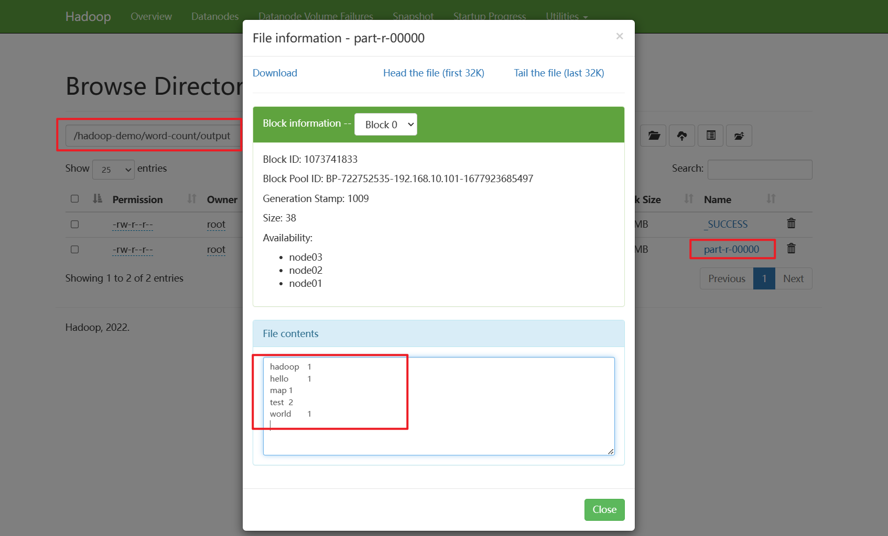

# 第一个MapReduce程序

参考官方源码：[Hadoop MapReduce examples](https://github.com/apache/hadoop/tree/release-3.3.5-RC3/hadoop-mapreduce-project/hadoop-mapreduce-examples/src/main/java/org/apache/hadoop/examples)

## 一. 需求分析

在给定的文本文件中统计输出每一个单词出现的总次数。

例如输入：

```txt
hadoop test
map test
hello world
```

输出：

```txt
hadoop	1
hello	1
map	1
test	2
world	1
```

## 二. 环境准备

第一步：创建maven工程，hadoop-demo

第二步：在pom.xml文件中添加如下依赖

```xml
<!-- https://mvnrepository.com/artifact/org.apache.hadoop/hadoop-client -->
<dependency>
    <groupId>org.apache.hadoop</groupId>
    <artifactId>hadoop-client</artifactId>
    <version>3.3.4</version>
</dependency>
<dependency>
    <groupId>junit</groupId>
    <artifactId>junit</artifactId>
    <version>4.12</version>
</dependency>
<dependency>
    <groupId>org.slf4j</groupId>
    <artifactId>slf4j-log4j12</artifactId>
    <version>1.7.30</version>
</dependency>
```

第三步：在项目的 `src/main/resources` 目录下，新建一个文件，命名为“log4j.properties”，在文件中填入

```properties
log4j.rootLogger=INFO, stdout  
log4j.appender.stdout=org.apache.log4j.ConsoleAppender  
log4j.appender.stdout.layout=org.apache.log4j.PatternLayout  
log4j.appender.stdout.layout.ConversionPattern=%d %p [%c] - %m%n  
log4j.appender.logfile=org.apache.log4j.FileAppender  
log4j.appender.logfile.File=target/spring.log  
log4j.appender.logfile.layout=org.apache.log4j.PatternLayout  
log4j.appender.logfile.layout.ConversionPattern=%d %p [%c] - %m%n
```

## 三. 编写程序

常用数据序列化类型

| Java类型 | Hadoop Writable类型 |
| -------- | ------------------- |
| Boolean  | BooleanWritable     |
| Byte     | ByteWritable        |
| Int      | IntWritable         |
| Float    | FloatWritable       |
| Long     | LongWritable        |
| Double   | DoubleWritable      |
| String   | Text                |
| Map      | MapWritable         |
| Array    | ArrayWritable       |
| Null     | NullWritable        |

### 3.1 编写Mapper类

```java
package cn.bigcoder.demo.mapreduce.wordcount;

import org.apache.hadoop.io.IntWritable;
import org.apache.hadoop.io.LongWritable;
import org.apache.hadoop.io.Text;
import org.apache.hadoop.mapreduce.Mapper;

import java.io.IOException;

public class WordCountMapper extends Mapper<LongWritable, Text, Text, IntWritable> {
    Text k = new Text();
    IntWritable v = new IntWritable(1);

    @Override
    protected void map(LongWritable key, Text value, Context context) throws IOException, InterruptedException {
        // 1 获取一行
        String line = value.toString();
        // 2 切割
        String[] words = line.split(" ");
        // 3 输出
        for (String word : words) {
            k.set(word);
            context.write(k, v);
        }
    }

}
```

map操作需要继承 `org.apache.hadoop.mapreduce.Mapper`，并实现`map`方法。

其中Mapper泛型如下：

```java
public class Mapper<KEYIN, VALUEIN, KEYOUT, VALUEOUT> {}
```

泛型分为两组，输入key-value，和输出key-value：

- KEYIN：map操作输入Key的类型，`LongWritable`对应JDK原先的Long类型。
- VALUEIN：map操作输入Value的类型，`Text`对应JDK原生的String类型。
- KEYOUT：map操作的输出Key类型
- VALUEOUT：map操作输出Value类型，`IntWritable`对应JDK元素的Integer类型。

### 3.2 编写Reducer类

```java
package cn.bigcoder.demo.mapreduce.wordcount;

import org.apache.hadoop.io.IntWritable;
import org.apache.hadoop.io.Text;
import org.apache.hadoop.mapreduce.Reducer;

import java.io.IOException;

public class WordCountReducer extends Reducer<Text, IntWritable, Text, IntWritable> {

    int sum;
    IntWritable v = new IntWritable();

    @Override
    protected void reduce(Text key, Iterable<IntWritable> values, Context context) throws IOException, InterruptedException {

        // 1 累加求和
        sum = 0;
        for (IntWritable count : values) {
            sum += count.get();
        }

        // 2 输出
        v.set(sum);
        context.write(key, v);
    }
}
```

### 3.3 编写驱动类

```java
package cn.bigcoder.demo.mapreduce.wordcount;

import org.apache.hadoop.conf.Configuration;
import org.apache.hadoop.fs.Path;
import org.apache.hadoop.io.IntWritable;
import org.apache.hadoop.io.Text;
import org.apache.hadoop.mapreduce.lib.input.FileInputFormat;
import org.apache.hadoop.mapreduce.lib.output.FileOutputFormat;

import org.apache.hadoop.mapreduce.Job;

import java.io.IOException;

public class WordCountDriver {

	public static void main(String[] args) throws IOException, ClassNotFoundException, InterruptedException {
		// 1 获取配置信息以及获取job对象
		Configuration conf = new Configuration();
		Job job = Job.getInstance(conf);
		// 2 关联本Driver程序的jar
		job.setJarByClass(WordCountDriver.class);
		// 3 关联Mapper和Reducer的jar
		job.setMapperClass(WordCountMapper.class);
		job.setReducerClass(WordCountReducer.class);
		// 4 设置Mapper输出的kv类型
		job.setMapOutputKeyClass(Text.class);
		job.setMapOutputValueClass(IntWritable.class);
		// 5 设置最终输出kv类型
		job.setOutputKeyClass(Text.class);
		job.setOutputValueClass(IntWritable.class);
		// 6 设置输入和输出路径
		FileInputFormat.setInputPaths(job, new Path(args[0]));
		FileOutputFormat.setOutputPath(job, new Path(args[1]));
		// 7 提交job
		boolean result = job.waitForCompletion(true);
		System.exit(result ? 0 : 1);
	}
}
```

### 3.4 提交到Hadoop集群测试

第一步：用maven打jar包，需要添加的打包插件依赖

```xml
<build>
    <plugins>
        <plugin>
            <artifactId>maven-compiler-plugin</artifactId>
            <version>3.6.1</version>
            <configuration>
                <source>1.8</source>
                <target>1.8</target>
            </configuration>
        </plugin>
        <plugin>
            <artifactId>maven-assembly-plugin</artifactId>
            <configuration>
                <descriptorRefs>
                    <descriptorRef>jar-with-dependencies</descriptorRef>
                </descriptorRefs>
            </configuration>
            <executions>
                <execution>
                    <id>make-assembly</id>
                    <phase>package</phase>
                    <goals>
                        <goal>single</goal>
                    </goals>
                </execution>
            </executions>
        </plugin>
    </plugins>
</build>
```

第二步：将代码打包成 jar



第三步：将jar包上传至服务器

第四步：创建input文件夹，上传带统计文件，文件内容见【5.1需求分析】

```shell
[root@node01 hadoop-test]# hadoop fs -mkdir /hadoop-demo
[root@node01 hadoop-test]# hadoop fs -mkdir /hadoop-demo/word-count/
[root@node01 hadoop-test]# hadoop fs -mkdir /hadoop-demo/word-count/input
# 将输入文件上传至hdfs
[root@node03 hadoop-test]# hadoop fs -put word.txt /hadoop-demo/word-count/input 
```

结果：



第五步：运行我们的word-count程序

```shell
[root@node01 hadoop-test]hadoop jar hadoop-demo-1.0-SNAPSHOT.jar  cn.bigcoder.demo.mapreduce.wordcount.WordCountDriver /hadoop-demo/word-count/input /hadoop-demo/word-count/output
```

运行结果：

会在 `/hadoop-demo/word-count/output` 路径下生成对应的执行结果：



