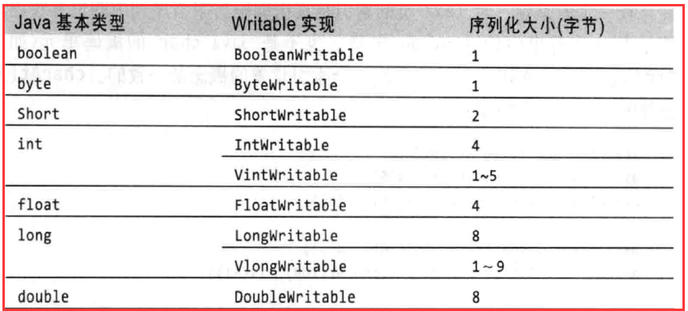

# Hadoop序列化

## 一. 概述

JDK有自带的 `Serializable` 序列化，为啥 Hadoop 会实现自己一套序列化方式呢？

Hadoop实现自己的序列化方式，主要是出于以下几个原因：

1. **性能优化：** 默认的Java序列化机制相对较慢，而且生成的序列化数据较大。Hadoop的主要目的是处理大量的数据，因此需要一个高效且紧凑的序列化方法。Hadoop的序列化方式允许数据在不同节点之间更快地传输，从而提高整体性能。
2. **跨语言兼容性：** Hadoop生态系统中有许多不同的编程语言实现，如Java、Python和Scala等。为了在这些不同编程语言之间进行通信和数据交换，Hadoop需要一种通用的序列化方式。通过实现自己的序列化方法，Hadoop可以确保跨语言的兼容性。
3. **灵活性和可扩展性：** 相比Java默认的序列化方法，Hadoop的序列化方式提供了更多的灵活性和可扩展性。例如，Hadoop使用`Writable`接口来实现序列化，允许用户定义自己的数据类型，从而更好地满足特定应用场景的需求。
4. **数据压缩：** Hadoop的序列化机制允许对数据进行压缩，以减少存储空间和带宽消耗。这对于大规模数据处理非常重要，可以显著降低硬件成本和提高性能。
5. **类型安全：** Hadoop序列化方式为映射和归约操作提供了类型安全。这意味着，当序列化和反序列化数据时，Hadoop会检查数据类型是否与预期一致。这有助于在开发阶段捕捉潜在的错误，并确保数据的正确性。

## 二. Hadoop中和序列化相关的接口和类

### 2.1 Hadoop对基本数据类型的包装

Hadoop参照JDK里面的数据类型实现了自己的数据类型，Hadoop自己实现的原理会使数据更紧凑一些，效率会高一些。序列化之后的字节数组大小会比JDK序列化出来的更小一些。所有Java基本类型的可写包装器，除了char（可以是存储在IntWritable中）。所有的都有一个 `get()` 和 `set()` 方法来检索和存储包装值。



Java中的String对应着Hadoop中的Text，Text可以存储2G的字符串大小。

### 2.2 Writable接口

```java
package org.apache.hadoop.io;

import java.io.DataInput;
import java.io.DataOutput;
import java.io.IOException;
import org.apache.hadoop.classification.InterfaceAudience.Public;
import org.apache.hadoop.classification.InterfaceStability.Stable;

@Public
@Stable
public interface Writable {
    void write(DataOutput var1) throws IOException;

    void readFields(DataInput var1) throws IOException;
}
```

Writable接口定义了两个方法：一个将其状态写到DataOutput二进制流（序列化），另一个从DataInput二进制流读取状态（反序列化）。

需要注意的是：**反序列化时，需要反射调用空参构造函数，所以必须有空参构造**。

### 2.3 Comparable接口

`Comparable` 是JDK内建的接口，**当我们需要将自定义序列化对象放在 reduce 操作的 key中传输时，则还需要实现Comparable接口，因为MapReduce框中的Shuffle过程要求对key必须能排序**。

向这类对象我们可以直接实现 `org.apache.hadoop.io.WritableComparable` 接口即可。

```java
package org.apache.hadoop.io;

import org.apache.hadoop.classification.InterfaceAudience.Public;
import org.apache.hadoop.classification.InterfaceStability.Stable;

@Public
@Stable
public interface WritableComparable<T> extends Writable, Comparable<T> {
}
```

## 三. 自定义序列化实现

### 3.1 需求分析

有些时候我们 Map 和 Reduce之间传递不一定是基本数据类型，如果传输的是自定义数据类型，就需要自己实现对象的序列化接口。

假如我们有如下数据：

```txt
1 13736230513 192.196.100.1 2481 24681 200
2 13846544121 192.196.100.2 264 0 200
3 13956435636 192.196.100.3 132 1512 200
4 13966251146 192.168.100.1 240 0 404
5 18271575951 192.168.100.2 1527 2106 200
6 84188413 192.168.100.3 4116 1432 200
7 13590439668 192.168.100.4 1116 954 200
8 15910133277 192.168.100.5 3156 2936 200
9 13729199489 192.168.100.6 240 0 200
10 13630577991 192.168.100.7 6960 690 200
11 15043685818 192.168.100.8 3659 3538 200
12 15959002129 192.168.100.9 1938 180 500
13 13560439638 192.168.100.10 918 4938 200
14 13470253144 192.168.100.11 180 180 200
15 13682846555 192.168.100.12 1938 2910 200
16 13992314666 192.168.100.13 3008 3720 200
17 13509468723 192.168.100.14 7335 110349 404
18 18390173782 192.168.100.15 9531 2412 200
19 13975057813 192.168.100.16 11058 48243 200
20 13768778790 192.168.100.17 120 120 200
21 13568436656 192.168.100.18 2481 24681 200
22 13568436656 192.168.100.19 1116 954 200
```

我们需要统计文件中每一个手机号耗费的总上行流量、总下行流量。

其中数据格式如下：

| id   | 手机号 | ip   | 上行流量 | 下行流量 | 网络状态 |
| ---- | ------ | ---- | -------- | -------- | -------- |

期望的输出格式：

| 手机号 | 上行总流量 | 下行总流量 | 总流量 |
| ------ | ---------- | ---------- | ------ |

### 3.2 代码编写

#### 3.2.1 Bean对象编写

```java
package cn.bigcoder.demo.mapreduce.netflow;

import org.apache.hadoop.io.WritableComparable;

import java.io.DataInput;
import java.io.DataOutput;
import java.io.IOException;

public class NetFlowBean implements WritableComparable<NetFlowBean> {
    private String phone;
    /**
     * 上行流量
     */
    private long upFlow;
    /**
     * 下行流量
     */
    private long downFlow;
    /**
     * 总流量
     */
    private long sumFlow;

    public String getPhone() {
        return phone;
    }

    public void setPhone(String phone) {
        this.phone = phone;
    }

    public long getUpFlow() {
        return upFlow;
    }

    public void setUpFlow(long upFlow) {
        this.upFlow = upFlow;
    }

    public long getDownFlow() {
        return downFlow;
    }

    public void setDownFlow(long downFlow) {
        this.downFlow = downFlow;
    }

    public long getSumFlow() {
        return sumFlow;
    }

    public void setSumFlow(long sumFlow) {
        this.sumFlow = sumFlow;
    }

    @Override
    public void write(DataOutput dataOutput) throws IOException {
        dataOutput.writeUTF(phone);
        dataOutput.writeLong(upFlow);
        dataOutput.writeLong(downFlow);
        dataOutput.writeLong(sumFlow);
    }

    /**
     * 反序列化，需要注意的是反序列化，必须与序列化顺序一样
     *
     * @param dataInput
     * @throws IOException
     */
    @Override
    public void readFields(DataInput dataInput) throws IOException {
        this.phone = dataInput.readUTF();
        this.upFlow = dataInput.readLong();
        this.downFlow = dataInput.readLong();
        this.sumFlow = dataInput.readLong();
    }

    /**
     * 当对象输出结果到文件时，会调用toString方法，所以此处使用 \t 分割属性，展示给用户
     *
     * @return
     */
    @Override
    public String toString() {
        return upFlow + "\t" + downFlow + "\t" + sumFlow;
    }

    @Override
    public int compareTo(NetFlowBean o) {
        return this.phone.compareTo(o.phone);
    }
}
```

#### 3.2.2 编写Mapper类

```java
package cn.bigcoder.demo.mapreduce.netflow;

import org.apache.hadoop.io.LongWritable;
import org.apache.hadoop.io.Text;
import org.apache.hadoop.mapreduce.Mapper;

import java.io.IOException;

public class NetFlowMapper extends Mapper<LongWritable, Text, Text, NetFlowBean> {

    private Text outKey = new Text();
    private NetFlowBean outValue = new NetFlowBean();

    @Override
    protected void map(LongWritable key, Text value, Mapper<LongWritable, Text, Text, NetFlowBean>.Context context) throws IOException, InterruptedException {
        // 获取一行
        String line = value.toString();
        // 空格切割
        String[] strs = line.split(" ");
        // 手机号
        String phone = strs[1];
        // 上行流量
        String up = strs[3];
        // 下行流量
        String down = strs[4];

        // 封装
        outKey.set(phone);
        outValue.setPhone(phone);
        outValue.setUpFlow(Long.valueOf(up));
        outValue.setDownFlow(Long.valueOf(down));
        outValue.setSumFlow(Long.valueOf(down) + Long.valueOf(up));

        // 输出
        context.write(outKey, outValue);
    }
}

```

#### 3.2.3 编写Reducer类

```java
package cn.bigcoder.demo.mapreduce.netflow;

import org.apache.hadoop.io.LongWritable;
import org.apache.hadoop.io.Text;
import org.apache.hadoop.mapreduce.Mapper;
import org.apache.hadoop.mapreduce.Reducer;

import java.io.IOException;

public class NetFlowReducer extends Reducer<Text, NetFlowBean, Text, NetFlowBean> {
    private NetFlowBean outV = new NetFlowBean();

    @Override
    protected void reduce(Text key, Iterable<NetFlowBean> values, Context context) throws IOException, InterruptedException {

        long totalUp = 0;
        long totalDown = 0;

        //1 遍历values,将其中的上行流量,下行流量分别累加
        for (NetFlowBean flowBean : values) {
            totalUp += flowBean.getUpFlow();
            totalDown += flowBean.getDownFlow();
        }

        //2 封装outKV
        outV.setUpFlow(totalUp);
        outV.setDownFlow(totalDown);
        outV.setSumFlow(totalUp + totalDown);

        //3 写出outK outV
        context.write(key, outV);
    }
}
```

#### 3.2.4 编写驱动类

```java
package cn.bigcoder.demo.mapreduce.netflow;

import org.apache.hadoop.conf.Configuration;
import org.apache.hadoop.fs.Path;
import org.apache.hadoop.io.Text;
import org.apache.hadoop.mapreduce.Job;
import org.apache.hadoop.mapreduce.lib.input.FileInputFormat;
import org.apache.hadoop.mapreduce.lib.output.FileOutputFormat;

import java.io.IOException;

public class NetFlowDriver {
    public static void main(String[] args) throws IOException, ClassNotFoundException, InterruptedException {

        //1 获取job对象
        Configuration conf = new Configuration();
        Job job = Job.getInstance(conf);

        //2 关联本Driver类
        job.setJarByClass(NetFlowDriver.class);

        //3 关联Mapper和Reducer
        job.setMapperClass(NetFlowMapper.class);
        job.setReducerClass(NetFlowReducer.class);

        //4 设置Map端输出KV类型
        job.setMapOutputKeyClass(Text.class);
        job.setMapOutputValueClass(NetFlowBean.class);

        //5 设置程序最终输出的KV类型
        job.setOutputKeyClass(Text.class);
        job.setOutputValueClass(NetFlowBean.class);

        //6 设置程序的输入输出路径
        FileInputFormat.setInputPaths(job, new Path("/logs/hadoop/netflow/input"));
        FileOutputFormat.setOutputPath(job, new Path("/logs/hadoop/netflow/output"));

        //7 提交Job
        boolean b = job.waitForCompletion(true);
        System.exit(b ? 0 : 1);
    }
}
```

#### 3.2.5 本地运行结果

```txt
13470253144	180	180	360
13509468723	7335	110349	117684
13560439638	918	4938	5856
13568436656	3597	25635	29232
13590439668	1116	954	2070
13630577991	6960	690	7650
13682846555	1938	2910	4848
13729199489	240	0	240
13736230513	2481	24681	27162
13768778790	120	120	240
13846544121	264	0	264
13956435636	132	1512	1644
13966251146	240	0	240
13975057813	11058	48243	59301
13992314666	3008	3720	6728
15043685818	3659	3538	7197
15910133277	3156	2936	6092
15959002129	1938	180	2118
18271575951	1527	2106	3633
18390173782	9531	2412	11943
84188413	4116	1432	5548
```

