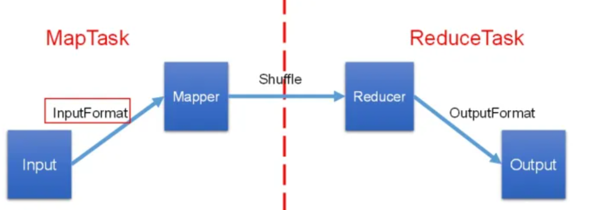
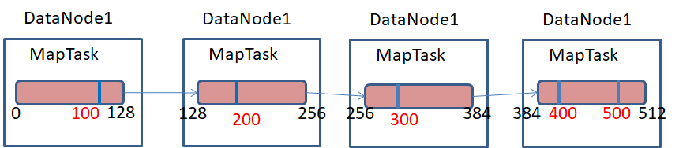

# Hadoop切片机制

## 一. InputFormat

在运行MapReduce程序时，输入的文件格式包括：基于行的日志文件，二进制格式文件，数据库表等。那么，针对不同的数据类型，MapReduce是如何读取这些数据的呢？

在数据传递给MapTask之前，需要对数据进行切片处理等工作。下图是一个完整的Map，Reduce数据处理流程。



Hadoop数据处理的第一步由 Inputformat 实现类完成。Hadoop框架提供了一个 InputFormat 接口。数据处理相关的InputFormat类都需要实现此接口。

```java
package org.apache.hadoop.mapreduce;

import java.io.IOException;
import java.util.List;
import org.apache.hadoop.classification.InterfaceAudience.Public;
import org.apache.hadoop.classification.InterfaceStability.Stable;

@Public
@Stable
public abstract class InputFormat<K, V> {
    public InputFormat() {
    }

    public abstract List<InputSplit> getSplits(JobContext var1) throws IOException, InterruptedException;

    public abstract RecordReader<K, V> createRecordReader(InputSplit var1, TaskAttemptContext var2) throws IOException, InterruptedException;
}

```

这个接口有2个方法：

- `getSplits`：此方法用于数据分片，返回一个数据分片的数组。
- `createRecordReader`：此方法返回一个 RecordReader ，用来将数据转换成键值对的形式。

## 二. 数据分片

一个超大文件在HDFS上存储时，是以多个Block存储在不同的节点上，比如一个512M的文件，HDFS默认一个Block为128M，那么1G的文件分成4个Block存储在集群中4个节点上。

Hadoop在map阶段处理上述512M的大文件时分成几个MapTask进行处理呢？Hadoop的MapTask并行度与数据切片有有关系，数据切片是对输入的文件在逻辑上进行分片，对文件切成多少份，Hadoop就会分配多少个MapTask任务进行并行执行该文件，原理如下图所示。



Block与Splite区别：Block是HDFS物理上把数据分成一块一块；数据切片只是在逻辑上对输入进行分片，并不会在磁盘上将其切分成片进行存储。

如上图所示，一个512M的文件在HDFS上存储时，默认一个block为128M，那么该文件需要4个block进行物理存储；若对该文件进行切片，假设以100M大小进行切片，该文件在逻辑上需要切成5片，则需要5个MapTask任务进行处理。

## 三. 数据切片源码

```java
/** 
 * Generate the list of files and make them into FileSplits.
 * @param job the job context
 * @throws IOException
 */
public List<InputSplit> getSplits(JobContext job) throws IOException {
  StopWatch sw = new StopWatch().start();
  /*
   * 	1、minSize默认最小值为1
   *     maxSize默认最大值为9,223,372,036,854,775,807‬
   * */
  long minSize = Math.max(getFormatMinSplitSize(), getMinSplitSize(job));
  long maxSize = getMaxSplitSize(job);

  // generate splits
  List<InputSplit> splits = new ArrayList<InputSplit>();
  /*
   *   2、获取所有需要处理的文件
   * */
  List<FileStatus> files = listStatus(job);
  for (FileStatus file: files) {
    Path path = file.getPath();
    /*
     *   3、获取文件的大小
     * */
    long length = file.getLen();
    if (length != 0) {
      BlockLocation[] blkLocations;
      if (file instanceof LocatedFileStatus) {
        /*
         * 4、获取文件的block，比如一个500M的文件，默认一个Block为128M,500M的文件会分布在4个DataNode节点上进行存储
         * */
        blkLocations = ((LocatedFileStatus) file).getBlockLocations();
      } else {
      	/*
      	 * 5、Hadoop如不特殊指定，默认用的HDFS文件系统，只会走上面if分支
      	 * */
        FileSystem fs = path.getFileSystem(job.getConfiguration());
        blkLocations = fs.getFileBlockLocations(file, 0, length);
      }
      if (isSplitable(job, path)) {
        /*
         * 6、获取Block块的大小，默认为128M
         * */
        long blockSize = file.getBlockSize();
        /*
         * 7、计算spliteSize分片的尺寸，首先取blockSize与maxSize之间的最小值即blockSize，
                        *         然后取blockSize与minSize之间的最大值，即为blockSize=128M,所以分片尺寸默认为128M
         * */
        long splitSize = computeSplitSize(blockSize, minSize, maxSize);

        long bytesRemaining = length;
        /*
         * 8、计算分片file文件可以在逻辑上划分为多少个数据切片，并把切片信息加入到List集合中
         * */
        while (((double) bytesRemaining)/splitSize > SPLIT_SLOP) {
          int blkIndex = getBlockIndex(blkLocations, length-bytesRemaining);
          splits.add(makeSplit(path, length-bytesRemaining, splitSize,
                      blkLocations[blkIndex].getHosts(),
                      blkLocations[blkIndex].getCachedHosts()));
          bytesRemaining -= splitSize;
        }

        /*
         * 9、如果文件最后一个切片不满128M,单独切分到一个数据切片中
         * */
        if (bytesRemaining != 0) {
          int blkIndex = getBlockIndex(blkLocations, length-bytesRemaining);
          splits.add(makeSplit(path, length-bytesRemaining, bytesRemaining,
                     blkLocations[blkIndex].getHosts(),
                     blkLocations[blkIndex].getCachedHosts()));
        }
      } else { // not splitable
        /*
         * 10、如果文件不可以切分，比如压缩文件，会创建一个数据切片
         * */
        splits.add(makeSplit(path, 0, length, blkLocations[0].getHosts(),
                    blkLocations[0].getCachedHosts()));
      }
    } else { 
      //Create empty hosts array for zero length file
  	/*
  	 * 11、如果为空文件，创建一个空的数据切片
  	 * */
      splits.add(makeSplit(path, 0, length, new String[0]));
    }
  }
  // Save the number of input files for metrics/loadgen
  job.getConfiguration().setLong(NUM_INPUT_FILES, files.size());
  sw.stop();
  if (LOG.isDebugEnabled()) {
    LOG.debug("Total # of splits generated by getSplits: " + splits.size()
        + ", TimeTaken: " + sw.now(TimeUnit.MILLISECONDS));
  }
  return splits;
}
```

## 二. 数据切片机制


> 本文转载至：[Hadoop切片机制_hadoop qiepian_苍鹰蛟龙的博客-CSDN博客](https://blog.csdn.net/u010502101/article/details/104012173)