# Arthas源码分析

## 一. 前言

Arthas 相信大家已经不陌生了，肯定用过太多次了，平时说到 Arthas 的时候都知道是基于Java Agent的，那么他具体是怎么实现呢，今天就一起来看看。

首先 Arthas 是在 GitHub 开源的，我们可以直接去 GitHub 上获取源码：[Arthas](https://github.com/alibaba/arthas)。

本文基于 Arthas 3.6.7 版本源码进行分析，具体源码注释可参考：[bigcoder84/arthas](https://github.com/bigcoder84/arthas)

## 二. arthas源码调试

在阅读源码的时候少不了需要对源码进行DEBUG，Arthas Debug 需要借助 IDEA 的远程Debug功能，具体可参考：

[Debug Arthas In IDEA · Issue #222 · alibaba/arthas (github.com)](https://github.com/alibaba/arthas/issues/222)

**第一步：编写测试类**

```java
public class Main {

    public static void main(String[] args) throws InterruptedException {
        int i = 0;
        while (true) {
            Thread.sleep(2000);
            print(i++);
        }
    }

    public static void print(Integer content) {
        System.out.println("Main print: " + content);
    }
}
```

**第二步：编译**

```java
javac Main.java
```

**第三步：启动测试类，并开启远程debug**

```shell
java -Xdebug -Xrunjdwp:transport=dt_socket,server=y,address=8000 Main
```

**-Xdebug**是通知JVM工作在DEBUG模式下，

**-Xrunjdwp**是通知JVM使用(java debug wire protocol)来运行调试环境。该参数同时了一系列的调试选项： 

- transport指定了调试数据的传送方式，dt_socket是指用SOCKET模式，另有dt_shmem指用共享内存方式，其中，dt_shmem只适用于Windows平台。 
- server参数是指是否支持在server模式的VM中. 
- onthrow指明，当产生该类型的Exception时，JVM就会中断下来，进行调式。该参数可选。 
- launch指明，当JVM被中断下来时，执行的可执行程序。该参数可选 
- suspend指明，是否在调试客户端建立起来后，再执行JVM。 
- onuncaught(=y或n)指明出现uncaught exception 后，是否中断JVM的执行. 

**第四步：IDEA开启远程DEBUG，连接Main进程**

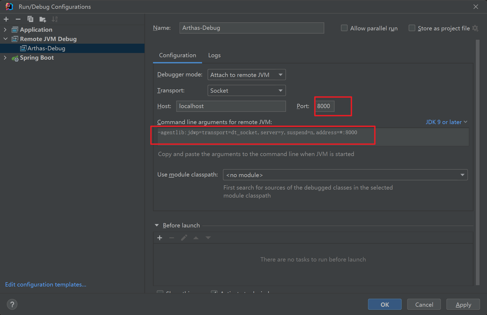

等待IDEA远程连接到测试进程后，测试代码则开始正常运行：


**第五步：启动 Arthas attach到目标进程上**

先使用 `jps -l` 查看测试进程的PID：

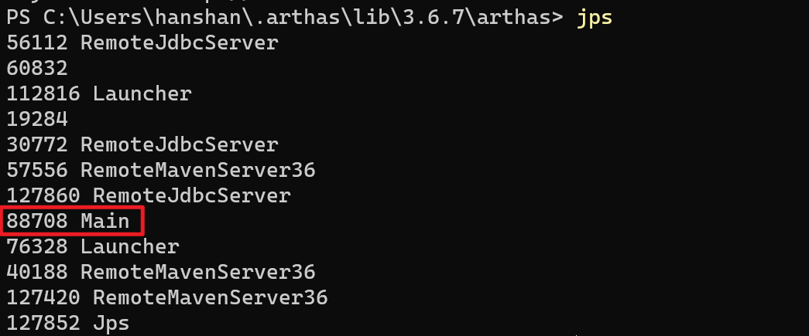

再启动 `as.sh` 启动 Arthas：

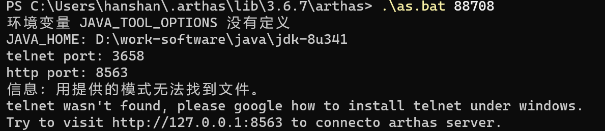

因为我是windows所以启动的是 as.bat 文件，这个文件在源码的bin目录下，但是不建议启动这里的脚本文件，因为这里只是源码，缺少依赖的jar包。

我们可以执行下列命令，下载一个官方的Arthas版本：

 ```shell
 curl -O https://arthas.aliyun.com/arthas-boot.jar
 java -jar arthas-boot.jar
 ```

 attach到任意进程上去，就会自动下载最新版本的脚本文件，最终文件会下载到 ${home}/.arthas/lib 下。

 我们执行这个目录下的 `as.bat` 即可：

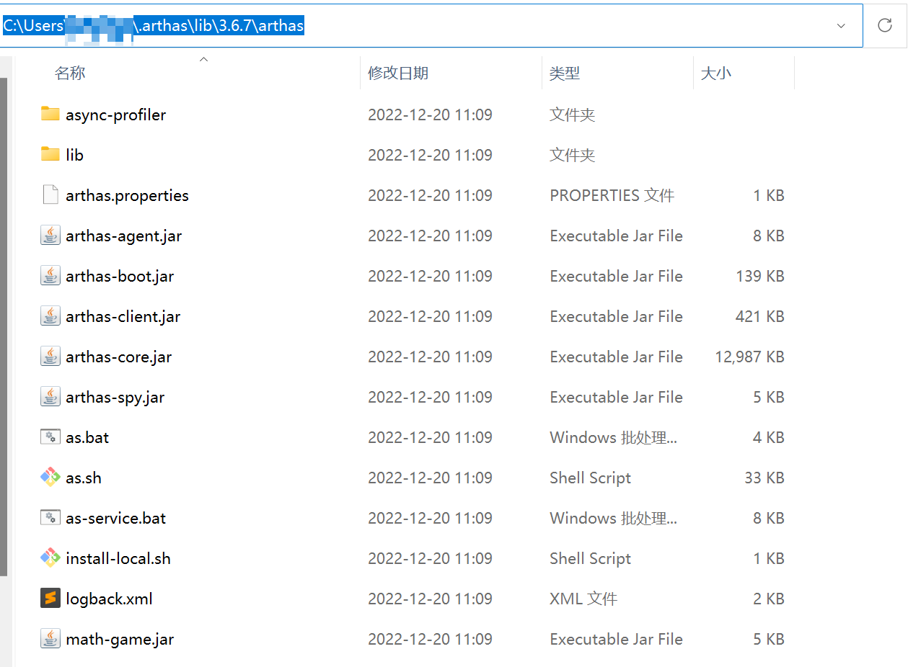

运行起来会，Arthas会自动打开浏览器，连接目标进程启动的 Web Console：

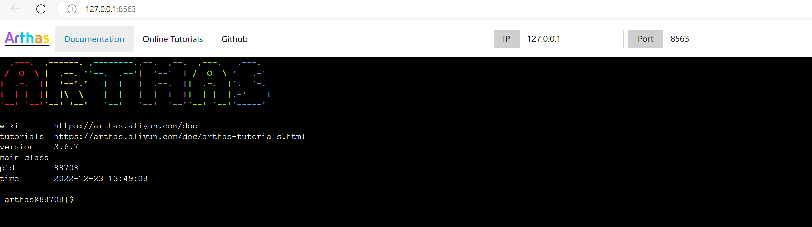

此时，我们打好断点，在控制台上输入命令，即可进入对应的断点。

> 参考至：[Debug Arthas In IDEA · Issue #222 · alibaba/arthas (github.com)](https://github.com/alibaba/arthas/issues/222)

## 三. arthas-boot启动源码分析

启动 Arthas 有一种方式是直接 `java -jar arthas-boot.jar` 这种方式来启动 `arthas-boot.jar` 这个jar包，我们有两种方式可以找到这个jar包的核心启动类：第一种是直接打开jar包然后找到`META-INF/MANIFEST.MF`文件，里面有一行是：`
Main-Class: com.taobao.arthas.boot.Bootstrap` 这里就是可以说明这个jar包的启动主类就是Bootstrap类，如下图所示：

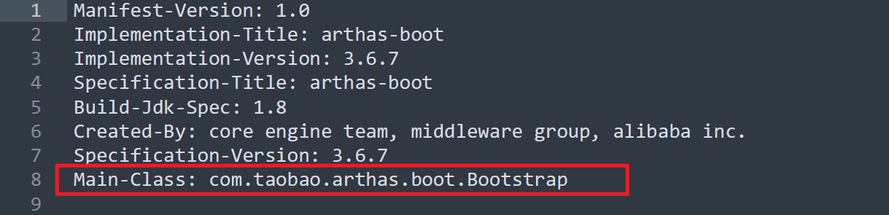

第二种方式是进入 `arthas-boot` 的pom文件里可以找到：

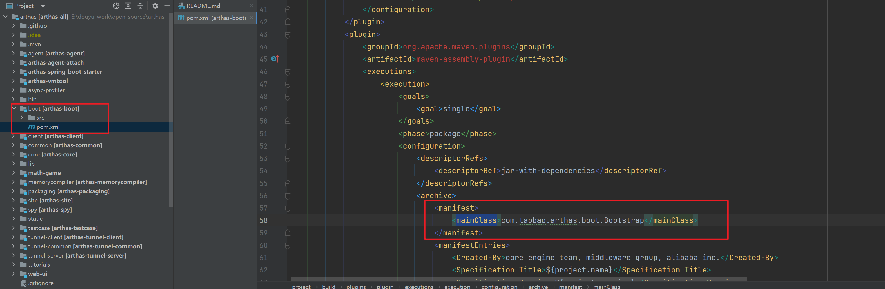

`maven-assembly-plugin` maven插件主要是用来构建一个可执行的jar包，其中`mainClass`属性用于指定`java -jar`启动时所执行的类的全限定名称，该参数会在打包时写入 `META-INF/MANIFEST.MF` 文件中。

**Bootstrap#main**

这样也可以说明这个jar包的启动类是Bootstrap。那我们直接找到Bootstrap.java：

```java
 Bootstrap bootstrap = new Bootstrap();

 CLI cli = CLIConfigurator.define(Bootstrap.class);
 CommandLine commandLine = cli.parse(Arrays.asList(args));

 try {
     CLIConfigurator.inject(commandLine, bootstrap);
 } catch (Throwable e) {
     e.printStackTrace();
     System.out.println(usage(cli));
     System.exit(1);
 }
```

首先 Arthas 的命令行解析是用的阿里巴巴的CLI框架，这里就是new了一个Bootstrap类，然后利用cli框架把启动的时候的参数注入到Bootstrap类的属性里面，Bootstrap类有这些属性：

```java
private String targetIp;
private Integer telnetPort;
private Integer httpPort;
...
```

比如启动的时候指定端口:`--telnet-port 9999 --http-port` 那么参数就可以绑定到这些属性上面来，具体绑定到方法是用的:

```java
    /**
     * 通过索引下标注入属性，index = 0代表第一个参数默认代表pid
     * 例如 java -jar arthas-booot.jar 28839 ，代表增强 28839 进程
     * @param pid
     */
    @Argument(argName = "pid", index = 0, required = false)
    @Description("Target pid")
    public void setPid(long pid) {
        this.pid = pid;
    }

    /**
     * 通过参数名称注入属性
     * 例如：java -jar arthas-booot.jar -h
     * @param help
     */
    @Option(shortName = "h", longName = "help", flag = true)
    @Description("Print usage")
    public void setHelp(boolean help) {
        this.help = help;
    }

    @Option(longName = "target-ip")
    @Description("The target jvm listen ip, default 127.0.0.1")
    public void setTargetIp(String targetIp) {
        this.targetIp = targetIp;
    }

    @Option(longName = "telnet-port")
    @Description("The target jvm listen telnet port, default 3658")
    public void setTelnetPort(int telnetPort) {
        this.telnetPort = telnetPort;
    }

    @Option(longName = "http-port")
    @Description("The target jvm listen http port, default 8563")
    public void setHttpPort(int httpPort) {
        this.httpPort = httpPort;
    }
```

是在这些属性的 `set` 方法上面加上 `Option` 注解，设置参数名字，然后在inject方法里面的时候就根据参数名字和set方法的对应关系来调用类的set方法就可以把配置的值设置到属性里了。

这里我们可以看到在启动的时候就可以手动指定我们要监听的java进程PID了，如果启动的时候没有指定进程PID，那么 Arthas 就会把本机所有的java进程PID都打印出来，让你选择需要监听哪个进程：

```java
// 获取参数中的pid
long pid = bootstrap.getPid();
// select pid
if (pid < 0) {
    // 如果启动时未通过参数指定Java进程PID，则获取本机所有Java进程列表，让用户选择
    try {
        pid = ProcessUtils.select(bootstrap.isVerbose(), telnetPortPid, bootstrap.getSelect());
    } catch (InputMismatchException e) {
        System.out.println("Please input an integer to select pid.");
        System.exit(1);
    }
    if (pid < 0) {
        System.out.println("Please select an available pid.");
        System.exit(1);
    }
}
```

- 如果启动的时候没有设置那么pid就是-1，这个时候就是调用 `ProcessUtils.select` 方法去找可用的java进程。

**ProcessUtils#select**

```java
    public static long select(boolean v, long telnetPortPid, String select) throws InputMismatchException {
        // 获取本机所有的Java进程信息，PID->进程的主类名
        Map<Long, String> processMap = listProcessByJps(v);
  		
        //........
        
        // 打印所有的Java进程信息
        int count = 1;
        for (String process : processMap.values()) {
            if (count == 1) {
                System.out.println("* [" + count + "]: " + process);
            } else {
                System.out.println("  [" + count + "]: " + process);
            }
            count++;
        }

        // 监听用户输入，选择的进程
        String line = new Scanner(System.in).nextLine();
        if (line.trim().isEmpty()) {
            // get the first process id
            return processMap.keySet().iterator().next();
        }

        int choice = new Scanner(line).nextInt();

        if (choice <= 0 || choice > processMap.size()) {
            return -1;
        }

        Iterator<Long> idIter = processMap.keySet().iterator();
        for (int i = 1; i <= choice; ++i) {
            if (i == choice) {
                return idIter.next();
            }
            idIter.next();
        }

        return -1;
    }
```

- 第一步：通过 `listProcessByJps` 获取本机所有Java进程信息。
- 第二步：将获取到的进程信息输出到控制台
  - 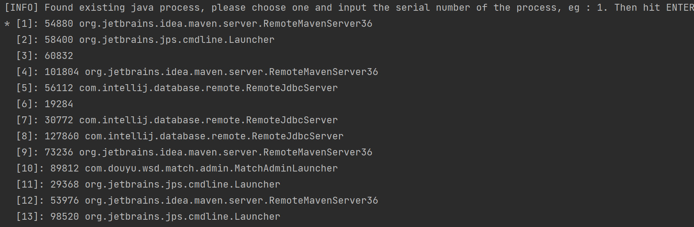
- 第三步：监听控制台输入，获取到用户选择的进程PID

**ProcessUtils#listProcessByJps**

其中 `listProcessByJps` 方法把所有可用的java进程用找出来，封装成`Map<Long, String> processMap` map对象

```java
    private static Map<Long, String> listProcessByJps(boolean v) {
        Map<Long, String> result = new LinkedHashMap<Long, String>();

        String jps = "jps";
        // 获取本机jps命令可执行文件
        File jpsFile = findJps();
        if (jpsFile != null) {
            jps = jpsFile.getAbsolutePath();
        }

        AnsiLog.debug("Try use jps to lis java process, jps: " + jps);

        String[] command = null;
        if (v) {
            command = new String[] { jps, "-v", "-l" };
        } else {
            command = new String[] { jps, "-l" };
        }

        // 执行 jps -l 获取所有运行中的Java进程信息
        List<String> lines = ExecutingCommand.runNative(command);

        AnsiLog.debug("jps result: " + lines);

        long currentPid = Long.parseLong(PidUtils.currentPid());
        for (String line : lines) {
            String[] strings = line.trim().split("\\s+");
            if (strings.length < 1) {
                continue;
            }
            try {
                long pid = Long.parseLong(strings[0]);
                if (pid == currentPid) {
                    // 过滤掉正在运行的 Arthas PID
                    continue;
                }
                if (strings.length >= 2 && isJpsProcess(strings[1])) { // skip jps
                    continue;
                }

                result.put(pid, line);
            } catch (Throwable e) {
                // https://github.com/alibaba/arthas/issues/970
                // ignore
            }
        }

        return result;
    }
```

-  `finJps` 方法，利用系统里配置的 Java 环境变量找到 JDK 目录下的 bin 目录里的 jps 文件。
  - 
- 然后利用 java 的 jps 命令来找到java进程，jps是用于查看有权访问的hotspot虚拟机的进程。当未指定hostid时，默认查看本机jvm进程，否者查看指定的hostid机器上的jvm进程，此时hostid所指机器必须开启jstatd服务。jps可以列出jvm进程lvmid、主类类名、main函数参数、jvm参数、jar名称等信息。然后会执行`jps -l`命令来打印本机的java进程信息：

此时 Arthas 就可以拿到需要监听的 Java 进程的 PID 了，总结一下其实就是用 jps 命令来获取所有Java 进程然后过滤掉 Arthas 进程让用户选择的，所以我们启用 Arthas 的用户一定要有 jps 这个的执行权限才可以。

然后下面的流程就是根据当前 `arthas-boot.jar` 的路径找到其他 `arthas` 核心组件还有一些依赖的驱动，如果是在官网下载的发行版本的话那么就是在 `arthas-bin` 下就是最完整的，此时的arthas-bin就是arthas.home目录了，需要的全部驱动和组件都在这里，如果没有的话或者说版本对应不上的话就会去阿里云上下载最新版本的：

```java
if (needDownload) {
    // try to download arthas from remote server.
    DownloadUtils.downArthasPackaging(bootstrap.getRepoMirror(), bootstrap.isuseHttp(),
                    remoteLastestVersion, ARTHAS_LIB_DIR.getAbsolutePath());
    localLastestVersion = remoteLastestVersion;
}
```

然后就是启动 `arthas-core.jar`：

```java
...
attachArgs.add("-core");
attachArgs.add(new File(arthasHomeDir, "arthas-core.jar").getAbsolutePath());
attachArgs.add("-agent");
attachArgs.add(new File(arthasHomeDir, "arthas-agent.jar").getAbsolutePath());
...
```

attachArgs参数就是拼接启动命令的，然后调用`ProcessUtils.startArthasCore`
方法把参数传进去，先获得本机jdk的绝对路径然后启动core，详细代码就不赘述了，最后传入的命令是：

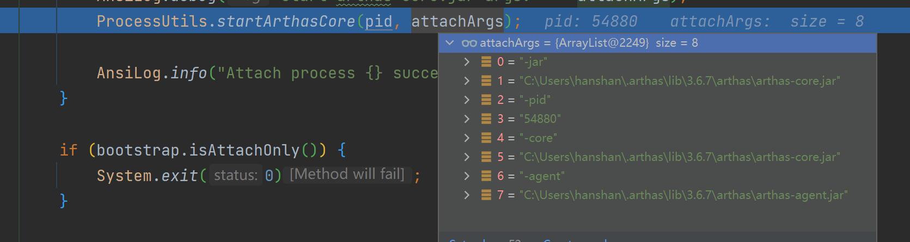

简单来说就是`java -jar arthas-core.jar -pid 54880 -core arthas-core.jar -agent arthas-agent.jar`

这里 `arthas-boot.jar` 的职责就完了，他的职责就是指定 PID 然后启动 `arthas-core`。

## 四. arthas-core启动源码分析

用上面同样的方法，我们打开`arthas-core/pom.xml`文件，查看`arthas-core.jar` 启动时运行的主类名：

```xml
<mainClass>com.taobao.arthas.core.Arthas</mainClass>
```

这个Arthas类的main方法：

```java
public static void main(String[] args) {
    try {
        new Arthas(args);
    } catch (Throwable t) {
        AnsiLog.error("Start arthas failed, exception stack trace: ");
        t.printStackTrace();
        System.exit(-1);
    }
}
```

很简单，就是调用了Arthas这个类的构造函数。在构造函数里：

```java
private Arthas(String[] args) throws Exception {
    attachAgent(parse(args));
}
```

先去 `parse` 方法解析参数，然后调用 `attachAgent` 方法，我们先看看是怎么解析参数的：

**Arthas#parse**

```java
    private Configure parse(String[] args) {
        Option pid = new TypedOption<Long>().setType(Long.class).setShortName("pid").setRequired(true);
        Option core = new TypedOption<String>().setType(String.class).setShortName("core").setRequired(true);
        Option agent = new TypedOption<String>().setType(String.class).setShortName("agent").setRequired(true);
        Option target = new TypedOption<String>().setType(String.class).setShortName("target-ip");
        Option telnetPort = new TypedOption<Integer>().setType(Integer.class)
                .setShortName("telnet-port");
        Option httpPort = new TypedOption<Integer>().setType(Integer.class)
                .setShortName("http-port");
        Option sessionTimeout = new TypedOption<Integer>().setType(Integer.class)
                        .setShortName("session-timeout");

        Option username = new TypedOption<String>().setType(String.class).setShortName("username");
        Option password = new TypedOption<String>().setType(String.class).setShortName("password");

        Option tunnelServer = new TypedOption<String>().setType(String.class).setShortName("tunnel-server");
        Option agentId = new TypedOption<String>().setType(String.class).setShortName("agent-id");
        Option appName = new TypedOption<String>().setType(String.class).setShortName(ArthasConstants.APP_NAME);

        Option statUrl = new TypedOption<String>().setType(String.class).setShortName("stat-url");
        Option disabledCommands = new TypedOption<String>().setType(String.class).setShortName("disabled-commands");

        CLI cli = CLIs.create("arthas").addOption(pid).addOption(core).addOption(agent).addOption(target)
                .addOption(telnetPort).addOption(httpPort).addOption(sessionTimeout)
                .addOption(username).addOption(password)
                .addOption(tunnelServer).addOption(agentId).addOption(appName).addOption(statUrl).addOption(disabledCommands);
        CommandLine commandLine = cli.parse(Arrays.asList(args));

        Configure configure = new Configure();
        configure.setJavaPid((Long) commandLine.getOptionValue("pid"));
        configure.setArthasAgent((String) commandLine.getOptionValue("agent"));
        configure.setArthasCore((String) commandLine.getOptionValue("core"));
        if (commandLine.getOptionValue("session-timeout") != null) {
            configure.setSessionTimeout((Integer) commandLine.getOptionValue("session-timeout"));
        }

        if (commandLine.getOptionValue("target-ip") != null) {
            configure.setIp((String) commandLine.getOptionValue("target-ip"));
        }

        if (commandLine.getOptionValue("telnet-port") != null) {
            configure.setTelnetPort((Integer) commandLine.getOptionValue("telnet-port"));
        }
        if (commandLine.getOptionValue("http-port") != null) {
            configure.setHttpPort((Integer) commandLine.getOptionValue("http-port"));
        }

        configure.setUsername((String) commandLine.getOptionValue("username"));
        configure.setPassword((String) commandLine.getOptionValue("password"));

        configure.setTunnelServer((String) commandLine.getOptionValue("tunnel-server"));
        configure.setAgentId((String) commandLine.getOptionValue("agent-id"));
        configure.setStatUrl((String) commandLine.getOptionValue("stat-url"));
        configure.setDisabledCommands((String) commandLine.getOptionValue("disabled-commands"));
        configure.setAppName((String) commandLine.getOptionValue(ArthasConstants.APP_NAME));
        return configure;
    }
```

记得到上文说的阿里巴巴自己的命令行解析工具CLI框架吗，这里还是用了这个，把刚刚在Boot中启动core的时候传递过来的参数封装成了一个 `Configure` 对象，把刚刚的参数设置成了这个对象的属性。然后传入 `attachAgent` 方法里面，在 `attachAgent` 方法里做了什么呢？

**Arthas#attachAgent**

```java
    private void attachAgent(Configure configure) throws Exception {
        // 第一步：获取指定PID对应的 VirtualMachineDescriptor
        VirtualMachineDescriptor virtualMachineDescriptor = null;
        for (VirtualMachineDescriptor descriptor : VirtualMachine.list()) {
            String pid = descriptor.id();
            if (pid.equals(Long.toString(configure.getJavaPid()))) {
                virtualMachineDescriptor = descriptor;
                break;
            }
        }
        VirtualMachine virtualMachine = null;
        try {
            // 第二步：连接到Java虚拟机。
            if (null == virtualMachineDescriptor) { // 使用 attach(String pid) 这种方式
                virtualMachine = VirtualMachine.attach("" + configure.getJavaPid());
            } else {
                virtualMachine = VirtualMachine.attach(virtualMachineDescriptor);
            }

            // 获取系统变量
            Properties targetSystemProperties = virtualMachine.getSystemProperties();
            // 校验一下JDK版本
            String targetJavaVersion = JavaVersionUtils.javaVersionStr(targetSystemProperties);
            String currentJavaVersion = JavaVersionUtils.javaVersionStr();
            if (targetJavaVersion != null && currentJavaVersion != null) {
                if (!targetJavaVersion.equals(currentJavaVersion)) {
                    AnsiLog.warn("Current VM java version: {} do not match target VM java version: {}, attach may fail.",
                                    currentJavaVersion, targetJavaVersion);
                    AnsiLog.warn("Target VM JAVA_HOME is {}, arthas-boot JAVA_HOME is {}, try to set the same JAVA_HOME.",
                                    targetSystemProperties.getProperty("java.home"), System.getProperty("java.home"));
                }
            }

            // 该参数是通过，arthas-boot.jar 中启动 arthas-agent.jar时 传入的 -core参数，具体值是 arthas-agent.jar绝对路径
            String arthasAgentPath = configure.getArthasAgent();
            //convert jar path to unicode string
            configure.setArthasAgent(encodeArg(arthasAgentPath));
            configure.setArthasCore(encodeArg(configure.getArthasCore()));
            try {
                // 第三步：加载 arthas-agent.jar，增强目标Java进程，实质上就是运行 com.taobao.arthas.agent334.AgentBootstrap.agentmain
                virtualMachine.loadAgent(arthasAgentPath,
                        configure.getArthasCore() + ";" + configure.toString());
            } catch (IOException e) {
                if (e.getMessage() != null && e.getMessage().contains("Non-numeric value found")) {
                    AnsiLog.warn(e);
                    AnsiLog.warn("It seems to use the lower version of JDK to attach the higher version of JDK.");
                    AnsiLog.warn(
                            "This error message can be ignored, the attach may have been successful, and it will still try to connect.");
                } else {
                    throw e;
                }
            } catch (com.sun.tools.attach.AgentLoadException ex) {
                if ("0".equals(ex.getMessage())) {
                    // https://stackoverflow.com/a/54454418
                    AnsiLog.warn(ex);
                    AnsiLog.warn("It seems to use the higher version of JDK to attach the lower version of JDK.");
                    AnsiLog.warn(
                            "This error message can be ignored, the attach may have been successful, and it will still try to connect.");
                } else {
                    throw ex;
                }
            }
        } finally {
            if (null != virtualMachine) {
                virtualMachine.detach();
            }
        }
    }
```

- 第一步：获取指定PID对应的 `VirtualMachineDescriptor`，`VirtualMachineDescriptor`是连接Java虚拟机的描述对象，有了它就能通过 `VirtualMachine#attach` 方法连接到指定Java虚拟机进程。
- 第二步：通过 `VirtualMachine#attach` 方法连接到指定Java虚拟机进程。
- 第三步：使用 `arthas-agent.jar` 增强指定Java进程，这一步实际上就是执行的 `com.taobao.arthas.agent334.AgentBootstrap#agentmain`方法。

## 五. arthas-agent启动源码分析

在上文中结尾中，我们一直说的java agent是啥？这里我们先来复习一下基础知识。

Arthas的根本原理是什么？对，众所周知是Java Agent，那么什么是Java Agent呢？

> Java Agent 是一种能够在不影响正常编译的情况下，修改字节码的技术。java作为一种强类型的语言，不通过编译就不能能够进行jar包的生成。有了 Java Agent 技术，就可以在字节码这个层面对类和方法进行修改。也可以把 Java Agent 理解成一种字节码注入的方式。
>
> Java Agent支持目标JVM启动时加载，也支持在目标JVM运行时加载，这两种不同的加载模式会使用不同的入口函数，如果需要在目标JVM启动的同时加载Agent：
>
> [1] public static void premain(String agentArgs, Instrumentation inst); [2] public static void premain(String agentArgs); JVM将首先寻找[1]，如果没有发现[1]，再寻找[2]。如果希望在目标JVM运行时加载Agent，则需要实现下面的方法：
>
> [1] public static void agentmain(String agentArgs, Instrumentation inst); [2] public static void agentmain(String agentArgs); 这两组方法的第一个参数AgentArgs是随同 “–javaagent”一起传入的程序参数，如果这个字符串代表了多个参数，就需要自己解析这些参数。inst是Instrumentation类型的对象，是JVM自动传入的，我们可以拿这个参数进行类增强等操作。

有关Java Agent原理可以参考：[JavaAgent详解](https://github.com/bigcoder84/study-notes/blob/master/基础笔记/知识点补充/subfile/_34JavaAgent详解.md)

在Java Agent规范中，需要在可执行的jar的 `META-INF/MANIFEST.MF` 文件中，通过`Agent-Class`、`Premain-Class` 指定 agent 启动时需要运行的类：

```
Manifest-Version: 1.0
Implementation-Title: arthas-agent
Premain-Class: com.taobao.arthas.agent334.AgentBootstrap
Implementation-Version: 3.6.7
Agent-Class: com.taobao.arthas.agent334.AgentBootstrap
Can-Redefine-Classes: true
Specification-Title: arthas-agent
Can-Retransform-Classes: true
Build-Jdk-Spec: 1.8
Created-By: Maven Archiver 3.5.0
Specification-Version: 3.6.7
```

与`arthas-boot` 和 `arthas-core`类似的是，`arthas-agent` 也会借助 `maven-assembly-plugin` 插件构建一个可执行的jar，在插件中指定 Java Agent所需要的配置：

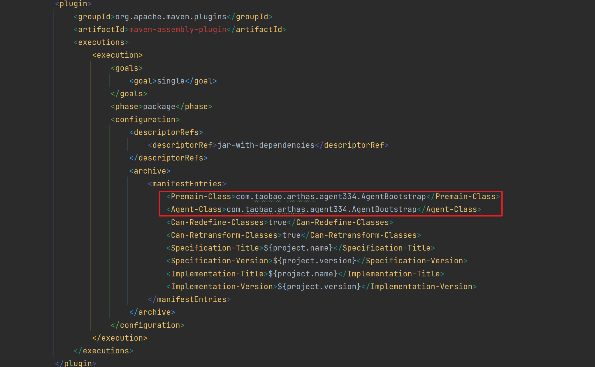

也就是说，我们在运行时动态加载agent的时候，会执行 `AgentBootstrap#agentmain` 方法：

```java
public static void premain(String args, Instrumentation inst) {
    main(args, inst);
}

public static void agentmain(String args, Instrumentation inst) {
    main(args, inst);
}
```

这两个方法都是调用 `main` 方法，其中`args`参数就是我们core组件的绝对路径和启动core组件的时候的参数：

```java
virtualMachine.loadAgent(arthasAgentPath,configure.getArthasCore() + ";" + configure.toString());
```

参数内容可参考：

```txt
C:\Users\hanshan\.arthas\lib\3.6.7\arthas\\arthas-core.jar;;telnetPort=3658;httpPort=8563;ip=127.0.0.1;arthasAgent=C:\Users\hanshan\.arthas\lib\3.6.7\arthas\\arthas-agent.jar;arthasCore=C:\Users\hanshan\.arthas\lib\3.6.7\arthas\\arthas-core.jar;javaPid=17756;
```

`Instrumentation` 参数由 JVM 自动传入，集中了几乎所有功能方法，如：类操作、classpath 操作等。这个就是刚刚的JVM对象自己传入进来的。然后我们继续看main方法：

```java
    private static synchronized void main(String args, final Instrumentation inst) {
        // 第一步：尝试判断arthas是否已在运行，如果是的话，直接就退出
        try {
            Class.forName("java.arthas.SpyAPI"); // 加载不到会抛异常
            if (SpyAPI.isInited()) {
                ps.println("Arthas server already stared, skip attach.");
                ps.flush();
                return;
            }
        } catch (Throwable e) {
            // ignore
        }
        try {
            ps.println("Arthas server agent start...");
            // 第二步：解析参数，参数分为两个部分，分解开赋给不同的变量
            // 传递的args参数分两个部分:arthasCoreJar路径和agentArgs, 分别是Agent的JAR包路径和期望传递到服务端的参数
            if (args == null) {
                args = "";
            }
            args = decodeArg(args);

            String arthasCoreJar;
            final String agentArgs;
            int index = args.indexOf(';');
            if (index != -1) {
                arthasCoreJar = args.substring(0, index);
                agentArgs = args.substring(index);
            } else {
                arthasCoreJar = "";
                agentArgs = args;
            }
			
            // 第三步：查找arthas-core.jar，如果在指定的路径没找到，就在当前路径下找，如果还是没找到则退出
            File arthasCoreJarFile = new File(arthasCoreJar);
            if (!arthasCoreJarFile.exists()) {
                ps.println("Can not find arthas-core jar file from args: " + arthasCoreJarFile);
                // try to find from arthas-agent.jar directory
                CodeSource codeSource = AgentBootstrap.class.getProtectionDomain().getCodeSource();
                if (codeSource != null) {
                    try {
                        File arthasAgentJarFile = new File(codeSource.getLocation().toURI().getSchemeSpecificPart());
                        arthasCoreJarFile = new File(arthasAgentJarFile.getParentFile(), ARTHAS_CORE_JAR);
                        if (!arthasCoreJarFile.exists()) {
                            ps.println("Can not find arthas-core jar file from agent jar directory: " + arthasAgentJarFile);
                        }
                    } catch (Throwable e) {
                        ps.println("Can not find arthas-core jar file from " + codeSource.getLocation());
                        e.printStackTrace(ps);
                    }
                }
            }
            if (!arthasCoreJarFile.exists()) {
                return;
            }

            /**
             * Use a dedicated thread to run the binding logic to prevent possible memory leak. #195
             */
            // 第四步：获取自定义的类加载器，尽量减少Arthas对现有工程的侵蚀
            final ClassLoader agentLoader = getClassLoader(inst, arthasCoreJarFile);

            Thread bindingThread = new Thread() {
                @Override
                public void run() {
                    try {
                        // 第五步：调用bind方法启动arthas服务端
                        bind(inst, agentLoader, agentArgs);
                    } catch (Throwable throwable) {
                        throwable.printStackTrace(ps);
                    }
                }
            };

            bindingThread.setName("arthas-binding-thread");
            bindingThread.start();
            bindingThread.join();
        } catch (Throwable t) {
            t.printStackTrace(ps);
            try {
                if (ps != System.err) {
                    ps.close();
                }
            } catch (Throwable tt) {
                // ignore
            }
            throw new RuntimeException(t);
        }
    }
```

- 第一步：尝试判断arthas是否已在运行，如果是的话，直接就退出。
- 第二步：解析参数，参数分为两个部分，arthas-core.jar路径和agentArgs, 分别是Agent的JAR包路径和期望传递到服务端的参数，分解开赋给不同的变量。
- 第三步：查找指定的arthas-core.jar路径是否存在该jar文件，如果在指定的路径没找到，就在当前路径下找，如果还是没找到则退出。
- 第四步：获取自定义的类加载器，尽量减少Arthas对现有工程的侵蚀。
- 第五步：异步调用 `bind` 方法，启动 Arthas 服务端。

我们继续看一下 `AgentBootstrap#bind` 方法：

```java
private static void bind(Instrumentation inst, ClassLoader agentLoader, String args) throws Throwable {
    /**
     * <pre>
     * ArthasBootstrap bootstrap = ArthasBootstrap.getInstance(inst);
     * </pre>
     */
    // 第一步：通过反射，调用 com.taobao.arthas.core.server.ArthasBootstrap#getInstance(java.lang.instrument.Instrumentation, java.util.Map<java.lang.String,java.lang.String>) 获取 ArthasBootstrap 实例
    Class<?> bootstrapClass = agentLoader.loadClass(ARTHAS_BOOTSTRAP);
    Object bootstrap = bootstrapClass.getMethod(GET_INSTANCE, Instrumentation.class, String.class).invoke(null, inst, args);
    
    // 第二步：调用isBind方法，判断服务端是否已经启动
    boolean isBind = (Boolean) bootstrapClass.getMethod(IS_BIND).invoke(bootstrap);
    if (!isBind) {
        String errorMsg = "Arthas server port binding failed! Please check $HOME/logs/arthas/arthas.log for more details.";
        ps.println(errorMsg);
        throw new RuntimeException(errorMsg);
    }
    ps.println("Arthas server already bind.");
}
```

- 第一步：用刚刚获取的自定义类加载器来加载我们的`com.taobao.arthas.core.server.ArthasBootstrap`
  这个arthas最核心的类，然后用 Java 反射调用它的 `getInstance` 方法来获取实例。

- 第二步：调用它的 `isBlind` 方法判断服务端是否已经启动。`ArthasBootstrap` 类是在arthas-core这个组件中的，所以也就解释为了什么刚刚要传入core组件的绝对路径过来。

我们进入 `ArthasBootstrap#getInstance` 方法中：

```java
    /**
     * 单例
     *
     * @param instrumentation JVM增强
     * @return ArthasServer单例
     * @throws Throwable
     */
    public synchronized static ArthasBootstrap getInstance(Instrumentation instrumentation, Map<String, String> args) throws Throwable {
        if (arthasBootstrap == null) {
            arthasBootstrap = new ArthasBootstrap(instrumentation, args);
        }
        return arthasBootstrap;
    }
```

- 它最终会调用构造方法初始化实例

```java
    private ArthasBootstrap(Instrumentation instrumentation, Map<String, String> args) throws Throwable {
        this.instrumentation = instrumentation;

        initFastjson();

        // 1. initSpy()
        initSpy();
        // 2. ArthasEnvironment
        initArthasEnvironment(args);

        String outputPathStr = configure.getOutputPath();
        if (outputPathStr == null) {
            outputPathStr = ArthasConstants.ARTHAS_OUTPUT;
        }
        outputPath = new File(outputPathStr);
        outputPath.mkdirs();

        // 3. init logger
        loggerContext = LogUtil.initLogger(arthasEnvironment);

        // 4. 增强ClassLoader
        enhanceClassLoader();
        // 5. init beans
        initBeans();

        // 6. start agent server
        bind(configure);

        executorService = Executors.newScheduledThreadPool(1, new ThreadFactory() {
            @Override
            public Thread newThread(Runnable r) {
                final Thread t = new Thread(r, "arthas-command-execute");
                t.setDaemon(true);
                return t;
            }
        });

        shutdown = new Thread("as-shutdown-hooker") {

            @Override
            public void run() {
                ArthasBootstrap.this.destroy();
            }
        };

        transformerManager = new TransformerManager(instrumentation);
        Runtime.getRuntime().addShutdownHook(shutdown);
    }
```

我们可以看到整个初始化分为六个步骤，初始化fastjson，这个不重要。

1. 初始化spy

2. 初始化arthas环境

3. 初始化日志

4. 增强 ClassLoader

5. 初始化bean

6. 启动agent server

**第一步：初始化spy**

```java
    private void initSpy() throws Throwable {
        // TODO init SpyImpl ?

        // 将Spy添加到BootstrapClassLoader
        ClassLoader parent = ClassLoader.getSystemClassLoader().getParent();
        Class<?> spyClass = null;
        if (parent != null) {
            try {
                spyClass =parent.loadClass("java.arthas.SpyAPI");
            } catch (Throwable e) {
                // ignore
            }
        }
        if (spyClass == null) {
            CodeSource codeSource = ArthasBootstrap.class.getProtectionDomain().getCodeSource();
            if (codeSource != null) {
                File arthasCoreJarFile = new File(codeSource.getLocation().toURI().getSchemeSpecificPart());
                File spyJarFile = new File(arthasCoreJarFile.getParentFile(), ARTHAS_SPY_JAR);
                // 使用Bootstrap ClassLoader 加载 SpyAPI类
                instrumentation.appendToBootstrapClassLoaderSearch(new JarFile(spyJarFile));
            } else {
                throw new IllegalStateException("can not find " + ARTHAS_SPY_JAR);
            }
        }
    }
```

arthas-spy.jar 中代码会通过 ASM 插入到业务代码中，由于业务代码中使用的部分类可能是 `BootstrapClassLoader` 加载器加载的，而 SpyAPI 正常来说是应该使用 `Application ClassLoader` 来加载，但是类加载器规范中规定父类加载器加载的类不能引用子类加载器加载的类。所以必须用根加载器加载 `SpyAPI` ，防止报 `NoClassDefFoundError` 错误。

> 由父类加载器加载的类，不能引用子类加载器加载的类，否则会抛出 NoClassDefFoundError。
>
> 怎么理解这句话呢？
>
> JDK提供的`java.*`类都由启动类加载器加载。
>
> 如果我们在java agent中修改java包下的类，插入调用logback打印日记的代码，会怎样？
>
> 由于java agent包下的logback由 Application ClassLoader（应用类加载器）加载，而加载java包下的类的启动类加载器是 Application ClassLoader 的父类加载器。
>
> 在java包下的类中插入调用logback打印日记的代码，首先在加载java包下的类时，jvm查看启动类加载器有没有加载过依赖的logback的类，如果没有加载过尝试加载。但启动类加载器加载不了logback包的类，并且启动类加载器不会向子类加载器去询问。任何类加载器都不会向子类加载器询问子类加载器是否能加载，即使子类加载器加载了这个类。所以就会出现NoClassDefFoundError。
>
> 
>
> 参考：[实现一个分布式调用链路追踪Java探针你可能会遇到的问题 - 掘金 (juejin.cn)](https://juejin.cn/post/6869371903664979976)

**2.initArthasEnvironment**

```java
    private void initArthasEnvironment(Map<String, String> argsMap) throws IOException {
        if (arthasEnvironment == null) {
            // 第一步：初始化Arthas环境
            arthasEnvironment = new ArthasEnvironment();
        }

        /**
         * <pre>
         * 脚本里传过来的配置项，即命令行参数 > System Env > System Properties > arthas.properties
         * arthas.properties 提供一个配置项，可以反转优先级。 arthas.config.overrideAll=true
         * https://github.com/alibaba/arthas/issues/986
         * </pre>
         */
        Map<String, Object> copyMap;
        if (argsMap != null) {
            copyMap = new HashMap<String, Object>(argsMap);
            // 添加 arthas.home
            if (!copyMap.containsKey(ARTHAS_HOME_PROPERTY)) {
                copyMap.put(ARTHAS_HOME_PROPERTY, arthasHome());
            }
        } else {
            copyMap = new HashMap<String, Object>(1);
            copyMap.put(ARTHAS_HOME_PROPERTY, arthasHome());
        }

        MapPropertySource mapPropertySource = new MapPropertySource("args", copyMap);
        arthasEnvironment.addFirst(mapPropertySource);

        tryToLoadArthasProperties();

        configure = new Configure();
        BinderUtils.inject(arthasEnvironment, configure);
    }
```

- 根据刚刚arthas-boot给arthas-core，然后arthas-core给arthas-agent，最后arthas-agent再给arthas-core的参数和一些环境变量什么的在初始化我们的configure对象。

**3.初始化日志**

这里就是用了`loggerContext = LogUtil.initLogger(arthasEnvironment);` 用刚刚的环境对象来初始化日志的上下文对象，这里用的是logback。

**4.enhanceClassLoader**

增强ClassLoader

这里代码就不贴了，总之是因为要解决解决一些 ClassLoader 加载不到 SpyAPI的问题所以才要增强ClassLoader，这里有一个issue——github.com/alibaba/arthas/issues/1596

**5.initBeans**

初始化bean

这里就是给两个成员属性新建赋值:

```java
    private void initBeans() {
        this.resultViewResolver = new ResultViewResolver();
        this.historyManager = new HistoryManagerImpl();
    }
```

**6.启动 agent server**

这里就是我们最后的arthas的启动代码了。首先：	

```java
        long start = System.currentTimeMillis();
        // 第一步：CAS的去改变绑定状态
        if (!isBindRef.compareAndSet(false, true)) {
            throw new IllegalStateException("already bind");
        }
        // init random port
		// 第二步：如果启动的时候未指定Telnet端口和Http端口，则随机获取一个可用的端口给Telnet和Http使用。
        if (configure.getTelnetPort() != null && configure.getTelnetPort() == 0) {
            int newTelnetPort = SocketUtils.findAvailableTcpPort();
            configure.setTelnetPort(newTelnetPort);
            logger().info("generate random telnet port: " + newTelnetPort);
        }
        if (configure.getHttpPort() != null && configure.getHttpPort() == 0) {
            int newHttpPort = SocketUtils.findAvailableTcpPort();
            configure.setHttpPort(newHttpPort);
            logger().info("generate random http port: " + newHttpPort);
        }

        // try to find appName
        // 第四步：如果启动时未指定 `app-name` 属性，则获取项目名称或Spring应用名称，注入Configuration
        if (configure.getAppName() == null) {
            configure.setAppName(System.getProperty(ArthasConstants.PROJECT_NAME,
                    System.getProperty(ArthasConstants.SPRING_APPLICATION_NAME, null)));
        }
            try {
            if (configure.getTunnelServer() != null) {
                tunnelClient = new TunnelClient();
                tunnelClient.setAppName(configure.getAppName());
                tunnelClient.setId(configure.getAgentId());
                tunnelClient.setTunnelServerUrl(configure.getTunnelServer());
                tunnelClient.setVersion(ArthasBanner.version());
                ChannelFuture channelFuture = tunnelClient.start();
                channelFuture.await(10, TimeUnit.SECONDS);
            }
        } catch (Throwable t) {
            logger().error("start tunnel client error", t);
        }

```

- 第一步：通过CAS去改变绑定状态，如果CAS失败那么就是已经绑定成功。
- 第二步：如果启动的时候未指定Telnet端口和Http端口，则随机获取一个可用的端口给Telnet和Http使用。
- 第三步：在配置对象中设置我们的java程序的项目名称。
- 第四步：如果启动时未指定 `app-name` 属性，则获取项目名称或Spring应用名称，注入Configuration
- 第五步：然后是设置我们的TunnelServer，这个是远程使用arthas会用到的，

```java
     ShellServerOptions options = new ShellServerOptions()
                            .setInstrumentation(instrumentation)
                            .setPid(PidUtils.currentLongPid())
                            .setWelcomeMessage(ArthasBanner.welcome());
            if (configure.getSessionTimeout() != null) {
                options.setSessionTimeout(configure.getSessionTimeout() * 1000);
            }

            this.httpSessionManager = new HttpSessionManager();
            this.securityAuthenticator = new SecurityAuthenticatorImpl(configure.getUsername(), configure.getPassword());
            shellServer = new ShellServerImpl(options);
            List<String> disabledCommands = new ArrayList<String>();
          ...
            BuiltinCommandPack builtinCommands = new BuiltinCommandPack(disabledCommands);
            List<CommandResolver> resolvers = new ArrayList<CommandResolver>();
            resolvers.add(builtinCommands)

          ...
	
            shellServer.listen(new BindHandler(isBindRef));
```

上面这段代码特别长，其实就是初始化 `ShellServer`，然后配置好，最后调用listen方法启动命令行服务器，在 `listen` 方法中，主要是根据之前注册的 `TermServer` 来逐个启动。

最后

```java
sessionManager = new SessionManagerImpl(options, shellServer.getCommandManager(), shellServer.getJobController());
httpApiHandler = new HttpApiHandler(historyManager, sessionManager);

logger().info("as-server listening on network={};telnet={};http={};timeout={};", configure.getIp(),
        configure.getTelnetPort(), configure.getHttpPort(), options.getConnectionTimeout());

// 异步回报启动次数
if (configure.getStatUrl() != null) {
    logger().info("arthas stat url: {}", configure.getStatUrl());
}
UserStatUtil.setStatUrl(configure.getStatUrl());
UserStatUtil.arthasStart();

try {
    SpyAPI.init();
} catch (Throwable e) {
    // ignore
}
```

启动完我们核心的 `shellServer` 来保持和客户端连接和监听客户端输入之后我们再启动我们的 `session` 管理和 `HttpApi` 的管理（arthas是支持api调用的所以刚刚要初始化FastJson），然后在设置一些配置什么的，最后再启动我们刚刚的spy中的 `SpyAPI` 来实现为后面的命令做准备了。

## 六. 命令处理源码分析

在上一节末尾中讲解了 Arthas 启动的时候会启动 TermServer 也就是命令行服务器。那么 TermServer 是如何监听监听命令行输入的，首先在我们的启动核心类的 `ArthasBootstrap` 里面有一段特别长的代码取初始化 `shellServer` ，当时这个 `shellServer` 不是启动的重点所以没有具体讲，这里我们先回顾下这段代码：

```java
// com.taobao.arthas.core.server.ArthasBootstrap#bind
ShellServerOptions options = new ShellServerOptions()
                            .setInstrumentation(instrumentation)
                            .setPid(PidUtils.currentLongPid())
                            .setWelcomeMessage(ArthasBanner.welcome());
            if (configure.getSessionTimeout() != null) {
                options.setSessionTimeout(configure.getSessionTimeout() * 1000);
            }

            this.httpSessionManager = new HttpSessionManager();
            this.securityAuthenticator = new SecurityAuthenticatorImpl(configure.getUsername(), configure.getPassword());
            shellServer = new ShellServerImpl(options);
            List<String> disabledCommands = new ArrayList<String>();
          ...
            BuiltinCommandPack builtinCommands = new BuiltinCommandPack(disabledCommands);
            List<CommandResolver> resolvers = new ArrayList<CommandResolver>();
            resolvers.add(builtinCommands)

          ...
	
            shellServer.listen(new BindHandler(isBindRef));
```

这里实际上我们重点关注三行代码即可：

```java
 shellServer = new ShellServerImpl(options);// 第一行
 ...
 BuiltinCommandPack builtinCommands = new BuiltinCommandPack(disabledCommands);// 第二行
 ...
 shellServer.listen(new BindHandler(isBindRef));// 第三行
```

第一行是new一个shellServer，说明这个shellSver的实现类是 `ShellServerImpl`。

然后第二行代码是在初始化所有的命令，在 `BuiltinCommandPack` 的构造函数里有：

```java
    public BuiltinCommandPack(List<String> disabledCommands) {
        initCommands(disabledCommands);
    }


    private void initCommands(List<String> disabledCommands) {
        List<Class<? extends AnnotatedCommand>> commandClassList = new ArrayList<Class<? extends AnnotatedCommand>>(33);
        commandClassList.add(HelpCommand.class);
        commandClassList.add(AuthCommand.class);
        commandClassList.add(KeymapCommand.class);
        commandClassList.add(SearchClassCommand.class);
        commandClassList.add(SearchMethodCommand.class);
        commandClassList.add(ClassLoaderCommand.class);
        commandClassList.add(JadCommand.class);
        commandClassList.add(GetStaticCommand.class);
        commandClassList.add(MonitorCommand.class);
        commandClassList.add(StackCommand.class);
        commandClassList.add(ThreadCommand.class);
        commandClassList.add(TraceCommand.class);
        commandClassList.add(WatchCommand.class);
        commandClassList.add(TimeTunnelCommand.class);
        commandClassList.add(JvmCommand.class);
        commandClassList.add(MemoryCommand.class);
        commandClassList.add(PerfCounterCommand.class);
        // commandClassList.add(GroovyScriptCommand.class);
        commandClassList.add(OgnlCommand.class);
        commandClassList.add(MemoryCompilerCommand.class);
        commandClassList.add(RedefineCommand.class);
        commandClassList.add(RetransformCommand.class);
        commandClassList.add(DashboardCommand.class);
        commandClassList.add(DumpClassCommand.class);
        commandClassList.add(HeapDumpCommand.class);
        commandClassList.add(JulyCommand.class);
        commandClassList.add(ThanksCommand.class);
        commandClassList.add(OptionsCommand.class);
        commandClassList.add(ClsCommand.class);
        commandClassList.add(ResetCommand.class);
        commandClassList.add(VersionCommand.class);
        commandClassList.add(SessionCommand.class);
        commandClassList.add(SystemPropertyCommand.class);
        commandClassList.add(SystemEnvCommand.class);
        commandClassList.add(VMOptionCommand.class);
        commandClassList.add(LoggerCommand.class);
        commandClassList.add(HistoryCommand.class);
        commandClassList.add(CatCommand.class);
        commandClassList.add(Base64Command.class);
        commandClassList.add(EchoCommand.class);
        commandClassList.add(PwdCommand.class);
        commandClassList.add(MBeanCommand.class);
        commandClassList.add(GrepCommand.class);
        commandClassList.add(TeeCommand.class);
        commandClassList.add(ProfilerCommand.class);
        commandClassList.add(VmToolCommand.class);
        commandClassList.add(StopCommand.class);
        try {
            if (ClassLoader.getSystemClassLoader().getResource("jdk/jfr/Recording.class") != null) {
                commandClassList.add(JFRCommand.class);
            }
        } catch (Throwable e) {
            logger.error("This jdk version not support jfr command");
        }

        for (Class<? extends AnnotatedCommand> clazz : commandClassList) {
            Name name = clazz.getAnnotation(Name.class);
            if (name != null && name.value() != null) {
                if (disabledCommands.contains(name.value())) {
                    continue;
                }
            }
            commands.add(Command.create(clazz));
        }
    }
```

- 这里会把所有的命令的对应的处理类都加载到缓存里，后面会用到，这里可以看到每个命令都对应一个Command对象，注意最后放入缓存的对象是`AnnotatedCommandImpl`，上面的每个命令的Command只是这个类的一个属性。

然后第三行代码就是初始化监听命令策略，在里面有：

```java
//com.taobao.arthas.core.shell.impl.ShellServerImpl#listen

@Override
public ShellServer listen(final Handler<Future<Void>> listenHandler) {
    ...
    for (TermServer termServer : toStart) {
        termServer.termHandler(new TermServerTermHandler(this));
        termServer.listen(handler);
    }
    ...
}
```

设置term处理器和监听器，接下来看下 `TelnetTermServer` 中的 `listen` 方法，termServer 有几个实现类比如Http、命令行等，这里以 `TelnetTermServer` 命令行为例讲解，在listen方法中：

```java
    // com.taobao.arthas.core.shell.term.impl.TelnetTermServer#listen
	@Override
    public TermServer listen(Handler<Future<TermServer>> listenHandler) {
        bootstrap = new NettyTelnetTtyBootstrap().setHost(hostIp).setPort(port);
        try {
            bootstrap.start(new Consumer<TtyConnection>() {
                @Override
                public void accept(final TtyConnection conn) {
                    termHandler.handle(new TermImpl(Helper.loadKeymap(), conn));
                }
            }).get(connectionTimeout, TimeUnit.MILLISECONDS);
            listenHandler.handle(Future.<TermServer>succeededFuture());
        } catch (Throwable t) {
            logger.error("Error listening to port " + port, t);
            listenHandler.handle(Future.<TermServer>failedFuture(t));
        }
        return this;
    }
```

这里会调用调用的是 `NettyTelnetBootstrap` 的 `start` 方法，主要是通过 `netty` 来启动网络服务，注意这里使用的是阿里巴巴自己的 termd 来实现的，也就是说arthas命令行的核心是用的 termd，github地址为：https://github.com/alibaba/termd，感兴趣的读者可以自行了解，反正这个库就是支持java命令行的，然后在监听到有命令的时候会调用 `termHandler.handle` 来处理，这里的`termHandler`的实现类是上一步设置的 `TermServerTermHandler` ，这个这个类的`handle`方法中是：

```java
public class TermServerTermHandler implements Handler<Term> {
    private ShellServerImpl shellServer;

    public TermServerTermHandler(ShellServerImpl shellServer) {
        this.shellServer = shellServer;
    }

    @Override
    public void handle(Term term) {
        shellServer.handleTerm(term);
    }
}
```

所以我们又回到了 `ShellServerImpl` 类，上一节的侧重点主要是启动流程所以这里讲的比较简单，这里补充一下，然后我们在看 `ShellServerImpl` 的 `handleTerm` ：

```java
    // com.taobao.arthas.core.shell.impl.ShellServerImpl#handleTerm
	public void handleTerm(Term term) {
        synchronized (this) {
            // That might happen with multiple ser
            if (closed) {
                term.close();
                return;
            }
        }

        ShellImpl session = createShell(term);
        tryUpdateWelcomeMessage();
        session.setWelcome(welcomeMessage);
        session.closedFuture.setHandler(new SessionClosedHandler(this, session));
        session.init();
        sessions.put(session.id, session); // Put after init so the close handler on the connection is set
        session.readline(); // Now readline
    }
```

这里 `session.readline()` 就是来读取用户的输入，这里` session.setWelcome(welcomeMessage);`
就是开启 `Arthas` 的时候的欢迎语输出的地方了。

然后在 `session.readline` 中：

```java
    public void readline() {
        term.readline(prompt, new ShellLineHandler(this),
                new CommandManagerCompletionHandler(commandManager));
    }
```

这里就是设置我们最最最核心的命令管理适配器了，也就是`InternalCommandManager`
这个类，这个类会监听到命令之后去查找命令然后用相应的处理器来处理，这个是后面arthas命令的核心。

## 七. 命令的执行

两个处理器——我们对应的就是 `ShellLineHandler` 和 `CommandManagerCompletionHandler` 分别在输入的时候执行和完成的时候执行，会执行 `requestHandler` 和 `completionHandler` 的accept方法，这里会把上文两个Handler封装一下，调用accept的时候实际上就是调用Handler的handle方法，所以我们执行命令的最终入口就是 `ShellLineHandler` 的 `handle`方法：

`ShellLineHandler` 是处理命令行输入的handler，例如我们在命令输入 `jad java.lang.String`：

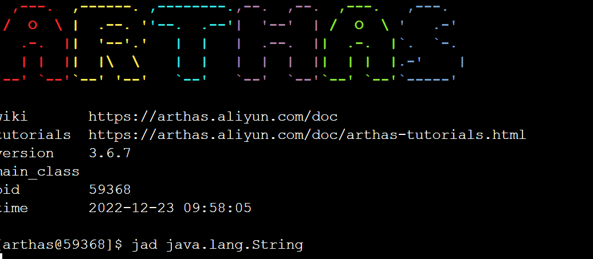

我们通过debug，就能在 `ShellLineHandler#handle` 方法中获取到用户输入的命令：

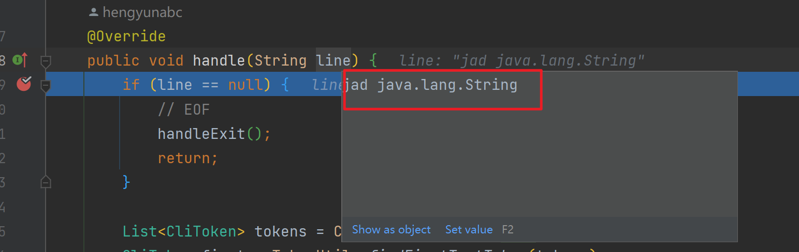

```java
    // com.taobao.arthas.core.shell.handlers.shell.ShellLineHandler#handle
	/**
     * 接收用户输入的命令行
     * @param line the event to handle
     */
    @Override
    public void handle(String line) {
        if (line == null) {
            // EOF
            handleExit();
            return;
        }

        List<CliToken> tokens = CliTokens.tokenize(line);
        CliToken first = TokenUtils.findFirstTextToken(tokens);
        if (first == null) {
            // For now do like this
            shell.readline();
            return;
        }

        String name = first.value();
        // 处理特殊命令，这些命令可以实时响应
        if (name.equals("exit") || name.equals("logout") || name.equals("q") || name.equals("quit")) {
            handleExit();
            return;
        } else if (name.equals("jobs")) {
            handleJobs();
            return;
        } else if (name.equals("fg")) {
            handleForeground(tokens);
            return;
        } else if (name.equals("bg")) {
            handleBackground(tokens);
            return;
        } else if (name.equals("kill")) {
            handleKill(tokens);
            return;
        }

        //
        Job job = createJob(tokens);
        if (job != null) {
            job.run();
        }
    }
```

首先会去解析输入的命令，一般可能你的命令带参数比如trace命令会带上类和方法名，所以这里要把命令从输入中解析出来，可以看到如果是是 exit、logout、quit、jobs、fg、bg、kill等 Arthas 本身的运行命令直接执行，如果是其他命令就创建一个job来执行。下面会到 `JobControllerImpl` 的 `createJob` 的方法里：

```java
    // com.taobao.arthas.core.shell.system.impl.JobControllerImpl#createJob
	@Override
    public Job createJob(InternalCommandManager commandManager, List<CliToken> tokens, Session session, JobListener jobHandler, Term term, ResultDistributor resultDistributor) {
        checkPermission(session, tokens.get(0));
        int jobId = idGenerator.incrementAndGet();
        StringBuilder line = new StringBuilder();
        for (CliToken arg : tokens) {
            line.append(arg.raw());
        }
        boolean runInBackground = runInBackground(tokens);
        Process process = createProcess(session, tokens, commandManager, jobId, term, resultDistributor);
        process.setJobId(jobId);
        JobImpl job = new JobImpl(jobId, this, process, line.toString(), runInBackground, session, jobHandler);
        jobs.put(jobId, job);
        return job;
    }
```

这里重点关注`rocess process = createProcess(session, tokens, commandManager, jobId, term, resultDistributor);` 这一行代码会根据输入找到命令然后封装成 `Process` 然后下面再把 `Process` 包装成job，我们先看怎么封装成 `Process`：

```java
    //com.taobao.arthas.core.shell.system.impl.JobControllerImpl#createProcess
	/**
     * Try to create a process from the command line tokens.
     *
     * @param line the command line tokens
     * @param commandManager command manager
     * @param jobId job id
     * @param term term
     * @param resultDistributor
     * @return the created process
     */
    private Process createProcess(Session session, List<CliToken> line, InternalCommandManager commandManager, int jobId, Term term, ResultDistributor resultDistributor) {
        try {
            ListIterator<CliToken> tokens = line.listIterator();
            while (tokens.hasNext()) {
                CliToken token = tokens.next();
                if (token.isText()) {
                    // check before create process
                    checkPermission(session, token);
                    Command command = commandManager.getCommand(token.value());
                    if (command != null) {
                        return createCommandProcess(command, tokens, jobId, term, resultDistributor);
                    } else {
                        throw new IllegalArgumentException(token.value() + ": command not found");
                    }
                }
            }
            throw new IllegalArgumentException();
        } catch (Exception e) {
            throw new RuntimeException(e);
        }
    }
```

这里会用到刚刚解析出来的命令的字符串去 `InternalCommandManager` 里找到相应的命令，getCommand就是在刚刚启动加载的命令缓存里去找到相应的命令也就是 `AnnotatedCommandImpl` 对象。然后在 `createCommandProcess` 方法里封装成Proccess对象，这里代码很长就不赘述了，反正就是把Command对象封装一下，有的命令会有特殊处理，比如watch命令会有管道符"|"这里要处理一下，然后热更新命令会有文件等参数也需要处理一下，总之在 `createCommandProcess` 方法里：

```java
ProcessImpl process = new ProcessImpl(command, remaining, command.processHandler(), ProcessOutput, resultDistributor);
```

这里就是完成的把命令封装成了process。然后再把Process放到job里，就完成初始化job等流程了。

在job初始化完毕之后就是调用job的 `run` 方法来执行了：

```java
    // com.taobao.arthas.core.shell.system.impl.JobImpl#run(boolean)
	@Override
    public Job run(boolean foreground) {
        actualStatus = ExecStatus.RUNNING;
        if (statusUpdateHandler != null) {
            statusUpdateHandler.handle(ExecStatus.RUNNING);
        }
        //set process's tty in JobControllerImpl.createCommandProcess
        //process.setTty(shell.term());
        process.setSession(this.session);
        process.run(foreground);

        if (this.status() == ExecStatus.RUNNING) {
            if (foreground) {
                jobHandler.onForeground(this);
            } else {
                jobHandler.onBackground(this);
            }
        }
        return this;
    }
```

在job的run里面实际上是在执行process的run方法：

```java
    // com.taobao.arthas.core.shell.system.impl.ProcessImpl#run(boolean)
	@Override
    public synchronized void run(boolean fg) {
        if (processStatus != ExecStatus.READY) {
            throw new IllegalStateException("Cannot run proces in " + processStatus + " state");
        }

        processStatus = ExecStatus.RUNNING;
        processForeground = fg;
        foreground = fg;
        startTime = new Date();

        // Make a local copy
        final Tty tty = this.tty;
        if (tty == null) {
            throw new IllegalStateException("Cannot execute process without a TTY set");
        }

        process = new CommandProcessImpl(this, tty);
        if (resultDistributor == null) {
            resultDistributor = new TermResultDistributorImpl(process, ArthasBootstrap.getInstance().getResultViewResolver());
        }

        final List<String> args2 = new LinkedList<String>();
        for (CliToken arg : args) {
            if (arg.isText()) {
                args2.add(arg.value());
            }
        }

        CommandLine cl = null;
        try {
            if (commandContext.cli() != null) {
                if (commandContext.cli().parse(args2, false).isAskingForHelp()) {
                    appendResult(new HelpCommand().createHelpDetailModel(commandContext));
                    terminate();
                    return;
                }

                cl = commandContext.cli().parse(args2);
                process.setArgs2(args2);
                process.setCommandLine(cl);
            }
        } catch (CLIException e) {
            terminate(-10, null, e.getMessage());
            return;
        }

        if (cacheLocation() != null) {
            process.echoTips("job id  : " + this.jobId + "\n");
            process.echoTips("cache location  : " + cacheLocation() + "\n");
        }
        Runnable task = new CommandProcessTask(process);
        ArthasBootstrap.getInstance().execute(task);
    }
```

这里重点看这行` Runnable task = new CommandProcessTask(process);` 就是初始化一个runnable，然后丢到线程池里执行，那么在`CommandProcessTask` 的run方法里：

```java
    private class CommandProcessTask implements Runnable {

        private CommandProcess process;

        public CommandProcessTask(CommandProcess process) {
            this.process = process;
        }

        @Override
        public void run() {
            try {
                handler.handle(process);
            } catch (Throwable t) {
                logger.error("Error during processing the command:", t);
                process.end(1, "Error during processing the command: " + t.getClass().getName() + ", message:" + t.getMessage()
                        + ", please check $HOME/logs/arthas/arthas.log for more details." );
            }
        }
    }
```

执行的就是handler的handle方法，这个handler就是在上一步把Command封装成Process对象的时候：

```java
ProcessImpl process = new ProcessImpl(command, remaining, command.processHandler(), ProcessOutput, resultDistributor);
```

放进来的，这个handler就是Command的 processHandler 属性，所以我们看 Command 缓存的 `AnnotatedCommandImpl` 类:

```java
 private Handler<CommandProcess> processHandler = new ProcessHandler();
 ...
   private class ProcessHandler implements Handler<CommandProcess> {
        @Override
        public void handle(CommandProcess process) {
            process(process);
        }
    }

...
private void process(CommandProcess process) {
        AnnotatedCommand instance;
        try {
            instance = clazz.newInstance();
        } catch (Exception e) {
            process.end();
            return;
        }
        CLIConfigurator.inject(process.commandLine(), instance);
        instance.process(process);
        UserStatUtil.arthasUsageSuccess(name(), process.args());
    }
    
```

这里实际上就是在执行 `AnnotatedCommandImpl` 的process方法，而process方法就是在执行每种命令Command的process方法

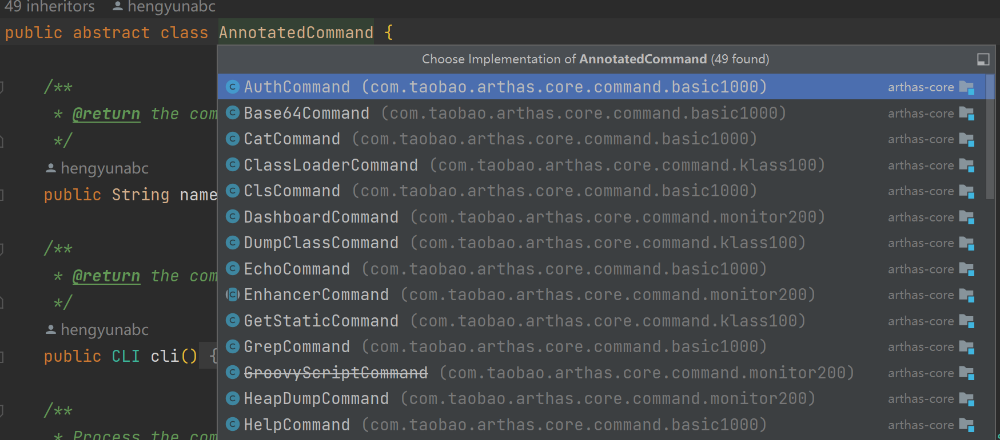

例如用户输入`jad java.lang.String`命令，最终会路由到 `com.taobao.arthas.core.command.klass100.JadCommand#process` 方法中执行：

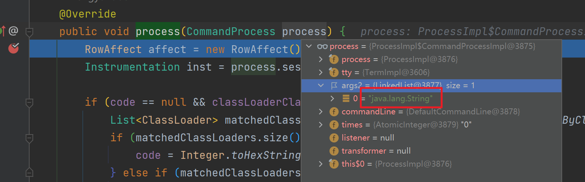

## 八. jad反编译命令

在上一节中我们知道了，Arthas将不同命令的处理逻辑封装在了对应的 `AnnotatedCommand` 实现里了。例如jad命令的处理类就是`JadCommand`，当用户输入 `jad java.lang.String` 尝试反编译该类时，就会调用 `JadCommand#process` 方法：

```java
    @Override
    public void process(CommandProcess process) {
        RowAffect affect = new RowAffect();
        Instrumentation inst = process.session().getInstrumentation();

        if (code == null && classLoaderClass != null) {
            List<ClassLoader> matchedClassLoaders = ClassLoaderUtils.getClassLoaderByClassName(inst, classLoaderClass);
            if (matchedClassLoaders.size() == 1) {
                code = Integer.toHexString(matchedClassLoaders.get(0).hashCode());
            } else if (matchedClassLoaders.size() > 1) {
                Collection<ClassLoaderVO> classLoaderVOList = ClassUtils.createClassLoaderVOList(matchedClassLoaders);
                JadModel jadModel = new JadModel()
                        .setClassLoaderClass(classLoaderClass)
                        .setMatchedClassLoaders(classLoaderVOList);
                process.appendResult(jadModel);
                process.end(-1, "Found more than one classloader by class name, please specify classloader with '-c <classloader hash>'");
                return;
            } else {
                process.end(-1, "Can not find classloader by class name: " + classLoaderClass + ".");
                return;
            }
        }

        // 第一步：查找用户需要反编译的class类
        Set<Class<?>> matchedClasses = SearchUtils.searchClassOnly(inst, classPattern, isRegEx, code);

        try {
            ExitStatus status = null;
            if (matchedClasses == null || matchedClasses.isEmpty()) {
                status = processNoMatch(process);
            } else if (matchedClasses.size() > 1) {
                status = processMatches(process, matchedClasses);
            } else { // matchedClasses size is 1
                // find inner classes.
                Set<Class<?>> withInnerClasses = SearchUtils.searchClassOnly(inst,  matchedClasses.iterator().next().getName() + "$*", false, code);
                if(withInnerClasses.isEmpty()) {
                    withInnerClasses = matchedClasses;
                }
                // 第二步：处理反编译逻辑
                status = processExactMatch(process, affect, inst, matchedClasses, withInnerClasses);
            }
            if (!this.sourceOnly) {
                process.appendResult(new RowAffectModel(affect));
            }
            CommandUtils.end(process, status);
        } catch (Throwable e){
            logger.error("processing error", e);
            process.end(-1, "processing error");
        }
    }
```

该方法看起来比较长，核心逻辑就两步：

- 第一步：查询用户输入的指定 `Class` 对象。
- 第二步：处理反编译逻辑。

我们具体来看一下 `processExactMatch` 方法：

```java
    /**
     * 处理反编译逻辑
     * @param process
     * @param affect
     * @param inst
     * @param matchedClasses
     * @param withInnerClasses
     * @return
     */
    private ExitStatus processExactMatch(CommandProcess process, RowAffect affect, Instrumentation inst, Set<Class<?>> matchedClasses, Set<Class<?>> withInnerClasses) {
        Class<?> c = matchedClasses.iterator().next();
        Set<Class<?>> allClasses = new HashSet<Class<?>>(withInnerClasses);
        allClasses.add(c);

        try {
            // 第一步：创建 ClassDumpTransformer
            ClassDumpTransformer transformer = new ClassDumpTransformer(allClasses);
            // 第二步：触发 ClassDumpTransformer#transform 将指定Class字节码写入文件中
            InstrumentationUtils.retransformClasses(inst, transformer, allClasses);

            // 第三步：获取已经写入到磁盘的字节码文件
            Map<Class<?>, File> classFiles = transformer.getDumpResult();
            File classFile = classFiles.get(c);

            // 第四步：反编译指定的字节码文件
            Pair<String,NavigableMap<Integer,Integer>> decompileResult = Decompiler.decompileWithMappings(classFile.getAbsolutePath(), methodName, hideUnicode, lineNumber);
            // 第五步：获取到反编译结果
            String source = decompileResult.getFirst();
            if (source != null) {
                source = pattern.matcher(source).replaceAll("");
            } else {
                source = "unknown";
            }

            JadModel jadModel = new JadModel();
            jadModel.setSource(source);
            jadModel.setMappings(decompileResult.getSecond());
            if (!this.sourceOnly) {
                jadModel.setClassInfo(ClassUtils.createSimpleClassInfo(c));
                jadModel.setLocation(ClassUtils.getCodeSource(c.getProtectionDomain().getCodeSource()));
            }
            // 第六步：将反编译结果返回
            process.appendResult(jadModel);

            affect.rCnt(classFiles.keySet().size());
            return ExitStatus.success();
        } catch (Throwable t) {
            logger.error("jad: fail to decompile class: " + c.getName(), t);
            return ExitStatus.failure(-1, "jad: fail to decompile class: " + c.getName() + ", please check $HOME/logs/arthas/arthas.log for more details.");
        }
    }

```

- 第一步：创建 ClassDumpTransformer
- 第二步：触发 ClassDumpTransformer#transform 将指定Class字节码写入文件中
- 第三步：获取已经写入到磁盘的字节码文件
  - 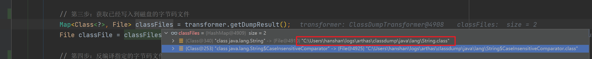
- 第四步：反编译指定的字节码文件

- 第五步：获取到反编译结果
  - 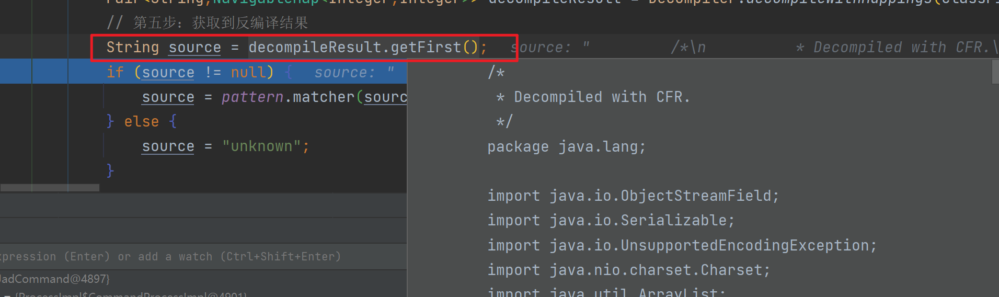
- 第六步：将反编译结果返回

## 九. 总结

至此 Arthas 整体流程分享完成，我们从 arthas-boot 开始，它的核心作用就是启动引导用户选择需要增强的Java进程PID，最终将PID传入 arthas-core 中；arthas-core根据用户选择的PID，利用Java Agent机制使用 arthas-agent 对目标进程进行增强；arthas-agent被唤醒后，就会启动命令行服务器监听命令，并匹配对应的命令处理器（XxxCommand）对用户命令进行处理，并返回。

本文以 `jad` 命令为引子，简单介绍了 Arthas 处理用户命令的全过程。但是其它诸如（watch、redefine）这类需要字节码增强的命令未做介绍，有兴趣的小伙伴可以自己研究一下，我也会用专门的文章分析这些命令的奇技淫巧。

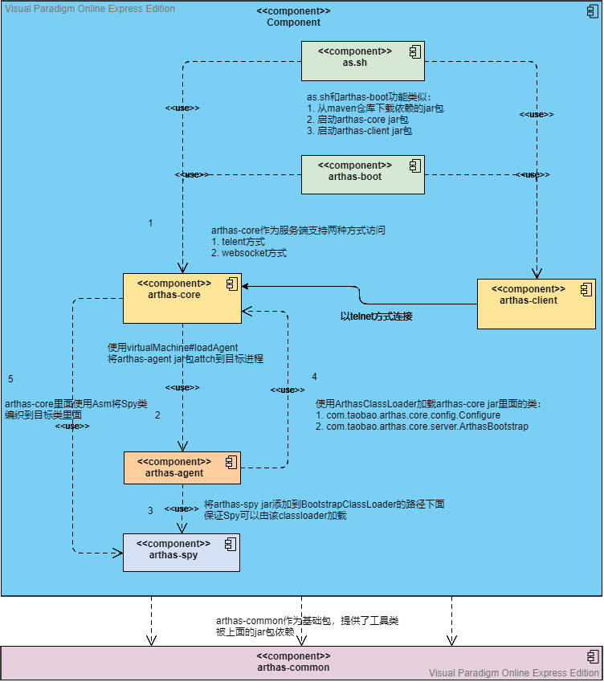


> 参考文章：
>
> [Arthas源码分析—启动源码分析 - 墨天轮 (modb.pro)](https://www.modb.pro/db/244638)
>
> [实现一个分布式调用链路追踪Java探针你可能会遇到的问题 - 掘金 (juejin.cn)](https://juejin.cn/post/6869371903664979976)
>
> [文章详情|arthas原理简介 (codefun007.xyz)](http://codefun007.xyz/a/article_detail/1057.htm)
>
> [arthas源码解析（二）启动流程 - 知乎 (zhihu.com)](https://zhuanlan.zhihu.com/p/397607071)
>
> [Arthas源码Debug](https://github.com/alibaba/arthas/blob/master/CONTRIBUTING.md#开发者相关)
>
> [Arthas 命令执行流程解析 - 墨天轮 (modb.pro)](https://www.modb.pro/db/378366)
>
> [arthas源码分析 - 简书 (jianshu.com)](https://www.jianshu.com/p/4e34d0ab47d1)

