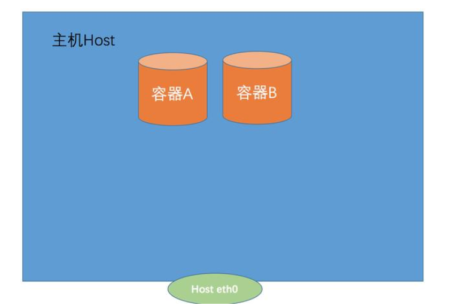
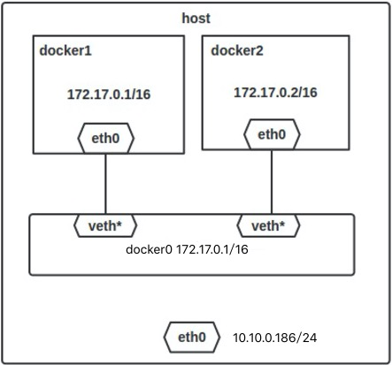

# Docker网络原理

Docker作为目前最火的轻量级容器技术，牛逼的功能，如Docker的镜像管理，不足的地方网络方面。

Docker自身的4种网络工作方式，和一些自定义网络模式

安装Docker时，它会自动创建三个网络，bridge（创建容器默认连接到此网络）、 none 、host

- host：容器将不会虚拟出自己的网卡，配置自己的IP等，而是使用宿主机的IP和端口。
- bridge：此模式会为每一个容器分配、设置IP等，并将容器连接到一个docker0虚拟网桥，通过docker0网桥以及Iptables nat表配置与宿主机通信。

- joined：创建的容器不会创建自己的网卡，配置自己的IP，而是和一个指定的容器共享IP、端口范围。

- none：该模式关闭了容器的网络功能。

以上都是不用动手的，真正需要配置的是自定义网络。

##  一. 前言

当你开始大规模使用Docker时，你会发现需要了解很多关于网络的知识。Docker作为目前最火的轻量级容器技术，有很多令人称道的功能，如Docker的镜像管理。然而，Docker同样有着很多不完善的地方，网络方面就是Docker比较薄弱的部分。因此，我们有必要深入了解Docker的网络知识，以满足更高的网络需求。本文首先介绍了Docker自身的4种网络工作方式，然后介绍一些自定义网络模式。

## 二. 默认网络

当你安装Docker时，它会自动创建三个网络。你可以使用以下`docker network ls`命令列出这些网络：

```shell
$ docker network ls
NETWORK ID          NAME                DRIVER
7fca4eb8c647        bridge              bridge
9f904ee27bf5        none                null
cf03ee007fb4        host                host
```

Docker内置这三个网络，运行容器时，你可以使用该--network标志来指定容器应连接到哪些网络。

该bridge网络代表docker0所有Docker安装中存在的网络。除非你使用该docker run --network=<NETWORK>选项指定，否则Docker守护程序默认将容器连接到此网络。

我们在使用docker run创建Docker容器时，可以用 --net 选项指定容器的网络模式，Docker可以有以下4种网络模式：

host模式：使用 --net=host 指定。

none模式：使用 --net=none 指定。

bridge模式：使用 --net=bridge 指定，默认设置。

container模式：使用 --net=container:[容器名称|容器ID] 指定。

下面分别介绍一下Docker的各个网络模式。

## 三. 四种网络模式

Docker默认有四种网络模式：none模式、bridge模式、container模式、host模式。

这四种模式的开放度依次增高，在不影响基本使用的情况下应尽量选择开放度低的网络模式以保证数据安全。

### 3.1 none模式（closed）

使用none模式，Docker容器拥有自己的Network Namespace，但是，并不为Docker容器进行任何网络配置。也就是说，这个Docker容器没有网卡、IP、路由等信息，只有lo 网络[接口](http://www.hqchip.com/app/1039)。需要我们自己为Docker容器添加网卡、配置IP等。

示例图如下：



### 3.2 bridged

当Docker server启动时，会在主机上创建一个名为docker0的虚拟网桥，此主机上启动的Docker容器会连接到这个虚拟网桥上。虚拟网桥的工作方式和物理交换机类似，这样主机上的所有容器就通过交换机连在了一个二层网络中。接下来就要为容器分配IP了，Docker会从RFC1918所定义的私有IP网段中，选择一个和宿主机不同的IP地址和子网分配给docker0，连接到docker0的容器就从这个子网中选择一个未占用的IP使用。如一般Docker会使用172.17.0.0/16这个网段，并将172.17.0.1/16分配给docker0网桥（在主机上使用ifconfig命令是可以看到docker0的，可以认为它是网桥的管理接口，在宿主机上作为一块虚拟网卡使用）。单机环境下的网络拓扑如下，主机地址为10.10.0.186/24。



#### 3.2.1 网络模式详解

Docker完成以上网络配置的过程大致是这样的：

1. 在主机上创建一对虚拟网卡veth pair设备。veth设备总是成对出现的，它们组成了一个数据的通道，数据从一个设备进入，就会从另一个设备出来。因此，veth设备常用来连接两个网络设备。

2. Docker将veth pair设备的一端放在新创建的容器中，并命名为eth0。另一端放在主机中，以veth65f9这样类似的名字命名，并将这个网络设备加入到docker0网桥中，可以通过brctl show命令查看。

```shell
$ brctl show
bridge name     bridge id               STP enabled     interfaces
docker0         8000.02425f21c208       no
```

3. 从docker0子网中分配一个IP给容器使用，并设置docker0的IP地址为容器的默认网关。

```shell
# 运行容器;
$ docker run --name=nginx_bridge --net=bridge -p 80:80 -d nginx       
9582dbec7981085ab1f159edcc4bf35e2ee8d5a03984d214bce32a30eab4921a
 
# 查看容器;
$ docker ps
CONTAINER ID        IMAGE          COMMAND                  CREATED             STATUS              PORTS                NAMES
9582dbec7981        nginx          "nginx -g 'daemon ..."   3 seconds ago       Up 2 seconds        0.0.0.0:80->80/tcp   nginx_bridge
 
# 查看容器网络;
$ docker inspect 9582dbec7981
"Networks": {
    "bridge": {
        "IPAMConfig": null,
        "Links": null,
        "Aliases": null,
        "NetworkID": "9e017f5d4724039f24acc8aec634c8d2af3a9024f67585fce0a0d2b3cb470059",
        "EndpointID": "81b94c1b57de26f9c6690942cd78689041d6c27a564e079d7b1f603ecc104b3b",
        "Gateway": "172.17.0.1",
        "IPAddress": "172.17.0.2",
        "IPPrefixLen": 16,
        "IPv6Gateway": "",
        "GlobalIPv6Address": "",
        "GlobalIPv6PrefixLen": 0,
        "MacAddress": "02:42:ac:11:00:02"
    }
}
```

```shell
$ docker network inspect bridge
[
    {
        "Name": "bridge",
        "Id": "9e017f5d4724039f24acc8aec634c8d2af3a9024f67585fce0a0d2b3cb470059",
        "Created": "2017-08-09T23:20:28.061678042-04:00",
        "Scope": "local",
        "Driver": "bridge",
        "EnableIPv6": false,
        "IPAM": {
            "Driver": "default",
            "Options": null,
            "Config": [
                {
                    "Subnet": "172.17.0.0/16"
                }
            ]
        },
        "Internal": false,
        "Attachable": false,
        "Ingress": false,
        "Containers": {
            "9582dbec7981085ab1f159edcc4bf35e2ee8d5a03984d214bce32a30eab4921a": {
                "Name": "nginx_bridge",
                "EndpointID": "81b94c1b57de26f9c6690942cd78689041d6c27a564e079d7b1f603ecc104b3b",
                "MacAddress": "02:42:ac:11:00:02",
                "IPv4Address": "172.17.0.2/16",
                "IPv6Address": ""
            }
        },
        "Options": {
            "com.docker.network.bridge.default_bridge": "true",
            "com.docker.network.bridge.enable_icc": "true",
            "com.docker.network.bridge.enable_ip_masquerade": "true",
            "com.docker.network.bridge.host_binding_ipv4": "0.0.0.0",
            "com.docker.network.bridge.name": "docker0",
            "com.docker.network.driver.mtu": "1500"
        },
        "Labels": {}
    }
]
```

网络拓扑介绍完后，接着介绍一下bridge模式下容器是如何通信的。

#### 3.2.2 bridge模式下容器的通信

在bridge模式下，连在同一网桥上的容器可以相互通信（若出于安全考虑，也可以禁止它们之间通信，方法是在DOCKER_OPTS变量中设置–icc=false，这样只有使用–link才能使两个容器通信）。

Docker可以开启容器间通信（意味着默认配置--icc=true），也就是说，宿主机上的所有容器可以不受任何限制地相互通信，这可能导致拒绝服务攻击。进一步地，Docker可以通过--ip_forward和--iptables两个选项控制容器间、容器和外部世界的通信。

容器也可以与外部通信，我们看一下主机上的Iptable规则，可以看到这么一条

```shell
-A POSTROUTING -s 172.17.0.0/16 ! -o docker0 -j MASQUERADE
```

这条规则会将源地址为172.17.0.0/16的包（也就是从Docker容器产生的包），并且不是从docker0网卡发出的，进行源地址转换，转换成主机网卡的地址。

这么说可能不太好理解，举一个例子说明一下。假设主机有一块网卡为eth0，IP地址为10.10.101.105/24，网关为10.10.101.254。从主机上一个IP为172.17.0.1/16的容器中ping百度（180.76.3.151）。IP包首先从容器发往自己的默认网关docker0，包到达docker0后，也就到达了主机上。然后会查询主机的路由表，发现包应该从主机的eth0发往主机的网关10.10.105.254/24。接着包会转发给eth0，并从eth0发出去（主机的ip_forward转发应该已经打开）。这时候，上面的Iptable规则就会起作用，对包做SNAT转换，将源地址换为eth0的地址。这样，在外界看来，这个包就是从10.10.101.105上发出来的，Docker容器对外是不可见的。

那么，外面的机器是如何访问Docker容器的服务呢？我们首先用下面命令创建一个含有web应用的容器，将容器的80端口映射到主机的80端口。

```shell
$ docker run --name=nginx_bridge --net=bridge -p 80:80 -d nginx
```

然后查看Iptable规则的变化，发现多了这样一条规则：

```shell
-A DOCKER ! -i docker0 -p tcp -m tcp --dport 80 -j DNAT --to-destination 172.17.0.2:80
```

此条规则就是对主机eth0收到的目的端口为80的tcp流量进行DNAT转换，将流量发往172.17.0.2:80，也就是我们上面创建的Docker容器。所以，外界只需访问10.10.101.105:80就可以访问到容器中的服务。

除此之外，我们还可以自定义Docker使用的IP地址、DNS等信息，甚至使用自己定义的网桥，但是其工作方式还是一样的。

### 3.3 container模式（joined）

容器之间可以共享网络协议栈，即可以通过套接字来进行通信

这个模式指定新创建的容器和已经存在的一个容器共享一个 Network Namespace，而不是和宿主机共享。新创建的容器不会创建自己的网卡，配置自己的 IP，而是和一个指定的容器共享 IP、端口范围等。同样，两个容器除了网络方面，其他的如文件系统、进程列表等还是隔离的。两个容器的进程可以通过 lo 网卡设备通信。


### 3.4 host模式（open）

Host模式使用是在容器启动时候指明--network host，此时容器共享宿主机的Network Namespace，容器内启动的端口直接是宿主机的端口，容器不会创建网卡和IP，直接使用宿主机的网卡和IP，但是容器内的其他资源是隔离的，如文件系统、用户和用户组。直接使用宿主机网络。同样启动一个nginx，此时共享主机网络，根据情况来使用，这样子也不用做端口转发，网络传输效率会比较高(思考一下为什么)。

例如，我们在10.10.0.186/24的机器上用host模式启动一个含有nginx应用的Docker容器，监听tcp80端口。

```shell
# 运行容器;
$ docker run --name=nginx_host --net=host -p 80:80 -d nginx
74c911272942841875f4faf2aca02e3814035c900840d11e3f141fbaa884ae5c
# 查看容器;
$ docker ps  
CONTAINER ID        IMAGE               COMMAND                  CREATED             STATUS              PORTS               NAMES
74c911272942        nginx        "nginx -g 'daemon ..."         25 seconds ago      Up 25 seconds                           nginx_host
```

当我们在容器中执行任何类似ifconfig命令查看网络环境时，看到的都是宿主机上的信息。而外界访问容器中的应用，则直接使用10.10.0.186:80即可，不用任何NAT转换，就如直接跑在宿主机中一样。但是，容器的其他方面，如文件系统、进程列表等还是和宿主机隔离的。

```shell
$ netstat -nplt | grep nginx
tcp        0      0 0.0.0.0:80              0.0.0.0:*               LISTEN      27340/nginx: master
```

​                                                                                                                                                                                                                                                                                                                                                                                                                                                                                                                                                                                                                                                                                                                                                                                                                                                                                                                                                                                                                                                                                                                                                                                                                                                                                                                                              

**本文参考至**：

[《Docker实战》]()

[https://www.cnblogs.com/zuxing/articles/8780661.html](https://www.cnblogs.com/zuxing/articles/8780661.html)

[https://yeasy.gitbook.io/docker_practice/network/linking](https://yeasy.gitbook.io/docker_practice/network/linking)