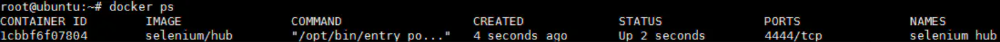
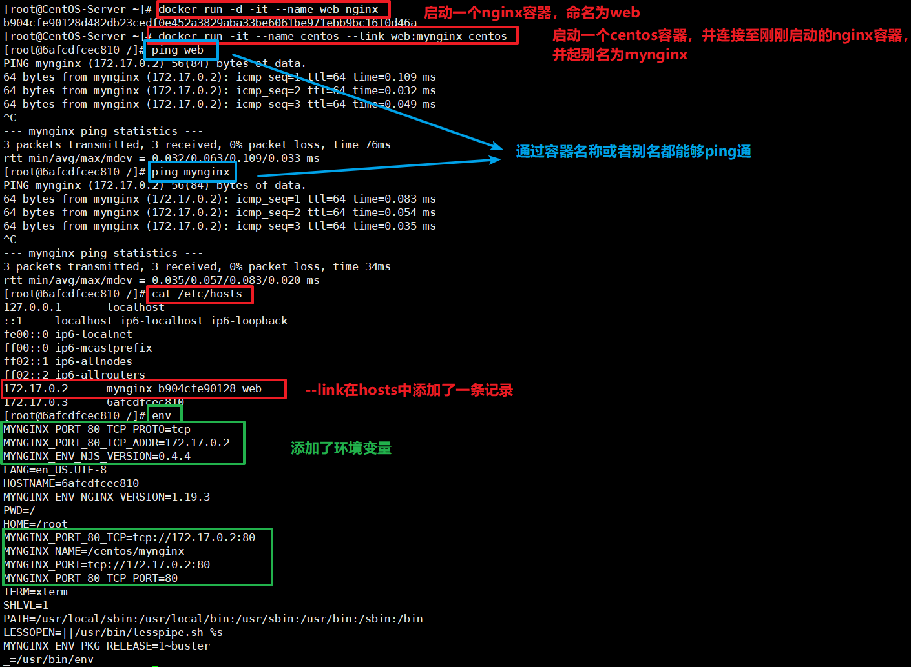

# 使用Link连接容器

我们启动两个centos容器，我们会发现容器会拥有自己的IP地址：

centos1:

```shell
[root@8e9a943d5d54 /]# ip addr
1: lo: <LOOPBACK,UP,LOWER_UP> mtu 65536 qdisc noqueue state UNKNOWN group default qlen 1000
    link/loopback 00:00:00:00:00:00 brd 00:00:00:00:00:00
    inet 127.0.0.1/8 scope host lo
       valid_lft forever preferred_lft forever
28: eth0@if29: <BROADCAST,MULTICAST,UP,LOWER_UP> mtu 1500 qdisc noqueue state UP group default 
    link/ether 02:42:ac:11:00:02 brd ff:ff:ff:ff:ff:ff link-netnsid 0
    inet 172.17.0.2/16 brd 172.17.255.255 scope global eth0
       valid_lft forever preferred_lft forever
```

centos2:

```shell
[root@3aebf23ebd35 /]# ip addr
1: lo: <LOOPBACK,UP,LOWER_UP> mtu 65536 qdisc noqueue state UNKNOWN group default qlen 1000
    link/loopback 00:00:00:00:00:00 brd 00:00:00:00:00:00
    inet 127.0.0.1/8 scope host lo
       valid_lft forever preferred_lft forever
30: eth0@if31: <BROADCAST,MULTICAST,UP,LOWER_UP> mtu 1500 qdisc noqueue state UP group default 
    link/ether 02:42:ac:11:00:03 brd ff:ff:ff:ff:ff:ff link-netnsid 0
    inet 172.17.0.3/16 brd 172.17.255.255 scope global eth0
       valid_lft forever preferred_lft forever
```

我们通过ip地址是能够ping通对方的，但是如果我们通过容器名称是ping不通的：

```shell
[root@3aebf23ebd35 /]# ping centos1
ping: centos1: Name or service not known
```

## 二. docker run --link的作用

`docker run --link`可以用来链接2个容器，使得源容器（被链接的容器）和接收容器（主动去链接的容器）之间可以互相通信，并且接收容器可以获取源容器的一些数据，如源容器的环境变量。

**--link的格式：**

```shell
--link [容器名称|容器ID]:[别名]
```

**源容器**

```
docker run -d --name selenium_hub selenium/hub
```

创建并启动名为selenium_hub的容器。



selenium_hub容器

**接收容器**

```shell
docker run -d --name node --link selenium_hub:hub selenium/node-chrome-debug
```

创建并启动名为node的容器，并把该容器和名为selenium_hub的容器链接起来。其中：

```shell
--link selenium_hub:hub
```

selenium_hub是上面启动的1cbbf6f07804容器的名字，这里作为源容器，hub是该容器在link下的别名（alias），通俗易懂的讲，站在node容器的角度，selenium_hub和hub都是1cbbf6f07804容器的名字，并且作为容器的hostname，node用这2个名字中的哪一个都可以访问到1cbbf6f07804容器并与之通信（docker通过DNS自动解析）。我们可以来看下：

进入node容器：

```
docker exec -it node /bin/bash

root@c4cc05d832e0:~# ping selenium_hub
PING hub (172.17.0.2) 56(84) bytes of data.
64 bytes from hub (172.17.0.2): icmp_seq=1 ttl=64 time=0.184 ms
64 bytes from hub (172.17.0.2): icmp_seq=2 ttl=64 time=0.133 ms
64 bytes from hub (172.17.0.2): icmp_seq=3 ttl=64 time=0.216 ms

root@c4cc05d832e0:~# ping hub
PING hub (172.17.0.2) 56(84) bytes of data.
64 bytes from hub (172.17.0.2): icmp_seq=1 ttl=64 time=0.194 ms
64 bytes from hub (172.17.0.2): icmp_seq=2 ttl=64 time=0.218 ms
64 bytes from hub (172.17.0.2): icmp_seq=3 ttl=64 time=0.128 ms
```

可见，selenium_hub和hub都指向172.17.0.2。

## 三. --link的原理

我们使用`--link`连接容器，实际上容器做了下面两件事：

1. 容器里添加了解析

2. 环境变量里设置了相应的地址和ip



文章参考至：

https://www.jianshu.com/p/21d66ca6115e

https://www.codenong.com/cs106463217/

