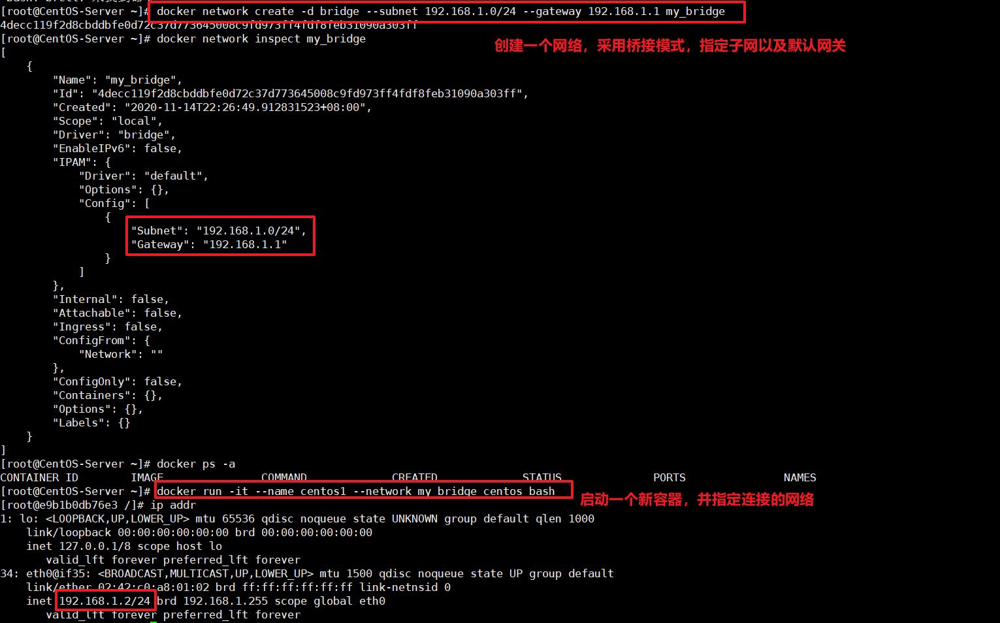
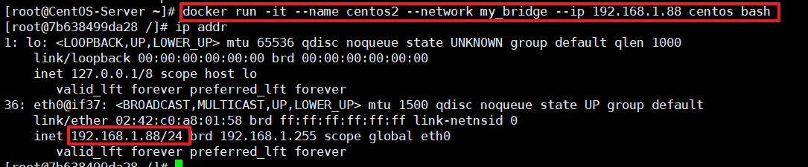
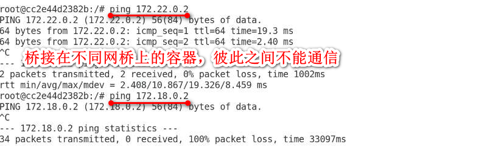
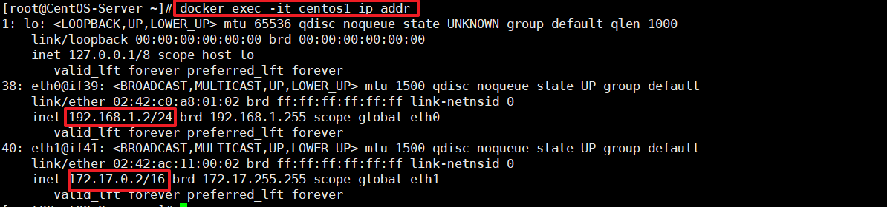
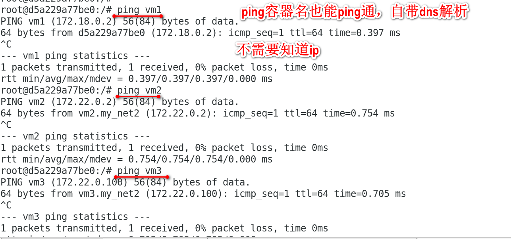

# 自定义网络

- [一. 创建自定义网络](#1)
  - [1.1 设置驱动类型](#1.1)
  - [1.2 自定义网段和网关](#1.2)
  - [1.3 自定义IP](#1.3)
  - [1.4 将容器连接至网络中](#1.4)
  - [1.5 内嵌DNS](#1.5)
- [二. 网络常用命令](#2)

当你安装Docker时，它会自动创建三个网络。你可以使用以下docker network ls命令列出这些网络：

```shell
$ docker network ls
NETWORK ID          NAME                DRIVER
7fca4eb8c647        bridge              bridge
9f904ee27bf5        none                null
cf03ee007fb4        host                host
```

Docker内置这三个网络，运行容器时，你可以使用该--network标志来指定容器应连接到哪些网络。我们还可以自定义网络，当容器运行时连接到自定义网络上。

Docker官方建议使用自定义的网桥来控制哪些容器可以相互通信，还可以自动DNS解析容器名称到IP地址。Docker提供了创建这些网络的默认网络驱动程序，你可以创建一个新的Bridge网络，Overlay或Macvlan网络。你还可以创建一个网络插件或远程网络进行完整的自定义和控制。

你可以根据需要创建任意数量的网络，并且可以在任何给定时间将容器连接到这些网络中的零个或多个网络。此外，您可以连接并断开网络中的运行容器，而无需重新启动容器。当容器连接到多个网络时，其外部连接通过第一个非内部网络以词法顺序提供。

## 一. 创建自定义网络<a name="1"></a>

格式：`docker network create [option] 名称`

```shell
$ docker network create testbridge
$ docker network ls
NETWORK ID          NAME                DRIVER              SCOPE
eaf52da56b6c        bridge              bridge              local
5ba396eed009        host                host                local
5bdf92c063b1        none                null                local
5e95abddbee4        testbridge          bridge              local
```

默认的网络配置：

```shell
$ docker network inspect testbridge
[
    {
        "Name": "testbridge",
        "Id": "5e95abddbee431a7f07520b89c14ad346603f992244164dafb6d76607a711433",
        "Created": "2020-11-14T22:12:55.855950401+08:00",
        "Scope": "local",
        "Driver": "bridge",
        "EnableIPv6": false,
        "IPAM": {
            "Driver": "default",
            "Options": {},
            "Config": [
                {
                    "Subnet": "172.18.0.0/16",
                    "Gateway": "172.18.0.1"
                }
            ]
        },
        "Internal": false,
        "Attachable": false,
        "Ingress": false,
        "ConfigFrom": {
            "Network": ""
        },
        "ConfigOnly": false,
        "Containers": {},
        "Options": {},
        "Labels": {}
    }
]

```

### 1.1 设置驱动类型<a name="1.1"></a>

我们可以通过 `--driver`指定网络的驱动类型，默认情况驱动类型为`bridge`

#### bridge

bridge网络是Docker中最常用的网络类型。桥接网络类似于默认bridge网络，但添加一些新功能并删除一些旧的能力。以下示例创建一些桥接网络，并对这些网络上的容器执行一些实验。

```shell
$ docker network create --driver bridge new_bridge
```

创建网络后，可以看到新增加了一个网桥（172.18.0.1）:

```shell
$ ifconfig
br-f677ada3003c: flags=4099<UP,BROADCAST,MULTICAST>  mtu 1500
        inet 172.18.0.1  netmask 255.255.0.0  broadcast 0.0.0.0
        ether 02:42:2f:c1:db:5a  txqueuelen 0  (Ethernet)
        RX packets 4001976  bytes 526995216 (502.5 MiB)
        RX errors 0  dropped 35  overruns 0  frame 0
        TX packets 1424063  bytes 186928741 (178.2 MiB)
        TX errors 0  dropped 0 overruns 0  carrier 0  collisions 0
 
docker0: flags=4163<UP,BROADCAST,RUNNING,MULTICAST>  mtu 1500
        inet 172.17.0.1  netmask 255.255.0.0  broadcast 0.0.0.0
        inet6 fe80::42:5fff:fe21:c208  prefixlen 64  scopeid 0x20<link>
        ether 02:42:5f:21:c2:08  txqueuelen 0  (Ethernet)
        RX packets 12  bytes 2132 (2.0 KiB)
        RX errors 0  dropped 0  overruns 0  frame 0
        TX packets 24  bytes 2633 (2.5 KiB)
        TX errors 0  dropped 0 overruns 0  carrier 0  collisions 0
```

#### Macvlan

Macvlan是一个新的尝试，是真正的网络虚拟化技术的转折点。Linux实现非常轻量级，因为与传统的Linux Bridge隔离相比，它们只是简单地与一个Linux以太网接口或子接口相关联，以实现网络之间的分离和与物理网络的连接。

Macvlan提供了许多独特的功能，并有充足的空间进一步创新与各种模式。这些方法的两个高级优点是绕过Linux网桥的正面性能以及移动部件少的简单性。删除传统上驻留在Docker主机NIC和容器接口之间的网桥留下了一个非常简单的设置，包括容器接口，直接连接到Docker主机接口。由于在这些情况下没有端口映射，因此可以轻松访问外部服务。

#### overlay

.....

### 1.2 自定义网段和网关<a name="1.2"></a>

```shell
docker network create -d bridge --subnet 192.168.1.0/24 --gateway 192.168.1.1 my_bridge
```



### 1.3 自定义IP<a name="1.3"></a>

我们可以在容器启动时自定IP

```shell
docker run -it --name centos2 --network my_bridge --ip 192.168.1.88 centos bash
```



注意：桥接在不同网桥上的容器无法直接通讯

### 1.4 将容器连接至网络中<a name="1.4"></a>

我们可以将正在运行的容器连接至指定网络：`docker network connect [网络名] [容器名|容器ID]`

```shell
$ docker network connect bridge centos1
```



可以看到一个容器是可以连接到多个网络上的。

### 1.5 内嵌DNS<a name="1.5"></a>

docker在1.10以后，都会内嵌一个DNSserver，同子网下的容器之间除了通过IP进行通信以外，还可以使用容器名称进行通讯。

由于自定义网络自带DNS解析，连接在同一个网络下的多个容器之间可以通过服务名直接连接：




## 二. 网络常用命令<a name="2"></a>

2.1 查看