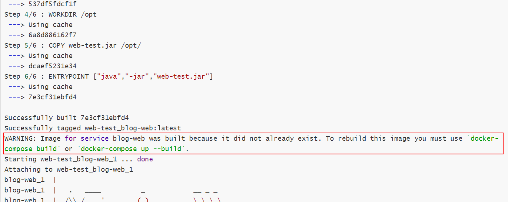

# Docker Compose

`Compose` 项目是 Docker 官方的开源项目，负责实现对 Docker 容器集群的快速编排。从功能上看，跟 `OpenStack` 中的 `Heat` 十分类似。

其代码目前在 <https://github.com/docker/compose> 上开源。

`Compose` 定位是 「定义和运行多个 Docker 容器的应用（Defining and running multi-container Docker applications）」，其前身是开源项目 Fig。

通过第一部分中的介绍，我们知道使用一个 `Dockerfile` 模板文件，可以让用户很方便的定义一个单独的应用容器。然而，在日常工作中，经常会碰到需要多个容器相互配合来完成某项任务的情况。例如要实现一个 Web 项目，除了 Web 服务容器本身，往往还需要再加上后端的数据库服务容器，甚至还包括负载均衡容器等。

`Compose` 恰好满足了这样的需求。它允许用户通过一个单独的 `docker-compose.yml` 模板文件（YAML 格式）来定义一组相关联的应用容器为一个项目（project）。

`Compose` 中有两个重要的概念：

- 服务 (`service`)：一个应用的容器，实际上可以包括若干运行相同镜像的容器实例。
- 项目 (`project`)：由一组关联的应用容器组成的一个完整业务单元，在 `docker-compose.yml` 文件中定义。

`Compose` 的默认管理对象是项目，通过子命令对项目中的一组容器进行便捷地生命周期管理。

`Compose` 项目由 Python 编写，实现上调用了 Docker 服务提供的 API 来对容器进行管理。因此，只要所操作的平台支持 Docker API，就可以在其上利用 `Compose` 来进行编排管理。

## 一. 安装和卸载

在 Linux 上的也安装十分简单，从 [官方 GitHub Release](https://github.com/docker/compose/releases) 处直接下载编译好的二进制文件即可。

例如，在 Linux 64 位系统上直接下载对应的二进制包。

```shell
$ sudo curl -L https://github.com/docker/compose/releases/download/1.25.5/docker-compose-`uname -s`-`uname -m` > /usr/local/bin/docker-compose

$ sudo chmod +x /usr/local/bin/docker-compose
```

### 卸载

如果是二进制包方式安装的，删除二进制文件即可。

```
$ sudo rm /usr/local/bin/docker-compose
```

如果是通过 `pip` 安装的，则执行如下命令即可删除。

```
$ sudo pip uninstall docker-compose
```

## 二. 基本使用

使用Compose仅需要三步： 
- 使用`Dockerfile`定义你的应用依赖的镜像； 
- 使用`docker-compose.yml`定义你的应用具有的服务； 
- 通过`docker-compose up`命令创建并运行应用；

新建文件夹，在该目录中引入`web-test.jar`，它是一个可执行的web程序（SpringBoot）。编写Dockerfile：

```shell
FROM openjdk:8u111
LABEL maintainer "bigcoder <bigcoder84@gmail.com>"
EXPOSE 8080/tcp
WORKDIR /opt
COPY web-test.jar /opt/
ENTRYPOINT ["java","-jar","web-test.jar"]
```

编写`docker-compose.yml`：

```shell
version: '3.8'
services:
  blog-web:
    build: .
    ports:
      - "8080:80"
```

第一行的version需要根据自己Docker版本进行配置，Docker版本的对应关系参考：https://docs.docker.com/compose/compose-file/

使用`docker-compose up`命令构建并运行：

```shell
[root@CentOS-Server web-test]# docker-compose up
WARNING: Found orphan containers (web-test_web_1) for this project. If you removed or renamed this service in your compose file, you can run this command with the --remove-orphans flag to clean it up.
Building blog-web
Step 1/6 : FROM openjdk:8u111
 ---> d23bdf5b1b1b
Step 2/6 : LABEL maintainer "bigcoder <bigcoder84@gmail.com>"
 ---> Using cache
 ---> 47da9b4be014
Step 3/6 : EXPOSE 8080/tcp
 ---> Using cache
 ---> 537df5fdcf1f
Step 4/6 : WORKDIR /opt
 ---> Using cache
 ---> 6a8d886162f7
Step 5/6 : COPY web-test.jar /opt/
 ---> Using cache
 ---> dcaef5231e34
Step 6/6 : ENTRYPOINT ["java","-jar","web-test.jar"]
 ---> Using cache
 ---> 7e3cf31ebfd4

Successfully built 7e3cf31ebfd4
Successfully tagged web-test_blog-web:latest
WARNING: Image for service blog-web was built because it did not already exist. To rebuild this image you must use `docker-compose build` or `docker-compose up --build`.
Starting web-test_blog-web_1 ... done
Attaching to web-test_blog-web_1
blog-web_1  | 
blog-web_1  |   .   ____          _            __ _ _
blog-web_1  |  /\\ / ___'_ __ _ _(_)_ __  __ _ \ \ \ \
blog-web_1  | ( ( )\___ | '_ | '_| | '_ \/ _` | \ \ \ \
blog-web_1  |  \\/  ___)| |_)| | | | | || (_| |  ) ) ) )
blog-web_1  |   '  |____| .__|_| |_|_| |_\__, | / / / /
blog-web_1  |  =========|_|==============|___/=/_/_/_/
blog-web_1  |  :: Spring Boot ::                (v2.4.0)
blog-web_1  | 
.......................
```

需要注意的是，在首次执行`docker-compose up`时会自动构建项目中配置的镜像，但是后面如果我们再使用该命令默认就不会重新构建了，如果我们需要重新构建可以使用`docker build`命令重新构建：



## 三. 默认命名规则

### 网络

`docker-compose up`命令启动后默认会创建一个网络（以`文件夹名称_default`格式命名），将项目中的所有服务都连接至这个网络中。我们在使用`docker-compose down`停止项目后，会默认删除创建的容器和网络。

### 容器命名

我们通过`docker ps`或者在`docker-compose.yml`文件所在目录下执行`docker-compose ps`命令，即可看到我们通过`docker-compose`启动的服务，值得注意的是启动的容器名称都是以`文件夹名_服务名_数字`格式命名的。其中文件名就是我们执行`docker-compose up`所在的文件夹名称，服务名就是`docker-compose.yml`文件中配置的服务名，而数字则是服务启动的数量（可以通过scala指定服务启动的数量）。

### 镜像命名

如果我们`docker-compose.yml`定义了镜像构建的动作的话，构建出来的镜像名称默认是`文件夹名_服务名`


