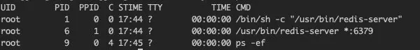
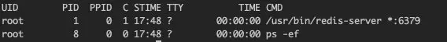
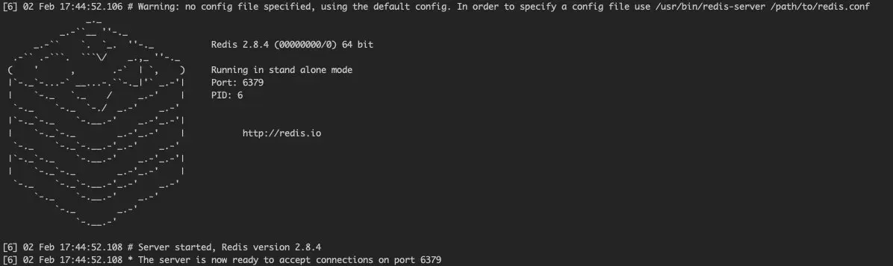
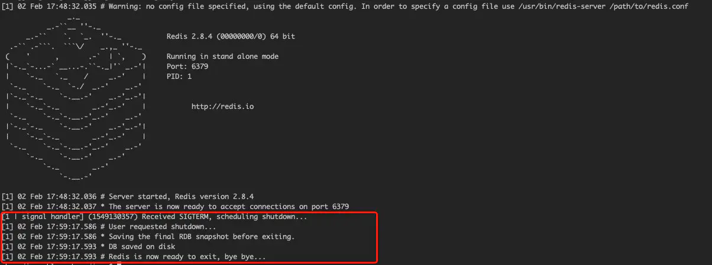

# 详解Docker进程

> 本文转载至：[从一个实例，一窥docker进程管理 (juejin.cn)](https://juejin.cn/post/6844903774511693838)

在Docker中，进程管理的基础是Linux内核的PID命名空间技术。在不同的PID命名空间下，可以有相同的PID。

Linux内核为所有的PID命名空间维护了一个树状的数据结构，最顶层是系统初始化时创建的root namespace（根命名空间）， 父节点可以看到子节点中的进程，并可以通过信号等方式对子节点中的进程产生影响。反过来，子节点不能看到父节点名空间中的任何内容，也不可能通过kill或ptrace影响父节点或其他名空间中的进程。

在docker中有一个很特殊的进程——PID为1的进程，这也是docker的主进程，通过Dockerfile中的 ENTRYPOINT 和/或 CMD指令指定。**当主进程退出的时候，容器所拥有的PIG命名空间就会被销毁，容器的生命周期也会结束**docker最佳实践建议的是一个container一个service，并不强制要你一个container一个线程。有的服务，会催生更多的子进程，比如Apache和uwsgi，这是完全OK的。

PID1进程需要对自己创建的子进程负责，当主进程没有设计好，不能优雅地让子进程退出，就会照成很多问题，比如数据库container，如果处理数据的进程没有优雅地退出，可能会照成数据丢失。如果很不幸，你的主进程就是这种管理不了子进程的那种，docker提供了一个小工具，帮助你来完成这部分内容。你只需要在run创建container的时候提供一个—init flag就行，docker就会手动为你处理好这些问题。

## 来看一个实例

在docker中，对于CMD和 ENTRYPOINT，支持两种进程执行方式：exec和shell。

shell的格式是：

```shell
CMD "executable param1 param2"
```

最终PID1进程将是： /bin/sh -c ”executable param1 param2”

exec的格式是:

```shell
CMD ["executable","param1","param2"]
```

最终的PID1进程是： executable param1 param2

现在有两个镜像，Dockerfile分别如下：

- 镜像redis:shell

```shell
FROM ubuntu:14.04
RUN apt-get update && apt-get -y install redis-server && rm -rf /var/lib/apt/lists/*
EXPOSE 6379
CMD "/usr/bin/redis-server"
```

- 镜像redis:exec

```shell
FROM ubuntu:14.04
RUN apt-get update && apt-get -y install redis-server && rm -rf /var/lib/apt/lists/*
EXPOSE 6379
CMD ["/usr/bin/redis-server"]
```

```shell
docker run -d --name myredis1 redis:shell
docker run -d --name myredis2 redis:exec
```

哪个docker镜像更好一点呢？

我们前面讲过，PID1进程（主进程）需要对自己的子进程负责，对于redis:shell，它产生的PID1进程是

```shell
/bin/sh -c "/usr/bin/redis-server"
```

也就是说，是`/bin/sh`这个进程，不是`/usr/bin/redis-server`，`/usr/bin/redis-server`只是它创建的一个子进程！

执行命令

```shell
docker exec myredis1 ps -ef
```

可以验证这种猜测：



通过exec方式运行的container的主进程则是我们所期望的。



你可能会觉得，这有什么大不了的呢，问题出现当我们停止container的时候。

## 停止redis:shell

```shell
docker stop myredis1
docker logs myredis1
```



Stop的时候，docker明显停顿了一段时间，而且查看日志可以看出，redis没有做任何持久化的操作，直接被强制退出了。这期间发生了什么？首先，运行stop命令会向容器发送 SIGTERM信号，告诉主进程：你该退出了，感觉收拾收拾。但是，这里的主进程是/bin/sh啊，它怎么可能会有处理redis进程退出的机制？所以redis进程不会马上退出。 Docker Daemon等待一段时间之后（默认是10s），发现容器还没有完全退出，这时候就会发送 SIGKILL，将容器强行杀死。在这过程中，redis进程完全不知道自己该退出了，所以他没有做任何收尾的工作。

##  停止redis:exec

```
docker stop myredis2
docker logs myredis2
```



这一次stop的时候是立即生效了，没有卡顿延迟现象，从输出来看，redis进行了shutdown的操作，把该持久化的数据都保存到磁盘了。因为这时候的PID1进程是`/usr/bin/redis-server`。

它是能够正确处理SIGTERM信号的。这才是我们所期望的。

## 总结一下

Docker的主进程（PID1进程）是一个很特殊的存在，它的生命周期就是docker container的生命周期，它得对产生的子进程负责，在写Dockerfile的时候，务必明确PID1进程是什么。