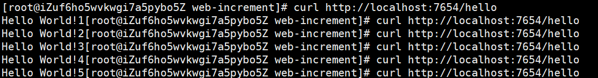
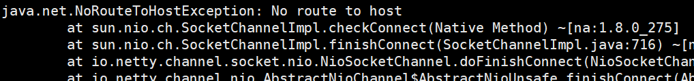

# 实战Docker官网计数器部署

官网在介绍Docker compose时给出了一个Python小程序，实现了接口访问计数的功能：[Get started with Docker Compose](https://docs.docker.com/compose/gettingstarted/)。这里我们使用Java实现一个类似的功能

## 第一步：构建SpringBoot项目

引入web、redis-template依赖：

````xml
<dependency>
   <groupId>org.springframework.boot</groupId>
   <artifactId>spring-boot-starter-web</artifactId>
</dependency>

<dependency>
    <groupId>org.springframework.boot</groupId>
    <artifactId>spring-boot-starter-data-redis</artifactId>
</dependency>
````

**测试接口**：

```java
@RestController
public class HelloController {

    @Autowired
    private StringRedisTemplate redisTemplate;

    @RequestMapping("hello")
    public String hello() {
        return "Hello World!" + redisTemplate.opsForValue().increment("view-count");
    }
}
```

**配置文件**：

```properties
spring.redis.host=redis
spring.redis.port=6379
```

因为redis默认端口就是6379，`spring.redis.port`可以不用配置；`spring.redis.host`这里配置的主机名称，由于使用docker部署我们是可以指定容器名称，后面我们在配置redis服务时，会指定服务名称为Redis。

## 第二步：编写Dockerfile

```dockerfile
FROM openjdk:8 #可以使用最小环境JRE
LABEL author="bigcoder" email="bigcoder84@gmail.com"
COPY *.jar /opt/app.jar
WORKDIR /opt/ 
CMD ["--server.port=80"] #通过传入JVM参数的形式，指定容器内SpingBoot项目端口
EXPOSE 80/tcp #声明暴露80端口（可省略）
ENTRYPOINT ["java","-jar","app.jar"]
```

可以使用`docker build`构建一下，测试Dockerfile是否有误：

```shell
[root@CentOS-Server web-increment]# docker build -t bigcoder/web-increament:v1.0 .
Sending build context to Docker daemon  25.51MB
Step 1/7 : FROM openjdk:8
8: Pulling from library/openjdk
756975cb9c7e: Pull complete 
d77915b4e630: Pull complete 
5f37a0a41b6b: Pull complete 
96b2c1e36db5: Pull complete 
27a2d52b526e: Pull complete 
93a36defce60: Pull complete 
9e2014d79b30: Pull complete 
Digest: sha256:e4227f27c4a2e607e0fb8d4fb33480e2e46ca776a84ed15ed2c04417399f4cac
Status: Downloaded newer image for openjdk:8
 ---> 82f24ce79de6
Step 2/7 : LABEL author="bigcoder" email="bigcoder84@gmail.com"
 ---> Running in 73f94d8a9472
Removing intermediate container 73f94d8a9472
 ---> 3e247dfcdb54
Step 3/7 : COPY *.jar /opt/app.jar
 ---> 93dc6b4a97c1
Step 4/7 : WORKDIR /opt/
 ---> Running in 084a40bdf940
Removing intermediate container 084a40bdf940
 ---> 17f1553f10da
Step 5/7 : CMD ["--server.port","80"]
 ---> Running in 65632a98b841
Removing intermediate container 65632a98b841
 ---> 4b5f8460a854
Step 6/7 : EXPOSE 80/tcp
 ---> Running in 96472d2d5639
Removing intermediate container 96472d2d5639
 ---> 94f22a977c8a
Step 7/7 : ENTRYPOINT ["java","-jar","app.jar"]
 ---> Running in 0a2197095dbd
Removing intermediate container 0a2197095dbd
 ---> 550c95271e88
Successfully built 550c95271e88
Successfully tagged bigcoder/web-increament:v1.0
```

## 第三步：编写`docker-compose.yml`文件

```shell
version: '3.9'
services:
  web-increament: # 服务名称
    build: . # 使用当前目录下的Dockerfile进行构建
    ports:
      - "7654:80" #将容器内的80映射到容器7654
    depends_on:
      - redis #声明该服务依赖与redis服务
  redis: 
    image: "redis:latest"
```

此时我们可以使用`docker-compose up [-d]`启动项目:

```shell
[root@CentOS-Server web-increment]# docker-compose up -d
Creating network "web-increment_default" with the default driver #为项目创建一个默认网络
Pulling redis (redis:latest)... #拉取redis镜像
latest: Pulling from library/redis
6ec7b7d162b2: Pull complete
1f81a70aa4c8: Pull complete
968aa38ff012: Pull complete
884c313d5b0b: Pull complete
6e858785fea5: Pull complete
78bcc34f027b: Pull complete
Digest: sha256:0f724af268d0d3f5fb1d6b33fc22127ba5cbca2d58523b286ed3122db0dc5381
Status: Downloaded newer image for redis:latest
Building web-increament # 构建镜像 
Step 1/7 : FROM openjdk:8
 ---> 82f24ce79de6
Step 2/7 : LABEL author="bigcoder" email="bigcoder84@gmail.com"
 ---> Using cache
 ---> 3e247dfcdb54
Step 3/7 : COPY *.jar /opt/app.jar
 ---> e0207e9cf8c1
Step 4/7 : WORKDIR /opt/
 ---> Running in 091562547ddd
Removing intermediate container 091562547ddd
 ---> 6f027bc2287b
Step 5/7 : CMD ["--server.port","80"]
 ---> Running in eb91c8340956
Removing intermediate container eb91c8340956
 ---> 91de7ed3d22f
Step 6/7 : EXPOSE 80/tcp
 ---> Running in 9b90dde997f5
Removing intermediate container 9b90dde997f5
 ---> f49551b9218f
Step 7/7 : ENTRYPOINT ["java","-jar","app.jar"]
 ---> Running in 7b5bec96aa1e
Removing intermediate container 7b5bec96aa1e
 ---> 3b789303c4d9

Successfully built 3b789303c4d9
Successfully tagged web-increment_web-increament:latest
WARNING: Image for service web-increament was built because it did not already exist. To rebuild this image you must use `docker-compose build` or `docker-compose up --build`.
Creating web-increment_redis_1 ... done
Creating web-increment_web-increament_1 ... done
```

访问接口：



**注意**：在使用CentOS8进行上述部署后，会发现在`web-increment`服务（容器）中连接不到依赖的`redis`服务：

报如下错误：



此时们执行下列命令即可：

```shell
firewall-cmd --zone=public --add-masquerade --permanent
firewall-cmd --reload
```

