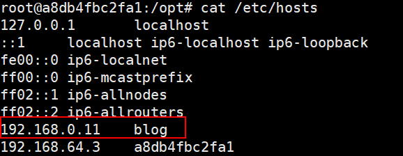

# yml配置指令

> 本文参考至：https://docs.docker.com/compose/compose-file

## version

指定本 yml 依从的 compose 哪个版本制定的。这个版本需要根据当前机器的Docker版本而定，具体的对应关系可以查看官网 [Compose file version 3 reference](https://docs.docker.com/compose/compose-file/)

## build

指定为构建镜像上下文路径：

```yaml
version: "3.9"
services:
  webapp:
    build: ./dir
```

如果你不仅仅需要指定上下文路径，还需要指定Dockerfile文件名称你可以这样做：

```yaml
version: "3.9"
services:
  webapp:
    build:
      context: ./dir
      dockerfile: Dockerfile-alternate
```

如果你同时指定了image和build，那么用image中指定的名称(webapp)和可选标签来(tag)为构建的镜像命名：

``` yaml
build: ./dir
image: webapp:tag
```

这样就得到了一个名为webapp的镜像，并带有标签，构建于./dir。

### context

要么是包含Dockerfile的路径，要么是一个Git仓库的URL地址。

如果提供的是一个相对路径，它被解释为相对于Compose文件的位置。 该目录也是发送到Docker守护程序的构建上下文。

### dockerfile

Compose使用另一个文件进行构建。还必须指定构建路径

```yaml
build:
  context: .
  dockerfile: Dockerfile-alternate
```

### network

> 在3.4版本引入该指令

用于设置容器在启动时连接的网络

```yaml
build:
  context: .
  network: host
```

```yaml
build:
  context: .
  network: custom_network_1
```

## command

覆盖容器默认的启动命令：

```yaml
command: ["bundle", "exec", "thin", "-p", "3000"]
```

## container_name

指定自定义容器名称，而不是生成一个默认名称。

```yaml
container_name: my-web-container
```

因为Docker容器的名称必须唯一，所以你在自定义名称后如果尝试将服务扩展至一个以上将会报错。

## depends_on

该指令用于表达服务之间的依赖关系，服务之间的依赖会有如下行为：

- `docker-compose up`启动项目时按照依赖顺序启动。
- `docker-compose up SERVICE` 启动特定服务时，会将依赖的服务也创建并启动。在下面的例子中，执行`docker-compose up web`时，也会创建并运行`db`和`redis`。
- `docker-compose stop` 停止时会按照依赖顺序停止。

一个简单的例子：

```yaml
version: "3.9"
services:
  web:
    build: .
    depends_on:
      - db
      - redis
  redis:
    image: redis
  db:
    image: postgres
```

> 需要注意的是：
>
> - `depends_on`不会等待`db`和`redis`启动完毕后再启动`web`。如果你需要等待`db`和`redis`启动完毕后再启动它，有关这个问题的更多信息和解决它的策略，请查看  [Controlling startup order](https://docs.docker.com/compose/startup-order/) 

## deploy

> 在version 3中增加

指定与服务的部署和运行有关的配置，这一配置只会在通过`docker stack deploy`部署到集群时才生效，而docker-compose up和docker-compose run会忽略它。

….

## extra_hosts

增加主机名映射。就像在Docker客户端使用`--add-host`参数一样：

```yaml
version: '3.9'
services:
  redis:
    image: "redis:latest"
  web-increament:
    build: .
    ports:
      - "7654:80"
    depends_on:
      - redis
    extra_hosts:
      - "blog:192.168.10.11"
```

一个带有IP地址和主机名的记录将被添加到`/etc/hosts`容器中，例如：



## image

指定要启动容器的镜像。 可以是存储库/标签或镜像ID。

```yaml
image: redis
image: ubuntu:14.04
image: tutum/influxdb
image: example-registry.com:4000/postgresql
image: a4bc65fd # 镜像id
```

```yaml
version: '3.9'
services:
  redis:
    image: "redis:latest"
```

如果镜像不存在，Compose会尝试拉取它，除非您还指定了build，在这种情况下，它将使用指定选项构建它，并将构建好的镜像命名。