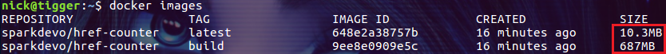
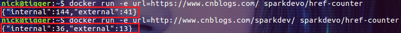
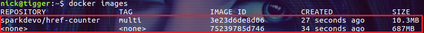

# 多阶段构建

> 本文转载至：https://www.cnblogs.com/sparkdev/p/8508435.html

在应用了容器技术的软件开发过程中，控制容器镜像的大小可是一件费时费力的事情。如果我们构建的镜像既是编译软件的环境，又是软件最终的运行环境，这是很难控制镜像大小的。

所以常见的配置模式为：**分别为软件的编译环境和运行环境提供不同的容器镜像**。比如为编译环境提供一个 `Dockerfile.build`，用它构建的镜像包含了编译软件需要的所有内容，比如代码、`SDK`、工具等等。同时为软件的运行环境提供另外一个单独的 Dockerfile，它从 `Dockerfile.build` 中获得编译好的软件，用它构建的镜像只包含运行软件所必须的内容。这种情况被称为**构造者模式(builder pattern)**，本文将介绍如何通过 Dockerfile 中的 multi-stage 来解决构造者模式带来的问题。

## 常见的容器镜像构建过程

比如我们创建了一个 GO 语言编写了一个检查页面中超级链接的程序 `app.go`(请从 [sparkdev](https://github.com/sparkdevo/href-counter) 获取本文相关的代码)：

```go
package main

import (
    "encoding/json"
    "fmt"
    "log"
    "net/http"
    "net/url"
    "os"
    "strings"

    "golang.org/x/net/html"
)

type scrapeDataStore struct {
    Internal int `json:"internal"`
    External int `json:"external"`
}

func isInternal(parsedLink *url.URL, siteUrl *url.URL, link string) bool {
    return parsedLink.Host == siteUrl.Host || strings.Index(link, "#") == 0 || len(parsedLink.Host) == 0
}

func main() {
    urlIn := os.Getenv("url")
    if len(urlIn) == 0 {
        urlIn = "https://www.cnblogs.com/"
        log.Fatalln("Need a valid url as an env-var.")
    }

    siteUrl, parseErr := url.Parse(urlIn)
    if parseErr != nil {
        log.Fatalln(parseErr)
    }
    resp, err := http.Get(urlIn)
    if err != nil {
        log.Fatalln(err)
    }

    scrapeData := &scrapeDataStore{}
    tokenizer := html.NewTokenizer(resp.Body)
    end := false
    for {
        tt := tokenizer.Next()
        switch {
        case tt == html.StartTagToken:
            // fmt.Println(tt)
            token := tokenizer.Token()
            switch token.Data {
            case "a":

                for _, attr := range token.Attr {

                    if attr.Key == "href" {
                        link := attr.Val

                        parsedLink, parseLinkErr := url.Parse(link)
                        if parseLinkErr == nil {
                            if isInternal(parsedLink, siteUrl, link) {
                                scrapeData.Internal++
                            } else {
                                scrapeData.External++
                            }
                        }

                        if parseLinkErr != nil {
                            fmt.Println("Can't parse: " + token.Data)
                        }
                    }
                }
                break
            }
        case tt == html.ErrorToken:
            end = true
            break
        }
        if end {
            break
        }
    }
    data, _ := json.Marshal(&scrapeData)
    fmt.Println(string(data))
}
```

下面我们通过容器来构建它，并把它部署到生产型的容器镜像中。

首先构建编译应用程序的镜像：

```dockerfile
FROM golang:1.7.3
WORKDIR /go/src/github.com/sparkdevo/href-counter/
RUN go get -d -v golang.org/x/net/html
COPY app.go .
RUN CGO_ENABLED=0 GOOS=linux go build -a -installsuffix cgo -o app .
```

把上面的内容保存到 `Dockerfile.build` 文件中。

接着把构建好的应用程序部署到生产环境用的镜像中：

```shell
FROM alpine:latest  
RUN apk --no-cache add ca-certificates
WORKDIR /root/
COPY app .
CMD ["./app"]  
```

把上面的内容保存到 Dockerfile 文件中。

最后需要使用一个脚本把整个构建过程整合起来：

```shell
#!/bin/sh
echo Building sparkdevo/href-counter:build
# 构建编译应用程序的镜像
docker build --no-cache -t sparkdevo/href-counter:build . -f Dockerfile.build
# 创建应用程序
docker create --name extract sparkdevo/href-counter:build# 拷贝编译好的应用程序
docker cp extract:/go/src/github.com/sparkdevo/href-counter/app ./app
docker rm -f extract

echo Building sparkdevo/href-counter:latest
# 构建运行应用程序的镜像
docker build --no-cache -t sparkdevo/href-counter:latest .
```

把上面的内容保存到 `build.sh`文件中。这个脚本会先创建出一个容器来构建应用程序，然后再创建最终运行应用程序的镜像。

把 `app.go`、`Dockerfile.build`、`Dockerfile` 和 `build.sh` 放在同一个目录下，然后进入这个目录执行 `build.sh` 脚本进行构建。构建后的容器镜像大小：



从上图中我们可以观察到，用于编译应用程序的容器镜像大小接近 700M，而**用于生产环境的容器镜像只有 10.3 M**，这样的大小在网络间传输的效率是很高的。

运行下面的命令可以检查我们构建的容器是否可以正常的工作：

```shell
$ docker run -e url=https://www.cnblogs.com/ sparkdevo/href-counter:latest
$ docker run -e url=http://www.cnblogs.com/sparkdev/ sparkdevo/href-counter:latest
```



OK，我们写的程序正确的统计了博客园首页和笔者的首页中超级链接的情况。

**采用上面的构建过程，我们需要维护两个 Dockerfile 文件和一个脚本文件 build.sh**。能不能简化一些呢？ 下面我们看看 docker 针对这种情况提供的解决方案：multi-stage。

## 在 Dockerfile 中使用 multi-stage

multi-stage 允许我们在 Dockerfile 中完成类似前面 build.sh 脚本中的功能，每个 stage 可以理解为构建一个容器镜像，后面的 stage 可以引用前面 stage 中创建的镜像。所以我们可以使用下面单个的 Dockerfile 文件实现前面的需求：

```dockerfile
FROM golang:1.7.3
WORKDIR /go/src/github.com/sparkdevo/href-counter/
RUN go get -d -v golang.org/x/net/html
COPY app.go    .
RUN CGO_ENABLED=0 GOOS=linux go build -a -installsuffix cgo -o app .

FROM alpine:latest
RUN apk --no-cache add ca-certificates
WORKDIR /root/
COPY --from=0 /go/src/github.com/sparkdevo/href-counter/app .
CMD ["./app"]
```

把上面的内容保存到文件 `Dockerfile.multi` 中。这个 `Dockerfile` 文件的特点是同时存在多个 `FROM` 指令，每个 `FROM` 指令代表一个 stage 的开始部分。我们可以把一个 stage 的产物拷贝到另一个 stage 中。本例中的第一个 stage 完成了应用程序的构建，内容和前面的 `Dockerfile.build` 是一样的。第二个 stage 中的 `COPY` 指令通过 `--from=0` 引用了第一个 stage ，并把应用程序拷贝到了当前 stage 中。接下来让我们编译新的镜像：

```shell
docker build --no-cache -t sparkdevo/href-counter:multi . -f Dockerfile.multi
```

结果和之前是一样的。那么新生成的镜像有没有特别之处呢：



好吧，从上图我们可以看到，除了 `sparkdevo/href-counter:multi` 镜像，还生成了一个匿名的镜像。因此，所谓的 multi-stage 不过时多个 Dockerfile 的语法糖罢了。但是这个语法糖还好很诱人的，现在我们维护一个结构简洁的 Dockerfile 文件就可以了

## 使用命名的 stage

在上面的例子中我们通过 --from=0 引用了 Dockerfile 中第一个 stage，这样的做法会让 Dockerfile 变得不容易阅读。其实我们是可以为 stage 命名的，然后就可以通过名称来引用 stage 了。下面是改造后的 `Dockerfile.mult` 文件：

```dockerfile
FROM golang:1.7.3 as builder
WORKDIR /go/src/github.com/sparkdevo/href-counter/
RUN go get -d -v golang.org/x/net/html
COPY app.go    .
RUN CGO_ENABLED=0 GOOS=linux go build -a -installsuffix cgo -o app .

FROM alpine:latest
RUN apk --no-cache add ca-certificates
WORKDIR /root/
COPY --from=builder /go/src/github.com/sparkdevo/href-counter/app .
CMD ["./app"]
```

我们把第一个 stage 使用 as 语法命名为 builder，然后在后面的 stage 中通过名称 builder 进行引用 --from=builder。通过使用命名的 stage， Dockerfile 更容易阅读了。

## 总结

Dockerfile 中的 multi-stage 虽然只是些语法糖，但它确实为我们带来了很多便利。尤其是减轻了 Dockerfile 维护者的负担(要知道实际生产中的 Dockerfile 可不像 demo 中的这么简单)。需要注意的是旧版本的 docker 是不支持 multi-stage 的，只有 17.05 以及之后的版本才开始支持。好了，是不是该去升级你的 docker 版本了？

