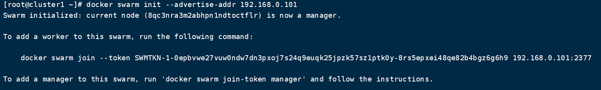
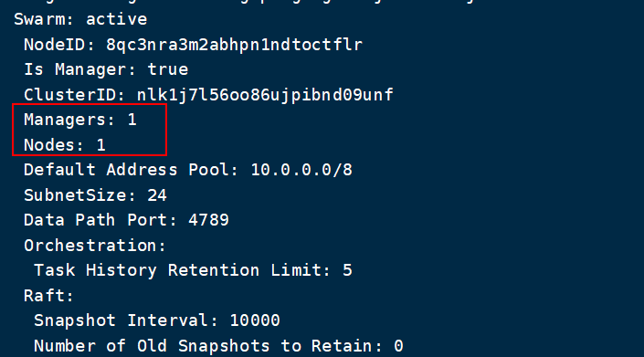
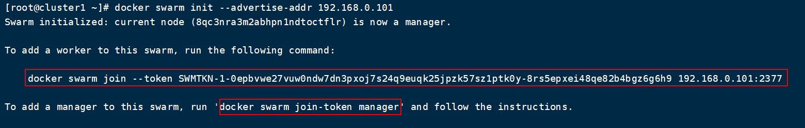
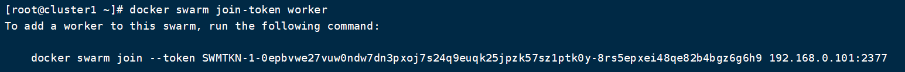
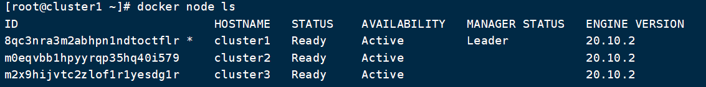

# DockerSwarm创建集群

## 一. 集群创建

我们知道 Swarm 集群由管理节点和工作节点组成。我们来创建一个包含一个管理节点和两个工作节点的最小 Swarm 集群。

### 1.1 初始化集群

我们使用 docker swarm init初始化一个 Swarm 集群。

```shell
$ docker swarm init --advertise-addr [IP]
```

如果你的 Docker 主机有多个网卡，拥有多个 IP，必须使用 --advertise-addr 指定 IP。执行 docker swarm init 命令的节点自动成为管理节点。



### 1.2 查看系统状态

通过 `docker info` 可以查看 swarm 集群状态:



### 1.3 增加工作节点

在我们使用`docker init`初始化集群时，docker会打印一条让其他机器加入swarm集群的命令：



我们在对应的机器上执行那个命令即可将机器加入Swarm管理。

我们还可以通过`docker swarm join-token`查看加入集群管理的token信息：

```shell
docker swarm join-token [manager|worker] # manager|worker 用于查看加入 管理节点|工作节点 的token
```

查看以Worker身份加入节点的token：



### 1.4 查看节点信息

命令 `docker node ls` 可以查看集群节点信息:

```sh
$ docker node ls
```




## 二. 解散集群

### 2.1 节点离开集群

进入到需要离开swarm管理的机器上，执行下列命令：

```shell
$ docker swarm leave
```

### 2.2 在管理节点上删除节点

通过`docker node ls`查看要删除节点对应的ID，然后执行删除命令：

```shell
$ docker node rm [节点ID]
```

### 2.3 解散集群

管理节点，解散集群

```shell
docker swarm leave --force
```

