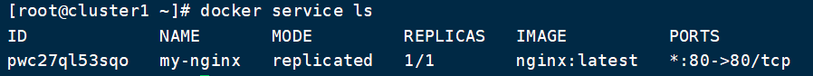
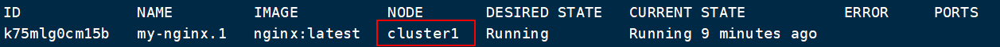
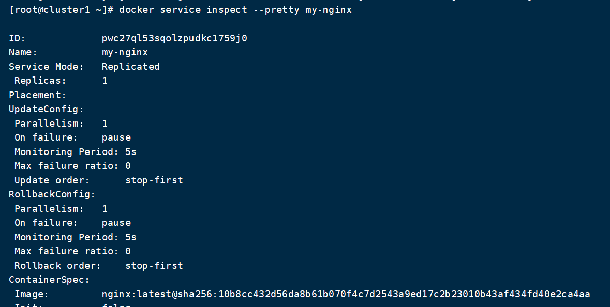

# DockerSwarm创建集群服务

## 一. 创建集群服务

我们使用 docker service 命令来管理 Swarm 集群中的服务，该命令只能在管理节点运行。我们以创建一个Nginx服务为例：

```sh
$ docker service create --replicas 1 --name my-nginx -p 80:80 nginx
```

命令解释：

- `docker service create` 命令创建一个服务
- `--name` 服务名称命名为 `my-nginx `
- `--replicas` 设置启动的实例数


通过`docker service ls`即可看到我们创建的服务：



使用命令 `docker service ps ` 可以查看服务进展



## 二. 删除集群服务

```shell
$ docker service rm [服务名称|服务ID]
```

## 二. 查看服务详情

使用`docker service inspect`命令查看服务信息

