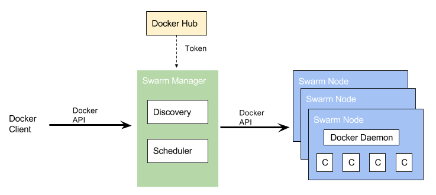
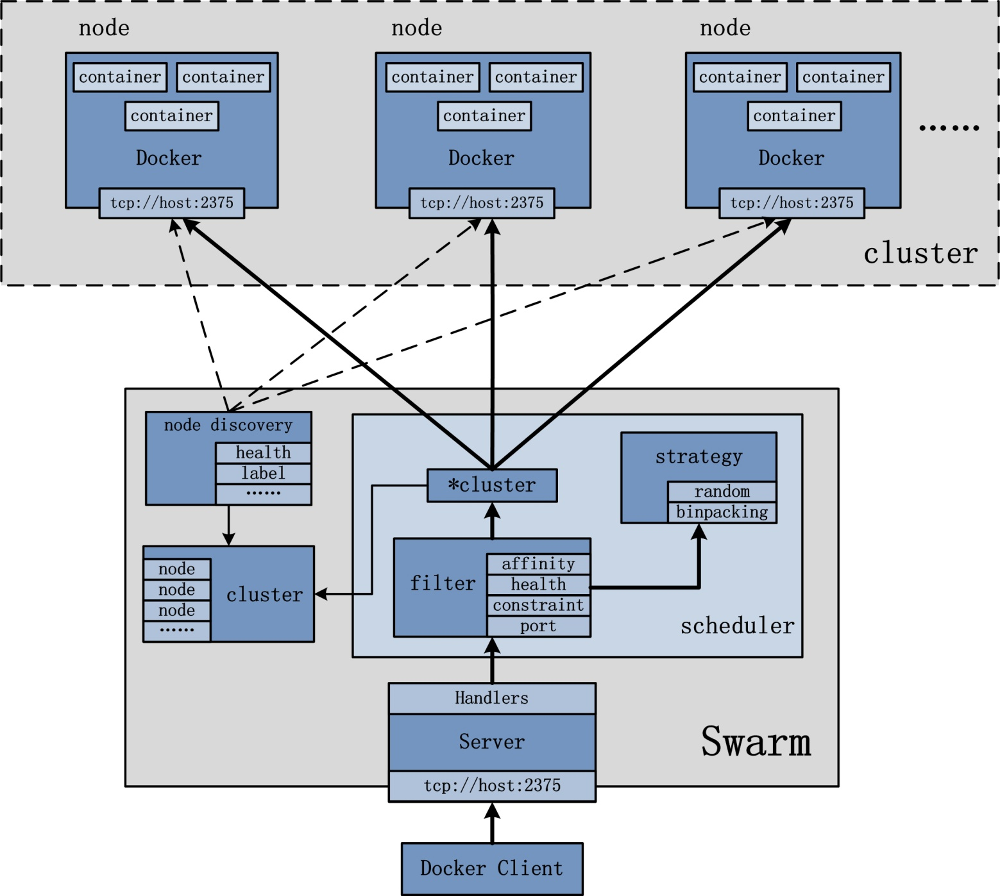
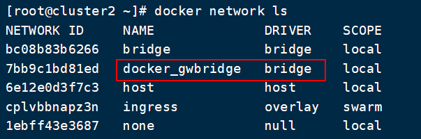
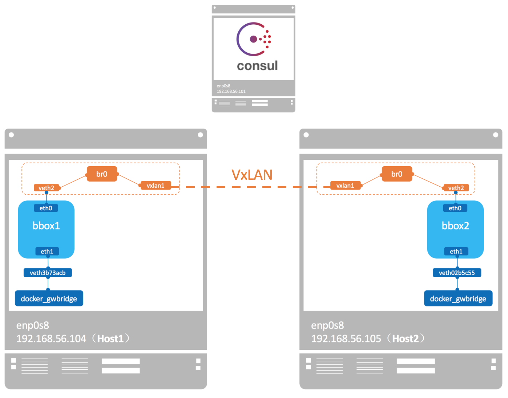
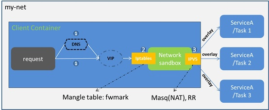

# DockerSwarm架构分析

> 本文转载至：https://zhoujinl.github.io/2018/10/19/docker-swarm-manager-ha/ 作者：[Jalon Zhou](https://zhoujinl.github.io/)

### 一. 基本架构

Docker Swarm提供了基本的集群能力，能够使多个Docker Engine组合成一个group，提供多容器服务。Swarm使用标准的Docker API，启动容器可以直接使用docker run命令。Swarm更核心的则是关注如何选择一个主机并在其上启动容器，最终运行服务。 Docker Swarm基本架构，如下图所示：



如上图所示，Swarm Node表示加入Swarm集群中的一个Docker Engine实例，基于该Docker Engine可以创建并管理多个Docker容器。其中，最开始创建Swarm集群的时候，Swarm Manager便是集群中的第一个Swarm Node。在所有的Node中，又根据其职能划分为Manager Node和Worker Node。

### 1.1 Manager Node

Manger 节点，顾名思义，是进行 Swarm 集群的管理工作的，它的管理工作集中在如下部分，

- 维护一个集群的状态；
- 对 Services 进行调度；
- 为 Swarm 提供外部可调用的 API 接口；

Manager 节点需要时刻维护和保存当前 Swarm 集群中各个节点的一致性状态，这里主要是指各个 Tasks 的执行的状态和其它节点的状态；因为 Swarm 集群是一个典型的分布式集群，在保证一致性上，Manager 节点采用 [Raft](https://raft.github.io/raft.pdf) 协议来保证分布式场景下的数据一致性；

通常为了保证 Manager 节点的高可用，Docker 建议采用奇数个 Manager 节点，这样的话，你可以在 Manager 失败的时候不用关机维护，我们给出如下的建议：

- 3 个 Manager 节点最多可以同时容忍 1 个 Manager 节点失效的情况下保证高可用；
- 5 个 Manager 节点最多可以同时容忍 2 个 Manager 节点失效的情况下保证高可用；
- N 个 Manager 节点最多可以同时容忍 (N−1)/2个 Manager 节点失效的情况下保证高可用；
- Docker 建议最多最多的情况下，使用 7 个 Manager 节点就够了，否则反而会降低集群的性能了。

### 1.2  Worker Node

Worker Node接收由Manager Node调度并指派的Task，启动一个Docker容器来运行指定的服务，并且Worker Node需要向Manager Node汇报被指派的Task的执行状态。

### 1.3 更换角色

通过 docker node promote 命令将一个 Worker 节点提升为 Manager 节点。通常情况下，该命令使用在维护的过程中，需要将 Manager 节点占时下线进行维护操作；同样可以使用 docker node demote 将某个 manager 节点降级为 worker 节点。

## 二. 设计架构



从前文可知， Swarm 集群的管理工作是由manager节点实现。如上图所示，manager节点实现的功能主要包括：node discovery，scheduler,cluster管理等。同时，为了保证Manager 节点的高可用，Manager 节点需要时刻维护和保存当前 Swarm 集群中各个节点的一致性状态。在保证一致性上，Manager 节点采用 [Raft](https://raft.github.io/raft.pdf) 协议来保证分布式场景下的数据一致性；

Docker Swarm内置了Raft一致性算法，可以保证分布式系统的数据保持一致性同步。Etcd, Consul等高可用键值存储系统也是采用了这种算法。这个算法的作用简单点说就是随时保证集群中有一个Leader，由Leader接收数据更新，再同步到其他各个Follower节点。在Swarm中的作用表现为当一个Leader 节点 down掉时，系统会立即选取出另一个Leader节点，由于这个节点同步了之前节点的所有数据，所以可以无缝地管理集群。

Raft的详细解释可以参考[《The Secret Lives of Data–Raft: Understandable Distributed Consensus》](http://thesecretlivesofdata.com/raft/)。

### 2.1 跨主机容器通信

Docker Swarm 内置的跨主机容器通信方案是overlay网络，这是一个基于vxlan协议的网络实现。VxLAN 可将二层数据封装到 UDP 进行传输，VxLAN 提供与 VLAN 相同的以太网二层服务，但是拥有更强的扩展性和灵活性。 overlay 通过虚拟出一个子网，让处于不同主机的容器能透明地使用这个子网。所以跨主机的容器通信就变成了在同一个子网下的容器通信，看上去就像是同一主机下的bridge网络通信。

为支持容器跨主机通信，Docker 提供了 overlay driver，使用户可以创建基于 VxLAN 的 overlay 网络。其实，docker 会创建一个 bridge 网络 “docker_gwbridge”，为所有连接到 overlay 网络的容器提供访问外网的能力。``docker network inspect docker_gwbridge` 查看网络信息。



下面我们讨论下overlay 网络的具体实现：

docker 会为每个 overlay 网络创建一个独立的 network namespace，其中会有一个 linux bridge br0，endpoint 还是由 veth pair 实现，一端连接到容器中（即 eth0），另一端连接到 namespace 的 br0 上。

br0 除了连接所有的 endpoint，还会连接一个 vxlan 设备，用于与其他 host 建立 vxlan tunnel。容器之间的数据就是通过这个 tunnel 通信的。逻辑网络拓扑结构如图所示：



### 2.2 服务发现

docker Swarm mode下会为每个节点的docker engine内置一个DNS server，各个节点间的DNS server通过control plane的gossip协议互相交互信息。此处DNS server用于容器间的服务发现。swarm mode会为每个 –net=自定义网络的service分配一个DNS entry。目前必须是自定义网络，比如overaly。而bridge和routing mesh的service，是不会分配DNS的。

那么，下面就来详细介绍服务发现的原理。

每个Docker容器都有一个DNS解析器，它将DNS查询转发到docker engine，该引擎充当DNS服务器。docker 引擎收到请求后就会在发出请求的容器所在的所有网络中，检查域名对应的是不是一个容器或者是服务，如果是，docker引擎就会从存储的key-value建值对中查找这个容器名、任务名、或者服务名对应的IP地址，并把这个IP地址或者是服务的虚拟IP地址返回给发起请求的域名解析器。

由上可知，docker的服务发现的作用范围是网络级别，也就意味着只有在同一个网络上的容器或任务才能利用内嵌的DNS服务来相互发现，不在同一个网络里面的服务是不能解析名称的，另外，为了安全和性能只有当一个节点上有容器或任务在某个网络里面时，这个节点才会存储那个网络里面的DNS记录。

如果目的容器或服务和源容器不在同一个网络里面，Docker引擎会把这个DNS查询转发到配置的默认DNS服务 。


在上面的例子中，总共有两个服务myservice和client，其中myservice有两个容器，这两个服务在同一个网里面。在client里针对docker.com和myservice各执行了一个curl操作，下面时执行的流程：

- 为了client解析docker.com和myservice，DNS查询进行初始化
- 容器内建的解析器在127.0.0.11:53拦截到这个DNS查询请求，并把请求转发到docker引擎的DNS服务
- myservice被解析成服务对应的虚拟IP（10.0.0.3），在接下来的内部负载均衡阶段再被解析成一个具体任务的IP地址。如果是容器名称这一步直接解析成容器对应的IP地址（10.0.0.4或者10.0.0.5）。
- docker.com在mynet网络上不能被解析成服务，所以这个请求被转发到配置好的默认DNS服务器（8.8.8.8）上。

### 2.3 负载均衡

负载均衡分为两种：Swarm集群内的service之间的相互访问需要做负载均衡，称为内部负载均衡（Internal LB）；从Swarm集群外部访问服务的公开端口，也需要做负载均衡，称外部部负载均衡(Exteral LB or Ingress LB)。

#### 2.3.1 Internal LB

内部负载均衡就是我们在上一段提到的服务发现，集群内部通过DNS访问service时，Swarm默认通过VIP（virtual IP）、iptables、IPVS转发到某个容器。



当在docker swarm集群模式下创建一个服务时，会自动在服务所属的网络上给服务额外的分配一个虚拟IP，当解析服务名字时就会返回这个虚拟IP。对虚拟IP的请求会通过overlay网络自动的负载到这个服务所有的健康任务上。这个方式也避免了客户端的负载均衡，因为只有单独的一个IP会返回到客户端，docker会处理虚拟IP到具体任务的路由，并把请求平均的分配给所有的健康任务。

```shell
# 创建overlay网络：mynet 
$ docker network create -d overlay mynet  
a59umzkdj2r0ua7x8jxd84dhr 
# 利用mynet网络创建myservice服务，并复制两份  
$ docker service create --network mynet --name myservice --replicas 2 busybox ping localhost  
78t5r8cr0f0h6k2c3k7ih4l6f5
# 通过下面的命令查看myservice对应的虚拟IP 
$ docker service inspect myservice  
...
"VirtualIPs": [ 
	{  
     "NetworkID": "a59umzkdj2r0ua7x8jxd84dhr",  
     			"Addr": "10.0.0.3/24"  
      },  
]
```

注：swarm中服务还有另外一种负载均衡技术可选DNS round robin (DNS RR) （在创建服务时通过–endpoint-mode配置项指定），在DNSRR模式下，docker不再为服务创建VIP，docker DNS服务直接利用轮询的策略把服务名称直接解析成一个容器的IP地址。

#### 2.3.2 Exteral LB（Ingress LB 或者 Swarm Mode Routing Mesh)

看名字就知道，这个负载均衡方式和前面提到的Ingress网络有关。Swarm网络要提供对外访问的服务就需要打开公开端口，并映射到宿主机。Ingress LB就是外部通过公开端口访问集群时做的负载均衡。

当创建或更新一个服务时，你可以利用`–publish`选项把一个服务暴露到外部，**在docker swarm模式下发布一个端口意味着在集群中的所有节点都会监听这个端口**，这时当访问一个监听了端口但是并没有对应服务运行在其上的节点会发生什么呢？ 接下来就该我们的路由网（routing mesh）出场了，路由网是docker1.12引入的一个新特性，它结合了IPVS和iptables创建了一个强大的集群范围的L4层负载均衡，它使所有节点接收服务暴露端口的请求成为可能。当任意节点接收到针对某个服务暴露的TCP/UDP端口的请求时，这个节点会利用预先定义过的Ingress overlay网络，把请求转发给服务对应的虚拟IP。ingress网络和其他的overlay网络一样，只是它的目的是为了转换来自客户端到集群的请求，它也是利用我们前一小节介绍过的基于VIP的负载均衡技术。

启动服务后，你可以为应用程序创建外部DNS记录，并将其映射到任何或所有Docker swarm节点。你无需担心你的容器具体运行在那个节点上，因为有了路由网这个特性后，你的集群看起来就像是单独的一个节点一样。

```shell
#在集群中创建一个复制两份的服务，并暴露在8000端口  
$ docker service create --name app --replicas 2 --network appnet --publish 8000:80 nginx
```


上面这个图表明了路由网是怎么工作的：

- 服务（app）拥有两份复制，并把端口映射到外部端口的8000
- 路由网在集群中的所有节点上都暴露出8000
- 外部对服务app的请求可以是任意节点，在本例子中外部的负载均衡器将请求转发到了没有app服务的主机上
- docker swarm的IPVS利用ingress overlay网路将请求重新转发到运行着app服务的节点的容器中

注：以上服务发现和负载均衡参考文档 https://success.docker.com/article/ucp-service-discovery

### 2.4 Services 架构

在微服务部署的过程中，通常将某一个微服务封装为 Service 在 Swarm 中部署执行，通常你需要通过指定容器 image 以及需要在容器中执行的 Commands 来创建你的 Service，除此之外，通常，还需要配置如下选项，

- 指定可以在 Swarm 之外可以被访问的服务端口号 port，
- 指定加入某个 Overlay 网络以便 Service 与 Service 之间可以建立连接并通讯，
- 指定该 Service 所要使用的 CPU 和 内存的大小，
- 指定一个滚动更新的策略 (Rolling Update Policy)
- 指定多少个 Task 的副本 (replicas) 在 Swarm 集群中同时存在

#### 2.4.1 服务和任务


Services，Tasks 和 Containers 之间的关系可以用上面这张图来描述。来看这张图的逻辑，表示用户想要通过 Manager 节点部署一个有 3 个副本的 Nginx 的 Service，Manager 节点接收到用户的 Service definition 后，便开始对该 Service 进行调度，将会在当前可用的Worker（或者Manager ）节点中启动相应的 Tasks 以及相关的副本；所以可以看到，Service 实际上是 Task 的定义，而 Task 则是执行在节点上的程序。

Task 是什么呢？其实就是一个 Container，只是，在 Swarm 中，每个 Task 都有自己的名字和编号，如图，比如 nginx.1、nginx.2 和 nginx.3，这些 Container 各自运行在各自的 node 上，当然，一个 node 上可以运行多个 Container；

#### 2.4.2 任务调度

Docker swarm mode 模式的底层技术实际上就是指的是调度器( scheduler )和编排器( orchestrator )；下面这张图展示了 Swarm mode 如何从一个 Service 的创建请求并且成功将该 Service 分发到两个 worker 节点上执行的过程。


- 首先，看上半部分Swarm manager

  1. 用户通过 Docker Engine Client 使用命令 docker service create 提交 Service definition，
  2. 根据 Service definition 创建相应的 Task，
  3. 为 Task 分配 IP 地址，
     注意，这是分配运行在 Swarm 集群中 Container 的 IP 地址，该 IP 地址最佳的分配地点是在这里，因为 Manager 节点上保存得有最新最全的 Tasks 的状态信息，为了保证不与其他的 Task 分配到相同的 IP，所以在这里就将 IP 地址给初始化好；
  4. 将 Task 分发到 Node 上，可以是 Manager 节点也可以使 Worker 节点，
  5. 对 Worker 节点进行相应的初始化使得它可以执行 Task

- 接着，看下半部分Swarm Work

  该部分就相对简单许多

  1. 首先连接 manager 的分配器( scheduler)检查该 task
  2. 验证通过以后，便开始通过 Worker 节点上的执行器( executor )执行；

注意，上述 task 的执行过程是一种单向机制，比如它会按顺序的依次经历 assigned, prepared 和 running 等执行状态，不过在某些特殊情况下，在执行过程中，某个 task 失败了( fails )，编排器( orchestrator )直接将该 task 以及它的 container 给删除掉，然后在其它节点上另外创建并执行该 task；

#### 2.4.3 调度策略

warm在scheduler节点（leader节点）运行容器的时候，会根据指定的策略来计算最适合运行容器的节点，目前支持的策略有：spread, binpack, random。

　　1）Random 顾名思义，就是随机选择一个Node来运行容器，一般用作调试用，spread和binpack策略会根据各个节点的可用的CPU, RAM以及正在运 行的容器的数量来计算应该运行容器的节点。

　　2）Spread 在同等条件下，Spread策略会选择运行容器最少的那台节点来运行新的容器，binpack策略会选择运行容器最集中的那台机器来运行新的节点。 使用Spread策略会使得容器会均衡的分布在集群中的各个节点上运行，一旦一个节点挂掉了只会损失少部分的容器。

　　3）Binpack Binpack策略最大化的避免容器碎片化，就是说binpack策略尽可能的把还未使用的节点留给需要更大空间的容器运行，尽可能的把容器运行在 一个节点上面。(The binpack strategy causes Swarm to optimize for the container which is most packed.)

#### 2.4.4 服务副本与全局服务

Docker Swarm支持服务的扩容缩容，Swarm通过`--mode`选项设置服务类型，提供了两种模式：一种是replicated，我们可以指定服务Task的个数（也就是需要创建几个冗余副本），这也是Swarm默认使用的服务类型；另一种是global，这样会在Swarm集群的每个Node上都创建一个服务。如下图所示（出自Docker官网），是一个包含replicated和global模式的Swarm集群：


上图中，黄色表示的replicated模式下的Service Replicas，灰色表示global模式下Service的分布。

在Swarm mode下使用Docker，可以实现部署运行服务、服务扩容缩容、删除服务、滚动更新等功能，下面我们详细说明。