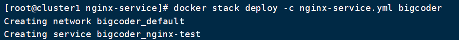

# Docker Stack命令

> 本文转载至：[第14章 使用Docker Stack 部署应用 - 简书 (jianshu.com)](https://www.jianshu.com/p/3776a56bf629)

### docker stack deploy

部署一个新的stack或更新一个现有的stack。

API 1.25+客户端和守护程序API都必须至少1.25才能使用这个命令。使用docker version命令在客户端检查你的客户端和daemon API版本。

```shell
$ docker stack deploy -c [compose文件] [名称]
```

例如：

```shell
$ docker stack deploy -c nginx-test.yml bigcoder
```



### docker stack rm

删除一个stack

```shell
$ docker stack rm [stack name]
```

#### docker stack services

查看stack下部署的所有服务

### docker stack ps

查看所有stack列表