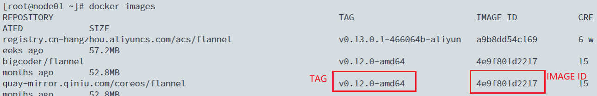

# Push镜像到DockerHub和阿里云

## 一. push到DockerHub

```shell
# 登录
docker login
# 输入用户名和密码

# 使用tag命令将标签打成 用户名/TAG 的形式
docker tag registry.cn-shanghai.aliyuncs.com/leozhanggg/flannel:v0.12.0-amd64 bigcoder/flannel:v0.12.0-amd64

#push到DockerHub
docker push bigcoder/flannel:v0.12.0-amd64
```

## 二. push到阿里云镜像仓库

（1）登录

```shell
docker login --username=176****7257 registry.cn-shanghai.aliyuncs.com
```

（2）查看本地镜像

```shell
docker images
```



（3）打标签

```shell
# 需要根据实际情况，替换[ImageId]和[TAG]两个参数
docker tag [ImageId] registry.cn-shanghai.aliyuncs.com/bigcoder/[仓库名称]:[TAG]

#示例：
docker tag 4e9f801d2217 registry.cn-shanghai.aliyuncs.com/bigcoder/flannel:v0.12.0-amd64
```

（4）push到阿里云

```shell
docker push registry.cn-shanghai.aliyuncs.com/bigcoder/flannel:v0.12.0-amd64
```

