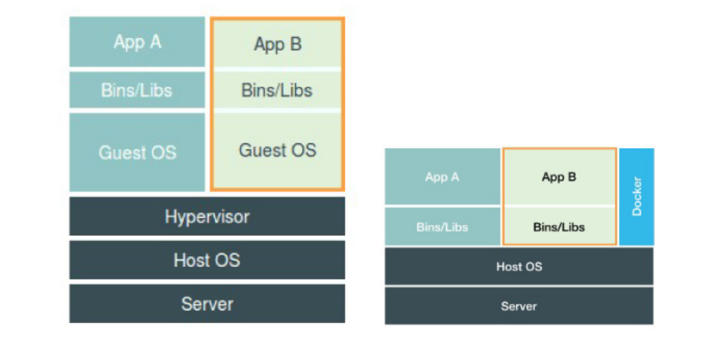
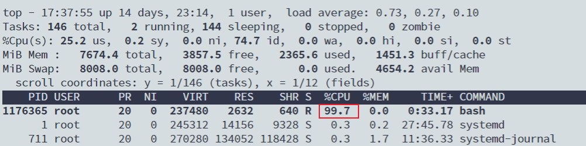
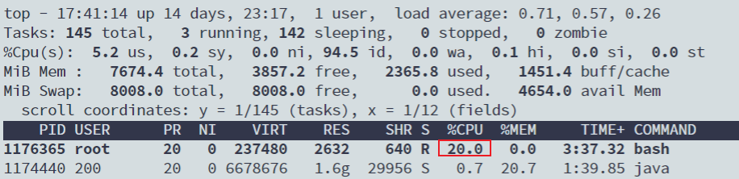
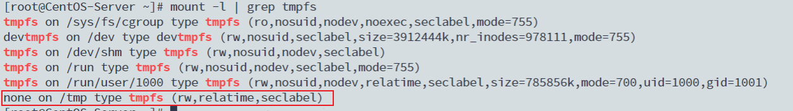

# 重新认识Docker

> 本文参考转载至：《深入剖析Kubernetes - 张磊》

容器技术的核心功能，就是通过约束和修改进程的动态表现，从而为其创造出一个“边界”。**对于 Docker 等大多数 Linux 容器来说，Cgroups 技术是用来制造约束的主要手段，而Namespace 技术则是用来修改进程视图的主要方法**。你可能会觉得 Cgroups 和 Namespace 这两个概念很抽象，别担心，接下来我们一起动手实践一下，你就很容易理解这两项技术了。

## 一. Namespace

假设你已经有了一个 Linux 操作系统上的 Docker 项目在运行，比如我的环境是 Ubuntu 16.04和 Docker CE 18.05。

接下来，让我们首先创建一个容器来试试。

```shell
$ docker run -it busybox /bin/sh
/ #
```

这个命令是 Docker 项目最重要的一个操作，即大名鼎鼎的 docker run。而 -it 参数告诉了 Docker 项目在启动容器后，需要给我们分配一个文本输入 / 输出环境，也就是 TTY，跟容器的标准输入相关联，这样我们就可以和这个 Docker 容器进行交互了。而`/bin/sh` 就是我们要在 Docker 容器里运行的程序。

所以，上面这条指令用大白话来将就是：请帮我启动一个容器，在容器里执行 /bin/sh，并且给我分配一个命令行终端跟这个容器交互。这样，我的 Ubuntu 16.04 机器就变成了一个宿主机，而一个运行着 /bin/sh 的容器，就跑在了这个宿主机里面。

上面的例子和原理，如果你已经玩过 Docker，一定不会感到陌生。此时，如果我们在容器里执行一下 ps 指令，就会发现一些更有趣的事情：

```shell
/ # ps
PID   USER     TIME  COMMAND
    1 root      0:00 /bin/sh
    7 root      0:00 ps
```

可以看到，我们在 Docker 里最开始执行的 /bin/sh，就是这个容器内部的第 1 号进程（PID=1），而这个容器里一共只有两个进程在运行。这就意味着，前面执行的 /bin/sh，以及我们刚刚执行的 ps，已经被 Docker 隔离在了一个跟宿主机完全不同的世界当中。这究竟是怎么做到呢？

本来，每当我们在宿主机上运行了一个 /bin/sh 程序，操作系统都会给它分配一个进程编号，比如 PID=100。这个编号是进程的唯一标识，就像员工的工牌一样。所以 PID=100，可以粗略地理解为这个 /bin/sh 是我们公司里的第 100 号员工，而第 1 号员工就自然是比尔 · 盖茨这样统领全局的人物。

而现在，我们要通过 Docker 把这个 /bin/sh 程序运行在一个容器当中。这时候，Docker 就会在这个第 100 号员工入职时给他施一个“障眼法”，让他永远看不到前面的其他 99 个员工，更看不到比尔 · 盖茨。这样，他就会错误地以为自己就是公司里的第 1 号员工。

这种机制，其实就是对被隔离应用的进程空间做了手脚，使得这些进程只能看到重新计算过的进程编号，比如 PID=1。可实际上，他们在宿主机的操作系统里，还是原来的第 100 号进程。

这种技术，就是 Linux 里面的 Namespace 机制。而 Namespace 的使用方式也非常有意思：它其实只是 Linux 创建新进程的一个可选参数。我们知道，在 Linux 系统中创建线程的系统调用是 clone()，比如：

```c
int pid = clone(main_function, stack_size, SIGCHLD, NULL);
```

这个系统调用就会为我们创建一个新的进程，并且返回它的进程号 pid。而当我们用 clone() 系统调用创建一个新进程时，就可以在参数中指定 CLONE_NEWPID 参数，比如：

```c
int pid = clone(main_function, stack_size, CLONE_NEWPID | SIGCHLD, NULL);
```

这时，新创建的这个进程将会“看到”一个全新的进程空间，在这个进程空间里，它的 PID 是1。之所以说“看到”，是因为这只是一个“障眼法”，在宿主机真实的进程空间里，这个进程的 PID 还是真实的数值，比如 100。

当然，我们还可以多次执行上面的 clone() 调用，这样就会创建多个 PID Namespace，而每个Namespace 里的应用进程，都会认为自己是当前容器里的第 1 号进程，它们既看不到宿主机里真正的进程空间，也看不到其他 PID Namespace 里的具体情况。

**而除了我们刚刚用到的 PID Namespace，Linux 操作系统还提供了 Mount、UTS、IPC、Network 和 User 这些 Namespace，用来对各种不同的进程上下文进行“障眼法”操作**。

比如，Mount Namespace，用于让被隔离进程只看到当前 Namespace 里的挂载点信息；Network Namespace，用于让被隔离进程看到当前 Namespace 里的网络设备和配置。这，就是 Linux 容器最基本的实现原理了。

经常有人将Docker容器技术成为虚拟化技术，实际上这种说法是不严谨的，



上图是虚拟化技术与容器技术的对比图，在这个对比图里，我们应该把 Docker 画在跟应用同级别并且靠边的位置。这意味着，**用户运行在容器里的应用进程，跟宿主机上的其他进程一样，都由宿主机操作系统统一管理**，只不过这些被隔离的进程拥有额外设置过的 Namespace 参数。而 Docker 项目在这里扮演的角色，更多的是旁路式的辅助和管理工作。

这是因为，使用虚拟化技术作为应用沙盒，就必须要由 Hypervisor 来负责创建虚拟机，这个虚拟机是真实存在的，并且它里面必须运行一个完整的 Guest OS 才能执行用户的应用进程。这就不可避免地带来了额外的资源消耗和占用。根据实验，一个运行着 CentOS 的 KVM 虚拟机启动后，在不做优化的情况下，虚拟机自己就需要占用 100~200 MB 内存。此外，用户应用运行在虚拟机里面，它对宿主机操作系统的调用就不可避免地要经过虚拟化软件的拦截和处理，这本身又是一层性能损耗，尤其对计算资源、网络和磁盘 I/O 的损耗非常大。

而相比之下，容器化后的用户应用，却依然还是一个宿主机上的普通进程，这就意味着这些因为虚拟化而带来的性能损耗都是不存在的；而另一方面，使用 Namespace 作为隔离手段的容器并不需要单独的 Guest OS，这就使得容器额外的资源占用几乎可以忽略不计。

不过，有利就有弊，**基于 Linux Namespace 的隔离机制相比于虚拟化技术也有很多不足之处，其中最主要的问题就是：隔离得不彻底**。首先，既然容器只是运行在宿主机上的一种特殊的进程，那么多个容器之间使用的就还是同一个宿主机的操作系统内核。尽管你可以在容器里通过 Mount Namespace 单独挂载其他不同版本的操作系统文件，比如CentOS 或者 Ubuntu，但这并不能改变共享宿主机内核的事实。这意味着，如果你要在Windows 宿主机上运行 Linux 容器，或者在低版本的 Linux 宿主机上运行高版本的 Linux 容器，都是行不通的。

而相比之下，拥有硬件虚拟化技术和独立 Guest OS 的虚拟机就要方便得多了。最极端的例子是，Microsoft 的云计算平台 Azure，实际上就是运行在 Windows 服务器集群上的，但这并不妨碍你在它上面创建各种 Linux 虚拟机出来。

**其次，在 Linux 内核中，有很多资源和对象是不能被 Namespace 化的，最典型的例子就是：时间**。这就意味着，如果你的容器中的程序使用 settimeofday(2) 系统调用修改了时间，整个宿主机的时间都会被随之修改，这显然不符合用户的预期。相比于在虚拟机里面可以随便折腾的自由度，在容器里部署应用的时候，“什么能做，什么不能做”，就是用户必须考虑的一个问题。

此外，由于上述问题，尤其是共享宿主机内核的事实，容器给应用暴露出来的攻击面是相当大的，应用“越狱”的难度自然也比虚拟机低得多。所以，在生产环境中，没有人敢把运行在物理机上的 Linux 容器直接暴露到公网上。

## 二. Cgroups

Linux Cgroups 的全称是 Linux Control Group。它最主要的作用，就是**限制一个进程组能够使用的资源上限**，包括 CPU、内存、磁盘、网络带宽等等。

在 Linux 中，Cgroups 给用户暴露出来的操作接口是文件系统，即它以文件和目录的方式组织在操作系统的 /sys/fs/cgroup 路径下。在 Ubuntu 16.04 机器里，我可以用 mount 指令把它们展示出来，这条命令是：

```shell
$ mount -t cgroup
cgroup on /sys/fs/cgroup/systemd type cgroup (rw,nosuid,nodev,noexec,relatime,seclabel,xattr,release_agent=/usr/lib/systemd/systemd-cgroups-agent,name=systemd)
cgroup on /sys/fs/cgroup/net_cls,net_prio type cgroup (rw,nosuid,nodev,noexec,relatime,seclabel,net_cls,net_prio)
cgroup on /sys/fs/cgroup/memory type cgroup (rw,nosuid,nodev,noexec,relatime,seclabel,memory)
cgroup on /sys/fs/cgroup/cpuset type cgroup (rw,nosuid,nodev,noexec,relatime,seclabel,cpuset)
cgroup on /sys/fs/cgroup/freezer type cgroup (rw,nosuid,nodev,noexec,relatime,seclabel,freezer)
cgroup on /sys/fs/cgroup/blkio type cgroup (rw,nosuid,nodev,noexec,relatime,seclabel,blkio)
cgroup on /sys/fs/cgroup/devices type cgroup (rw,nosuid,nodev,noexec,relatime,seclabel,devices)
cgroup on /sys/fs/cgroup/cpu,cpuacct type cgroup (rw,nosuid,nodev,noexec,relatime,seclabel,cpu,cpuacct)
cgroup on /sys/fs/cgroup/rdma type cgroup (rw,nosuid,nodev,noexec,relatime,seclabel,rdma)
cgroup on /sys/fs/cgroup/hugetlb type cgroup (rw,nosuid,nodev,noexec,relatime,seclabel,hugetlb)
cgroup on /sys/fs/cgroup/pids type cgroup (rw,nosuid,nodev,noexec,relatime,seclabel,pids)
cgroup on /sys/fs/cgroup/perf_event type cgroup (rw,nosuid,nodev,noexec,relatime,seclabel,perf_event)
```

可以看到，在 /sys/fs/cgroup 下面有很多诸如 cpuset、cpu、 memory 这样的子目录，也叫子系统。这些都是我这台机器当前可以被 Cgroups 进行限制的资源种类。而在子系统对应的资源种类下，你就可以看到该类资源具体可以被限制的方法。比如，对 CPU 子系统来说，我们就可以看到如下几个配置文件，这个指令是：

```shell
$ ls /sys/fs/cgroup/cpu
cgroup.clone_children  cpuacct.usage             cpuacct.usage_percpu_user  cpu.cfs_quota_us   cpu.stat           release_agent
cgroup.procs           cpuacct.usage_all         cpuacct.usage_sys          cpu.rt_period_us   docker             system.slice
cgroup.sane_behavior   cpuacct.usage_percpu      cpuacct.usage_user         cpu.rt_runtime_us  init.scope         tasks
cpuacct.stat           cpuacct.usage_percpu_sys  cpu.cfs_period_us          cpu.shares         notify_on_release  user.slice
```

如果熟悉 Linux CPU 管理的话，你就会在它的输出里注意到 cfs_period 和 cfs_quota 这样的关键词。这两个参数需要组合使用，可以用来限制进程在长度为 cfs_period 的一段时间内，只能被分配到总量为 cfs_quota 的 CPU 时间。

而这样的配置文件又如何使用呢？

你需要在对应的子系统下面创建一个目录，比如，我们现在进入 /sys/fs/cgroup/cpu 目录下：

```shell
$ cd /sys/fs/cgroup/cpu
$ mkdir container
$ ls container/
cgroup.clone_children  cpuacct.usage         cpuacct.usage_percpu_sys   cpuacct.usage_user  cpu.rt_period_us   cpu.stat
cgroup.procs           cpuacct.usage_all     cpuacct.usage_percpu_user  cpu.cfs_period_us   cpu.rt_runtime_us  notify_on_release
cpuacct.stat           cpuacct.usage_percpu  cpuacct.usage_sys          cpu.cfs_quota_us    cpu.shares         tasks
```

这个目录就称为一个“控制组”。你会发现，操作系统会在你新创建的 container 目录下，自动生成该子系统对应的资源限制文件。

现在，我们在后台执行这样一条脚本：

```shell
$ while : ; do : ; done &
[1] 1176365
```

显然，它执行了一个死循环，可以把计算机的 CPU 吃到 100%，根据它的输出，我们可以看到这个脚本在后台运行的进程号（PID）是 226。这样，我们可以用 top 指令来确认一下 CPU 有没有被打满：



而此时，我们可以通过查看 container 目录下的文件，看到 container 控制组里的 CPU quota还没有任何限制（即：-1），CPU period 则是默认的 100 ms（100000 us）：

```shell
$ cat /sys/fs/cgroup/cpu/container/cpu.cfs_quota_us
-1
$ cat /sys/fs/cgroup/cpu/container/cpu.cfs_period_us
100000
```

接下来，我们可以通过修改这些文件的内容来设置限制。比如，向 container 组里的 cfs_quota 文件写入 20 ms（20000 us）：

```shell
$ echo 20000 > /sys/fs/cgroup/cpu/container/cpu.cfs_quota_us
```

结合前面的介绍，你应该能明白这个操作的含义，它意味着在每 100 ms 的时间里，被该控制组限制的进程只能使用 20 ms 的 CPU 时间，也就是说这个进程只能使用到 20% 的 CPU 带宽。

接下来，我们把被限制的进程的 PID 写入 container 组里的 tasks 文件，上面的设置就会对该进程生效了：

```shell
$ echo 1176365 > /sys/fs/cgroup/cpu/container/tasks
```

我们可以用 top 指令查看一下：



可以看到，计算机的 CPU 使用率立刻降到了 20%（%Cpu0 : 20.3 us）。

除 CPU 子系统外，Cgroups 的每一项子系统都有其独有的资源限制能力，比如：

- blkio，为块设备设定I/O 限制，一般用于磁盘等设备；
- cpuset，为进程分配单独的 CPU 核和对应的内存节点；
- memory，为进程设定内存使用的限制。

Linux Cgroups 的设计还是比较易用的，简单粗暴地理解呢，它就是一个子系统目录加上一组资源限制文件的组合。而对于 Docker 等 Linux 容器项目来说，它们只需要在每个子系统下面，为每个容器创建一个控制组（即创建一个新目录），然后在启动容器进程之后，把这个进程的 PID 填写到对应控制组的 tasks 文件中就可以了。

而至于在这些控制组下面的资源文件里填上什么值，就靠用户执行 docker run 时的参数指定了，比如这样一条命令：

```shell
$ docker run -it --cpu-period=100000 --cpu-quota=20000 ubuntu /bin/bash
```

在启动这个容器后，我们可以通过查看 Cgroups 文件系统下，CPU 子系统中，“docker”这个控制组里的资源限制文件的内容来确认：

```shell
$ cat /sys/fs/cgroup/cpu/docker/5d5c9f67d/cpu.cfs_period_us
100000
$ cat /sys/fs/cgroup/cpu/docker/5d5c9f67d/cpu.cfs_quota_us
20000
```

这就意味着这个 Docker 容器，只能使用到 20% 的 CPU 带宽

跟 Namespace 的情况类似，Cgroups 对资源的限制能力也有很多不完善的地方，被提及最多的自然是 /proc 文件系统的问题。

众所周知，Linux 下的 /proc 目录存储的是记录当前内核运行状态的一系列特殊文件，用户可以通过访问这些文件，查看系统以及当前正在运行的进程的信息，比如 CPU 使用情况、内存占用率等，这些文件也是 top 指令查看系统信息的主要数据来源。

但是，你如果在容器里执行 top 指令，就会发现，它显示的信息居然是宿主机的 CPU 和内存数据，而不是当前容器的数据。造成这个问题的原因就是，/proc 文件系统并不知道用户通过 Cgroups 给这个容器做了什么样的资源限制，即：/proc 文件系统不了解 Cgroups 限制的存在。

在生产环境中，这个问题必须进行修正，否则应用程序在容器里读取到的 CPU 核数、可用内存等信息都是宿主机上的数据，这会给应用的运行带来非常大的困惑和风险。这也是在企业中，容器化应用碰到的一个常见问题，也是容器相较于虚拟机另一个不尽如人意的地方。

## 三. 容器镜像

Linux 容器最基础的两种技术：Namespace 和 Cgroups。希望此时，你已经彻底理解了“容器的本质是一种特殊的进程”这个最重要的概念。而正如我前面所说的，Namespace 的作用是“隔离”，它让应用进程只能看到该 Namespace内的“世界”；而 Cgroups 的作用是“限制”，它给这个“世界”围上了一圈看不见的墙。这么一折腾，进程就真的被“装”在了一个与世隔绝的房间里，而这些房间就是 PaaS 项目赖以生存的应用“沙盒”。

可是，还有一个问题不知道你有没有仔细思考过：这个房间四周虽然有了墙，但是如果容器进程低头一看地面，又是怎样一副景象呢？换句话说，容器里的进程看到的文件系统又是什么样子的呢？

可能你立刻就能想到，这一定是一个关于 Mount Namespace 的问题：容器里的应用进程，理应看到一份完全独立的文件系统。这样，它就可以在自己的容器目录（比如 /tmp）下进行操作，而完全不会受宿主机以及其他容器的影响。

下面，我们不妨使用它来验证一下刚刚提到的问题。

```c
#define _GNU_SOURCE 
#include <sys/mount.h> 
#include <sys/types.h> 
#include <sys/wait.h> 
#include <stdio.h> 
#include <sched.h> 
#include <signal.h> 
#include <unistd.h> 
#define STACK_SIZE (1024 * 1024) 
static char container_stack[STACK_SIZE]; 

char* const container_args[] = 
{ 
	"/bin/bash", NULL 
};

int container_main(void* arg) 
{ 
	printf("Container - inside the container!\n"); 
	execv(container_args[0], container_args);
	printf("Something's wrong!\n"); 
    return 1; 
}

int main() 
{ 
	printf("Parent - start a container!\n"); 
	int container_pid = clone(container_main, container_stack+STACK_SIZE, CLONE_NEWNS | SIGCHLD, NULL);
	waitpid(container_pid, NULL, 0); 
	printf("Parent - container stopped!\n"); 
	return 0; 
}
```

这段代码的功能非常简单：在 main 函数里，我们通过 clone() 系统调用创建了一个新的子进程container_main，并且声明要为它启用 Mount Namespace（即：CLONE_NEWNS 标志）。

而这个子进程执行的，是一个“/bin/bash”程序，也就是一个 shell。所以这个 shell 就运行在了 Mount Namespace 的隔离环境中。

我们来一起编译一下这个程序：

```shell
$ gcc -o ns ns.c
$ ./ns
Parent - start a container!
Container - inside the container!
```

这样，我们就进入了这个“容器”当中。可是，如果在“容器”里执行一下 ls 指令的话，我们就会发现一个有趣的现象： /tmp 目录下的内容跟宿主机的内容是一样的。也就是说：**即使开启了 Mount Namespace，容器进程看到的文件系统也跟宿主机完全一样**。

```shell
ls /tmp
# 你会看到宿主机的很多文件
```

这是怎么回事呢？

仔细思考一下，你会发现这其实并不难理解：Mount Namespace 修改的，是容器进程对文件系统“挂载点”的认知。但是，这也就意味着，只有在“挂载”这个操作发生之后，进程的视图才会被改变。而在此之前，新创建的容器会直接继承宿主机的各个挂载点。

这时，你可能已经想到了一个解决办法：创建新进程时，除了声明要启用 Mount Namespace之外，我们还可以告诉容器进程，有哪些目录需要重新挂载，就比如这个 /tmp 目录。于是，我们在容器进程执行前可以添加一步重新挂载 /tmp 目录的操作：

```c
int container_main(void* arg) 
{ 
	printf("Container - inside the container!\n"); 
    mount("none", "/tmp", "tmpfs", 0, "");
	execv(container_args[0], container_args);
	printf("Something's wrong!\n"); 
	return 1; 
}
```

可以看到，在修改后的代码里，我在容器进程启动之前，加上了一句`mount(“none”,“/tmp”, “tmpfs”, 0, “”)` 语句。就这样，我告诉了容器以 tmpfs（内存盘）格式，重新挂载了/tmp 目录。

这段修改后的代码，编译执行后的结果又如何呢？我们可以试验一下：

```shell
$ gcc -o ns ns.c
$ ./ns
Parent - start a container!
Container - inside the container!
$ ls /tmp
#这一次/tmp目录下为空
```

可以看到，这次 /tmp 变成了一个空目录，这意味着重新挂载生效了。我们可以用 mount -l 检、查一下：

```shell
$ mount -l | grep tmpfs
```



可以看到，容器里的 /tmp 目录是以 tmpfs 方式单独挂载的。

更重要的是，因为我们创建的新进程启用了 Mount Namespace，所以这次重新挂载的操作，只在容器进程的 Mount Namespace 中有效。如果在宿主机上用 mount -l 来检查一下这个挂载，你会发现它是不存在的：

```shell
# 在宿主机上 
$ mount -l | grep tmpfs
```

这就是 Mount Namespace 跟其他 Namespace 的使用略有不同的地方：它对容器进程视图的改变，一定是伴随着挂载操作（mount）才能生效。

可是，作为一个普通用户，我们希望的是一个更友好的情况：每当创建一个新容器时，我希望容器进程看到的文件系统就是一个独立的隔离环境，而不是继承自宿主机的文件系统。怎么才能做到这一点呢？

不难想到，我们可以在容器进程启动之前重新挂载它的整个根目录“/”。而由于 Mount Namespace 的存在，这个挂载对宿主机不可见，所以容器进程就可以在里面随便折腾了。

在 Linux 操作系统里，有一个名为 chroot 的命令可以帮助你在 shell 中方便地完成这个工作。顾名思义，它的作用就是帮你“change root file system”，即改变进程的根目录到你指定的位置。它的用法也非常简单。

假设，我们现在有一个 $HOME/test 目录，想要把它作为一个 /bin/bash 进程的根目录。

首先，创建一个 test 目录和几个 lib 文件夹：

```shell
$ mkdir -p $HOME/test 
$ mkdir -p $HOME/test/{bin,lib64,lib} 
$ cd $T
```

然后，把 bash 命令拷贝到 test 目录对应的 bin 路径下：

```shell
$ cp -v /bin/{bash,ls} $HOME/test/bin
```

接下来，把 bash 命令需要的所有 so 文件，也拷贝到 test 目录对应的 lib 路径下。找到 so 文件可以用 ldd 命令：

```shell
$ T=$HOME/test
$ list="$(ldd /bin/ls | egrep -o '/lib.*\.[0-9]')"
$ for i in $list; do cp -v "$i" "${T}${i}"; done
```

最后，执行 chroot 命令，告诉操作系统，我们将使用 $HOME/test 目录作为 /bin/bash 进程的根目录：

```shell
$ chroot $HOME/test /bin/bash
```

这时，你如果执行 "ls /"，就会看到，它返回的都是 $HOME/test 目录下面的内容，而不是宿主机的内容。

更重要的是，对于被 chroot 的进程来说，它并不会感受到自己的根目录已经被“修改”成$HOME/test 了。

这种视图被修改的原理，是不是跟我之前介绍的 Linux Namespace 很类似呢？

为了能够让容器的这个根目录看起来更“真实”，我们一般会在这个容器的根目录下挂载一个完整操作系统的文件系统，比如 Ubuntu16.04 的 ISO。这样，在容器启动之后，我们在容器里通过执行 "ls /" 查看根目录下的内容，就是 Ubuntu 16.04 的所有目录和文件。**而这个挂载在容器根目录上、用来为容器进程提供隔离后执行环境的文件系统，就是所谓的“容器镜像”。它还有一个更为专业的名字，叫作：rootfs（根文件系统）**。

所以，一个最常见的 rootfs，或者说容器镜像，会包括如下所示的一些目录和文件，比如/bin，/etc，/proc 等等：

```shell
$ ls / 
bin dev etc home lib lib64 mnt opt proc root run sbin sys tmp usr var
```

而你进入容器之后执行的 /bin/bash，就是 /bin 目录下的可执行文件，与宿主机的 /bin/bash完全不同。

现在，你应该可以理解，对 Docker 项目来说，它最核心的原理实际上就是为待创建的用户进程：

1. 启用 Linux Namespace 配置；
2. 设置指定的 Cgroups 参数；
3.  切换进程的根目录（Change Root）。

这样，一个完整的容器就诞生了。不过，Docker 项目在最后一步的切换上会优先使用pivot_root 系统调用，如果系统不支持，才会使用 chroot。这两个系统调用虽然功能类似，但是也有细微的区别，这一部分小知识就交给你课后去探索了

另外，需要明确的是，**rootfs 只是一个操作系统所包含的文件、配置和目录，并不包括操作系统内核**。在 Linux 操作系统中，这两部分是分开存放的，操作系统只有在开机启动时才会加载指定版本的内核镜像。所以说，rootfs 只包括了操作系统的“躯壳”，并没有包括操作系统的“灵魂”。同一台机器上的所有容器，都共享宿主机操作系统的内核。

这就意味着，如果你的应用程序需要配置内核参数、加载额外的内核模块，以及跟内核进行直接的交互，你就需要注意了：这些操作和依赖的对象，都是宿主机操作系统的内核，它对于该机器上的所有容器来说是一个“全局变量”，牵一发而动全身。