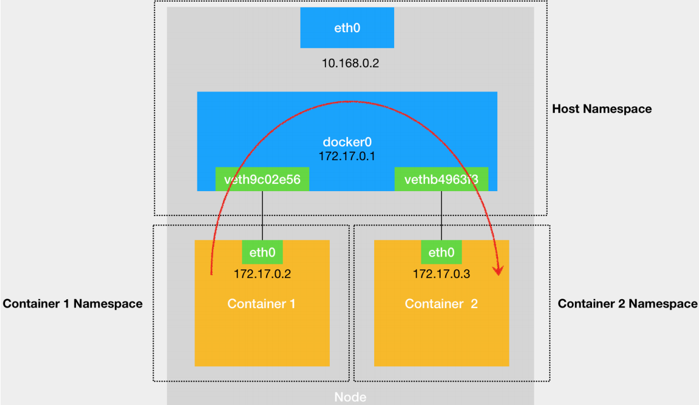
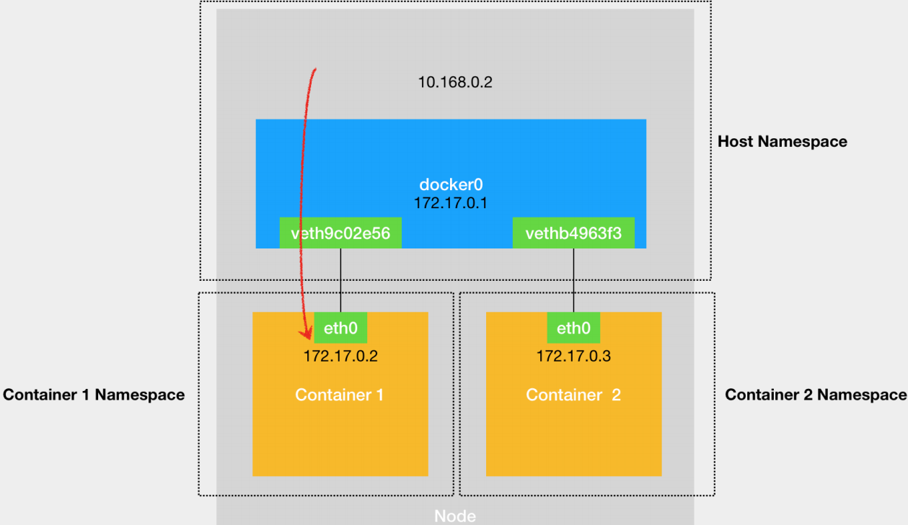
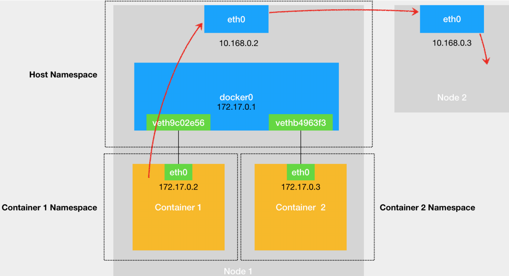
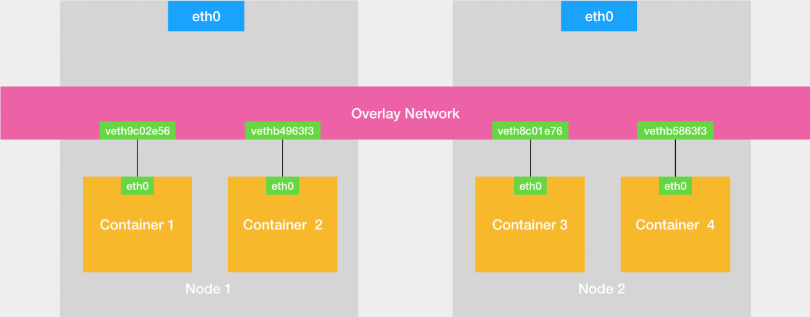

# 深入理解容器网络

> 本文转载至：《深入剖析Kubernetes》-张磊

在前面讲解容器基础时，我曾经提到过一个 Linux 容器能看见的“网络栈”，实际上是被隔离在它自己的 Network Namespace 当中的。

而所谓“网络栈”，就包括了：网卡（Network Interface）、回环设备（Loopback Device）、路由表（Routing Table）和 iptables 规则。对于一个进程来说，这些要素，其实就构成了它发起和响应网络请求的基本环境。

需要指出的是，作为一个容器，它可以声明直接使用宿主机的网络栈（–net=host），即：不开启 Network Namespace，比如：

```shell
 $ docker run –d –net=host --name nginx-host nginx
```

在这种情况下，这个容器启动后，直接监听的就是宿主机的 80 端口。

像这样直接使用宿主机网络栈的方式，虽然可以为容器提供良好的网络性能，但也会不可避免地引入共享网络资源的问题，比如端口冲突。所以，在大多数情况下，我们都希望容器进程能使用自己 Network Namespace 里的网络栈，即：拥有属于自己的 IP 地址和端口。

这时候，一个显而易见的问题就是：这个被隔离的容器进程，该如何跟其他 Network Namespace 里的容器进程进行交互呢？

为了理解这个问题，你其实可以把每一个容器看做一台主机，它们都有一套独立的“网络栈”。

如果你想要实现两台主机之间的通信，最直接的办法，就是把它们用一根网线连接起来；而如果你想要实现多台主机之间的通信，那就需要用网线，把它们连接在一台交换机上。

**在 Linux 中，能够起到虚拟交换机作用的网络设备，是网桥（Bridge）。它是一个工作在数据链路层（Data Link）的设备，主要功能是根据 MAC 地址学习来将数据包转发到网桥的不同端口（Port）上**。

当然，至于为什么这些主机之间需要 MAC 地址才能进行通信，这就是网络分层模型的基础知识了。不熟悉这块内容的读者，可以通过这篇文章来学习一下。

而为了实现上述目的，Docker 项目会默认在宿主机上创建一个名叫 docker0 的网桥，凡是连接在 docker0 网桥上的容器，就可以通过它来进行通信。

可是，我们又该如何把这些容器“连接”到 docker0 网桥上呢？

这时候，我们就需要使用一种名叫Veth Pair的虚拟设备了。

Veth Pair 设备的特点是：它被创建出来后，总是以两张虚拟网卡（Veth Peer）的形式成对出现的。并且，从其中一个“网卡”发出的数据包，可以直接出现在与它对应的另一张“网卡”上，哪怕这两个“网卡”在不同的 Network Namespace 里。

这就使得 Veth Pair 常常被用作连接不同 Network Namespace 的“网线”。

比如，现在我们启动了一个叫作 nginx-1 的容器：

```shell
 $ docker run –d --name nginx-1 nginx
```

然后进入到这个容器中查看一下它的网络设备：

```shell
#进入容器
$ docker exec -it nginx-1 /bin/sh

$ ifconfig
eth0: flags=4163<UP,BROADCAST,RUNNING,MULTICAST>  mtu 1500
        inet 172.17.0.3  netmask 255.255.0.0  broadcast 172.17.255.255
        ether 02:42:ac:11:00:03  txqueuelen 0  (Ethernet)
        RX packets 5762  bytes 9163059 (8.7 MiB)
        RX errors 0  dropped 0  overruns 0  frame 0
        TX packets 4226  bytes 306132 (298.9 KiB)
        TX errors 0  dropped 0 overruns 0  carrier 0  collisions 0

lo: flags=73<UP,LOOPBACK,RUNNING>  mtu 65536
        inet 127.0.0.1  netmask 255.0.0.0
        loop  txqueuelen 1000  (Local Loopback)
        RX packets 0  bytes 0 (0.0 B)
        RX errors 0  dropped 0  overruns 0  frame 0
        TX packets 0  bytes 0 (0.0 B)
        TX errors 0  dropped 0 overruns 0  carrier 0  collisions 0
$ route
Kernel IP routing table
Destination     Gateway         Genmask         Flags Metric Ref    Use Iface
default         172.17.0.1      0.0.0.0         UG    0      0        0 eth0
172.17.0.0      0.0.0.0         255.255.0.0     U     0      0        0 eth0
```

可以看到，这个容器里有一张叫作 eth0 的网卡，它正是一个 Veth Pair 设备在容器里的这一端。

通过 route 命令查看 nginx-1 容器的路由表，我们可以看到，这个 eth0 网卡是这个容器里的默认路由设备；所有对 172.17.0.0/16 网段的请求，也会被交给 eth0 来处理（第二条172.17.0.0 路由规则）。

而这个 Veth Pair 设备的另一端，则在宿主机上。你可以通过查看宿主机的网络设备看到它，如下所示：

```shell
[tianjindong@CentOS-Server ~]$ ipaddr
-bash: ipaddr: 未找到命令
[tianjindong@CentOS-Server ~]$ ip addr
...
5: docker0: <BROADCAST,MULTICAST,UP,LOWER_UP> mtu 1500 qdisc noqueue state UP group default 
    link/ether 02:42:e8:09:d3:f4 brd ff:ff:ff:ff:ff:ff
    inet 172.17.0.1/16 brd 172.17.255.255 scope global docker0
       valid_lft forever preferred_lft forever
    inet6 fe80::42:e8ff:fe09:d3f4/64 scope link 
       valid_lft forever preferred_lft forever
13: veth9c02e56@if12: <BROADCAST,MULTICAST,UP,LOWER_UP> mtu 1500 qdisc noqueue master docker0 state UP group default 
    link/ether 1e:2b:a4:b1:f4:78 brd ff:ff:ff:ff:ff:ff link-netnsid 0
    inet6 fe80::1c2b:a4ff:feb1:f478/64 scope link 
       valid_lft forever preferred_lft forever
```

通过 `ip addr` 命令的输出，你可以看到，nginx-1 容器对应的 Veth Pair 设备，在宿主机上是一张虚拟网卡。它的名字叫作 veth389c399。并且，通过 brctl show 的输出，你可以看到这张网卡被“插”在了 docker0 上。

```shell
$ brctl show
bridge name     bridge id               STP enabled     interfaces
br-e9b1081bbbce         8000.0242b78e33f5       no
docker0         8000.0242e809d3f4       no              veth9c02e56
```

这时候，如果我们再在这台宿主机上启动另一个 Docker 容器，比如 nginx-2：

```shell
$ docker run –d --name nginx-2 nginx
$ brctl show
bridge name     bridge id               STP enabled     interfaces
br-e9b1081bbbce         8000.0242b78e33f5       no
docker0         8000.0242e809d3f4       no              veth9c02e56
                                                        vethb4963f3
```

你就会发现一个新的、名叫 veth3f2fff0 的虚拟网卡，也被“插”在了 docker0 网桥上。

这时候，如果你在 nginx-1 容器里 ping 一下 nginx-2 容器的 IP 地址（172.17.0.3），就会发现同一宿主机上的两个容器默认就是相互连通的。

这其中的原理其实非常简单，我来解释一下。

当你在 nginx-1 容器里访问 nginx-2 容器的 IP 地址（比如 ping 172.17.0.3）的时候，这个目的 IP 地址会匹配到 nginx-1 容器里的第二条路由规则。可以看到，这条路由规则的网关（Gateway）是 0.0.0.0，这就意味着这是一条直连规则，即：凡是匹配到这条规则的 IP 包，应该经过本机的 eth0 网卡，通过二层网络直接发往目的主机。

而要通过二层网络到达 nginx-2 容器，就需要有 172.17.0.3 这个 IP 地址对应的 MAC 地址。所以 nginx-1 容器的网络协议栈，就需要通过 eth0 网卡发送一个 ARP 广播，来通过 IP 地址查找对应的 MAC 地址。

> 备注：ARP（Address Resolution Protocol），是通过三层的 IP 地址找到对应的二层 MAC 地址的协议。

我们前面提到过，这个 eth0 网卡，是一个 Veth Pair，它的一端在这个 nginx-1 容器的Network Namespace 里，而另一端则位于宿主机上（Host Namespace），并且被“插”在了宿主机的 docker0 网桥上。

一旦一张虚拟网卡被“插”在网桥上，它就会变成该网桥的“从设备”。从设备会被“剥夺”调用网络协议栈处理数据包的资格，从而“降级”成为网桥上的一个端口。而这个端口唯一的作用，就是接收流入的数据包，然后把这些数据包的“生杀大权”（比如转发或者丢弃），全部交给对应的网桥。

所以，在收到这些 ARP 请求之后，docker0 网桥就会扮演二层交换机的角色，把 ARP 广播转发到其他被“插”在 docker0 上的虚拟网卡上。这样，同样连接在 docker0 上的 nginx-2 容器的网络协议栈就会收到这个 ARP 请求，从而将 172.17.0.3 所对应的 MAC 地址回复给nginx-1 容器。

有了这个目的 MAC 地址，nginx-1 容器的 eth0 网卡就可以将数据包发出去。

而根据 Veth Pair 设备的原理，这个数据包会立刻出现在宿主机上的 veth9c02e56 虚拟网卡上。不过，此时这个 veth9c02e56 网卡的网络协议栈的资格已经被“剥夺”，所以这个数据包就直接流入到了 docker0 网桥里。

此时，对宿主机来说，docker0 网桥就是一个普通的网卡。

> 这一点，你可以通过查看宿主机上 ifconfig 的输出来验证：docker0 这个设备既有 MAC 地址（02:42:e8:09:d3:f4），也有 IP 地址（172.17.0.1），跟一个普通网卡没什么区别。

所以，对于这个网桥上流入的数据包，就会通过宿主机的网络协议栈进行处理。需要注意的是，在宿主机上，Docker 会为你设置如下所示的路由规则：

```shell
$ route
Kernel IP routing table
Destination     Gateway         Genmask         Flags Metric Ref    Use Iface
172.17.0.0      0.0.0.0         255.255.0.0     U     0      0        0 docker0
```

而这次流入的数据包的目的 IP 是 172.17.0.3，所以，当它出现宿主机之后，就会按照上述172.17.0.0 这条路由规则，再次经过 docker0 网桥转发（FORWARD）出去。

docker0 处理转发的过程，则继续扮演二层交换机的角色。此时，docker0 网桥根据数据包的目的 MAC 地址（也就是 nginx-2 容器的 MAC 地址），在它的 CAM 表（即交换机通过 MAC地址学习维护的端口和 MAC 地址的对应表）里查到对应的端口（Port）为：vethb4963f3，然后把数据包发往这个端口。

而这个端口，正是 nginx-2 容器“插”在 docker0 网桥上的另一块虚拟网卡，当然，它也是一个 Veth Pair 设备。这样，数据包就进入到了 nginx-2 容器的 Network Namespace 里。

所以，nginx-2 容器看到的情况是，它自己的 eth0 网卡上出现了流入的数据包。这样，nginx-2 的网络协议栈就会对请求进行处理，最后将响应（Pong）返回到 nginx-1。

以上，就是同一个宿主机上的不同容器通过 docker0 网桥进行通信的流程了。我把这个流程总结成了一幅示意图，如下所示：



熟悉了 docker0 网桥的工作方式，你就可以理解，在默认情况下，被限制在 Network Namespace 里的容器进程，实际上是通过 Veth Pair 设备 + 宿主机网桥的方式，实现了跟同其他容器的数据交换。

与之类似地，当你在一台宿主机上，访问该宿主机上的容器的 IP 地址时，这个请求的数据包，也是先根据路由规则到达 docker0 网桥，然后被转发到对应的 Veth Pair 设备，最后出现在容器里。这个过程的示意图，如下所示：



同样地，当一个容器试图连接到另外一个宿主机时，比如：ping 10.168.0.3，它发出的请求数据包，首先经过 docker0 网桥出现在宿主机上。然后根据宿主机的路由表里的直连路由规则（10.168.0.0/24 via eth0)），对 10.168.0.3 的访问请求就会交给宿主机的 eth0 处理。

所以接下来，这个数据包就会经宿主机的 eth0 网卡转发到宿主机网络上，最终到达 10.168.0.3对应的宿主机上。当然，这个过程的实现要求这两台宿主机本身是连通的。这个过程的示意图，如下所示：



所以说，当你遇到容器连不通“外网”的时候，你都应该先试试 docker0 网桥能不能 ping通，然后查看一下跟 docker0 和 Veth Pair 设备相关的 iptables 规则是不是有异常，往往就能够找到问题的答案了。

不过，在最后一个“Docker 容器连接其他宿主机”的例子里，你可能已经联想到了这样一个问题：如果在另外一台宿主机（比如：10.168.0.3）上，也有一个 Docker 容器。那么，我们的nginx-1 容器又该如何访问它呢？

这个问题，其实就是容器的“跨主通信”问题。

在 Docker 的默认配置下，一台宿主机上的 docker0 网桥，和其他宿主机上的 docker0 网桥，没有任何关联，它们互相之间也没办法连通。所以，连接在这些网桥上的容器，自然也没办法进行通信了。

不过，万变不离其宗。

如果我们通过软件的方式，创建一个整个集群“公用”的网桥，然后把集群里的所有容器都连接到这个网桥上，不就可以相互通信了吗？

说得没错。

这样一来，我们整个集群里的容器网络就会类似于下图所示的样子：



可以看到，构建这种容器网络的核心在于：我们需要在已有的宿主机网络上，再通过软件构建一个覆盖在已有宿主机网络之上的、可以把所有容器连通在一起的虚拟网络。所以，这种技术就被称为：Overlay Network（覆盖网络）。

而这个 Overlay Network 本身，可以由每台宿主机上的一个“特殊网桥”共同组成。比如，当Node 1 上的 Container 1 要访问 Node 2 上的 Container 3 的时候，Node 1 上的“特殊网桥”在收到数据包之后，能够通过某种方式，把数据包发送到正确的宿主机，比如 Node 2上。而 Node 2 上的“特殊网桥”在收到数据包后，也能够通过某种方式，把数据包转发给正确的容器，比如 Container 3。

甚至，每台宿主机上，都不需要有一个这种特殊的网桥，而仅仅通过某种方式配置宿主机的路由表，就能够把数据包转发到正确的宿主机上。这些内容，我在后面的文章中会为你一一讲述。