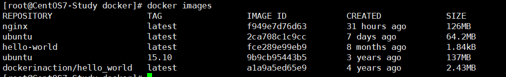

# Docker镜像

## 1. 列出本地镜像

```shell 
$ docker images
```



**REPOSITORY：**镜像的仓库源

**TAG：**镜像的标签

**IMAGE ID：**镜像ID

**CREATED：**镜像创建时间

**SIZE：**镜像大小

同一仓库源可以有多个 TAG，代表这个仓库源的不同个版本，如ubuntu仓库源里，有15.10、14.04等多个不同的版本，我们使用 REPOSITORY:TAG 来定义不同的镜像。

所以，我们如果要使用版本为15.10的ubuntu系统镜像来运行容器时，命令如下：

```shell
docker run -t -i ubuntu:15.10 /bin/bash 
```

如果你不指定一个镜像的版本标签，例如你只使用 ubuntu，docker 将默认使用 ubuntu:latest 镜像。


## 2. 获取一个新的镜像

当我们在本地主机上使用一个不存在的镜像时 Docker 就会自动下载这个镜像。如果我们想预先下载这个镜像，我们可以使用 docker pull 命令来下载它。

```shell
$ docker pull ubantu:15.10
```


## 3. 查找镜像

我们可以从 Docker Hub 网站来搜索镜像，Docker Hub 网址为： *https://hub.docker.com/*

我们也可以使用 docker search 命令来搜索镜像。比如我们需要一个httpd的镜像来作为我们的web服务。我们可以通过 docker search 命令搜索ubuntu来寻找适合我们的镜像。

```shell
$ docker search ubuntu
```


## 4. 删除镜像

```shell
$ docker rmi [镜像ID]
```

