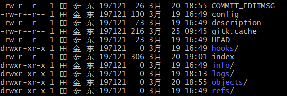
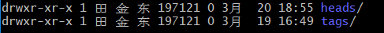

## 探秘`.git`目录

​	我们先进入`.git`目录，这个目录是一个隐藏目录，需要使用`ls -a`才能看到。

```shell
$ cd .git
```

​	

#### HEAD文件

​	**`HEAD` 文件指示目前被检出的分支**

​	该文件使用与指定当前工作目录正工作在哪个分支中，我们通过`cat或其他`命令查看这个文件内容：


​	通过上面的HEAD我们可以看到，当前工作目录正工作在`master`分支下，如果我们更换分支，`HEAD`文件的内容也会随之改变。

#### refs文件夹

​	**`refs` 目录存储指向数据（分支）的提交对象的指针**

​	前面HEAD文件记录，当前工作的分支，就是引用refs文件夹中的文件。refs文件夹中有两个文件夹:

​	

- tags文件夹：保存当前仓库的标签

- heads：表示Git仓库的分支（每一个分支，都在这个目录中有相对应的文件夹）

  

#### config文件

​	在文件内容之前，我们先执行下面的命令

```shell
$ git config --local user.name "tjd" #local参数可以省略，默认就是local作用域
```

​	然后我们再使用`cat config`命令查看config文件中的内容：


​	可以看到，由于我们为当前工作目录设置与全局user.name不同的值，所以系统就会在当前工作目录的config文件中记录用户设置的`-local`作用域的属性。

​	**我们可以直接更改这个文件中的内容，也能达到`$ git config --local user.name "xxx"`命令的效果。也就是说，我们在使用`git config --local user.name`命令查看`-local`作用域下的`user.name`就是读取这个文件中的内容。**


#### objects文件夹

​	这个文件夹保存Git的对象。